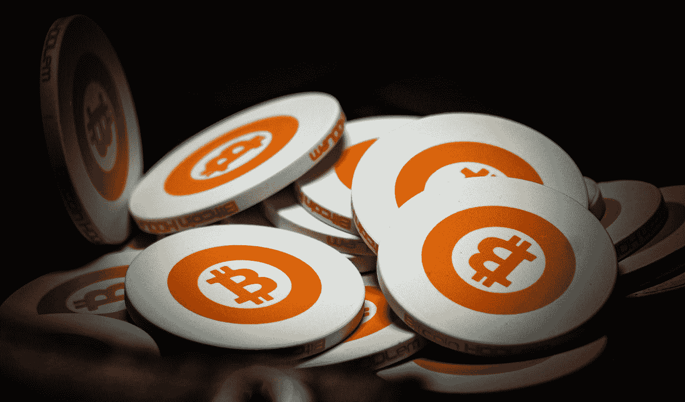
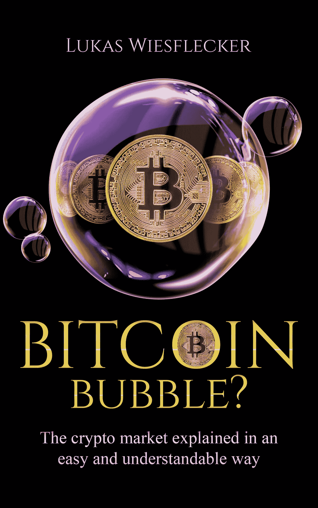

# 比特币——泡沫？

> 原文：<https://medium.datadriveninvestor.com/bitcoin-a-bubble-a53d17e6298b?source=collection_archive---------11----------------------->

伟大的安德烈亚斯·安东诺普洛斯(Andreas Antonopoulos)是本书的作者，也是比特币和区块链的主要专家之一，他在一次演讲中说:是的，比特币是一个泡沫！但是他这么说到底是什么意思呢？安德烈亚斯关于比特币是泡沫的说法主要是关于 BTC 价格和货币的本质。货币以及比特币都是基于这样一种假设，即尽可能多的其他人和公司接受它，以便用它来交换商品或服务。如果没有人再相信它，货币就失去了它的价值:到那时，钞票只是绿色的、含细菌的纸片，充其量只能充当烧烤打火机。

> “金钱是一种公共和文化幻觉”
> ——安德烈亚斯·安东诺普洛斯

## 不受监管的市场充满了贪婪和恐惧

下一个比特币泡沫会再次破裂，而且已经破裂过几次。上一次是在 2017 年 12 月，在比特币目前的历史高点(2 万美元)达到之后。30 天后，比特币的价值减少了约 50%。但在 2011 年和 2013 年，BTC 价格也暴跌了 90%。所谓的货币未来技术如何形成如此强烈的泡沫并重复这一点？

Photo by [Harrison Kugler](https://unsplash.com/@harrisonkugler?utm_source=medium&utm_medium=referral) on [Unsplash](https://unsplash.com?utm_source=medium&utm_medium=referral)

答案简单明了:比特币只受供求关系影响。没有一家股票交易所收盘时股价下跌 20%,没有一个公众假期不允许你交易 BTC。价格只是对新闻立即做出无情的反应，无论是假的还是官方的，无论是营销措施还是真正的创新。心理因素如希望、恐惧和贪婪也起着重要作用。因此，这是 BTC 自身的错，但更多的是人类行为导致了价格泡沫。毕竟，价格泡沫最终只不过是基础资产的基本面高估。由于几乎没有任何评估比特币价值的模型，确定 BTC 的“公允价值”极其困难。

 [## Azbit 旨在连接传统金融和加密货币|数据驱动的投资者

### Azbit 是下一个提供交易平台的加密项目，该平台提供保证金和算法交易。一样多…

www.datadriveninvestor.com](https://www.datadriveninvestor.com/2019/03/20/azbit-aims-to-connect-traditional-finance-and-cryptocurrency/) 

## 图书发行

立正！一周前，我出版了我的第一本比特币书籍。它被称为比特币——泡沫？

这是关于如何进入加密市场，如何表现，我说的是比特币的未来。当然我会详细讨论比特币是不是泡沫！

[***点击这里阅读更多关于这本书的内容！***](https://www.amazon.de/gp/product/B0874SJ754/ref=dbs_a_def_rwt_hsch_vapi_tkin_p1_i2)

## 总结:泡沫是你的朋友

所以你真的不应该让自己被逼疯，尤其不应该被比特币反复形成的泡沫逼疯。通过定期减半，通货膨胀率大约每四年减半。这是通货膨胀减半时制造另一个泡沫的最佳条件。虽然其他因素也起作用，但这可能是最根本的因素。所以我们可以好奇看看这次事情会如何发展。众所周知，历史喜欢重演。

**你想让比特币及时上市吗？**

我在每月一期的 [**简讯中分享了更多私密的想法，你可以在这里查看**](https://mailchi.mp/bf8f8e8ed697/keep-in-touch-with-lukas) 。请在评论中告诉我，并在各种社交媒体平台上加入我:

[**推特**](https://twitter.com/WiesfleckerL)●[**insta gram**](https://www.instagram.com/lukaswiesflecker/)●[**脸书**](https://www.facebook.com/lukaswiesfleckerr)●[**Snapchat**](https://www.snapchat.com/add/luggooo)**●[**LinkedIn**](https://www.linkedin.com/in/lukas-wiesflecker-1b11251a5/)**

**无论你做什么，都要带着爱和激情去做！**