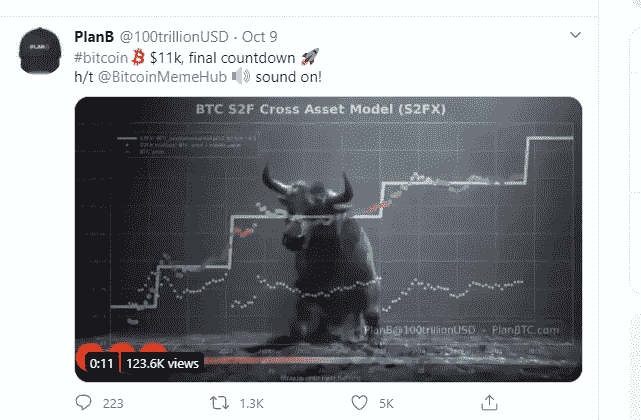

# 比特币——许多人的救生艇

> 原文：<https://medium.datadriveninvestor.com/bitcoin-a-lifeboat-for-many-people-fe77d59334de?source=collection_archive---------24----------------------->

商业智能公司 MicroStrategy 的首席执行官迈克尔·塞勒(Michael Saylor)今天在 WhatBitcoinDid 播客中称支付公司 Square 对比特币的 5000 万美元投资是“非凡的消息”。让我们仔细看看这条新闻的背后是什么。

我们还将讨论 PlanB 的一条推文，该推文表明比特币股价可能正处于下一次抛物线上涨的边缘。下一个 BTC 牛市即将到来吗？

# 比特币——许多人的救生艇

8 月 11 日至 9 月 14 日期间，Microstrategy 向比特币投资了 4.25 亿美元。大约三周后，2020 年 10 月 8 日，Square 进行了一笔更小的投资。现在，MicroStrategy 的首席执行官已经权衡了最新的比特币赌注。

根据 Saylor 的说法，Square 并不是出于财务原因进行这项投资的。

> 他们不需要钱。他们比上帝更有钱。

相反，他们的投资有点像政治或道德声明。在采访中，塞勒提到，在 22 个国家有 9.32 亿人的货币正在崩溃，并将比特币描述为这些人的一种救生艇。反过来，Square“将这整个步骤包装成‘让世界变得更美好’的议程。”

塞勒补充道:

> 我很高兴这给这个空间带来了积极的、建设性的和鼓舞人心的能量，我相信只有好的事情会发生。

Square 的投资甚至可能促使 Twitter 或脸书进行类似的比特币投资。

> 许多人会将 Square 视为一家杰出、成功且不断进步的公司，他们会想要复制它，因为谁愿意与成功争论呢？

此后，塞勒在多个场合称赞比特币的长期投资机会。但鉴于 Square 的投资，比特币的潜力也可能吸引短期交易者。他表示，华尔街的“快钱花花公子”会考虑抢先投资下一个效仿杰克·多西的投资者。多尔西说，这反过来又会促进大量奇妙的事情发生，所有这些都归结为一句简单的话:“比特币是个好东西，是个安全的东西，你可能会想要一些。”

后者无疑会导致比特币价格上涨。就时间而言，目前无论如何都很合适。至少如果你问 PlanB 他们的意见。

# 是时候开始下一轮比特币课程了

这种交易以笔名 PlanB 发布了一条推文，暗示这位经验丰富的分析师根据他的模型，预计比特币价格将很快进入下一个抛物线增长阶段。

[PlanB](https://twitter.com/100trillionUSD/status/1314521749577494528)

可能 PlanB 的分析模型和基本事件正被 PlanB 利用。类似上述的头条新闻和围绕比特币的类似积极发展确实可能是下一个期待已久的比特币课程 Bullrun 的先兆。对许多人来说，毫无疑问的是，BTC 的房价将进一步呈抛物线状上涨。对他们来说，这不是是否的问题，而是何时的问题。通过黄金的替代，比特币价格从 12 万美元到 60 万美元的预测被广泛接受。

 [## 稳定币会危及比特币在加密领域的地位吗？数据驱动的投资者

### Stablecoin 是一种加密货币，主要用于维持稳定的市场价值。它可以通过…

www.datadriveninvestor.com](https://www.datadriveninvestor.com/2020/06/08/can-a-stablecoin-jeopardize-the-position-of-bitcoin-in-the-crypto-space/) 

愿望是否是想法之父就不做进一步讨论了。无论如何，PlanB 的预测模型表明，比特币价格将很快出现进一步的抛物线式上涨。BTC 目前由于突破了我们讨论过的对称三角形而获得的积极势头正符合这一点。

当诸如此类的事件累积起来时，这尤其会导致许多散户投资者进一步积累 BTC，因为他们担心自己否则可能会赶不上潮流。这本身已经产生了越来越多的需求，并可能在短期内对比特币的价格产生积极影响。

# 你也想投资比特币吗？

如果你想像十亿美元的 Square 和 MicroStrategy 一样保留它，并投资比特币或交易 BTC，我们推荐我们的测试赢家 OKEx。

根据来自 CoinGecko 的[数据](https://www.coingecko.com/en/exchanges/okex_swap)，除了其稳定的 BTC 期货产品， [OKEx](https://www.okex.com/join/1/2428945) 还占据了所有加密衍生品交易所的首位。在它的期货、永久掉期和期权市场上，总共有令人吃惊的 608 对可供交易者使用。

> “加密行业对坏消息和挑战性条件并不陌生，但令人鼓舞的是，围绕比特币的交易者情绪仍然很高”——OKEx 首席执行官 Jay Hao

这远不是第一次 [OKEx](https://www.okex.com/join/1/2428945) 在比特币期货和其他衍生品交易方面胜过所有其他交易所。事实上，根据 CoinDesk Research 的数据，就在上个月， [OKEx](https://www.okex.com/join/1/2428945) 被评为全球最大的[加密衍生品交易所](https://www.okex.com/academy/en/okex-ranked-worlds-largest-crypto-derivatives-exchange-according-to-coindesk-research/)。

现在就免费试用，自己看吧。现在就开始投资吧！

我在每月一期的 [**简讯中分享了更多私密的想法，你可以在这里**](https://mailchi.mp/bf8f8e8ed697/keep-in-touch-with-lukas) 查看。请在评论中告诉我，并在各种社交媒体平台上加入我:

[**推特**](https://twitter.com/WiesfleckerL)●[**insta gram**](https://www.instagram.com/lukaswiesflecker/)●[**脸书**](https://www.facebook.com/lukaswiesfleckerr)●[**Snapchat**](https://www.snapchat.com/add/luggooo)**●[**LinkedIn**](https://www.linkedin.com/in/lukas-wiesflecker-1b11251a5/)**

**无论你做什么，都要带着爱和激情去做！**

## **访问专家视图— [订阅 DDI 英特尔](https://datadriveninvestor.com/ddi-intel)**