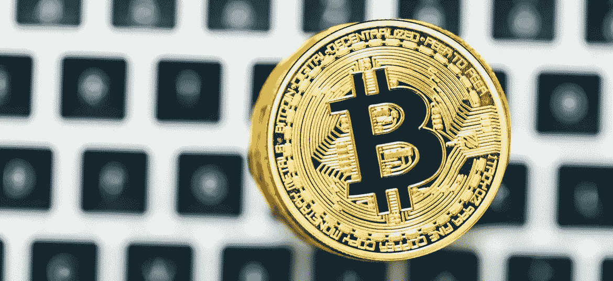
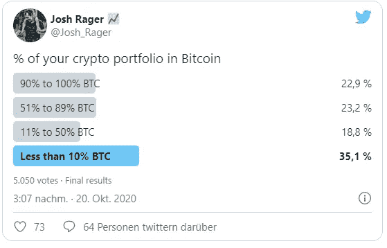

# 比特币与替代硬币——为什么投资组合中大多数人更喜欢 BTC

> 原文：<https://medium.datadriveninvestor.com/bitcoin-about-altcoins-why-most-prefer-btc-in-the-portfolio-b879bf585b5e?source=collection_archive---------9----------------------->

比特币比所有 Altcoins 都有明显优势。我们不仅仅是在谈论网络效应，这种效应已经追不上了，而是在谈论它作为价值储存手段的功能。比特币以其最纯粹的数字形式代表着稀缺。

推特上的一项调查也得出了这个结论。从结果来看，大多数投资组合主要由比特币组成。

 [## 稳定币会危及比特币在加密领域的地位吗？数据驱动的投资者

### Stablecoin 是一种加密货币，主要用于维持稳定的市场价值。它可以通过…

www.datadriveninvestor.com](https://www.datadriveninvestor.com/2020/06/08/can-a-stablecoin-jeopardize-the-position-of-bitcoin-in-the-crypto-space/) 

# 比特币在顶端

过去几天比特币股价的强劲上涨是一个相当大的挑战。BTC 价格在短短几天内上涨了 10%，目前仍在努力达到 13，000 美元大关。

尽管目前比特币和以太坊的人气很高，但它与其他加密货币的关系并不乐观。比特币价格上涨已经导致许多替代币出血，不仅仅是 BTC 交易对。

Altcoins 具有高度的投机性，并且极度依赖于比特币的价格。因此，替代硬币面临着巨大的风险。此外，这些加密货币都无法与比特币的稀缺性相竞争，这使得比特币从长期来看是一种糟糕的价值储存手段。

你的投资组合中有多少幅 BTC 作品？

Twitter 上的知名交易员乔希·拉格(Josh Rager)想了解更多相关信息。他创建了一个调查来了解他的粉丝是如何定位的。他问投资组合中比特币占多大比例。

这是调查的结果。共有 5000 多人参加了调查。

大多数投票得到的选项是“不到 10%”。这里 35.1%的选民表示同意。在 BTC，只有 18.8%的选民持有 11-50%的投资组合。

然而，在 23.2%的受访者中，投资组合包含 51%至 89%的比特币。22.9%的人相信比特币，并在 BTC 持有 90%至 100%的投资组合。

虽然 Josh 主要面向对加密感兴趣的人，但人们并不确切知道他的粉丝的其他投资组合是由什么组成的。所以这并不意味着投资组合的其余部分都是替代货币。这里你也可以想象股票和其他金融产品。

然而，仍有 46.1%的受访者持有超过 50%的比特币投资组合。这清楚地表明了投资者对数字黄金的确信程度以及他们的期望。

# 公司和机构投资者只对比特币感兴趣

结果可能不会让大多数人感到惊讶。最近几个月，一些公司已经宣布将部分资本储备投资于比特币。

私人投资者的情况类似。了解 BTC 的人知道其背后的巨大潜力。其他人更喜欢被各种替代硬币的承诺所蒙蔽，通常不得不期待重大损失。

除此之外，就在昨天，PayPal 公开表示，它已经在自己的平台上整合了比特币和 kryptowhrungen。这一消息颠覆了整个加密空间，并导致比特币价格向上爆发。

# 为下一次试运行做准备

比特币的发展让人们有理由期待更多。因此，不仅企业直接进入比特币，而且支持网络并提供必要的基础设施，以便数百万人可以轻松进入氪星。

石头已经开始滚动，这只是一个时间问题，直到更多的企业跟进。考虑到公司和机构投资者已经持有超过 60 万 BTC，很容易想象如果更多的公司效仿将会发生什么。

没有足够的整比特币给每个人。到目前为止，许多人不明白，然而随着时间的推移和价格的上涨，第一种加密货币实际上是多么稀缺，它实际上具有什么价值，这一点变得越来越清楚。

我在每月的[时事通讯中分享了更多私密的想法，你可以在这里查看](https://mailchi.mp/bf8f8e8ed697/keep-in-touch-with-lukas)。请在评论中告诉我，并在各种社交媒体平台上加入我:

[推特](https://twitter.com/WiesfleckerL) ● [Instagram](https://www.instagram.com/lukaswiesflecker/) ● [脸书](https://www.facebook.com/lukaswiesfleckerr)●[Snapchat](https://www.snapchat.com/add/luggooo)●[LinkedIn](https://www.linkedin.com/in/lukas-wiesflecker-1b11251a5/)

无论你做什么，都要带着爱和激情去做！

## 访问专家视图— [订阅 DDI 英特尔](https://datadriveninvestor.com/ddi-intel)