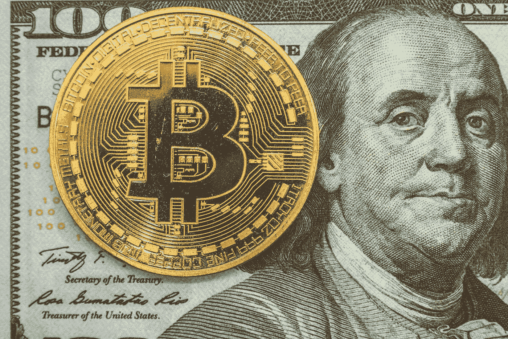
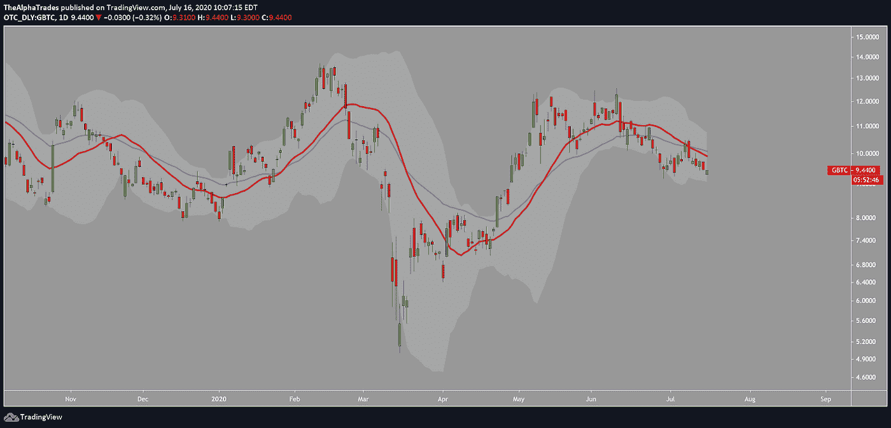
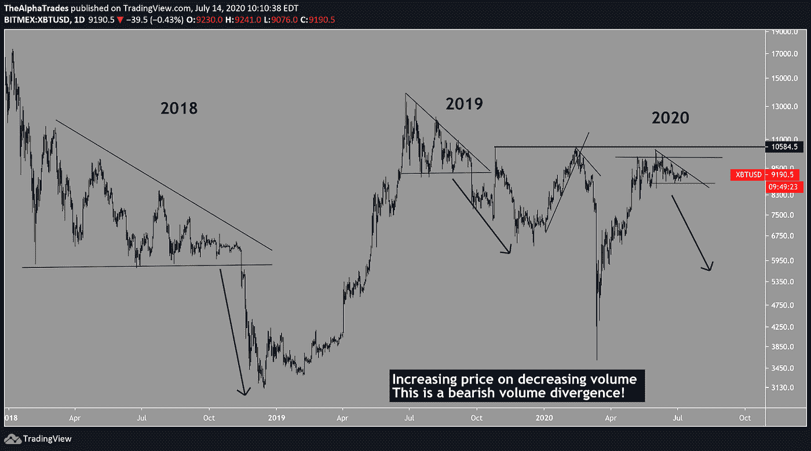

# 比特币和股票揭示了沙漠中的一条线

> 原文：<https://medium.datadriveninvestor.com/bitcoin-and-equities-reveal-a-line-in-the-sand-1ac6126d2b23?source=collection_archive---------12----------------------->

## **7 月 15 日当周的加密简讯| Alpha 交易**

*被困在 Medium 的付费墙后面？* [*注册我们的 Discord 服务器*](https://discord.gg/a97qq2s) *查看#公告免费获取全文:*[*https://discord.gg/a97qq2s*](https://discord.gg/a97qq2s)

**@bermixstudio via Unsplash**

# 外卖:

*   股票和美元显示了市场成败的线索
*   比特币和加密市场继续与股票相关。

大家好。这是阿尔法交易的每周股票时事通讯。周二的加密视频在底部。我们在视频中涉及的主题不同于时事通讯，因此值得您花时间查看这两者！可以找到上一期我们的加密货币简讯 [***【此处】***](https://medium.com/datadriveninvestor/is-this-the-start-of-alt-season-bitcoin-needs-to-hold-9000-alphatrades-38d5bf458f1) *。最后一期股票与经济是* [***【此处】***](https://medium.com/datadriveninvestor/best-strategy-for-q3-china-the-dollar-and-a-persistent-virus-f7a9f290b31c?source=---------2------------------) *。*

[【复制我们的比特币主图，设置警报！】](https://www.tradingview.com/chart/vxxXy5t0/)

# 每周节拍

我们的分析师团队一直在逐步削减他们在所有市场的头寸，包括加密货币。特别是，股票给出了混杂的短期信号，表明最好持有现金。在科技股龙头大幅回调后，市场出现了强劲反弹，但除了一些快速的抛售，我们不买(或做空)它。

# 股票

([时间戳:18:14](https://youtu.be/kf4ViH8KRXM?t=1092) )你只希望*有人会用我们看待这些**三个信号的方式来看待你**:SPX 在科技股抛售中拔得头筹。自然，随着大型企业进入更受压制的行业，将会出现一些动荡。与此同时，美元指数(DXY)正在寻找支撑，这可能是美元兑其他货币走强的早期迹象。最后，美国 10 年期国债即将突破区间低点。在我们看来，如果人们不购买债券，他们就不会购买积极的美国叙事。*

# 比特币

**一个拐点|** ( [时间戳:6:30](https://youtu.be/kf4ViH8KRXM?t=390) )所有人都在关注 SPX，我们仍然认为 BTC 会跟随领先者。我们预计标普 500 指数将朝着 2700 点回调约 15%，从历史上看，BTC 的走势接近传统市场的两倍。由于 BTC 在 8000 至 9000 英镑区间花了很多时间，我们怀疑在这些水平上没有足够的兴趣，这将需要在任何一个方向上的重大推动，以发现新的需求。此外，日线图上的市云显示了 7000 平的支撑。

([时间戳:12:52](https://youtu.be/kf4ViH8KRXM?t=772) ) GBTC 在日线时间框架上徘徊在布林带和 34 均线中间。通常，当 GBTC 跌破均线时，就会出现大幅下跌。[我们在这里进一步展开这个话题](https://medium.com/datadriveninvestor/bitcoin-boils-the-frogs-volatility-incoming-8f396c405ac6)。

Bollinger Bands and 34 EMA on GBTC; Source: Alpha Trades

我们的分析师早些时候发布了这张图表。这表明 BTC 可能会为历史的熊市重演做好准备。

# 在新闻报道中出现

**DeFi —只会越来越热|** [分散金融(DeFi)](https://defipulse.com/) 承诺消除中间人，取消或大幅降低费用，加快全球业务发展，增加透明度。DeFi 锁定的总价值每周都在增长。考虑到世界上超过 80%的金融交易都是在 COBOL(一种有 60 年历史的编程语言)上运行的，随着传统系统最终寿终正寝，DeFi 的发展空间已经所剩无几。由于在中国的区块链战略中扮演不可或缺的角色，链家(link)是本月 DeFi 领域表现最佳的公司之一。

([时间戳:9:40](https://youtu.be/kf4ViH8KRXM?t=580) )我们的分析师早些时候在 LINK 上分享了一个设置，它已经打破了预期。林克可能会在这样的抛物线助跑后达到最高点。加密没有好的出口，所以只要有可能，兑现利润，支撑你的止损。不是投资建议。

 [## 稳定币会危及比特币在加密领域的地位吗？数据驱动的投资者

### Stablecoin 是一种加密货币，主要用于维持稳定的市场价值。它可以通过…

www.datadriveninvestor.com](https://www.datadriveninvestor.com/2020/06/08/can-a-stablecoin-jeopardize-the-position-of-bitcoin-in-the-crypto-space/) 

**软件正在吞噬你的钱包|** 富达 2020 年 6 月[机构投资者数字资产调查](https://www.fidelitydigitalassets.com/bin-public/060_www_fidelity_com/documents/FDAS/institutional-investors-digital-asset-survey.pdf?utm_campaign=Investor%20Letters&utm_medium=email&_hsmi=91103417&_hsenc=p2ANqtz--Za2D1z9uj1iQ_OIIb5UAqXUknmh5cDI_gXxDhh2fNlFi3aLjj0u_gIxTExwwtEM3UkPZ1Tmsnqe27Oq8-o7xwTKDNFg&utm_content=91103417&utm_source=hs_email)报告称，80%的受访机构投资者发现数字资产有一些吸引力。对数字资产的看法(中性到积极)为 60%，而当前的风险敞口为 36%。

投资的五大主要障碍是价格波动、对市场操纵的担忧、缺乏衡量实际价值的基本面、客户的安全担忧以及复杂性(客户难以理解)。

[**时间差不多了**](https://www.coindesk.com/paypal-venmo-to-roll-out-crypto-buying-and-selling?amp=1&__twitter_impression=true&utm_campaign=Investor%20Letters&utm_medium=email&_hsmi=91103417&_hsenc=p2ANqtz-_hKy9zz4_1TziRK16CBdNVBYVuN8R2JNZbZgwhI2CAMPNUVQqamfNrBLI1Mfe9_mhGGlo2QTV5tAvng5gC2z72AMIsBA&utm_content=91103417&utm_source=hs_email) **|** PayPal 和 Venmo 计划实现密码买卖。PayPal 在给欧盟的一封信中证实了这一整合，这意味着他们的 3 . 25 亿客户将很快能够通过他们的应用程序直接购买 crypto。细节尚不完全清楚。

15 日星期三，奥巴马、贝佐斯、拜登、盖茨和埃隆·马斯克等许多人的推特账户被盗。在任何人知道真相之前，黑客们骗取了高达 10 万美元的比特币。有消息称，这可能是第三方自动化服务的安全漏洞造成的。

# 意见

**类别冠军|**[Chamath Palihapitiya](https://twitter.com/chamath?ref_src=twsrc%5Egoogle%7Ctwcamp%5Eserp%7Ctwgr%5Eauthor),[社会资本](https://www.socialcapital.com/)的首席执行官，几周前参加了[一个价值包装面试](https://unchainedpodcast.com/chamath-palihapitiya-why-bitcoin-will-be-the-category-winner/?utm_campaign=Investor%20Letters&utm_medium=email&_hsmi=91103417&_hsenc=p2ANqtz-_knatsGPjVKzdDnuuIDxrdppztsbd61ed4JjTHhHCmhOK--lcHnmjpjwwxcyYiT8k9v6e2V-oNFxz77gfYhgFRrH80kw&utm_content=91103417&utm_source=hs_email)。

在讨论的许多事情中，有一个是比特币最终将如何超越以太坊网络等其他项目，成为该领域的头号玩家。如果选择显而易见的话，一般投资者会选择某个特定领域中最可靠的选择。真正有价值的亚军往往会随波逐流，不一定会失败。在查马斯看来，最丰厚的回报来自于对该领域顶尖企业的投资。目前的情况是，当加密货币进入大众市场时，比特币最有可能脱颖而出，成为明显的类别赢家，因此投资比特币而不是一篮子复杂的替代品可以让投资者省去很多头疼的事情。

除此之外，查马斯表示，比特币不会凌驾于其他货币之上，因为它有能力成为无缝支付网关，他也不接受数字黄金的概念。相反，他相信有很多其他项目可以处理支付处理。高于所有其他应用的比特币将成为一种保险，一种针对失败的货币体系的对冲。

> “美国政府现在负责超过 50%的国内生产总值，这基本上使我们成为一个准共产主义国家，至少是一个社会主义国家，除了没有任何好处。所以，你仍然有天价的医疗保健和过高的无用的教育。”-查马斯·帕里哈皮蒂亚

突破点将是当出于金融对冲目的的人比短期投机的人更多时，这将巩固比特币作为不相关资产的地位。查马斯认为，比特币作为一种金融对冲工具被大规模采用的唯一方式是当前全球经济体系的彻底崩溃。在这种情况下，霍德勒将脱颖而出，但代价很高。

# 编辑推荐

在过去的几天里，没有什么真正让我们大吃一惊，但一个视频引起了一些关注:

全世界可以只用一种货币吗？

# 素食贸易，硅，和闪亮的东西

本周，Advantage 会员加入了我们的分析师讨论他们在交易什么，如何长期定位，以及投资策略。我们在这些时事通讯中给你开胃菜，但是我们在我们的高级现场会议 [**【了解更多】**](https://discord.gg/a97qq2s) 中分享真正的问题。

保持安全

[我们周三也报道了股票](https://www.youtube.com/watch?v=SclyPClhSfA)，如果你觉得这些内容有价值，请一定要喜欢并订阅！

# 想免费试用 Advantage 两天吗？

[订阅 Discord 服务器](https://bit.ly/2KJ1oor)学习技术分析以及如何投资获利。询问 2 天的高级会员试用！

# 放弃

Alpha Trades，LLC 提供的信息不用于制定任何财务决策，也不是购买、持有和/或销售特定产品、数字资产或 ICO 的请求或建议。

访问我们的完整服务条款:[https://bit.ly/3faVeeV](https://bit.ly/3faVeeV)

**访问专家视图—** [**订阅 DDI 英特尔**](https://datadriveninvestor.com/ddi-intel)