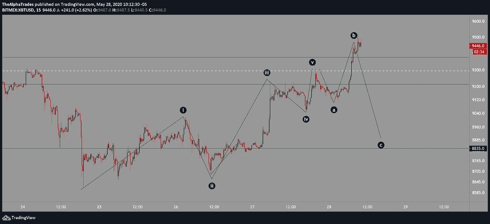
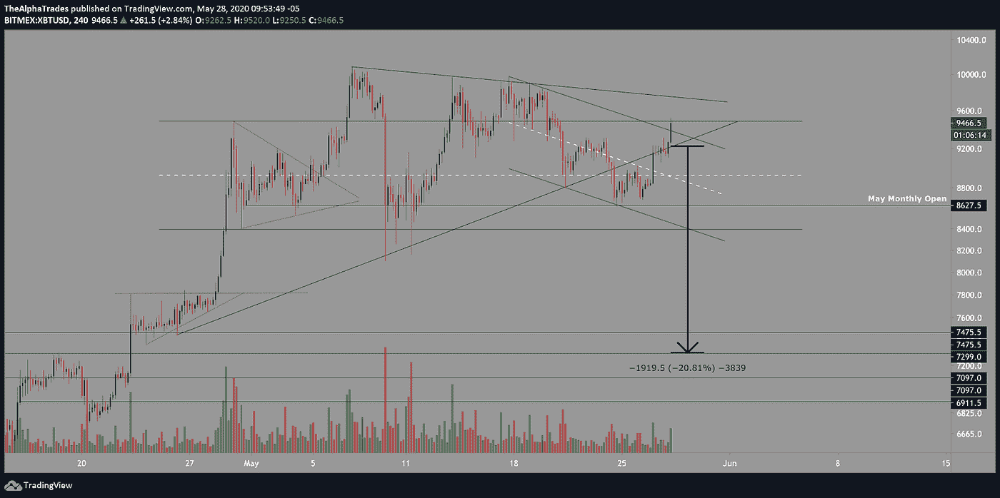
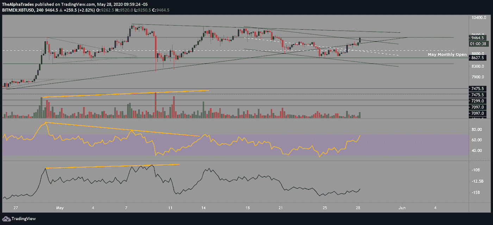
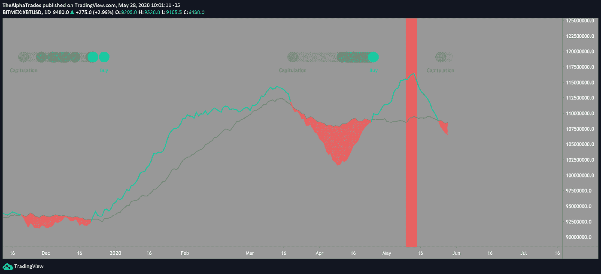
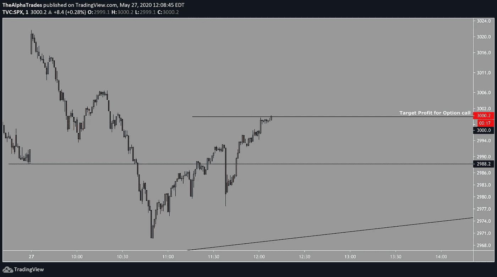
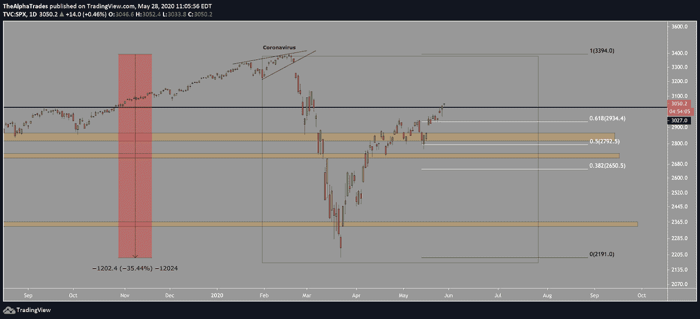
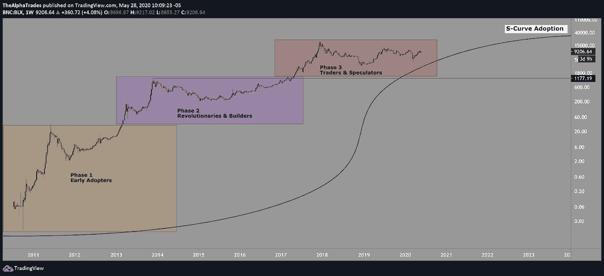

# 随着周末的临近，比特币和股票交易的游戏计划

> 原文：<https://medium.datadriveninvestor.com/bitcoin-and-equities-trading-game-plan-as-the-weekend-approaches-698ea374982b?source=collection_archive---------11----------------------->

## 高盛看跌，矿商投降，鲸鱼在抛售袋子。

Bitcoin, Photo by André François McKenzie on Unsplash

昨天，我向我的社区展示了基于较低时间框架的比特币艾略特波浪计数，从 8618 点上升，如提供的图表所示。

这可能是第五波的顶部，在 B 波的顶部会出现一个 [ABC 修正](https://www.babypips.com/learn/forex/corrective-waves)。这与 61.8%的斐波纳契回撤水平一致，通常被称为“黄金口袋”。这是价格在完成 C 浪的路径上反转的最佳区域。基于斐波那契水平，那一波会把价格带到 8880 左右。如果你在理解图表上有困难，查看今天在本文底部的分析视频，深入了解我如何绘制这些不同的水平。

在 4 小时的时间框架内，我画了一个下降的平行通道，揭示了 BTC 是如何与一个关键的阻力区作战的。到本月底，我们可能会看到标准普尔 500 股市大幅波动和大幅调整。

在日线时间框架中，我们看到在打印了最近的高点后，成交量在下降，价格结构在今天早上形成了一面三角旗。

BTC Elliott Waves, Source: Alpha Trades, LLC

# 比特币更广阔的视角

几天前，我让我的社区注意到了比特币(BTC)在一小时时间框架内形成的[头肩顶](https://www.investopedia.com/terms/h/head-shoulders.asp)模式。这种模式并没有持续下去，相反，价格突破了[下降楔形](https://en.wikipedia.org/wiki/Wedge_pattern)之外，我预计价格会相反。基于突破顶部楔形最宽部分的测量移动可能达到 9978 点。

 [## 加密货币行业是死是活？数据驱动的投资者

### 九月初，我们在 X-Order 内部就代币市场的未来进行了一场辩论。有趣的是，我们的观点是…

www.datadriveninvestor.com](https://www.datadriveninvestor.com/2019/12/12/will-the-cryptocurrency-industry-be-dead-or-alive/) 

**我不认为比特币会达到那个目标的原因:**

我能解释这个的最好方法是通过我现在的挥杆姿势来告诉你。我做空 BTC 是基于几个不同的理由:

当 Crypto Twitter 高喊我们将持有 10，000 股并突围而出时，[我已经详细谈过了成交量概况](https://youtu.be/xNRnXJN7ZJo)。如下图所示，伴随着前期上涨顶部的交易量激增，是市场中较大参与者(鲸鱼)的价格分布迹象。[探索 Trading Lite，更好地掌握订单簿(LTE)数据](https://tradinglite.com/)。观看这篇文章的附带视频，了解该工具如何工作的概述(关于 8:30 标记)。价格最终下滑至 8600 左右。下图所示的三角形之外的当前**走势保证了向 7200** 的适度移动(近似值，基于本出版物更新的价格走势，而*不是投资建议*)。

BTC breakdown target, Source: Alpha Trades, LLC

注意**成交量、RSI 和 OBV 的看跌背离**，其中所有这些指标都在价格的相反方向运行，如下图对角线所示。事后看来，从 10，000 点向 8600 点的下跌有很大的可能性会结束。请记住，这一切都发生在[减半](https://www.coindesk.com/bitcoin-halving-explainer)的时候，所以一旦消息传出，[对市场产生负面影响只是时间问题](https://www.newsbtc.com/2020/05/13/post-bitcoin-halving-miners-have-dumped-5m-more-btc-than-before/)。以我的拙见，一个新闻驱动的事件，比如提前四年预先计划的比特币减半，将遵循一个可预测的卖新闻周期。

BTC indicator analysis, Source: Alpha Trades, LLC

BTC hash ribbons, Source: Alpha Trades, LLC

hash ribbons 指标显示，矿商正在投降，至少我们可以预计会有一些波动，任何重大的下跌都会给维持比特币价格在 10，000 以上的论点带来漏洞。此外，平均而言，许多矿工的生产成本过高。

以下 CME COT 指标跟踪交易者的承诺，在撰写本文时，反映了当价格缓慢下降时，未平仓合约是如何上升的。这可能意味着，在期货市场，空头兴趣正在上升。深入挖掘，该指标显示了对冲基金和机构如何增加空头敞口，而散户交易者似乎正在买入那些较大玩家的卖出墙。我在我的[2025 年比特币路线图](https://www.youtube.com/watch?v=TLKVdaPlsDE)视频中详细介绍了这一点。

BTC volume analysis, Source: Alpha Trades, LLC

# 比特币与股票市场高度相关，尤其是标准普尔 500。

我提醒我的观众，一旦 SPX 跌破 2987，我会在不到两个小时内像强盗一样获得 18.5%的利润。抱歉，如果您不是 Advantage 会员，这些是您实时错过的电话。请记住*我们不提供投资建议*，出于教育目的，我的团队分享了成功和失败。

SPX Call Flex, Source: Alpha Trades, LLC

请注意图表上的 2020 年 2 月 13 日标记，这标志着 SPX 的顶部。比特币在 SPX 开始滚动前六天达到顶峰。理论是这样的:由于比特币在很大程度上是由算法驱动的(想想机器人)，并且是一种低流动性资产，投资者在预期整体市场回调时会希望退出比特币。此外，由于比特币等低流动性资产的价格波动较大，比特币的大玩家希望以分散的方式退出。这再次证实了我对各种指标和交易量的讨论，这些指标和交易量表明“鲸鱼”为了在一个更理想的水平退出他们的头寸，价格呈阶梯状上升。

这一理论的结论是**比特币可能是股票见顶的信号，正如它在 2 月**所做的那样。

SPX overview, Source: Alpha Trades, LLC

# 高盛不懂比特币

在最近与投资者的电话会议中，[高盛讨论了加密货币](https://www.coindesk.com/goldman-sachs-cryptocurrencies-are-not-an-asset-class)。摆在桌面上的是加密如何成为非法活动的渠道([)2019 年犯罪实体向货币交易所发送了 28 亿美元的比特币](https://www.technologyreview.com/2020/01/16/130843/cryptocurrency-money-laundering-exchanges/)，以及庞氏骗局的幽灵。我认为高盛并不了解比特币的真正目的，也没有将其价值与当前世界各国央行的财政鲁莽行动相提并论。

另外，我认为我们将会看到美元的通货紧缩，然后是通货膨胀。与此同时，我认为除了少数加密货币之外，所有加密货币都将归零，而[比特币将可能成为幸存者之一](https://www.datadriveninvestor.com/2020/05/26/bitcoin-roadmap-to-2025/)。

在下面的图表中，我描绘了比特币应用的三个阶段。在第三阶段的最后几个月，大多数抛售是由短期投资者推动的。这又一次指向了“鲸鱼”们向兴高采烈的散户投资者倾销他们的袋子。在狼坑里，我们把散户进入目标价格水平的这种指导叫做“上楼梯，下电梯(或者跳窗)”。这很无情，但比特币巨鲸就是这样做的。

COVID 是一个独特的事件，但就 crypto 而言，它证明了投机者和散户交易者仍然有很多堕落的行为，需要在比特币真正进入更高的楼层并被广泛采用之前被清除出市场。

从周线来看，[BTC 仍然有可能重新测试 1200](https://www.datadriveninvestor.com/2020/05/26/bitcoin-roadmap-to-2025/) ，这是 2013 年 11 月牛市的高点，而不会失去长期的牛市。

Bitcoin adoption S-curve cycle, Source: Alpha Trades, LLC

# 额外收获:可卡因分析

一定要看完今天的分析视频(嵌在下面)，以捕捉我对θ-BTC 的分析。根据我绘制的资产价格走势图，我预计会有 12-13%的波动。

# 优势会员获得更多

[订阅 Discord 服务器](https://bit.ly/2KJ1oor)学习技术分析以及如何投资获利。仅仅几个小时就有可能改进你的游戏。更多请看下面的视频。

Source: Alpha Trades, LLC

Source: Alpha Trades, LLC

# 放弃

Alpha Trades，LLC 提供的信息不用于制定任何财务决策，也不是购买、持有和/或销售特定产品、数字资产或 ICO 的请求或建议。

访问我们的完整服务条款:[https://bit.ly/3faVeeV](https://bit.ly/3faVeeV)