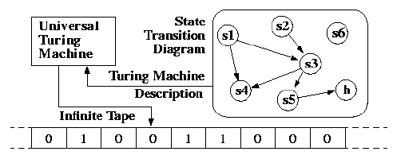

# 比特币和全面开放的主张。

> 原文：<https://medium.datadriveninvestor.com/bitcoin-and-the-claim-of-total-turingness-5670872b3250?source=collection_archive---------13----------------------->

*设计区块链语言的一课。*

克雷格·赖特是一个非常有争议的人——中本聪声称，比特币 SV，*重大*抄袭指控——事实上，如果你在 Reddit 上提到他，你会被否决掉。但克雷格·赖特也是一个非常聪明的人，比密码社区的 Twitter 账号让你相信的要聪明得多。他的学位和多年的经验是你不能忽视的——哦，等等，除了，[你可以](https://www.forbes.com/sites/thomasbrewster/2015/12/11/bitcoin-creator-satoshi-craig-wright-lies-hoax/#782eb4306794)。然而，我们今天先假定莱特博士是无辜的。2014 年，莱特博士发表了一篇名为“[比特币:一个完整的图灵机](https://papers.ssrn.com/sol3/papers.cfm?abstract_id=3265146)”的论文，今天我们就来讨论一下。

*注意:*这篇文章没有结论，我在 02-05-2020 之前不太擅长图灵计算机，因此不会自称是。我使用术语“声明”、“陈述”、“提议”并不是因为我怀疑作者和评审小组的智力诚实，而是因为我对这些系统没有 100%的理解。

Photo by [Mauro Sbicego](https://unsplash.com/@maurosbicego?utm_source=medium&utm_medium=referral) on [Unsplash](https://unsplash.com?utm_source=medium&utm_medium=referral)

如果你不知道图灵机，现在是谈论它的好时机。图灵机是代表抽象机器的理论计算模型。图灵机是分成单元的带子。

A Universal Turing Machine

图灵机是传奇人物艾伦·图灵在 1936 年提出的，它证明了一件非常重要的事情:Entscheidungsproblem 的[不可计算性](https://en.wikipedia.org/wiki/Computability)。当然，图灵机不能在现实生活中实现，因为我们在现实生活中没有无限的磁带，也因为这些机器没有为现实生活中的实现进行优化。比如说。现实生活中的计算机使用 ram，而 TMs 不使用。但是 TMs 可以计算真实计算机能计算的任何东西，只要计算的持续时间不成问题。

图灵完备性是指任何图灵完备的程序将会停止。任何停止的程序都不会趋于无穷大。从这里我们推断图灵机应该运行无限时间。

**这和比特币有什么关系？**

比特币的脚本是一种基于栈的、非图灵的完全编程语言。并且有很多关于这方面的谈话，特别是攻击以太坊社区是图灵完全的，缺乏需要是图灵完全的，因为“波斯特定理”。

Representation of a Stack Data Structure

波斯特定理经常被用来为图灵完备性的缺乏和可判定性的安全性辩护。但随后赖特进来说，比特币已经成为他提议称之为“概率总体图灵机”的东西。

让我试着总结一下克雷格的观点——

1.  Wright 提出比特币等价于 Wolfram 猜想中提出的机器，Wolfram 猜想指出一个 2 态，3 符号的图灵机是一个通用的图灵机。由此，一个命题建立了比特币脚本也必须是通用图灵脚本。
2.  Wright 声明比特币是图灵完全的，并使用 Ackermann 函数证明了这一点。
3.  Wright 提出比特币脚本是一个概率总图灵机，这是他较早提出的东西。PTTM 不同于 PTMs。
4.  脚本中的备用堆栈使其图灵完整。
5.  比特币脚本中缺少循环并不意味着非图灵不完整。
6.  由于比特币是使用原始递归函数形成的，因此脚本结构是图灵完整的。

让我们试着剖析这一切。

1.  **比特币不支持循环:**这本身并不能使脚本图灵完整或不完整，这使得脚本缺乏控制结构。当然，如果-else 存在，但是没有 For 循环，就缺乏控制。这不是语言中的一个 bug，而是一个特性。一个 [Busy Beaver](http://courses.cms.caltech.edu/cs11/material/python/lab6/lab6.html) 这样的小脚本，往坏里说会导致比特币网络返回 DoS 超时，往好里说会拖慢哈希速率。这是为了提高决策性和安全性而实施的。
2.  **两个栈并不构成一个图灵完全机:**要模拟一个两栈的 PDA(也就是图灵完全)，你需要一个控制结构。正如我在[1]中所说，比特币缺乏循环。
3.  **比特币限制了每个脚本可以做的非推送操作的数量:**如果你看比特币的 Github，你会看到下面这段代码:*static const int MAX _ OPS _ PER _ SCRIPT = 201；这意味着每个脚本可以执行 201 次非推送操作。这也是为了防止不可判定的问题。因此，即使您实现了 2PDA，您实际上也会受到限制。*

对我来说，比特币是否是图灵完全的是一个徒劳的争论。比特币网络比其他网络“更”图灵，因为它的规模(那种说法没有科学价值，我是作为一种比喻说的)。比特币脚本最好是设计成不完整的图灵，即使可能有一些“证据”证明它不是这样。P2P 共识网络需要在其脚本中实现某种形式的可判定性。例如，以太坊有一个气体系统。因此它是准图灵完备的。比特币脚本，如果在比特币网络之外使用，会有问题，因为它在设计上是图灵不完整的，但稍加修改，你就可以将其构建为图灵完整的。但是实际上，没有一个系统是真正的图灵完备的。我很喜欢你对此的评论！