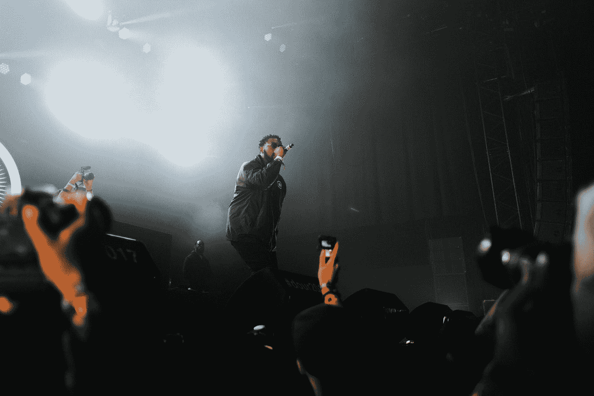

# 比特币和美国的解放？——说唱歌手凯恩·韦斯特是亲 BTC 的

> 原文：<https://medium.datadriveninvestor.com/bitcoin-and-the-liberation-of-the-usa-rapper-kayne-west-is-pro-btc-79ea776a991f?source=collection_archive---------14----------------------->

Photo by [Simon Boxus](https://unsplash.com/@simonlerouge?utm_source=medium&utm_medium=referral) on [Unsplash](https://unsplash.com?utm_source=medium&utm_medium=referral)

美国说唱歌手凯恩·韦斯特是美国最著名的明星之一。这位亿万富翁也将作为独立候选人参加今年的美国总统大选，他在最近的一次 YouTube 采访中表达了自己对比特币及其潜力的看法。这位说唱歌手兼时装设计师对他的观点给出了有趣的见解。

例如，西方证明了加密货币比特币“解放美国”的潜力。在这篇文章中，我们仔细观察了这位说唱歌手令人激动的陈述。

 [## 13.000 美元比特币处于 2019 年 7 月以来的最高水平——为什么？

### 关于什么推动了 BTC 价格，什么没有，有很多争论。以下是对此的一些想法

medium.com](https://medium.com/the-capital/13-000-bitcoin-at-the-highest-level-since-july-2019-why-42cdc0942015) 

# 比特币是美国的解放？—凯恩·韦斯特

凯恩·韦斯特被认为是一个有争议的人物。在外人看来，他的言论总是离奇古怪，有时甚至疯狂。然而，毫无疑问，西氏已经建立了一个帝国，尤其是基于两大支柱，“音乐”和“服装”

然而，韦斯特并不满足于这种状况，因此将作为独立候选人参加今年的美国总统选举。他竞选的焦点尤其是他与上帝和宗教的关系。

然而，谁认为现在的保守图景是错误的。在当前与乔·罗根的播客采访中，凯恩·韦斯特谈到了比特币及其对加密货币的看法。

因此，它首先表现出对“比特币天才”的赞赏，这些人表现出真正的远见卓识，并相信社会的持久变化。

> 这些人对美国和社会的真正解放有自己的看法。

在这个过程中，韦斯特说，许多来自“技术领域”的人物正在推动边界，从而有助于塑造社会变革。

这些技术人员中的许多人，尤其是比特币人员，我们能够利用新的方式，事实上是信息和技术的新方式，并通过这样做，将边界进一步向前推进。另一方面，政治体系仍然固守旧的价值观和传统的选举团制度。

 [## 比特币与替代硬币——为什么投资组合中大多数人更喜欢 BTC

### 比特币比所有 Altcoins 都有明显优势。

medium.com](https://medium.com/datadriveninvestor/bitcoin-about-altcoins-why-most-prefer-btc-in-the-portfolio-b879bf585b5e) 

# 像 Square 或 Microstrategy 这样的公司是先驱

凯恩·韦斯特在采访中强调说，他为这次谈话做了充分的准备。例如，他与风险投资家安东尼·席勒和比特币基地联合创始人弗雷德·厄尔萨姆进行了交谈。

在这方面，West 与加密空间行业的人士进行了交谈，他们为他提供了有趣的见解。在这个过程中，这位说唱歌手还强调了 Square 或 Microstrategy 等公司的先锋作用，这些公司开创了一个新局面。

有趣的是，乔·罗根在采访后也表示，这“远远超出了他的预期。”罗根过去已经采访过几位美国总统，并明确表示，人们实际上可以理解“这个人是如何看待凯恩·韦斯特的”。

这位说唱歌手在采访中强调了比特币的几个积极方面。你对凯恩·韦斯特的陈述有什么看法？

我在每月一期的 [**简讯中分享了更多私密的想法，你可以在这里**](https://mailchi.mp/bf8f8e8ed697/keep-in-touch-with-lukas) 查看。请在评论中告诉我，并在各种社交媒体平台上加入我:

[**推特**](https://twitter.com/WiesfleckerL)●[**insta gram**](https://www.instagram.com/lukaswiesflecker/)●[**脸书**](https://www.facebook.com/lukaswiesfleckerr)●[**Snapchat**](https://www.snapchat.com/add/luggooo)**●[**LinkedIn**](https://www.linkedin.com/in/lukas-wiesflecker-1b11251a5/)**

**无论你做什么，都要带着爱和激情去做！**