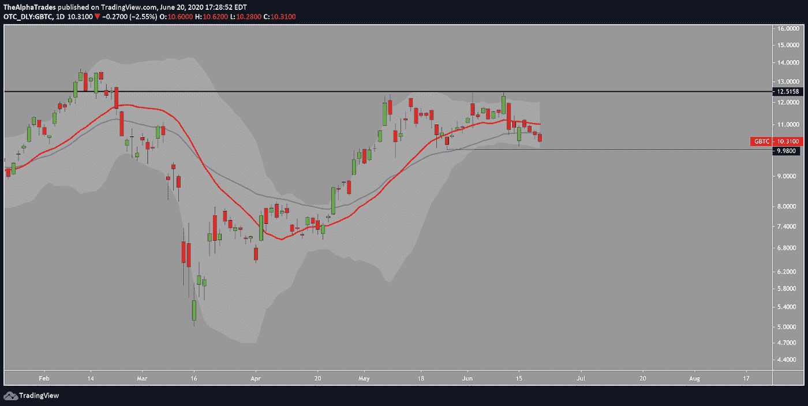
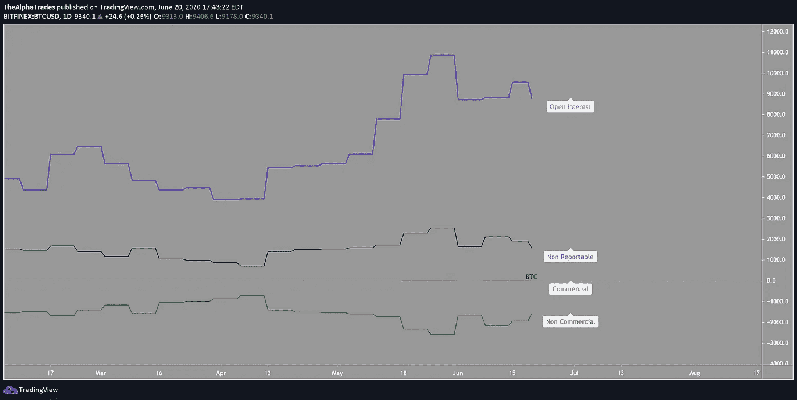
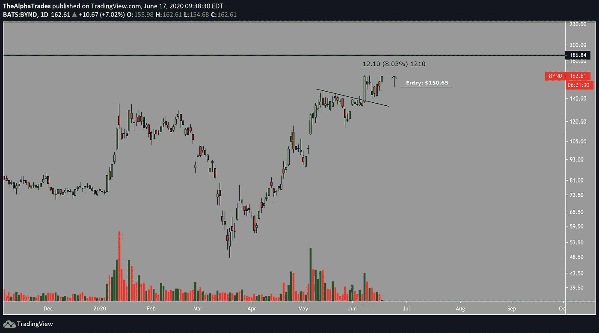

# 比特币煮青蛙——波动来临

> 原文：<https://medium.datadriveninvestor.com/bitcoin-boils-the-frogs-volatility-incoming-8f396c405ac6?source=collection_archive---------5----------------------->

## 期权到期可能会加大对 BTC 的压力。

Bitcoin Boils Frogs; Source: Couleur, Pixabay

## **总结**

*   比特币和 GBTC 市场情绪——无聊的青蛙被活活煮熟
*   标准普尔 500 [期权到期](https://realmoney.thestreet.com/investing/stocks/options-expiration-extravaganza-will-drive-friday-s-action-15353147)“四重巫术”波动

如果你想了解比特币的技术分析，请查看我们的[之前的报道](https://medium.com/datadriveninvestor/bitcoin-faces-a-rocky-adoption-curve-daily-update-e12e26611256)，也可以滚动到本页底部，观看周五上午的视频以及下午与我们的首席分析师 Faisal 的讨论。

总的来说，BTC 打破了 6 月份的月度开放，并没有设法关闭以上的水。来自较低时间框架的多次拒绝将 BTC 拉进了一个下降的平行通道，从 4 小时的时间框架中可以看出这一点([时间戳:2:25](https://youtu.be/2LpwgZ7W8zs?t=145) )。

# 煮青蛙

参见 2019 年 8 月的[视频](https://youtu.be/KIVFFz_GCjs?t=380)，该视频展示了我们今天在 BTC 目睹的市场情绪和价格行为的类似模式。这被称为“煮青蛙”的类比。

[俗话说](https://en.wikipedia.org/wiki/Boiling_frog#:~:text=The%20boiling%20frog%20is%20a,will%20be%20cooked%20to%20death.)当你把一只青蛙放入温水中，慢慢加热，青蛙并没有意识到它正在被煮沸。如果你把温度调得足够慢，青蛙会一直呆在水里直到死去。如果你快速加热，青蛙会注意到不同并跳到安全的地方。

 [## 加密货币行业是死是活？数据驱动的投资者

### 九月初，我们在 X-Order 内部就代币市场的未来进行了一场辩论。有趣的是，我们的观点是…

www.datadriveninvestor.com](https://www.datadriveninvestor.com/2019/12/12/will-the-cryptocurrency-industry-be-dead-or-alive/) 

在这种情况下，青蛙是普通投资者。直到价格暴跌，他们才知道自己被煮了，对许多人来说，那一刻来得太晚了。一些更精明的青蛙可能会更早一点意识到价格波动对他们不利，一旦意识到他们已经承受了很大的损失，他们就会平仓，造成连锁反应，直到所有的青蛙要么死了，要么跳到了安全的地方。

Bitcoin boiling the frog; Source: Alpha Trades

无论市场或资产的类型，你都可以观察到青蛙沸腾现象。只要普通投资者群体中存在足够多的自满情绪和非理性繁荣(理解为:对之前的市场偏见感到厌倦)，这种情况就会发生。当人们变得自满时，他们就会犯错误，尤其是如果这种自满是因为长期持有偏见的结果。简单来说，这就是缓慢下降通道的形成过程，越低越高。

随着波动性下降，Crypto Twitter 变得无聊并渴望采取一些行动，我变得越来越谨慎。在过去的一个半月里，我一直不看好 BTC。通常情况下，说到识别分布，我是有点早的，我觉得现在就是这样。

我要说明的是，我不是大师，但当我看到看涨的大众对他们的出血头寸变得自满时，马克·道格拉斯的开创性著作《区域内交易》就浮现在我的脑海里。我向任何想在他人心理背景下更好地理解自己心理的人推荐那本书。我学到了很多关于人们如何应对激烈的市场环境的知识，也教会了我如何处理盈利和亏损。通过阅读关于自律和市场情绪的书籍来建立你的投资者或交易心态。

# 期权合约全面到期

标准普尔 500 本周结束时，价值约 1.8 万亿美元的期权合约[到期](https://www.ccn.com/unprecedented-sp-500-volatility-imminent-ahead-of-major-options-expiration/)，这被称为“[四重魔力](https://www.bloomberg.com/news/articles/2020-06-18/quadruple-witching-set-to-add-fuel-to-month-of-stock-turbulence)”事件。这是历史上第三大非 12 月期权到期日，每个人都预计会出现一些不可思议的波动。与此同时，这并不奇怪，罗宾汉散户投资者在预期(无限？)上行。

如果标准普尔 500 下跌，我当然预计比特币也会跟着下跌。回想一下，GBTC(灰度比特币信托)在股票市场上作为 ETF 交易，所以我会结合 BTC 的价格行动和传统市场密切关注它。GBTC 的抛售也将增加比特币现货市场的压力。随着上个月出现双顶，GBTC 下跌的可能性增加了。此外，正如周四视频中所讨论的，GBTC 的 34 均线(下图中的紫色线)和布林带(特别是红线)指标尤为重要。至少早在 2019 年 2 月，34 均线就充当了动态支撑阻力区。如果所有这些因素最终导致 GBTC 下跌，ETF 的下一个目标是 9.98 左右。关于我用布林线计时交易的策略，请看[时间戳 19:36](https://youtu.be/2LpwgZ7W8zs?t=1176) 。不要错过它，因为 BTC 不会长时间保持这种平静，布林线在很大程度上是波动的指标。

Bitcoin GBTC Grayscale Bollinger Bands and 34 EMA; Source: Alpha Trades

足够多的人在 BTC 提出了潜在的逆转[头肩顶](https://www.investopedia.com/terms/h/head-shoulders.asp)，这可以从一小时的图表中最好地看出，我将在这里提供之前视频中的时间戳: [16:10](https://youtu.be/2LpwgZ7W8zs?t=970) 。

COT Data Bitcoin; Source: Alpha Trades

COT 数据(交易者的承诺)显示，未平仓合约正在攀升，但价格已经缓慢下跌。对我来说，这表明系统中空头头寸的增加。非商业领域(对冲基金和机构通常出没的地方)的空头敞口略有下降，尽管大多数都严重做空。零售商似乎减少了总体长期敞口。也许青蛙感受到了温度的上升？

# 奖励交易:超越肉类(BYND)

我在 150.65 美元附近进场做多，交易继续保持强劲。这些交易的细节要多得多，而且每天都有很多。继续滚动图表，找出如何参与行动。

Beyond Meat BYND long trade position; Source: Alpha Trades

# 优势会员获得更多

[订阅 Discord 服务器](https://bit.ly/2KJ1oor)学习技术分析以及如何投资获利。不要错过，因为我们正在**统治我们通常免费提供的内容**以关注我们优势群体的更高质量的数据、新闻和分析。

# 放弃

Alpha Trades，LLC 提供的信息不用于制定任何财务决策，也不是购买、持有和/或销售特定产品、数字资产或 ICO 的请求或建议。

访问我们的完整服务条款:[https://bit.ly/3faVeeV](https://bit.ly/3faVeeV)

**访问专家视图—** [**订阅 DDI 英特尔**](https://datadriveninvestor.com/ddi-intel)