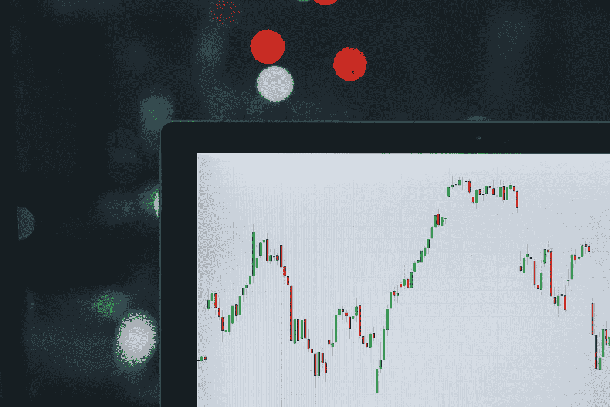
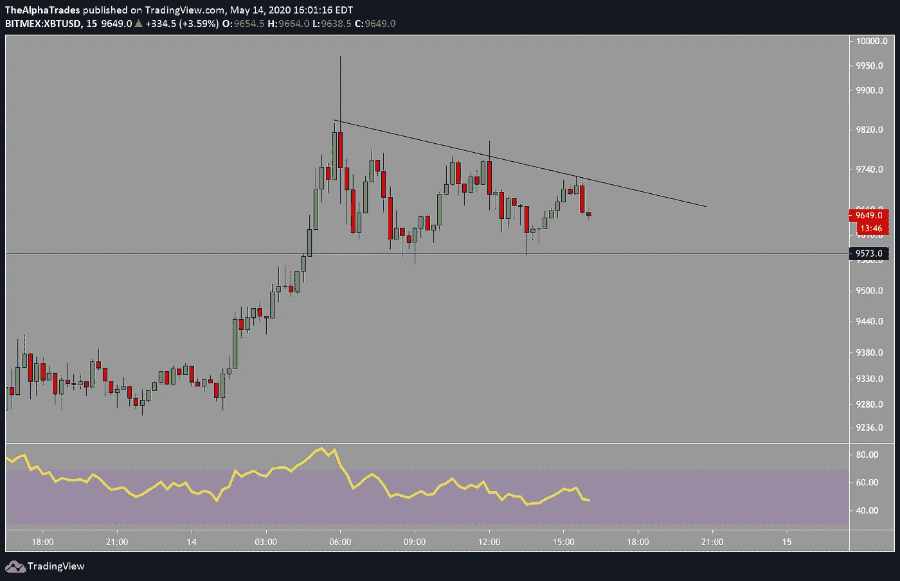
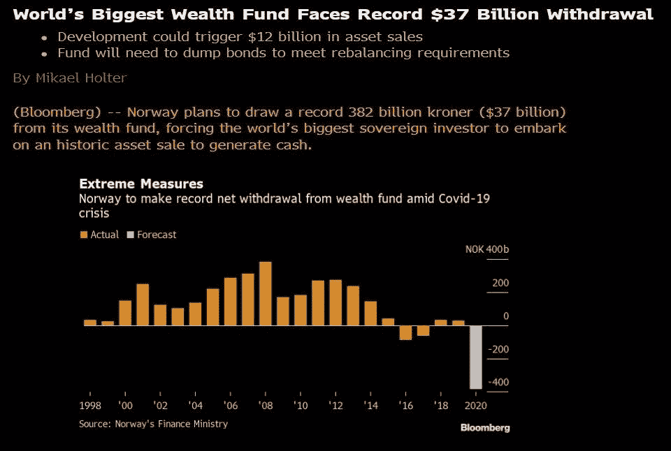
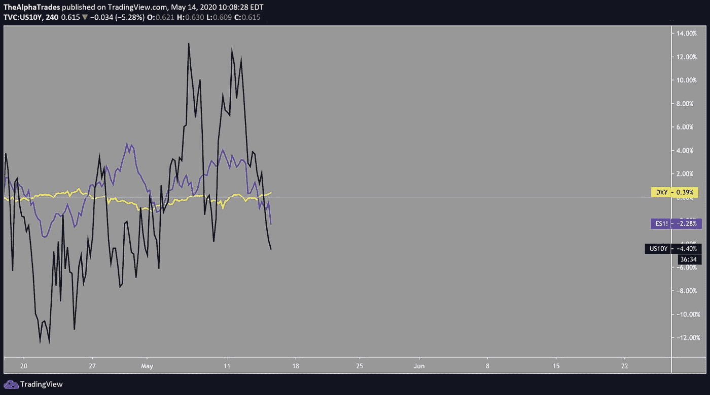
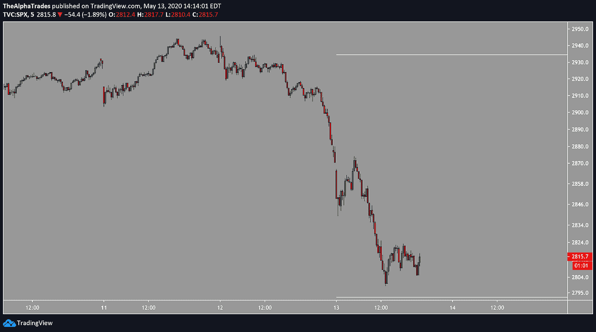
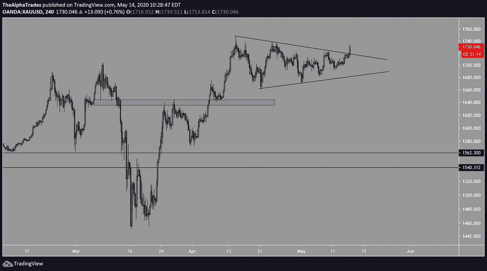

# 比特币突围还是多头陷阱？

> 原文：<https://medium.datadriveninvestor.com/bitcoin-breakout-or-bull-trap-4b2d4206613f?source=collection_archive---------11----------------------->

## 美元升值，标准普尔 500 挑战关键低位，BTC 盘整。

Photo by M. B. M. on Unsplash

# 比特币分析

比特币在 9978 附近暂时登顶，卖方交易量较高。在 15 分钟上，有一个下降的三角形出现在趋势的顶部，表明可能会继续。如果价格在较小的时间框架内拒绝了较低的高点，并突破了关键低点 9551。缩小到 4 小时时间框架，从 4 月 30 日开始用对称三角形建立的范围给出了 9490 的目标支撑位。如果这个区域被打破，做空机会就会出现，目标是 8925 附近的 EQ 区域，最后是 8400 附近的区间低点。相对强弱指标也继续看涨。从更高的时间框架来看，BTC 目前有更多的上行动力。

Bitcoin smaller time frames, Source: Alpha Trades, LLC

# 美国股票和全球市场分析

尽管盘前下跌了约 300 点，但金融和能源价格从坟墓中爬了出来，并从当天的低点上涨了近 4%。

我们现在通过分析市场中的领先板块来确定今天反弹的力度。相对于其他行业，科技股和高成长股正在遭受打击。像 MSFT 和俄克拉荷马州这样的领导者保持稳定，但没有跟随反弹。在今天早上将 IPHI 加入投资组合后，我们的团队正在寻找 DIS 和 CRM 中的最佳条目。

 [## 加密货币行业是死是活？数据驱动的投资者

### 九月初，我们在 X-Order 内部就代币市场的未来进行了一场辩论。有趣的是，我们的观点是…

www.datadriveninvestor.com](https://www.datadriveninvestor.com/2019/12/12/will-the-cryptocurrency-industry-be-dead-or-alive/) 

如果与美国的紧张关系升级，人民币兑美元可能会进一步走软，加剧新兴市场的抛售。与此同时，世界上最大的财富基金[面临创纪录的 370 亿美元提款](https://www.bloomberg.com/news/articles/2020-05-12/world-s-biggest-wealth-fund-faces-record-37-billion-withdrawal)，而在美国，公共养老基金[公布了创纪录的损失](https://www.wsj.com/articles/public-pension-fund-losses-set-record-in-first-quarter-11589240175?shareToken=st6d2b11aebd06416392e74d90c3086021)，平均下降 13.2%。削减福利的压力会很大。

随着全球经济压力的增加，美联储计划本周开始购买公司债务 ETF，主要目标是平稳市场运作。到目前为止，美联储的努力只是勉强稳定了不可避免的违约和破产，这将对更大规模的救助计划构成压力。

World’s Biggest Wealth Fund Faces Record $37 Billion Withdrawal, Source: Bloomberg

# 股票和债券头寸更新

标准普尔 500 最近开始下降，到晚上又回升了。

下面的图表描绘了 DXY(美元指数)攀升，而 E-mini 标准普尔 500 期货和 10 年期美国国债下跌。随着与中国的贸易战和破产的迫近，投资者可能会在完美熊风暴的预期中转向现金。

Assets pour into the US Dollar, Source: Alpha Trades, LLC

随着一个小的双底打印(5 分钟的时间框架)，我关闭了 5 月 12 日启动的看跌期权，平均利润+270%。

SPX is double-bottoming, Source: Alpha Trades, LLC

阿尔法交易团队还平仓了应用材料公司(AMAT)的多头头寸:

**收盘价:**53.75 美元

**利润:** 13.5%

**原因:**收益将在今天收盘后公布，这给自信持有带来了太多的不确定性。

最后，黄金(GLD)正在突破一个更大的三角形形态。我已经在 GLD 待了一段时间了，所以这对交易来说是一个积极的信号。

GLD breakout, Source: Alpha Trades, LLC

# 今天的红利优势交易

我们的股票分析师在 5 月 11 日提醒 Advantage 会员注意 EOG 的多头交易。具体情况如下(大量免费赠品送给我们的非付费观众):

**EOG 资源(EOG)石油天然气生产商**

交易时间表:短期(1-3 周)

提醒价:49.95 美元

第一个目标:58-60 美元

回报:14%-18%

覆盖参数:如果股票收盘低于 48.50 美元 2 天，我将覆盖警报

下行风险:2%-5%

# 推理:

EOG 上周公布了不错的收益。

**逆势观点:**石油资产面临价格下跌和价值板块表现不佳的压力。

**披露:** *以上股票提示为本人观点，非投资建议。请在交易前做好自己的研究。*

# 处于优势

感谢您成为这个社区的一员。如果你对这篇文章有共鸣，请[订阅 Discord 服务器](https://bit.ly/2KJ1oor)。你将可以免费访问公共频道，在那里我们每天发布大量免费有用的内容。更多细节请看下面的视频。

Source: Alpha Trades, LLC (Youtube)

# 放弃

Alpha Trades，LLC 提供的信息不用于制定任何财务决策，也不是购买、持有和/或销售特定产品、数字资产或 ICO 的请求或建议。

访问我们的完整服务条款:[https://bit.ly/3faVeeV](https://bit.ly/3faVeeV)