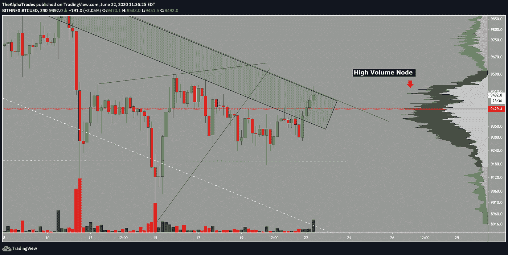
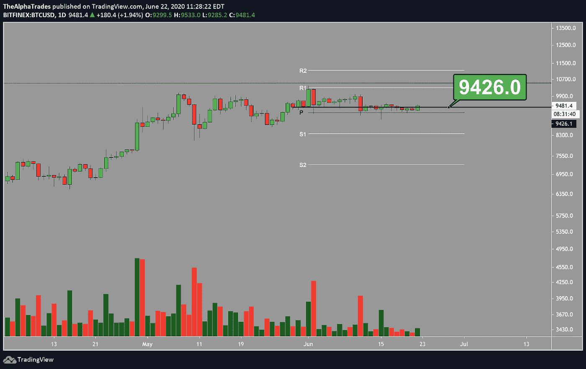
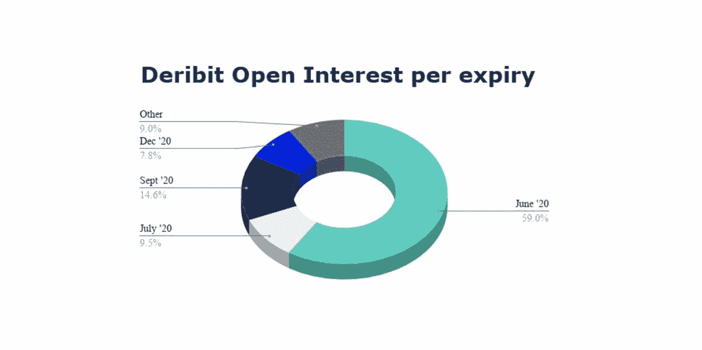
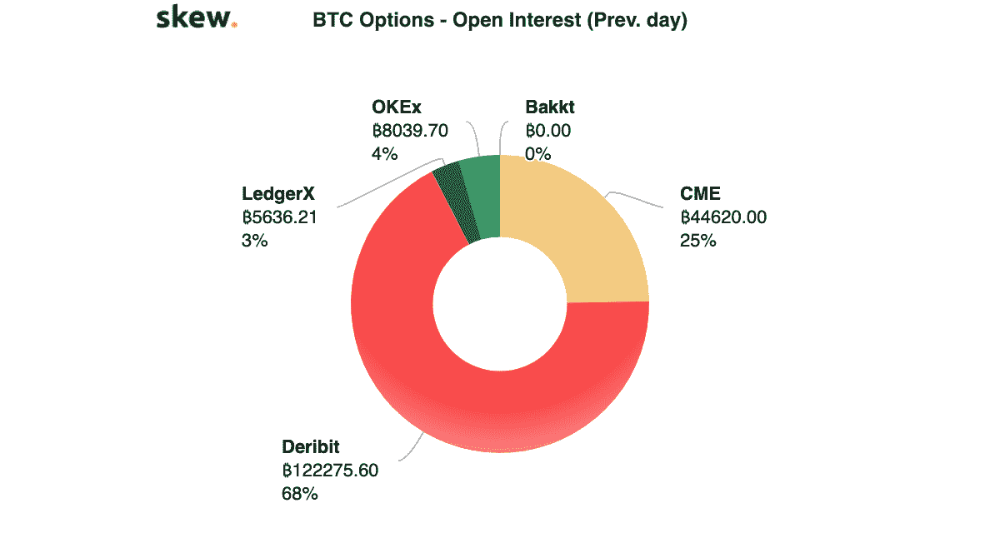
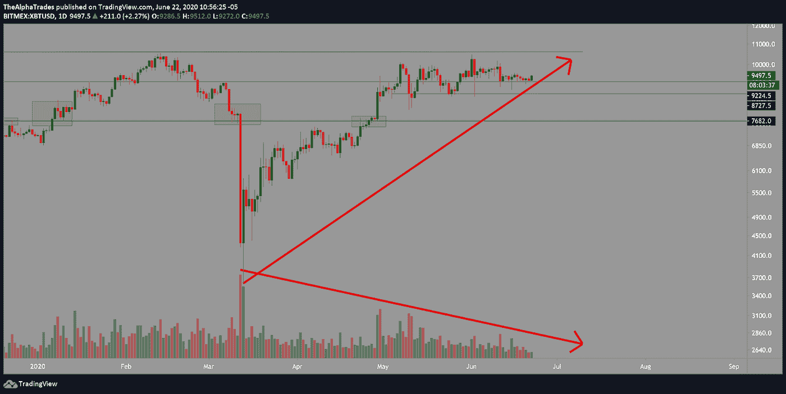

# 期权到期，比特币多头没油了

> 原文：<https://medium.datadriveninvestor.com/bitcoin-bulls-out-of-gas-as-options-expire-bd1d0dc16b45?source=collection_archive---------7----------------------->

## 先是股票期权到期，现在轮到比特币了——低波动性不会永远持续下去。

Bitcoin Bulls are out of gas; Photo by Lily Banse on Unsplash

希望你有一个美妙的周末。在您进一步阅读之前，我建议您将我们上周五的视频添加到您的日常背景噪音中；叫做“[比特币煮青蛙——波动来袭](https://medium.com/datadriveninvestor/bitcoin-boils-the-frogs-volatility-incoming-8f396c405ac6)”比特币正在加大对后期游戏玩家的压力。解释者在视频中，如果你想更好地理解市场心理，以及市场如何慢慢地榨干参与者，直到他们在分配过程结束时受到快速的毁灭性打击，请查看视频。

比特币的价格走势略有看涨至中性，因为它在较低的时间框架内突破了下降趋势线(从 1 小时到 4 小时看效果最好)。在一天前的视频中，嵌入在这篇文章的底部，我提到价格应该设法达到大约 9500，在这篇文章中它已经做到了。我们现在将拭目以待，看看它是否能测试 2020 年 6 月的月度公开赛作为支持。

从四小时的角度来看，BTC 已经形成了一个明显的下降趋势，根据提供的图表，超过三次触及绿色通道。

 [## 加密货币行业是死是活？数据驱动的投资者

### 九月初，我们在 X-Order 内部就代币市场的未来进行了一场辩论。有趣的是，我们的观点是…

www.datadriveninvestor.com](https://www.datadriveninvestor.com/2019/12/12/will-the-cryptocurrency-industry-be-dead-or-alive/) 

在日线时间框架上，关键标志是 9426，这与日线中枢重合。对我来说，6 月 11 日的日线蜡烛线是一个明显的结构断裂，随后出现了几次蜡烛线拒绝，这意味着提到的关键标志是这个阶段的一个强阻力位。

从 VPVR 指标来看，高交易量节点的拒绝至少会将价格拉至图表中红线所示的控制点。取决于资产变得多么不稳定，第二个高交易量节点的突破可能会使 BTC 下跌很多。

OBV(平衡交易量)指标帮助你理解通过给定资产的资本流动量。BTC 的 OBV 一直在下降，表明没有多少新资本进入该资产。

BTC high volume node on VPVR indicator shows major resistance above the downtrending channel; Source: Alpha Trades

BTC on-balance volume (OBV) downtrending; Source: Alpha Trades

BTC key marker is 9426 near the daily pivot; Source: Alpha Trades

# 股票市场的季度收盘时间临近

在季度收盘时，通常会发生对冲基金内部的配置轮换。我们将在本文的第二部分对此进行详细介绍，但是这个事件与…

# 六月期权到期潮

6 月 26 日的期权合约将到期，未平仓合约超过 16 亿美元，即近 167，000 份合约。这些合约分散在不同的交易所，但主要的一点是，对 BTC 来说，这将是巨大而动荡的一周。

June 26th options expiry will be a big one for BTC; Source: Deribit

BTC Options Open Interest; Source: Skew

# 请看周日视频了解 GBTC ( [时间戳:15:34](https://youtu.be/1h7tQEYxkV4?t=934)

GBTC 打破了日线布林中轨和重要的 34 均线，日线蜡烛线位于下方。同样，这在提供的视频中有详细的解释。

# 自 2020 年 5 月以来，随着价格攀升，比特币交易量下降，这表明了看跌分歧。

BTC volume descending as price climbs, bearish divergence; Source: Alpha Trades

# 如需查看以下视频，请点击此链接(链接即将推出)。

# 我们正在寻找客座专家和分析师。

*如果你想顺便来聊聊市场和经济，我们邀请你到* [*加入不和*](https://bit.ly/AlphaTradesDiscord) *并给任何一位管理员发送消息。如果我们有一个爆炸在一起，我们也会在我们的分销渠道的特点你。*

# 优势会员获得更多

[订阅 Discord 服务器](https://bit.ly/2KJ1oor)学习技术分析以及如何投资获利。寻找第一个月高级会员的 50%折扣？向管理员发送消息。

# 放弃

Alpha Trades，LLC 提供的信息不用于制定任何财务决策，也不是购买、持有和/或销售特定产品、数字资产或 ICO 的请求或建议。

访问我们的完整服务条款:[https://bit.ly/3faVeeV](https://bit.ly/3faVeeV)

**访问专家视图—** [**订阅 DDI 英特尔**](https://datadriveninvestor.com/ddi-intel)