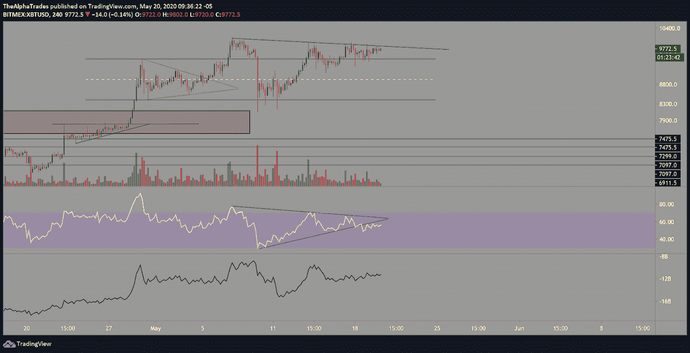
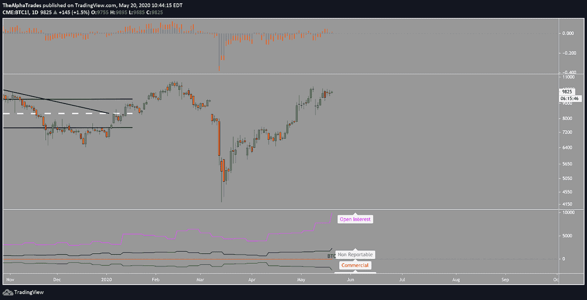
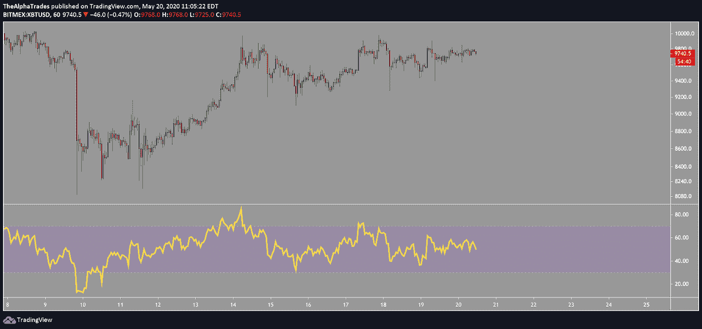

# 比特币 CME 期货数据显示，对冲基金和机构正在增加空头

> 原文：<https://medium.datadriveninvestor.com/bitcoin-cme-futures-data-shows-hedge-funds-and-institutions-are-increasing-shorts-9b20c1723936?source=collection_archive---------9----------------------->

## 空头在躲藏，散户在看你的脚步！

BTC bears incoming, Photo by Daniel Salcius on Unsplash

星期三快乐，在我们开始今天的分析之前，有几件事情需要解决。如果你赶时间，可以跳到下一个副标题。

我们在社区中有了大量的新兴趣，并且在 Discord 服务器中有了许多新的频道。这个社区正在成长，我希望你们能成为其中的一部分，因为我认为在接下来的几个月里，我们会在这些动荡的市场中发现一些巨大的机会。**这也是一个选举年**，所以我们的团队预计波动性将在美国引起特别关注，并将波及全球市场，特别是外汇市场。

综上所述，**我们将在月底**提高优势会员的价格，因为我们现在在交易中加入了很多价值。好了，今天的文章到此结束，现在回到分析上来！

 [## Azbit 旨在连接传统金融和加密货币|数据驱动的投资者

### Azbit 是下一个提供交易平台的加密项目，该平台提供保证金和算法交易。一样多…

www.datadriveninvestor.com](https://www.datadriveninvestor.com/2019/03/20/azbit-aims-to-connect-traditional-finance-and-cryptocurrency/) 

# 比特币中有东西要来了…

我目前做空 BTC，仍然认为它很有可能会下跌。我认为有几个原因，[，今天的视频](https://bit.ly/alphatradesVidMay20)中也解释了这些原因(请自行研究，这不是财务建议)。

比特币在大约六天的时间里发现自己处于一个广泛的价格区间，在 9970 至 9100 之间盘整。这是一个接近 800 美元的区间，因为交易者的情绪在纠结这种资产是否有力量超越标准普尔 500 的浪潮。

价格也印出了更高的低点，因为多头继续引导价格向上，这可能是一个上升三角形[的突破。然而，我认为这可能是部分看空者的欺骗，因为我认为 BTC 在那里更看空而不是看涨。希望读者能在市场发生任何剧烈变化之前抓住这个分析。](https://www.investopedia.com/terms/a/ascendingtriangle.asp)

空头可能很快介入的第一个线索是，随着价格挑战趋势线，交易量逐渐减少，如下图所示，第二，我想指出的是，到目前为止，BTC 在每次偏离趋势线时都拉回了范围，并且是在交易量飙升的基础上。我认为我们将迎来另一次交易量高峰，这将至少把价格拉回区间。

我们进入这种渠道内外的长期分布已经两个半星期了，从更高的时间框架来看，许多卖方交易量增加，而买方无法达到更高的高点。

这告诉我们，多头正在努力突破一个真正的更高的高点。为了更深入地了解正在发生的事情，我查看了订单簿数据和订单流，在我看来，这些数据显示空头正在引导价格上涨，诱使散户以越来越高的价格买入，并可能准备对多头下手。规模较大的玩家有时会将资产的价格标入自己的订单墙，以便根据自己的剧本以更具成本效益的价格进行分销。

Bitcoin challenging new highs? Source: Alpha Trades, LLC

# 在衡量比特币突破之前等待更多信息

假设向上突破到 10，100 点或 10，500 点，那么我们可以消除所有的困惑，假设 11，000 点，也许 11，500 点是下一个目标，但价格行为还有待证明。

我在我的[到 2025](https://youtu.be/TLKVdaPlsDE) 的比特币路线图视频中描述了很多你在这里看到的东西，在视频中，我还绘制了未来几年的艾略特波浪计数、每日量价背离，以及一些关于如何比以往任何减半事件后更多的矿工现在卖出[的法医分析。](https://www.newsbtc.com/2020/05/13/post-bitcoin-halving-miners-have-dumped-5m-more-btc-than-before/)

从每日角度来看，2019 年 10 月至 2020 年 2 月的关键高点 10，500 点存在明确的风险，而卖方显然已经连续几天保持 10，000 点的强势。这就是为什么我持有我的摇摆空头头寸这么长时间，因为我正在仔细观察价格是否能够突破并保持在 10，000 以上，以挑战那些更强的阻力位。

# 深入研究 CME 数据

比特币 CME 期货数据对于理解市场结构以及大型对冲基金的期货头寸或未平仓头寸非常有用。

下图中的底部指示器监控 CME 成本数据，这是交易者报告的承诺，并提供对许多参与者的市场定位的洞察。首先要注意的是，持仓量飙升得非常热，但价格却相对下降了。那么这告诉我们什么呢？

我会让读者参考[这本来自剑与盾](https://swordandshieldforex.com/complete-guide-to-cot-trading/)的指南，它从外汇市场的角度解释了 COT 数据。同样的原则也适用于比特币。现在你对数据有了更深的理解，你可能会得出结论，随着价格下降而未平仓合约增加，市场仍然相对看跌，尽管这种情绪隐藏在裸图上。

COT 指标上的黑线代表“不可报告”,这可能揭示高净值个人，绿线代表“非商业”,即较大的机构和对冲基金，红线代表“商业”或在市场中持有对冲头寸的人(他们试图对价格行为保持相对中立)。

非商业广告对价格走势有很大影响，因为这些都是较大的机构和对冲基金，当它们推动时，市场就会移动。

从这张图表中，我们可以假设市场中较大的参与者是净空头，空头头寸随着价格上涨而增加，同时似乎散户交易者继续堆积多头头寸。

这告诉我，虽然出现大规模假突破的可能性很大，但市场上的大玩家最终都穿上了他们的熊套，准备从散户投资者的陷阱中获利。

CME BTC order book analysis, Source: Alpha Trades, LLC

在今天的分析中，我们将检查的最后一个指标是平衡交易量(OBV)，它有助于您了解市场中的流入和流出。从一个小时的时间框架来看，OBV 再次显示，随着价格继续攀升，订单流量并没有随之增加，因此许多人在这个阶段都在按兵不动。

BTC OBV analysis, Source: Alpha Trades, LLC

# 处于优势

感谢您成为这个社区的一员。如果你对这篇文章有共鸣，请[订阅 Discord 服务器](https://bit.ly/2KJ1oor)。你将可以免费访问公共频道，在那里我们每天发布大量免费有用的内容。更多细节请看下面的视频。

Bitcoin CME Futures data shows Hedge Funds & Institutions are increasing Shorts, Source: Alpha Trades, LLC

# 放弃

Alpha Trades，LLC 提供的信息不用于制定任何财务决策，也不是购买、持有和/或销售特定产品、数字资产或 ICO 的请求或建议。

访问我们的完整服务条款:【https://bit.ly/3faVeeV 