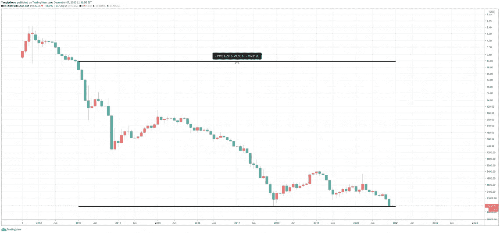

# 比特币主导美元:自 2013 年以来，美元贬值 99%

> 原文：<https://medium.datadriveninvestor.com/bitcoin-dominates-us-dollar-usd-loses-99-in-value-since-2013-5ce61082188e?source=collection_archive---------5----------------------->

比特币今年创下了历史新高。事实证明，2020 年是 BTC 价格的驱动因素。美国货币政策、不断增加的预算债务以及新冠肺炎引发的全球不确定性等所有外部因素的结合，导致了对头号加密货币的需求真正繁荣。

爱德华·斯诺登(Edward Snowden)可能是历史上最著名的告密者，他在最近的一条推文中谈到了比特币/美元交易对。通过这样做，斯诺登表明，21 世纪的主要货币相对于比特币正在经历巨大的损失。

 [## 比特币是 Covid 赢家

### 当代最著名的历史学家之一认为比特币是 Covid 危机的赢家。

medium.com](https://medium.com/coinmonks/bitcoin-is-covid-winner-5d5dd26248a7) 

# 比特币和美元:BTC 显示实力

比特币软件自 2009 年 1 月 3 日开始运行。这一天被认为是 BTC 的诞生日。

爱德华·斯诺登抛下前生，从而承受巨大的心理和经济后果的动机，很可能是为了启迪人们。

教育人们关于信息获取的政策，不知道什么是隐私，只知道国家利益。

而出于这个动机，爱德华·斯诺登也是比特币的支持者。因为中本聪为应对 2007/2008 年金融和银行危机而设计的加密货币是一种无需政府支持的数字货币概念。

因此，比特币(BTC)是基于美元强势的经济抑制政策的答案。

因此，斯诺登于 12 月 7 日在 Twitter 上发布了一条关于 BTC 美元价值的推文。

根据该报告，自 2013 年以来，美元相对于比特币已经贬值了 99%以上。换句话说，自 2013 年以来，美元贬值了 99%以上:比特币对美元大幅升值。

# 交易对美元/BTC，而不是 BTC/美元

毫无疑问，美元是最主要的世界货币。

无论是外汇市场、债券市场、股票还是商品市场:所有的交易对都是以美元计量的。

现在我们也在 BTC 测量比特币的价值。然而，如果你把交易对转过来，看看美元/BTC 的图表，我们看到的正是斯诺登在上图中描述的情景。

 [## 稳定币会危及比特币在加密领域的地位吗？数据驱动的投资者

### Stablecoin 是一种加密货币，主要用于维持稳定的市场价值。它可以通过…

www.datadriveninvestor.com](https://www.datadriveninvestor.com/2020/06/08/can-a-stablecoin-jeopardize-the-position-of-bitcoin-in-the-crypto-space/) 

# 比特币 BTC 美元价格

以 BTC 衡量，美元下跌了 99%以上。

需要注意的是，比特币受益于其通缩概念和通胀率下降。虽然总供应量是有限的，新的数量随着时间的推移而减少，但稀缺的数字商品需求却大幅增加。

在同一时期，美元数量增加了一个更强的因素。

我在每月一期的 [**简讯中分享了更多私密的想法，你可以在这里**](https://mailchi.mp/bf8f8e8ed697/keep-in-touch-with-lukas) 查看。请在评论中告诉我，并在各种社交媒体平台上加入我:

[**推特**](https://twitter.com/WiesfleckerL)●[**insta gram**](https://www.instagram.com/lukaswiesflecker/)●[**脸书**](https://www.facebook.com/lukaswiesfleckerr)●[**Snapchat**](https://www.snapchat.com/add/luggooo)**●[**LinkedIn**](https://www.linkedin.com/in/lukas-wiesflecker-1b11251a5/)**

**无论你做什么，都要带着爱和激情去做！**

## **访问专家视图— [订阅 DDI 英特尔](https://datadriveninvestor.com/ddi-intel)**