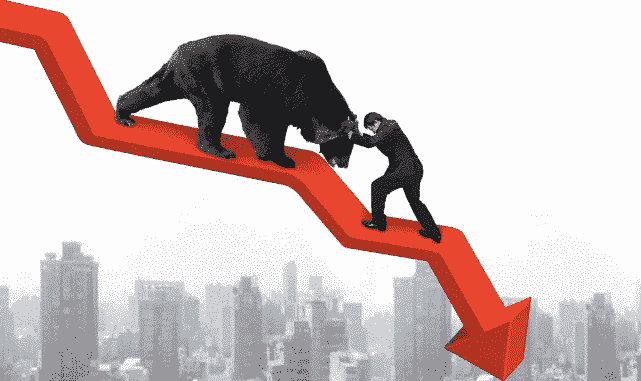

# 比特币的纯数字牛市案例(下):

> 原文：<https://medium.datadriveninvestor.com/bitcoin-doubter-the-truth-is-in-the-trends-part-ii-cabd84ff2158?source=collection_archive---------4----------------------->

【2011 年以来 4 次比特币牛市&熊市周期分析

让我先提出一些警告。这不是投资建议，也没有考虑到你的个人财务状况。比特币非常不稳定。只投资你愿意损失的，不要用信用卡买比特币。最后，也做你自己的研究！

**下一个熊市底部在哪里？**

从我们停下的地方继续，让我们开始吧。在比特币牛市的欢乐歇斯底里期间，没有人愿意谈论这个话题。就我而言，我非常看好比特币的长期潜力和价值。然而，让我们面对现实吧——市场有起有落。没有熊市和牛市就没有市场，任何资产的诚实或聪明的拥护者都不会告诉你它会永远上涨。

正如我在第一部分提到的，我分析了过去的 4 个牛市和熊市周期，并根据这些过去的周期进行了预测计算。

概括一下，以下是之前的牛市顶部和熊市底部:

**日期:BTC 价格**

## 11 年 6 月 9 日:19.58 美元(牛市顶部)
18 日-11 月 11 日:2.13 美元(熊市底部)
10 日-4 月 13 日:181.66 美元(牛市顶部)
6 日-7 月 13 日:69.05 美元(熊市底部)【T11 月 29 日-13 日:1，132 美元(牛市顶部)
17 日-1 月 15 日:199.25 美元(熊市底部)
16

当然，这一分析中缺少的是“上一个”(又称“下一个”)牛市峰值在哪里，因为那还没有发生。因此，本文将无法衡量熊市底部与上一个牛市峰值的对比。根据第一部分，以及强劲的基本面，如企业采用，这似乎还没有发生(或不会很快发生)。也就是说，我们没有峰值的数据，所以让我们看看分析中的其他点:

**下一个熊市对上一个牛市**

根据上面的数字，平均熊市底部是之前牛市峰值的 20.8%。熊市的最低底部是之前牛市峰值的 10.9%。最强的熊市底部是之前牛市峰值的 38.0%。

还是那句话，既然这里没有“最后一个牛峰”可以衡量，我就不列出任何计算了。随意看第一部分，或者以后参考这个，自己算算。

**下一个熊市对上一个熊市**

值得注意的是，我不认为新冠肺炎是熊市底部，因为这是一个非同寻常的短暂事件。将熊市底部与之前的熊市底部进行比较，2015 年 1 月 17 日为 199.25 美元，2018 年 12 月 16 日为 3283 美元，即 16.48 倍。如果上一个周期以相同的百分比重复，下一个熊市底部将为 54104 美元。

平均市场底部比之前的熊市底部高 17.26 倍。最弱的熊市底部是前一个熊市底部的 2.89 倍。与之前的熊市相比，最强的熊市出现在 2013 年 7 月 6 日，比之前的熊市高出 32.42 倍。

基于此，如果重复，市场底部将是:
**均值情况:**$ 56604.58
$ 看跌情况:$ 9487.87
**看涨情况**:$ 106434.86

**结论**

平均上述熊市，不包括任何基本面，**这将表明下一个熊市的市场底部在 57，509.10 美元。**

**重复第一部分的计算，这将是从高峰下跌后的结果。根据过去一系列牛市和熊市计算的平均峰值为 215，536.34 美元**。

喜欢这篇文章吗？点击下面的拍手按钮，给我一个关注。

接下来:

**比特币:看好 22 世纪数字资产的理由**

你重视这些文章吗？关注分享！

更多的博客，最新的加密和金融科技新闻，等等，请访问我们的网站:[thelatestblock.com](https://thelatestblock.com/)。

…

*本文不是投资建议，也不考虑你的个人财务状况。永远不要投资超过你愿意损失的，也不要赊账购买比特币或其他投资。我写下我的观察和个人观点，目的是与他人分享我所学到的东西。*

*披露:我投资于比特币和其他加密货币。*