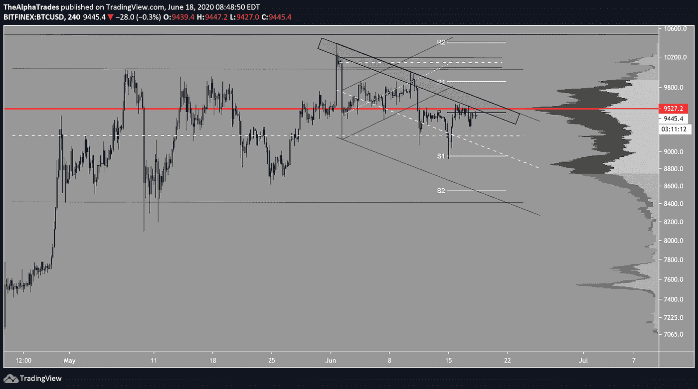
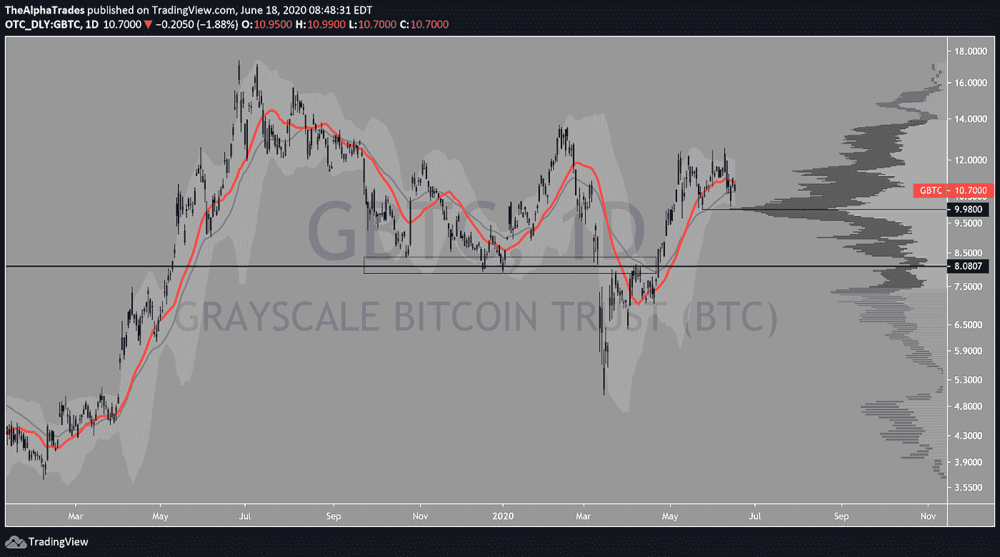
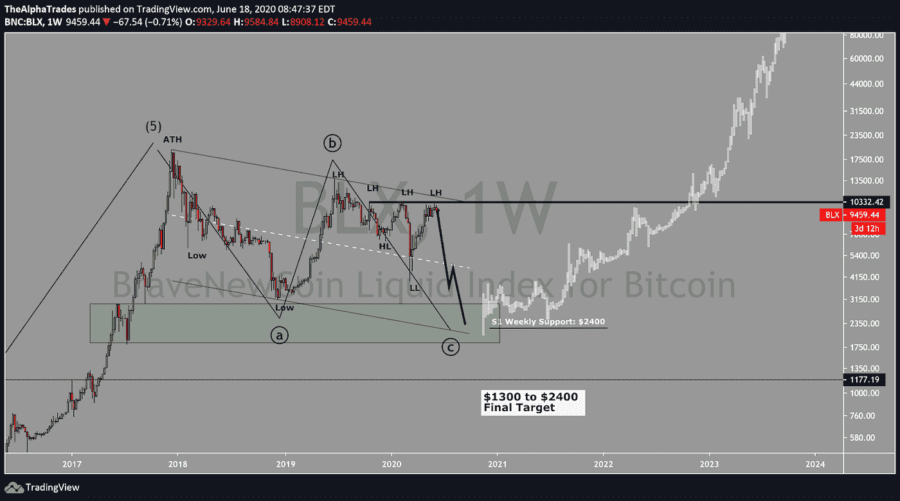
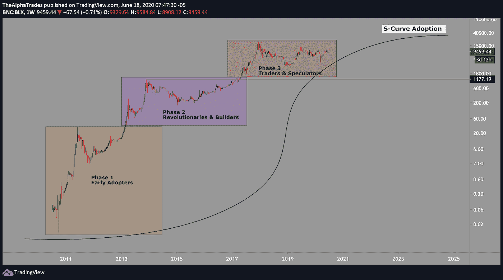
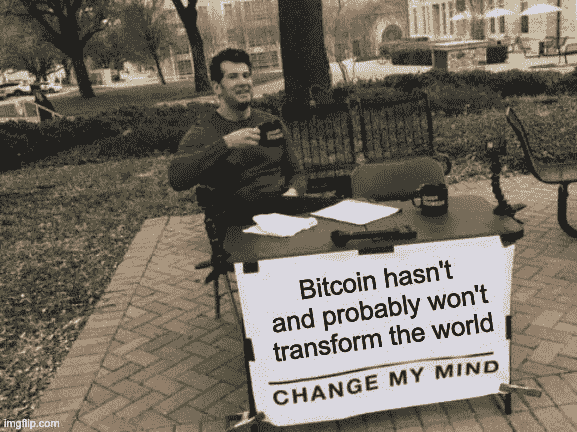

# 比特币面临艰难的采用曲线——每日更新

> 原文：<https://medium.datadriveninvestor.com/bitcoin-faces-a-rocky-adoption-curve-daily-update-e12e26611256?source=collection_archive---------8----------------------->

## 技术上看跌，除了反向头部和肩部。

Bitcoin is looking bearish; Source: Alpha Trades

## **总结**

*   从当地时间框架和更直接的价格行动比特币技术分析。
*   我认为比特币未来发展的更长时间范围。

大多数交易者意识到很难预测任何特定资产的价格走向，尤其是像比特币这样的东西，它是如此[不稳定、新颖和创新](https://blog.oleganza.com/post/85111558553/bitcoin-is-like)。所有这些因素都使比特币成为一种高度投机的资产。也就是说，我将涵盖这种资产到目前为止的历史价格行为，然后规划未来的路线图。请保持开放的心态，因为我对这个话题的观点是有争议的。

# 当地时间框架下的比特币([时间戳:1:26](https://youtu.be/HpgqVugFVEs?t=86)

接下来是每日分析，就像我们的观众习惯的那样，如果你对 2025 年及以后比特币的宏伟前景更感兴趣，你可以随时跳过。

自 2020 年 6 月初，BTC 创下新高，随后遭到大幅拒绝以来，我一直强烈怀疑 BTC 能够继续上涨并保持更高的高点。经过长时间的分配，BTC 开始推出一个更有说服力的熊市趋势案例。我们社区很多人都在讨论一个潜在的[逆头肩底](https://www.investopedia.com/terms/h/head-shoulders.asp) ( [时间戳:2:36](https://youtu.be/HpgqVugFVEs?t=156) )。图案的体积与您通常看到的有效图案相匹配，左肩印刷的体积较大，右肩印刷的体积较小。该形态的头部可以看做多头 [SFP(摆动失败形态)](https://medium.com/bex500/how-to-use-swing-failure-pattern-sfp-4731e9fc266a#:~:text=A%20Swing%20Failure%20Pattern%20(SFP,price%20in%20the%20opposite%20direction.)。这种形态的确认需要看到成交量的扩大，直到突破颈线。如果这种模式发挥作用，一个有分寸的移动将把 BTC 拉向 10，250 或 10，300 美元。

**我认为头肩底的突破可能性不大。我们可以观察四小时的价格走势来理解其中的原因。**

9400 点附近的关键区域将价格压制了近一周。这个区域尤为重要，因为它恰逢 2020 年 6 月的月度公开赛。每月开放的蜡烛线至关重要，因为这是 algos 通常争夺趋势控制权的地方。到目前为止，价格已经拒绝了 6 月月度开盘的每一次突破，这基本上是多头和空头之间的自主战区。

 [## BTCwars

### 比特币交易的实时数据以一种有趣的方式呈现。加入战斗到最后的聪。熊或…

dave.freeinforadar.ch](https://dave.freeinforadar.ch/btcwars/) 

在我看到更多的线索之前，我不会再赌 BTC 会翻身，因为多头最终会筋疲力尽——下图显示了一个下降趋势线区域，用绿色标出([下降通道的时间戳:15:33](https://youtu.be/HpgqVugFVEs?t=932) )。在接近四小时的关键时刻，BTC 正在努力闯入绿色地带。如果你是一个[枢轴对枢轴交易者](https://www.investopedia.com/trading/using-pivot-points-for-predictions/#:~:text=Pivot%20points%20are%20used%20by,the%20current%20or%20upcoming%20session.)，你可能会认为这是对本地四小时枢轴的拒绝，增加了在 8950 点左右回到 S1 的机会。如果 S1 站不住脚(事实上它可能会形成一个双底并回撤至 R1)，作为中枢交易者，最简单的目标是 8550 点的 S2。由于 BTC 花了大量时间进行调整，大幅调整的可能性变得越来越高。此外，在更高的时间框架内也有汇合点([时间戳:6:57](https://youtu.be/HpgqVugFVEs?t=417) ):日中枢已经多次拒绝价格，增加了从更高的时间框架内，BTC 可能跌至 S1 或 8350 点的可能性。

 [## 加密货币行业是死是活？数据驱动的投资者

### 九月初，我们在 X-Order 内部就代币市场的未来进行了一场辩论。有趣的是，我们的观点是…

www.datadriveninvestor.com](https://www.datadriveninvestor.com/2019/12/12/will-the-cryptocurrency-industry-be-dead-or-alive/) 

在四小时 [VPVR](https://medium.com/@joezabbs/volume-profile-visible-range-e099f22cd2d7) ( [时间戳:7:59](https://youtu.be/HpgqVugFVEs?t=479) )中发现了进一步的汇合，这揭示了 BTC 如何在高交易量节点拒绝，增加了价格被吸引到下一个支撑性高交易量节点的机会，该节点从 8850 开始。

Bitcoin on the four-hour time frame; Source: Alpha Trades

在 GBTC 和芝加哥商品交易所的图表上也可以看到高交易量的节点，但我会特别提醒你注意 34 和 21 日的均线。根据我的经验，特别是在日线图上，这些均线对寻找支撑位和阻力位很有用。

我们最近多次打压 34 均线，在 2020 年 5 月形成了一个[双顶](https://www.investopedia.com/terms/d/doubletop.asp#:~:text=A%20double%20top%20is%20an,between%20the%20two%20prior%20highs.)。双顶确认的经验法则是突破两个顶部之间的低点，在 GBTC 是 9.98，或大约 8680 美元。

发现支撑位和阻力位的另一个简单方法是使用[布林线](https://www.investing.com/studios/article-239#:~:text=Bollinger%20Bands%20are%20a%20popular,to%20an%20underlying%20asset's%20price.&text=As%20market%20volatility%20spikes%2C%20the,of%20gap%20between%20the%20bands.) ( [时间戳:12:28](https://youtu.be/HpgqVugFVEs?t=748) )。该指标有助于识别波动性。一旦价格高于中间波段，这表明看涨，一个潜在的策略是在中间波段再次测试时买入。当然，反过来也是如此。目前，从日线时间框架来看，这一策略暗示着更多的看跌动能在等待着 BTC。

Bitcoin GBTC Bollinger Bands, VPVR indicators; Source: Alpha Trades

# 到 2025 年的比特币路线图([时间戳:19:45](https://youtu.be/HpgqVugFVEs?t=1185)

*(本节是对之前同一主题* *】的* [*的更新)*](https://www.datadriveninvestor.com/2020/05/26/bitcoin-roadmap-to-2025/)

比特币将面临一条崎岖的前进道路，虽然从长期来看，这种资产可能会创下新高，但这条道路将会有陡峭、隐蔽的山谷。打开周线图，我们看到的是比特币的 10 年历史。

从 30，000 英尺的角度来看，我们看到一个由 2017 年的前一个历史高点和 2020 年低点的底部形成的下降平行通道。我的艾略特波浪计数表明，BTC 目前正处于 ABC 式的调整中。C 浪很可能会打印一个更低的低点或达到 3100 点。接近 10，000 点的结构性较低高点是一个最强的迹象，表明更高的时间偏好，我认为这是一个确认的下降趋势。下面的图表显示了我对 BTC 的最终低目标，考虑到长期来看，该资产将继续推动更高的高点。

不言而喻，比特币是一种革命性的金融工具。在接下来的几年里，如果人们继续过渡到 BTC 这样的工具，我认为 15 万英镑的最高价格是可以实现的([时间戳:26:30](https://youtu.be/HpgqVugFVEs?t=1593) )。这种基于分形的预测是基于以前的价格行为，这种特殊的资产在其历史上经历了多次抛物线运动。最起码 37 到 4 万，或者历史高价的一倍，还是可以的。然而，*请记住，过去的表现并不能保证未来的回报。*

这将为我赢得一些抨击，但如果你比较一下微软的长期采用，这个庞然大物花了近二十年才打破其历史高点。一方面，比特币是在强劲的牛市中诞生的，另一方面，它也是全球范围内快速加速的技术发展和分配的一部分。也就是说，即使发展速度很快，BTC 仍然必须遵循自己的多年采用 S 曲线。

Bitcoin projected final target; Source: Alpha Trades

Bitcoin S-Curve of adoption; Source: Alpha Trades

根据上面的图表，比特币的应用可能已经接近顶峰。目前，世界上只有一小部分人拥有比特币。我认为，就广泛采用而言，比特币并没有达到人们希望的程度。这种观点可以被质疑，我欢迎任何人改变我的想法。

如果你在 2017 年甚至 2019 年进入 crypto，要警惕将你的预期建立在之前的价格波动上可能会带来的慢性死亡。现在的竞争环境不同了，我们正在全球范围内进入一个隐性时期，在比特币实现其粉丝俱乐部为其设定的任何崇高目标之前，很容易就会有更多的血液。

# 优势会员获得更多

[订阅 Discord 服务器](https://bit.ly/2KJ1oor)学习技术分析以及如何投资获利。不要错过，因为我们**在我们通常免费提供的内容中占主导地位**关注更高质量的数据、新闻和对我们优势群体的分析。

# 放弃

Alpha Trades，LLC 提供的信息不用于制定任何财务决策，也不是购买、持有和/或销售特定产品、数字资产或 ICO 的请求或建议。

访问我们的完整服务条款:[https://bit.ly/3faVeeV](https://bit.ly/3faVeeV)

## 获得专家视图— [订阅 DDI 英特尔](https://datadriveninvestor.com/ddi-intel)