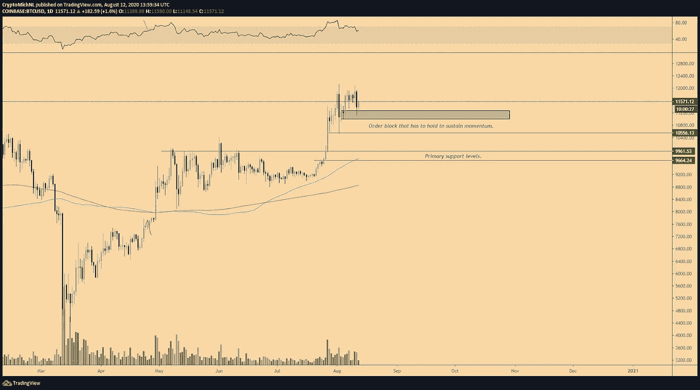
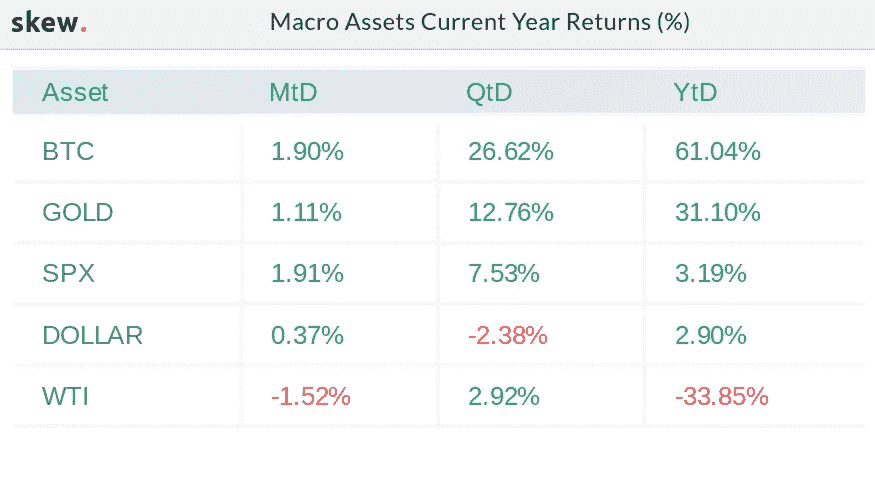
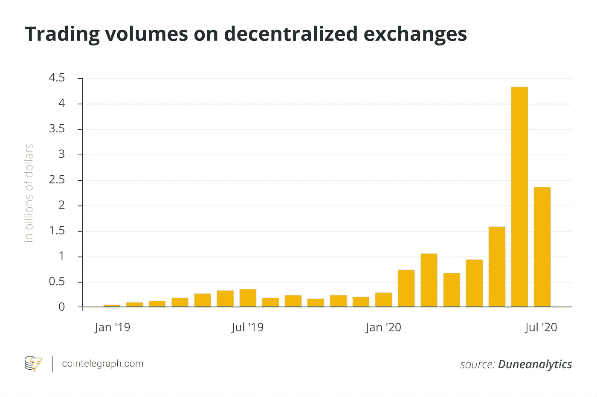

# 比特币未能突破 12000 美元，市场仍然强劲。

> 原文：<https://medium.datadriveninvestor.com/bitcoin-fails-to-break-12-000-market-still-strong-5915b1d70b5f?source=collection_archive---------4----------------------->

8 月 11 日，我们经历了加密和贵金属市场的大幅调整。比特币继续测试 12，000 美元的阻力位，只会下降到 11，200 美元的支撑位。随着 Tezos (XTX)和 Chainlink(链接)等热门替代硬币的飙升，我们可以看到人气仍然强劲。比特币在一天内有 700 美元的回调，达到 11100 美元。几个小时后，它在 11，500 美元附近变得很舒服。

*BTC CME 1-day chart. Source: TradingView*

比特币必须维持至关重要的 11，100 美元支撑位，否则有跌至 10，000 美元的风险。这些都是需要关注的短期价格变动。如果价格保持稳定，我们可以看到从 12，000 美元的突破，并开始测试 15，000 美元。

# 投资 3%的比特币，避免贬值

持续的刺激计划将导致通货膨胀的法币被禁锢，繁荣程度下降。BitGo 的首席执行官建议人们保护自己的财富免受全球经济衰退的影响。

> “如果你现在没有一些比特币，是时候把至少 3%的净资产投入比特币了。这是你有生之年可能看到的风险最低、不对称收益最高的投资。或者停止封锁。但还是能拿到比特币。”
> 
> 迈克·贝尔舍

*2020 macro asset returns comparison as of Aug. 12\. Source: Skew*

**DeFi 升级**

DeFi 仍然是对该领域产生新兴趣的罪魁祸首。我们目前正经历以太坊网络的高流量。汽油费已经涨到 200 魏大关，从平均 60 魏的水平变得非常昂贵。

 [## 稳定币会危及比特币在加密领域的地位吗？数据驱动的投资者

### Stablecoin 是一种加密货币，主要用于维持稳定的市场价值。它可以通过…

www.datadriveninvestor.com](https://www.datadriveninvestor.com/2020/06/08/can-a-stablecoin-jeopardize-the-position-of-bitcoin-in-the-crypto-space/) 

这可能会让传统银行和密码交易所担心他们的业务。随着流动性在分散式交易所(dex)中变得不那么成问题，越来越多的人将使用它们作为他们首选的交易方式。

我们认为，像 1inch 和 ParaSwap 这样的 DEX 只需通过你的网络钱包就能获得所有 DEX 市场的流动性。DeFi 提供的不仅仅是交易。随着智能合约的创新，保险和信贷等市场向精明的投资者敞开了大门。对于经验丰富的人来说，产量农业和快速贷款是世界前所未见的创造新金融体系的新工具。

**访问专家视图—** [**订阅 DDI 英特尔**](https://datadriveninvestor.com/ddi-intel)