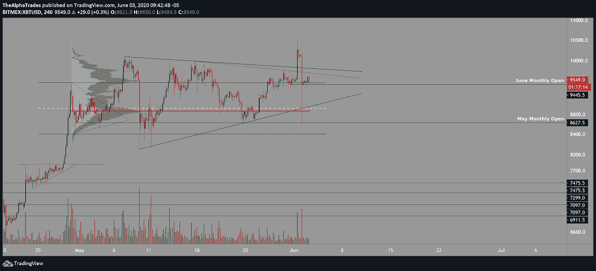

# 比特币不到 2 分钟跌到 8600 美元！交易者和投资者的下一步

> 原文：<https://medium.datadriveninvestor.com/bitcoin-fell-to-8600-in-under-2-minutes-next-steps-for-traders-and-investors-42a79a9ad1c1?source=collection_archive---------15----------------------->

## 价格波动的幅度并不反常。

Bitcoin, Image by Pete Linforth from Pixabay

早上好，

比特币已经从昨天的低点推低了一点，这是一个可以预见的缓慢上涨，因为价格试图回撤两天前的部分暴跌。我昨天在我的 YouTube 直播会议上提到，6 月份的月度开盘将保证回撤至趋势线，该趋势线在回卷之前形成了更广泛的三角形。在我们看到反转之前，BTC 仍有空间达到 9900 点，对弱势的第一个确认将是打破 6 月份月度开盘的 9445.5 点。我至少有 70%的信心，突破该水平将把 BTC 拉回到三角形趋势线的底部，然后拉向 2020 年 5 月月度开盘的低点。

我喜欢用[固定范围 VPVR](https://medium.com/@joezabbs/volume-profile-visible-range-e099f22cd2d7) (成交量概况)指标，它给出了某一时期特定价格而非成交量的供需清晰图像。

由 VPVR 指示器的红色水平条指示的高交易量节点揭示了在供给和需求方面最感兴趣的位置。

 [## 加密货币行业是死是活？数据驱动的投资者

### 九月初，我们在 X-Order 内部就代币市场的未来进行了一场辩论。有趣的是，我们的观点是…

www.datadriveninvestor.com](https://www.datadriveninvestor.com/2019/12/12/will-the-cryptocurrency-industry-be-dead-or-alive/) 

我经常提到的一点是，更重要的参与者需要价格保持在一个特定的范围内，以隐藏和缓冲他们的波动，因为他们不能放弃价值 5000 万美元的订单，除非他们的意图是推低市场。类似地，他们不能通过市场订单购买大量比特币，除非他们打算推动市场上涨或造成短期挤压。通过 VPVR 足迹可以看到更重要的玩家的微妙移动。第二大成交量节点出现在 6 月月度公开赛。除了水平红线所示的最高交易量节点，6 月月开市蜡烛线是“鲸鱼”的另一个重要标志，这些鲸鱼的仓位大到足以在一次全部取出的情况下扭转市场。

Bitcoin VPVR and Triangle; Source: Alpha Trades, LLC

低于 6 月月度开盘的压力，以及高交易量节点，将足以吸引 BTC 走向 5 月月度开盘蜡烛线的下一个高交易量节点。我知道这是非常技术性的，但你可以顺便访问我们的 Discord 服务器，我们的团队将帮助你理解更令人兴奋的概念。目前，最好理解价格正在挑战一个关键水平，跌破它可能会导致价格走向上个月开盘蜡烛线的下一个关键水平。

对我来说，一根蜡烛在如此短的时间内波动幅度如此之大，并不是看涨。在衍生品交易所，尤其是 [BitMEX](https://www.bitmex.com/) ，交易量相当可观，现货交易所也是如此。

昨天当价格在这个 9481 附近时，我发布了一个图表，表明大约 9372 的重新测试可能是一个潜在的多头头寸，高达 50%的斐波纳契回撤水平，甚至 61.8%的斐波纳契回撤水平。这种非官方交易确实进行了一次像样的重新测试，但现在市场可能会试图填补几个小时前价格大幅下跌的空白。没有明显的盘整期往往会导致一些回撤，回到之前由于价格剧烈波动而没有盘整的区域。

Bitcoin Unofficial Trade based on Fibonacci Levels; Source: Alpha Trades, LLC

在艾略特波浪计数方面，我在下面提供了一张地图。整个结构底部大约在 7000 点左右。

芝加哥商品交易所的图表再次显示，我们最近看到的波动来自于相当大的成交量。我会说，如果现货交易量不高，而 BitMEX 交易量很高，这是一次性事件，但事实并非如此。总体而言，大多数交易所看到 BTC 下跌到至少 9300 点。与此同时，只有 BitMEX 触及约 8600 点，这与这些更重要的衍生品交易所的过度杠杆化交易员的水平相符。

芝加哥商品交易所的图表显示，2019 年 10 月空头挤压的关键高点刚刚得到重新测试，随后 BTC 在充足的卖方交易量上印上了墓碑多奇，表明 BTC 可能还没有准备好令人信服地打破这一区域。

当在每日时间框架内查看枢轴时，价格达到了当前打印的枢轴。**为了更深入地了解 BTC 的关键点，请观看今天上午 11 点开始的分析视频。**

Bitcoin Elliott Wave Count Structure; Source: Alpha Trades, LLC

# 优势会员获得更多

[订阅 Discord 服务器](https://bit.ly/2KJ1oor)学习技术分析以及如何投资获利。要求第一个月的高级会员享受 50%的折扣！(优惠将于 6 月 15 日结束)查看以下视频了解更多信息。

Bitcoin broke down to $8600 in less than 2 minutes — Next steps for traders and investors!

# 放弃

Alpha Trades，LLC 提供的信息不用于制定任何财务决策，也不是购买、持有和/或销售特定产品、数字资产或 ICO 的请求或建议。

访问我们的完整服务条款:[https://bit.ly/3faVeeV](https://bit.ly/3faVeeV)