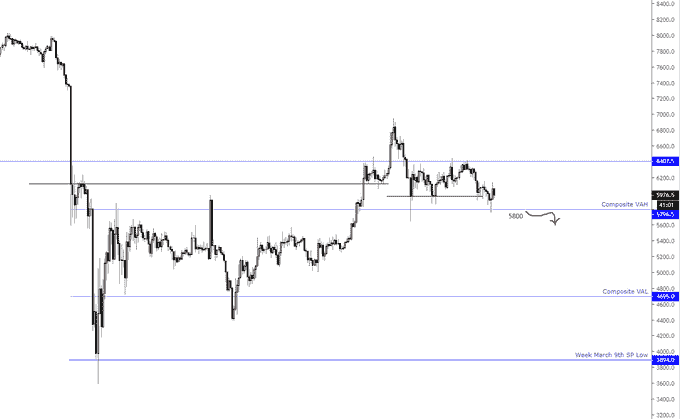
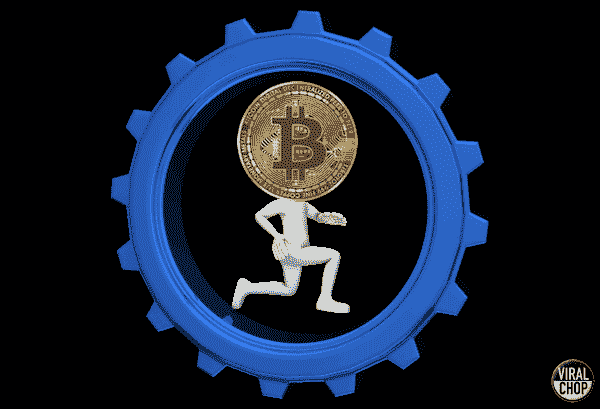

# 比特币的未来:为什么 2020 年将是比特币之年

> 原文：<https://medium.datadriveninvestor.com/bitcoin-future-why-2020-will-be-bitcoins-year-4799d56daf19?source=collection_archive---------6----------------------->

# 亿万富翁牛迈克·诺沃格拉茨完美地解释了他为什么认为 2020 年将是比特币之年:

在昨天(3 月 22 日)徘徊在略低于 6500 美元之后，空头赢得了当天的胜利，BTC 价格跌破 6000 美元。截至发稿时，比特币交易价格为 5825.42 美元，一些交易员预计，随着冠状病毒疫情继续在欧洲和美国肆虐，比特币将进一步回调。

尽管如此，尽管加密市场混乱不堪，亿万富翁迈克·诺沃格拉茨相信 2020 年将是比特币之年。

# 预计未来几个月波动将继续

过去几周，比特币和更广泛的加密市场动荡不安。比特币在几个小时内暴跌 50%，达到 3K 美元的水平，但随着冠状病毒恐惧在市场上肆虐，比特币从底部反弹了约 77%。

 [## Azbit 旨在连接传统金融和加密货币|数据驱动的投资者

### Azbit 是下一个提供交易平台的加密项目，该平台提供保证金和算法交易。一样多…

www.datadriveninvestor.com](https://www.datadriveninvestor.com/2019/03/20/azbit-aims-to-connect-traditional-finance-and-cryptocurrency/) 

世界各国政府已经准备了一揽子刺激计划来减轻这种新型病毒的经济影响，但投资者似乎并不完全相信这些救助计划能够满足公民的需求。因此，股市和比特币已经恢复了跌势。甚至被认为是安全避风港的黄金也在下跌，因为它的拥有者正在出售它以获得快钱。

目前，比特币的交易价格略低于 6000 美元。迈克·诺沃格拉茨预计，过山车行情将在未来几个月持续下去。但剧烈的波动不应妨碍比特币今年大放异彩。

# 宏观背景是比特币诞生的原因:

如上所述，世界各地的中央银行都在疯狂印刷钞票，试图拯救他们的经济对抗冠状病毒危机。极快的货币扩张很可能导致大规模通货膨胀和法定货币贬值。

在比特币减半之前，这种情况再好不过了。5 月份减半后，比特币的通胀率将降至每年 1.8%左右，不可否认，这低于大多数央行设定的目标。

此外，冠状病毒的情况已经让许多股票市场考虑可能的关闭。例如，纽约证券交易所计划今天(3 月 23 日)关闭交易大厅，但随后很快恢复全电子交易。

随着股市继续跳水，未来几周可能会有更多的证券交易所关闭，比特币将成为唯一一个全天候运营的市场。

根据诺沃格拉茨的说法，宏观背景正是比特币诞生的原因。这位前华尔街对冲基金经理指出，这就是为什么他预计 2020 年将是比特币之年。

> 在接下来的几个月里会继续波动，但宏观背景是它成立的原因。这将是也需要是 BTC 的一年

# 交易员预计 BTC 近期将跌至$4K 低点

这位加密货币之王在过去 24 小时内贬值了约 7.14%。一些交易员预计，在不久的将来，金价会进一步跌至 4K 区域。

坎特林·克拉克(Cantering Clark)预测，本周股市将迎来另一场大屠杀，比特币将紧随其后。该交易员表示，他*“相当有信心”*我们将再次看到 4 千美元的低位。

> 如果 VAH 重新回到 5800 区间，希望积极加仓。股票本周可能遭受重创。比特币也会随之而来。很有信心我们再次看到低 4。

mich al van de Poppe——绰号 Crypto mich al——是来自阿姆斯特丹的全职交易员，他与 Cantering Clark 持相同观点。他最近观察到，目前 5750 美元和 5800 美元的支撑位看起来很弱，下一个要关注的水平是 4200 美元和 4800 美元。

加密市场目前处于混乱状态，这种情况可能会持续几个月。但它会触底反弹，随着全球经济逐渐走向衰退，比特币应该会大放异彩。

我在每月一期的 [**简讯中分享了更多私密的想法，你可以在这里查看**](https://mailchi.mp/bf8f8e8ed697/keep-in-touch-with-lukas) 。请在评论中告诉我，并在各种社交媒体平台上加入我:

[**推特**](https://twitter.com/WiesfleckerL)●[**insta gram**](https://www.instagram.com/lukaswiesflecker/)●[**脸书**](https://www.facebook.com/lukaswiesfleckerr)●[**Snapchat**](https://www.snapchat.com/add/luggooo)**●[**LinkedIn**](https://www.linkedin.com/in/lukas-wiesflecker-1b11251a5/)**

**无论你做什么，都要带着爱和激情去做！**