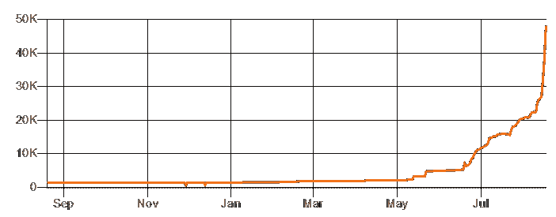
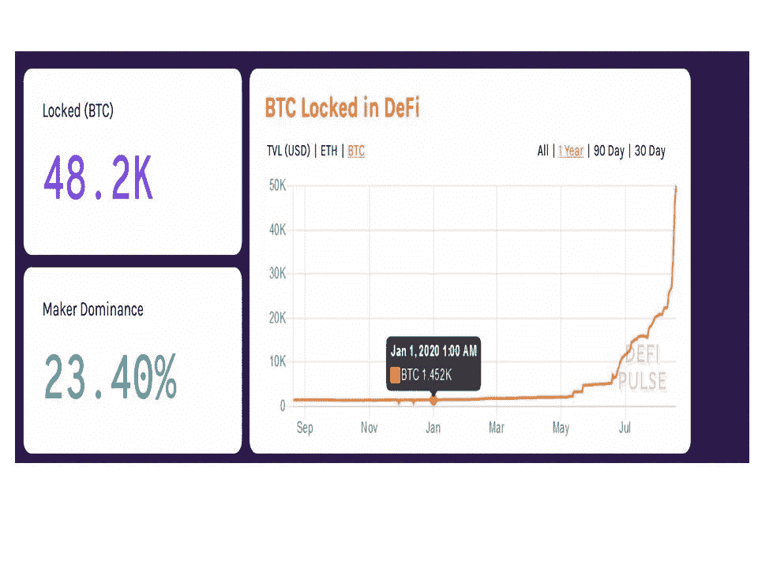
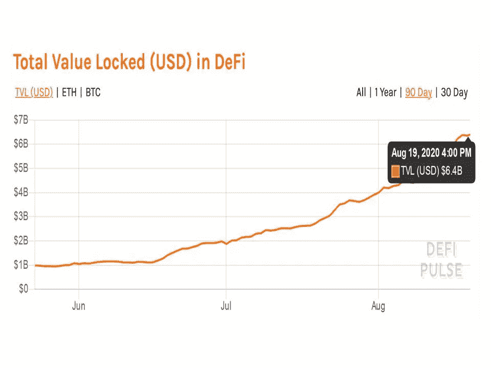

# 比特币是抛物线，它不是价格！

> 原文：<https://medium.datadriveninvestor.com/bitcoin-goes-parabolic-and-its-not-the-price-e810de71241d?source=collection_archive---------23----------------------->

**采用 DeFi 将如何影响 Cryptos 之王的市值**

Up 33,8x from January 1st

W 当与不熟悉加密领域的投资者讨论比特币时，这是他们反复提出的问题“……*这些都很有趣，但最终我能用比特币做什么？我能用它买什么？*

的确，采用比特币在某种程度上是一个问题，但这也是一个不为人知的问题。比特币的采用通常与其地址的增长有关。)或者把它作为货币使用，来购买东西。不管怎样，主流的争论主要集中在错误的问题上。由于比特币主要被用作价值储存手段，它被用作价值储存手段与作为货币使用并不完全一致——事实上，它是被囤积起来而不是被花掉。

虽然采用比特币作为[数字黄金和价值储存手段](https://medium.com/@andreabianconi/oops-ray-dalio-missed-the-biggest-of-all-paradigm-shifts-crypto-79ce826c1445)肯定是目前的关键驱动力——这将对其市值和价格产生重大影响，因为它将[获得黄金市场份额的一小部分](https://twitter.com/APompliano/status/1294755734467547137)——但这与未来采用比特币的主要驱动力相比仍然相形见绌。

进入 DeFi，[许多人称之为分散金融或民主化金融](https://defiwiki.org/wiki/DeFi_-_A_Beginner%E2%80%99s_Guide_to_Decentralized_Finance)。

对于新手来说，DeFi 只是传统金融服务的简单复制，如借贷、支付、交易、资产管理、保险等，通过基于区块链的应用程序以分散的方式提供。显然，新技术的引入不仅改善了传统金融服务，更重要的是，它创造了发展全新服务、产品和市场的机会，这些在今天之前闻所未闻，如 [DAOs(去中心化自治组织](https://defiprime.com/dao))、全新资产类别的[令牌化](https://defiprime.com/assets-tokenization)以及新数字资产的[稀缺驱动价值的创造](https://opensea.io/)。

 [## 稳定币会危及比特币在加密领域的地位吗？数据驱动的投资者

### Stablecoin 是一种加密货币，主要用于维持稳定的市场价值。它可以通过…

www.datadriveninvestor.com](https://www.datadriveninvestor.com/2020/06/08/can-a-stablecoin-jeopardize-the-position-of-bitcoin-in-the-crypto-space/) 

1 月 1 日，全球只有 1425 个 BTC 锁定了 DeFi 项目。8 月 17 日，BTC 承诺的金额超过 48000 英镑。以目前 12.400 美元的价格计算，这将产生超过 5 亿美元的利润。对于传统金融部门来说，这只是沧海一粟，对于一个数万亿美元的市场来说，这只是沧海一粟。这就是为什么他们没有注意到，至少现在还没有。

但对于新生的 DeFi 部门，仅在 8 个月内就实现了 33.8 倍的增长。[而且一直加速](https://www.coindesk.com/wrapped-bitcoin-tokenized-faster-mined-defi)。此外，在过去的两个月里，整个 DeFi 部门以美元表示的总价值从 20 亿美元上升到 60 多亿美元。

48.200 BTC locked in DeFi on August 17, 2020-source DEFI PULSE

6,4 billion Total USD locked in DeFi on August 19, 2020-Source DEFI PULSE

技术创新很微妙。起初，它只被有限圈子内极少数精通技术的人所理解，在它被大规模采用之前，很难预测这种创新会给人们的生活和业务带来什么样的变化。

这也是为什么[技术采用呈非线性](https://www.smartdatacollective.com/21278/)的原因之一，还有互补效应、网络效应和病毒式产品特征。

但是当它得到牵引力时，它就会变成抛物线。但是不要担心，我们还没有到那一步，这只是开始。

由于比特币代表着国王货币资产和整个加密领域的价值储存，其市值与 DeFi 应用、服务和产品的增长密切相关。比特币润滑了 DeFi 系统，为其带来了流动性，并在许多应用中充当了作为抵押品的可信货币资产。

还要注意的是，到目前为止，比特币主要被令牌化(即“[包装”到一个 ERC20 以太坊令牌](https://wbtc.network/)中)，以便在区块链以太坊内使用。

但是，当新的 DeFi 应用也开始出现在比特币区块链时，会发生什么呢？对比特币协议处理大量交易的能力持怀疑态度的人将不得不三思。一些[已经开始在闪电网络上使用智能合约进行衍生品交易](https://www.coindesk.com/bitcoin-defi-japan-smart-contracts)。在以太坊上运行的 DeFi 应用程序中使用比特币与其在自己的协议上的潜在用途之间的区别在于 [*“在以太坊正在尝试的 DeFi 和 P2P 金融之间存在很大的差距，”鲁宾说。“Uniswap 真的很棒。但它们将自己的流动性池标记化了。……我们(比特币创造者)正在讨论找到一种让人们直接相互合作的方式。”*](https://www.coindesk.com/bitcoin-defi-japan-smart-contracts)

本质上，比特币 DeFi 项目并没有像 WBTC 那样使用比特币的衍生品，他们的目标是让交易者能够直接使用比特币。就比特币的采用而言，后果将是巨大的。

因此，让我们暂时记下一些数字，只是为了对比特币的市值在一些假设中可能处于的位置有一个粗略的概念:

1.让我们假设比特币作为数字黄金继续被采用，并且基于估计的 190.000 吨的地上存量和 1.990 美元的当前价格，它获得了当前 13 万亿美元的黄金市值的 X%。

2.让我们进一步假设，比特币在 DeFi 应用中的采用增加了，它在全球传统金融服务、资产管理和保险领域获得了 X%的市场份额。请注意，取自 Investopedia 的[统计数字并不完全可靠。但这是我能快速找到的最好的，不需要做彻底的数据搜索，这不是本文的范围。](https://www.investopedia.com/ask/answers/030515/what-percentage-global-economy-comprised-financial-services-sector.asp)

© 2020 [www.bianconiandrea.com](http://www.bianconiandrea.com)

从上表可以看出，在第一个假设中，我们估计市值在 1.3 万亿美元到 3.9 万亿美元之间，具体取决于相对于黄金的市场份额增长(最低 10%，最高 30%)。这将预测 BTC 价格在 68.000 美元和 205.000 美元之间。

在第二个假设中，我们估计使用 DeFi 应用程序获得的传统金融服务市场份额要低得多，在 5%到 20%之间。由于每个特定部门的市值不同，BTC 预测的价格差异更大。显然，DeFi 的采用不仅限于一个部门，因此必须对它们进行总结。这就是我们在第三个假设中所做的，我们保守地总结了每个传统金融部门以及黄金市场的最小市场份额收益。在这里，我们预测 BTC 市值为 4.73 万亿美元，价格为 248.000 美元。BTC 的货币供应量保守地设定为 1900 万，考虑到人们普遍认为 200 万到 400 万 BTC 已经永远消失了，因此 1900 万的最大供应量似乎是合理的。

如上所述，这只是一个估计，还有更多变量需要考虑，包括比特币可能必须在未来与其他新兴加密货币分享 DeFi 采用的好处。但我肯定有人了解情况。人们可以尽情玩弄这些数字，但毫无疑问，比特币未来的市值将是现在的数倍。排除不利的技术发展或目前比特币协议层面不可想象的问题，唯一合理的问题是，其未来价格将是今天价格的几倍。

抓紧前方有趣的时光。

www.bianconiandrea.com—2020 年

#区块链# bianconiandrea # think block tank #令牌化#令牌#加密货币#比特币#以太坊# defi #去中心化金融

*****************************************************************

***如果你喜欢这篇文章，请在左下角“鼓掌”x 次，这样它就会被更多的人分享。多谢***

****************************************************************

**法律免责声明**:本网站及其中包含的信息仅供一般指导，并不构成法律意见。因此，它不应被用来替代就具体问题与律师的磋商。本文中的所有信息均按“原样”提供，不保证完整性、准确性、及时性或任何形式的明示或暗示的担保。

**投资免责声明**:本网站及其中包含的信息无意成为与所提交材料相关的建议或信用分析的来源，本网站中包含的信息和/或文件不构成投资建议。

[www.bianconiandrea.com](http://www.bianconiandrea.com)—2020 年

*原载于 2020 年 8 月 20 日*[*【https://medium.com】*](https://medium.com/@andreabianconi/bitcoin-goes-parabolic-and-its-not-the-price-c557f90a694a)*。*

**访问专家视图—** [**订阅 DDI 英特尔**](https://datadriveninvestor.com/ddi-intel)