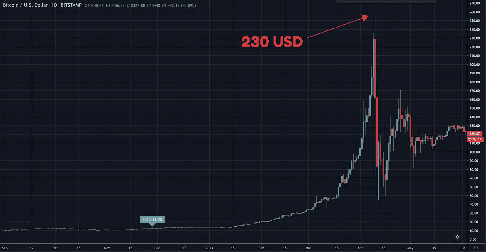
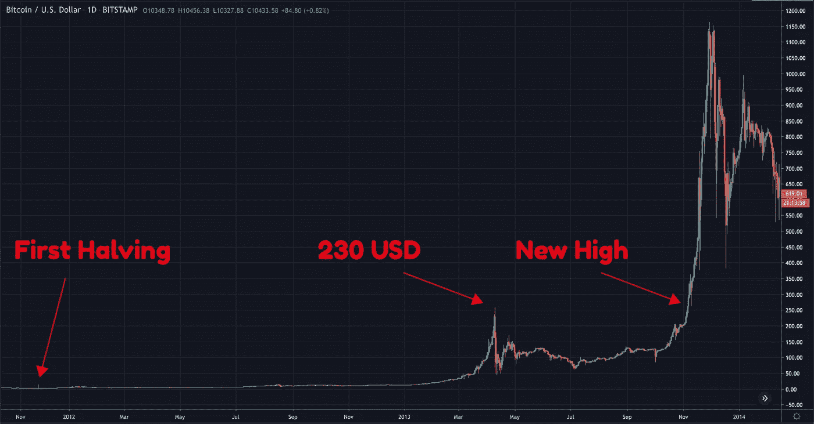
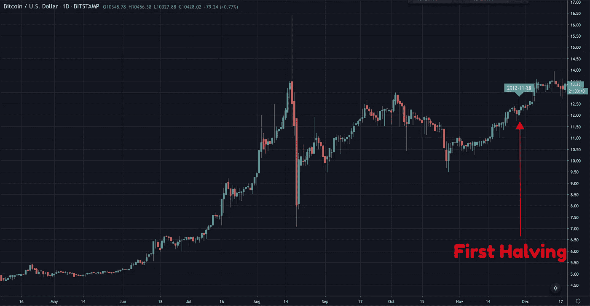
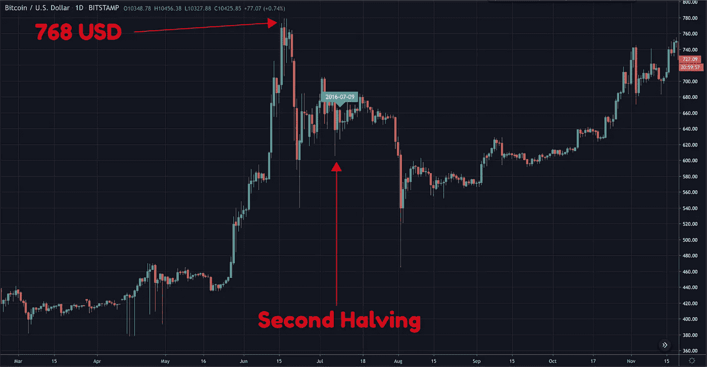
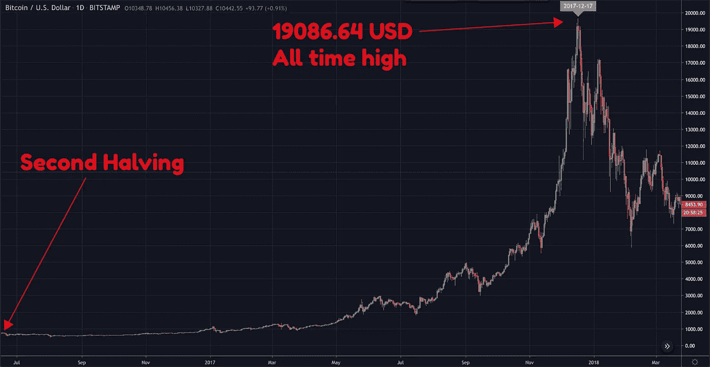

# 比特币减半真的到月球了吗？

> 原文：<https://medium.datadriveninvestor.com/bitcoin-halving-actually-to-the-moon-50cc4b30a14c?source=collection_archive---------4----------------------->

不知道最近这个泵是什么心情。

不慌不忙继续持有比特币？没有赶上高峰？
错过了 altcoin 上的 oppertunity？

也许所有上述情况，例如，OKB 急剧上升，肯定大多数人错过了。有朋友甚至说是**兑换币先“腰斩”**。

尽管仍有许多疑问，但大多数加密投资者已经意识到**牛市已经到来。**

我们如何确定这波行情预示着大牛市？牛市持续多久？现在在哪里？

当然我无法预测，否则我只是另一个注意力寻求者，但我们或许可以通过一些指标大胆猜测下一个大行情，之前的**减半行情**和牛熊周期。

 [## 总部位于瑞士的 ETP 进入加密交易市场|数据驱动的投资者

### 虽然金融市场几乎没有沉闷的时刻，特别是在引入…

www.datadriveninvestor.com](https://www.datadriveninvestor.com/2019/03/10/swiss-based-etp-enters-the-crypto-trading-market/) 

当然，任何理性的分析都可能容易受到市场的影响，但我们总是要为投资做决定。

一般我们会用过去的市场趋势和经验来预测未来的趋势。我们先来看看前两次减半前后比特币的价格变化。

## 第一次减半

第一次比特币减半发生在 2012 年 11 月 28 日。减半当天的价格约为 12 美元。当天价格没有大的波动。**经历了几个月的减半后，比特币开始快速上涨**，在 2013 年的今年 4 月，最高涨到 230 美元左右。

之后开始回调，之后继续在 66-150 美元之间来回震荡。直到一年后的 2013 年 11 月，比特币价格突破 230 美元，突破前期高点，迎来 2013 年底的大牛市，最高涨到 1147 美元，涨幅达到惊人的 9000%。

**在减半开始之前，往往会有一个短暂的回调平仓过程。**

这是第一次减半前的最高点 13.5 美元。时间是 8 月 16 日，距离减半还有 104 天。几天后快速回落，然后快速上涨，维持在 10 美元以上至减半。

## 第二次减半

比特币的第二次减半发生在 2016 年 7 月 9 日，当天的价格在 650 美元左右。减半前约 23 天，比特币最高涨到 768 美元，之后震荡回调后下跌。

**减半后，比特币价格不涨反跌**，维持在 1000 美元以下。已经是 2017 年 5 月了。比特币冲上 1000 美元上方，继续上涨，在 12 月 17 日达到 20000 美元左右的峰值，这。时间比上次减半 526 天。

**二等分前也有高点，出现回调。**

2016 年 6 月 16 日，第二次减半前 23 天，在减半前有一个 768 美元的峰值，振荡几天后回落到 600 美元，虽然在减半前一直维持在 650 美元左右。

从最近两次减半可以发现，比特币的**大牛市往往出现在减半之后，减半之后的缓慢上涨。** **牛市的顶峰可能出现在未来一年或一年半。减半之前有一个小高峰，然后回调，但是回调的力度不是很大。**

## 周期

我们不妨看看比特币的大牛市周期。总的来说，大家认为比特币经历了三次大牛熊，2011 年年中的大牛市，2013 年的大牛市，2017 年的大牛市。

从 2010 年 5 月到 2018 年初，比特币经历了四次完整的牛市和三次完整的熊市。其中，2013 年出现了两次牛熊转换。如果再算上 2018 年的熊市，应该是四波熊市。

按照波浪理论的观点，如果只把 2013 年归为一波上涨，比特币会有五波上涨。2018 年底约 3200 美元，较 2017 年峰值下跌约 83%，是上一次熊市的大底。

从之前的牛熊周期来看，每次熊市最大跌幅都在 80%以上，之后进入缓慢上涨过程。

**投资是购买预期。**

当然，谈过去的经历也没什么用。起作用的是逻辑。价格一涨，你就说不买，空着就断大腿。

这个减半对于整个行业来说，无疑是一个至关重要的参考点。