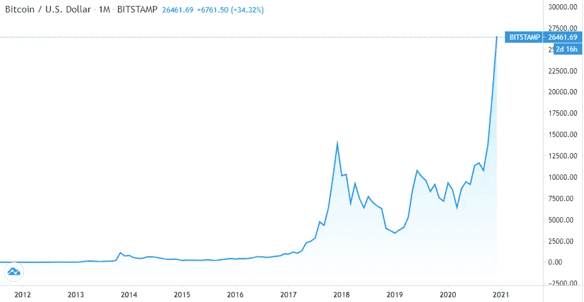

# 比特币已经到了 28000 美元。现在该怎么办？

> 原文：<https://medium.datadriveninvestor.com/bitcoin-has-reached-28-000-what-to-do-now-eae5ae9df280?source=collection_archive---------18----------------------->

## 我的计划是卖掉

Photo by [Thought Catalog](https://www.pexels.com/@thought-catalog-317580?utm_content=attributionCopyText&utm_medium=referral&utm_source=pexels) from [Pexels](https://www.pexels.com/photo/woman-holding-two-coins-2228570/?utm_content=attributionCopyText&utm_medium=referral&utm_source=pexels)

2020 年初，我带着对比特币的特别兴奋迎来了新年。今年，比特币将最终再减半。据估计，这是一个看涨的一年，因为减半意味着矿工的比特币奖励减少，这可能导致比特币供应减少，需求增加。

当减半事件发生时，历史表明比特币将在此后创下历史新高。我有点怀疑比特币是否能打破之前 2017 年的 19700 美元/枚大关，但我有一点点希望。嘿，谁知道呢？

然后二月来了，接着是三月。股市崩盘，加密货币市场紧随其后。比特币触及今年最低价格 5000 美元左右。当五月，半月终于来了，看起来没有什么特别的事情会很快发生。

激动人心的事情不在那里，或者它已经和人们对 2020 年的其他梦想和希望一起消亡了。

金价在飙升，但显然不是数字黄金。我很悲观。

当时，创历史新高听起来完全不可能。

# 修改后的计划

我长期持有比特币，并计划尽可能长时间持有 BTC。然而，由于今年早些时候发生的事情，我觉得我必须做出一些调整。

我更详细地研究了 2016 年减半后比特币运动的历史。这表明历史最高价格发生在减半后的 15 个月内。

第二次减半= 2016 年 7 月，历史新高= 2017 年 12 月 19800 美元。

我的新计划是，

> 如果比特币在 2021 年底之前没有达到历史高点，那么我将不得不卖掉几乎所有东西，只留下一小部分作为“纪念品”。

我对出售一切都很认真，我把我的新计划写在便利贴上，贴在我的办公桌前。原因是，因为我很少关注密码市场，尤其是在“无聊”的时候，我需要一个明显的提醒，这样我就永远不会忘记。

# 创下历史新高后，现在怎么办？

令我惊讶的是——我想对大多数人来说也是如此——比特币达到了 15000 美元大关，然后在小幅回调后缓慢攀升至 19000 美元。但这种情况持续存在，并持续增加，直到不久前我们看到一枚硬币的价格达到了 27000 美元。

既兴奋又担心。

老实说，我不知道这种情况什么时候会发生。我只计划了最坏的情况。

# 又一个泡沫？

如果再参考历史，2017 年发生的事情其实都没有好下场。加密泡沫破裂，促使比特币暴跌 50%，从 19600 美元跌至 7500 美元。

光是看图表，就发现挺吓人的。比特币在 2019 年进一步跌至 2500 美元左右的最低点。

Screenshot from [TradingView](https://www.tradingview.com/symbols/BTCUSD/)

如果历史重演，就像它往往会发生的那样，我不想再次陷入同样的境地。我需要风险管理。

尽管各种媒体和名人试图让我相信这一次是不同的——比如[这个](https://fortune.com/2020/11/18/the-return-of-20000-bitcoin-whats-different-this-time-around/)、[这个](https://www.reuters.com/article/us-crypto-currencies-analysis-idUSKBN27Y2L1)和[这个](https://www.cnbc.com/2020/12/11/why-the-winklevoss-twins-think-bitcoins-rally-is-different-this-time.html)——我仍然没有完全被说服。我宁愿错过，也不愿沉浸在兴奋中，感受“派对后”的激情。这只是我的方法。我能承担的风险。

 [## 稳定币会危及比特币在加密领域的地位吗？数据驱动的投资者

### Stablecoin 是一种加密货币，主要用于维持稳定的市场价值。它可以通过…

www.datadriveninvestor.com](https://www.datadriveninvestor.com/2020/06/08/can-a-stablecoin-jeopardize-the-position-of-bitcoin-in-the-crypto-space/) 

# 这次我想如何管理我的风险

那么，我现在在准备什么呢？这是我的策略。

作为免责声明，我不是建议人们跟随我的步骤。这不是一篇投资建议文章。我只是分享。

## 1.保护首都

像任何风险投资一样，我的原则是一旦盈亏平衡，就要确保盈利。后来，你让利润跑了。

有了比特币，我离收支平衡还远着呢。由于我是 2017 年前的长期持有人，我很久以前就这样做了。

然而，今年我开始了新的头寸，并不断积累，直到价格在 17，000 美元左右。我将这些职位分开处理。我正在筹集资金，并开始出售。

## 2.开始兑现

我 2017 年的错误是当时，我没有注意。那年我在背包旅行，忙于个人生活。我完全忘了我有比特币。我希望在股价创下历史新高时，我能获得一些利润。那一定很棒。

> “在别人贪婪的时候卖出。”

这一次，既然我完全了解发生了什么，我不想错过销售机会。几天前当它涨到 28，400 美元时，我卖了一些，然后它又回落到现在的 26，200 美元。

我在几个增量点逐步卖出。对于比特币来说，很难确定。

## 3.但是，千万不要全部卖掉

但是，如果价格一直上涨到下一个令人难以置信的水平呢？还是当泡沫破灭从未发生？

我不是什么都卖。

这就是为什么我从不卖出一定数量的 BTC。我认为是“利润”BTC。我的资本已经不在了，因为我兑现了它。这是我一直在思考的问题，我要把它传给我的孙子。即使有一天它变得一文不值，它仍然是一件数码古董。我在[这篇旧文章](https://medium.com/2-minute-madness/holding-bitcoin-since-2013-heres-what-i-realized-c0ddec24ca37)中写下了它的情感价值。

此外，我训练自己抑制我的 FOMO。我在投资时的座右铭，无论是股票还是密码，我相信即使你错过了，机会也会再来，或者它会以另一种方式出现——另一只股票，另一个密码。这只是我试图采纳的富足心态。

所以，我在卖，你可能什么都没做，甚至在积累。我不会说你的方法不对，也不会说你应该跟着我。同样，这不是一篇建议文章。

我只是分享我对当前比特币上涨的投资组合风险策略。我可能是错的，也可能是对的，没人知道。这只是我喜欢的方式。

声明:不是投资建议！

我还在我的简讯上分享与投资相关的文章，用更轻松的语气和一些个人风格，同时仍然富有洞察力和发人深省。请考虑订阅，谢谢。

**访问专家视图—** [**订阅 DDI 英特尔**](https://datadriveninvestor.com/ddi-intel)