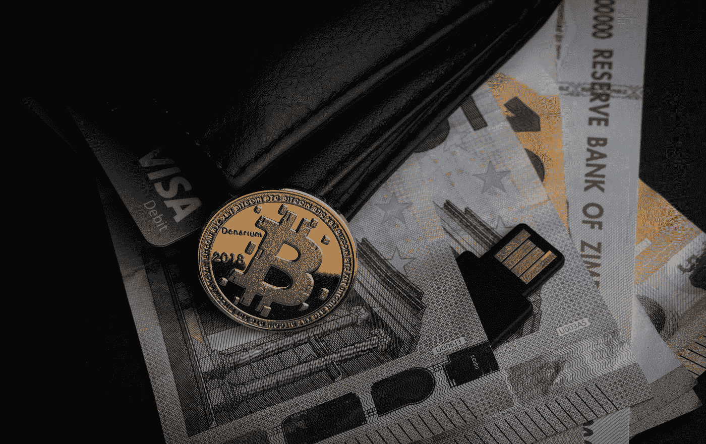

# 据银河数码称，比特币有增长 60 倍的潜力

> 原文：<https://medium.datadriveninvestor.com/bitcoin-has-the-potential-to-increase-by-a-factor-of-60-according-to-galaxy-digital-cfe41db6cf9a?source=collection_archive---------17----------------------->

Photo by [Aleksi Räisä](https://unsplash.com/@denarium_bitcoin?utm_source=medium&utm_medium=referral) on [Unsplash](https://unsplash.com?utm_source=medium&utm_medium=referral)

专注于数字资产投资的领先公司银河数字资本管理公司(Galaxy Digital Capital Management)表示，金融市场对比特币的公众关注正在增加，BTC 比黄金更具增长潜力。

尽管这种贵金属在历史上一直是投资者抵御金融不确定性的首选、经过验证的可靠安全网，但银河数码在一份新报告中表示，投资传奇人物保罗·都铎·琼斯和科技巨头 MicroStrategy 最近对比特币的投资凸显了比特币作为潜在对冲通胀的吸引力。

 [## 自白——我绝对不爱比特币|数据驱动投资者

### 这是真的，我已经写了几篇关于比特币和加密货币的文章，它们可能会在明年或…

www.datadriveninvestor.com](https://www.datadriveninvestor.com/2020/09/15/confessions-i-absolutely-dont-love-bitcoin/) 

# 有比特币的 60x 可能吗？

根据 Galaxy Digital 的数据，市值超过 2000 亿美元的所有加密货币中排名第一的比特币仍有巨大的上升潜力。根据资产管理公司的说法，它甚至有可能将其市场资本增加 60 倍，使 BTC 比黄金有更大的上涨空间:

黄金的市值目前超过 12 万亿美元。另一方面，比特币的价值目前约为 2000 亿美元，不到黄金市场的 2%。因此，如果比特币增长到黄金的水平，作为一种替代的数字价值储存手段，它的潜在市场扩张机会将超过 60 倍。

由于其开源性质以及与主要全球资产负相关的 11 年历史，比特币已经从一个默默无闻、分散的点对点数字交易网络发展成为一种全球公认的机构资产，可以抵御政治审查或干预。

 [## 你的密码交易指南

### 加密货币是一种设计用作交易媒介的数字资产。

medium.com](https://medium.com/@l.wiesflecker/your-guide-to-crypto-trading-425c8edcc46f) 

# 微观战略只是一个例子

自 COVID 19 疫情以来，机构对比特币的接受和使用大幅增加。据银河数码称，这是由于不断增长的国债和各州的经济刺激:

> 顶级投资者和主要机构正在将其作为通胀对冲工具，包括宏观传奇保罗·都铎·琼斯和上市商业智能软件公司 MicroStrategy Inc .(纳斯达克代码:MSTR)。

今年 8 月，MicroStrategy 向比特币投资了 2.5 亿美元。本月早些时候，该公司增加了 1.75 亿美元的投资。

银河数码表示，很难说数字经济的未来将走向何方。尽管如此，比特币并不是所有牌中最差的。

> 很难预测未来的数字世界会是什么样子，也没有人能绝对肯定地说什么投资或资产会胜出。作为黄金的替代品，比特币作为一种领先的全球价值投资有着很大的优势。

本文中的陈述不构成交易建议或投资建议。

我在每月一期的 [**简讯中分享了更多私密的想法，你可以在这里**](https://mailchi.mp/bf8f8e8ed697/keep-in-touch-with-lukas) 查看。请在评论中告诉我，并在各种社交媒体平台上加入我:

[**推特**](https://twitter.com/WiesfleckerL)●[**insta gram**](https://www.instagram.com/lukaswiesflecker/)●[**脸书**](https://www.facebook.com/lukaswiesfleckerr)●[**Snapchat**](https://www.snapchat.com/add/luggooo)**●[**LinkedIn**](https://www.linkedin.com/in/lukas-wiesflecker-1b11251a5/)**

**无论你做什么，都要带着爱和激情去做！**

## **访问专家视图— [订阅 DDI 英特尔](https://datadriveninvestor.com/ddi-intel)**