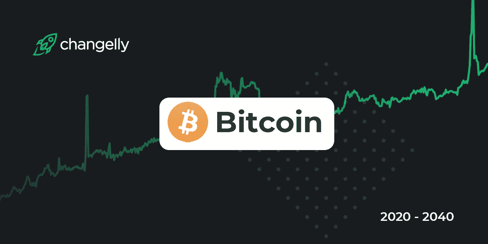

# 比特币杂凑率暴跌 35%以上——发生了什么，对比特币价格有什么影响？

> 原文：<https://medium.datadriveninvestor.com/bitcoin-hash-rate-slump-by-more-than-35-what-happened-and-what-effects-does-it-have-on-the-b8695fb2bdc2?source=collection_archive---------8----------------------->

采矿很普遍，尤其是在中国。挖掘大多是用 GPU(显卡)或者专用设备(ASIC)完成的。图为一个 GPU 矿场。

比特币散列率在几天内下降了 35%以上。根据 Core Scientific 公司的说法，这次坍塌是由于中国四川的雨季造成的。

# 由于雨季的结束，比特币价格大幅下跌

在中国，比特币开采是在多雨地区进行的，那里有廉价的水力发电。从 6 月到 10 月，雨季期间大坝蓄水，电力供应充足。在此期间，比特币矿工以最高速度工作，可以降低电价。

然而，根据 Core Scientific 区块链业务发展高级副总裁 Tarak Kulyk 的说法，随着该地区降雨量的减少，比特币采矿的利润变得远远低于价格的三倍或四倍。库雷克在接受采访时说:

对许多中国矿商来说，天气是一个重要的利润驱动因素，因为他们可以廉价购买旧设备，但一年中只有 5 个月可以盈利。

比特币的散列率是衡量 BTC 矿工集体计算能力的一个指标。区块链研究实验室的联合创始人 Ingo Fiedler 说:

由于比特币开采是能源密集型的，矿工们在最便宜的地方寻找能源。例如，一旦能源价格发生变化，矿商就会因为中国的雨季而转移。

换句话说，当 BTC 矿工移动时，他们是离线的，因此无法对比特币散列率做出贡献。

 [## 13.000 美元比特币处于 2019 年 7 月以来的最高水平——为什么？

### 关于什么推动了 BTC 价格，什么没有，有很多争论。以下是对此的一些想法

medium.com](https://medium.com/the-capital/13-000-bitcoin-at-the-highest-level-since-july-2019-why-42cdc0942015) 

## 搬到北美去？

与中国相比，环境因素在开采比特币的其他国家不一定发挥如此大的作用。

这种相对不稳定的结果是，一些中国矿商正寻求转移业务。Kulyk 说:“Core Scientific 正在与几家中国公司合作，将他们的部分车队转移到北美，因为我们的业绩稳定，在这一年中不会有重大变化。”

根据 Kulyk 的说法，在美国，比特币矿工也受益于更稳定的监管政策。

北美的监管政策要稳定得多，可以加速数字资产领域的发展。改变对数字资产开采和该行业的看法是国家安全的优先事项。

2020 年期间，中国在比特币挖矿领域的主导地位有所减弱，尽管它仍控制着比特币散列率的很大一部分。当局已经部分限制了当地的采矿业。在一些地区，在一份报告称比特币采矿“与实体经济无关”后，获得补贴的电力被封锁。

# 比特币难度调整将补救

所以目前不需要担心比特币的安全性。散列率仍然太高，不足以保护网络。然而，必须指出的是，由于难度不适应，比特币块的发现速度更慢。这目前可能导致更高的交易费用和更长的等待时间。较低的散列率也可能导致比特币价格短期下跌。

一旦难度适应了，这将激励其他矿工进入比特币挖矿。比特币背后的博弈理论继续出色地发挥作用。此外，在矿工移动后，散列率应该会恢复正常。

# 用比特币和以太坊使你的投资组合多样化

您是否正在寻找一个[值得信赖的平台](https://changelly.com/)，在那里您可以投资领先的加密货币，如比特币(BTC)、以太坊(ETH)、Ripple (XRP)、IOTA 等，同时分散您的投资组合？

那么我们的测试冠军[**changely**](https://changelly.com/)就是适合你的地方。

[**changely**](https://changelly.com/)是最知名的加密货币兑换服务之一，已经获得了全球 200 多万用户的信任。这项服务在不暴露用户身份的情况下提供安全快捷的交易。我们通过比较各种可靠的交易平台提供尽可能最好的利率，并捕获 130 多种上市加密货币。这个名单还在不断增加。

## 更多改变信任的理由:

*   没有存款和即时货币兑换
*   每个帐户都受到双因素认证和 HTTPS 协议的保护。
*   超过 200 万满意用户。

与著名的大型加密货币服务合作，如 Coinmarketcap、Coinomi、Jaxx、Huobi、菌丝体、NEM/XEM 钱包、FRG 等。

我在每月一期的 [**简讯中分享了更多私密的想法，你可以在这里**](https://mailchi.mp/bf8f8e8ed697/keep-in-touch-with-lukas) 查看。请在评论中告诉我，并在各种社交媒体平台上加入我:

[**推特**](https://twitter.com/WiesfleckerL)●[**insta gram**](https://www.instagram.com/lukaswiesflecker/)●[**脸书**](https://www.facebook.com/lukaswiesfleckerr)●[**Snapchat**](https://www.snapchat.com/add/luggooo)**●[**LinkedIn**](https://www.linkedin.com/in/lukas-wiesflecker-1b11251a5/)**

**无论你做什么，都要带着爱和激情去做！**