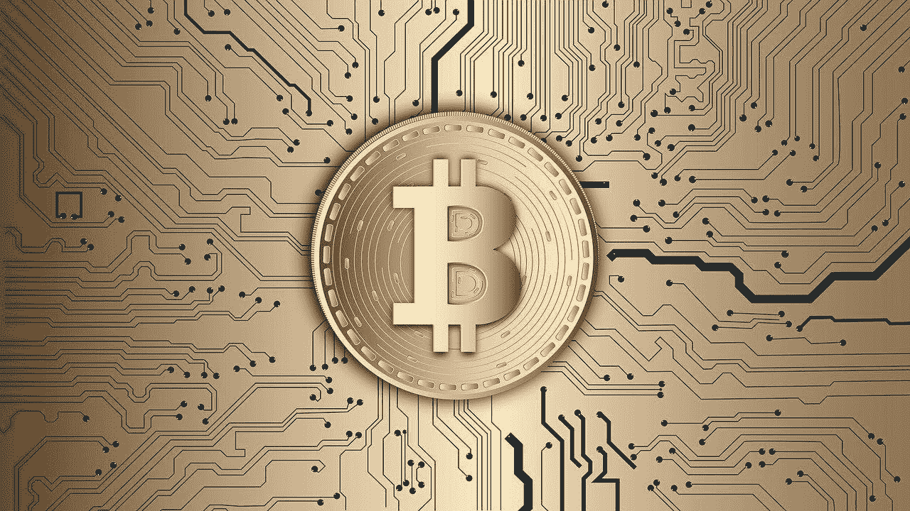
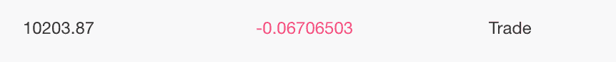
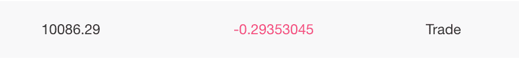
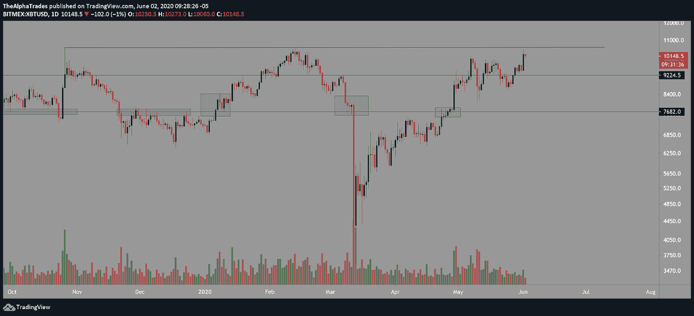
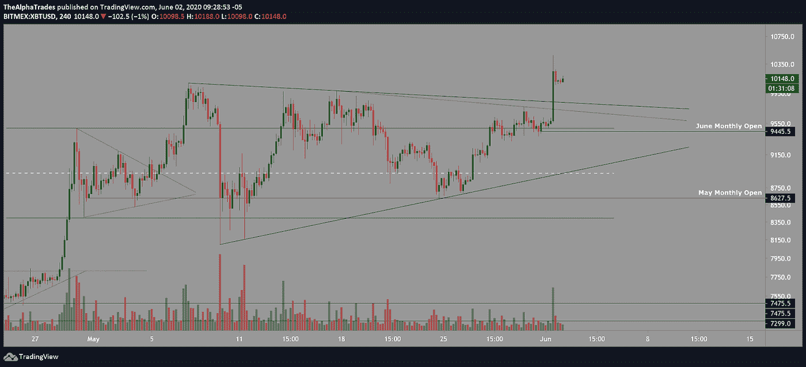
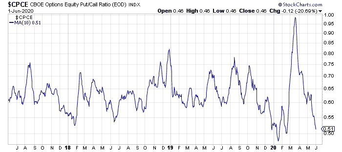
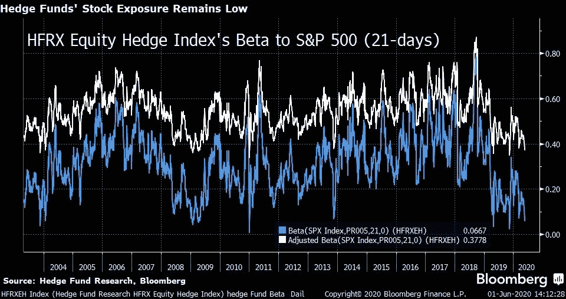

# 比特币触及 1 万美元——现在怎么办？

> 原文：<https://medium.datadriveninvestor.com/bitcoin-hits-10-000-now-what-2636924f8501?source=collection_archive---------10----------------------->

## BTC 没有突破关键的 10，550 美元阻力

Bitcoin, Image by VIN JD from Pixabay

比特币价格一夜爆涨，接近 10107 美元左右。所有 Twitter 和 YouTube 上的巨魔肯定都在准备折磨我，所以我将以我做空比特币的亏损证明开始这篇文章。

前几天晚上参加直播的人看到了这一爆炸性的变化，证明比特币是唯一不会因恶劣天气而取消的火箭。现在周围，有很多人喊着我们再也看不到 10000 点以下了，但我会给你看另一个观点。

比特币看涨者比看跌者有更多的东西需要证明，因为价格挑战了一个被拒绝约九个月的关键领域。比特币在令人信服的成交量水平上爆发，但现在我们需要看到后续。

 [## 加密货币行业是死是活？数据驱动的投资者

### 九月初，我们在 X-Order 内部就代币市场的未来进行了一场辩论。有趣的是，我们的观点是…

www.datadriveninvestor.com](https://www.datadriveninvestor.com/2019/12/12/will-the-cryptocurrency-industry-be-dead-or-alive/) 

当 BTC 突破 10500 点时，我会更倾向于看涨。但是让我们回顾一下强势突破是什么样子的。从 2019 年 11 月到今年 1 月，BTC 从 6，000 点突破到 10，550 点。当价格超过图表上标记为 7682 的关键阻力点时，成交量显示出稳步增长，即使卖家大举入市，价格也以令人信服的方式继续攀升。

# 如何交易这个比特币行动

我的交易策略是根据图表寻找三角形顶部的再次测试，证明有足够的支撑继续向上。那个复试机会会出现在 9850 到 9900 点左右。我会在反弹至 10，450 点时买入该回撤线。如果价格在令人信服的数量上接近 10，550 英镑，下一场好戏就要上演了。比特币价格不会超过 12500 美元或 13900 美元，这是一个关键的高点。

或者，如果 BTC 开始翻滚，回到三角内，我会怀疑这是一个大骗局。请记住，在重新测试三角形顶部或令人信服地突破 10，550 附近的关键高点之前买入任何地方都将是买入阻力，这是我很少做的事情，除非我所有的鸭子都在交易量，市场情绪和附近关键水平的力量方面保持一致。

Bitcoin Daily time frame, resistance levels to watch; Source: Alpha Trades, LLC

Bitcoin four-hour time frame, triangle levels; Source: Alpha Trades, LLC

值得注意的一个有趣的细节是在衍生品方面(通过 [Exocharts](https://exocharts.com/) )，很明显，昨天的大部分波动是由于清算的空头挤压，导致 12.1 亿美元的蜡烛线，净正 delta 只有 1.3 亿美元。真正的资金没有进入市场并推高价格，而是一连串的空头头寸平仓或被清算。随之而来的是，看看 Bitstamp 或比特币基地这样的现货交易所就会发现，进入整个市场的新交易量相当低；这一变动的大部分是将已经杠杆化的头寸从一方转移到另一方。

**总而言之，我认为 BTC 的突围可能有两个原因:**

要么这是一个陷阱，要么这是一个延续到更高高点的真正突破。你不会像那样爆发，只是四处游荡，所以如果没有延续，价格确实回落到三角形内，这将意味着多头可能燃料不足。然而，对三角形顶部的重新测试和持续的反弹将是多头的一个强烈信号。请看今天 7 分钟左右的视频，了解如何使用更短的时间框架和警报来捕捉 10，550 区域上方的突破。

# 对密码之外市场的思考

昨天我在白银(SLV 交易所交易基金)建立了一个头寸，因为我认为金属表现很好。让我们讨论一下非加密市场在做什么。

标准普尔 500 (ES1！)在美国 4000 万人失业的大范围社会动荡之际，期货合约开始飙升，这向即便是最理性的交易员证明，股市并不关心普通民众。美联储正在故意吹有史以来最大的经济泡沫之一。这有点黑色幽默，但梅西百货的旗舰店被洗劫一空，然而该公司的股票却上涨了。谈好保险！

与此同时，看跌期权与看涨期权的比率在 0.50 至 0.51 之间，对我来说，这意味着较大的参与者正在为市场见顶或资金从市场的一个领域向另一个领域进行有意义的分配做准备。这其中的含义是模糊而深远的，但我们会让我们的观众了解我们在未来几天如何定位自己。

尽管过去两个月股市飙升 37%，但对冲基金对股票的敞口仍接近历史低点。对冲基金经理正在远离这种风险。

CBOE Options Equity Put/Call Ratio (EOD) Index

Hedge Funds’ Exposure Remains Low; Source: Bloomberg

# 优势会员获得更多

[订阅 Discord 服务器](https://bit.ly/2KJ1oor)学习技术分析以及如何投资获利。要求第一个月的高级会员享受 50%的折扣！(优惠将于 6 月 15 日结束)查看以下视频了解更多信息。

Bitcoin hits $10000! | Still have not broken key $10550 resistance | Now what? Source: Alpha Trades, LLC

# 放弃

Alpha Trades，LLC 提供的信息不用于制定任何财务决策，也不是购买、持有和/或销售特定产品、数字资产或 ICO 的请求或建议。

访问我们的完整服务条款:[https://bit.ly/3faVeeV](https://bit.ly/3faVeeV)