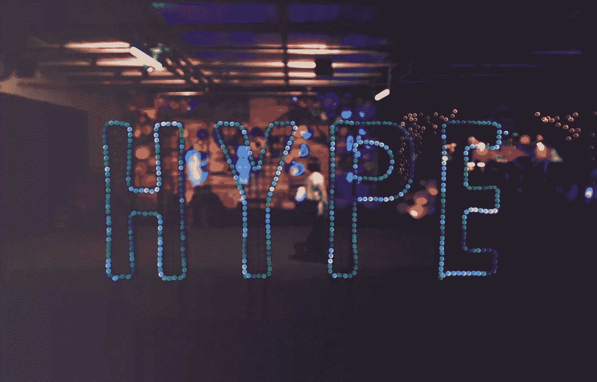
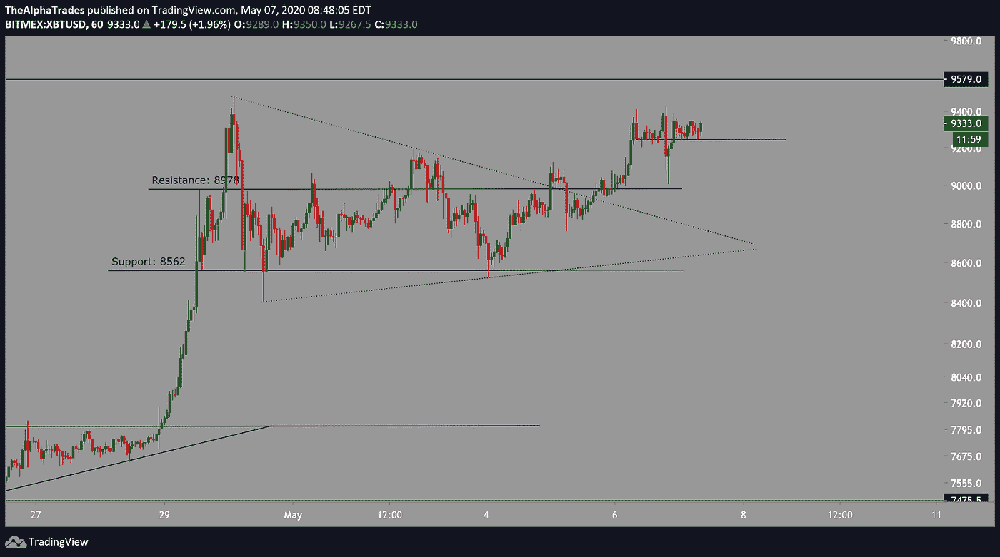
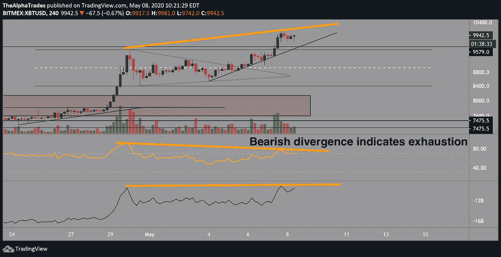
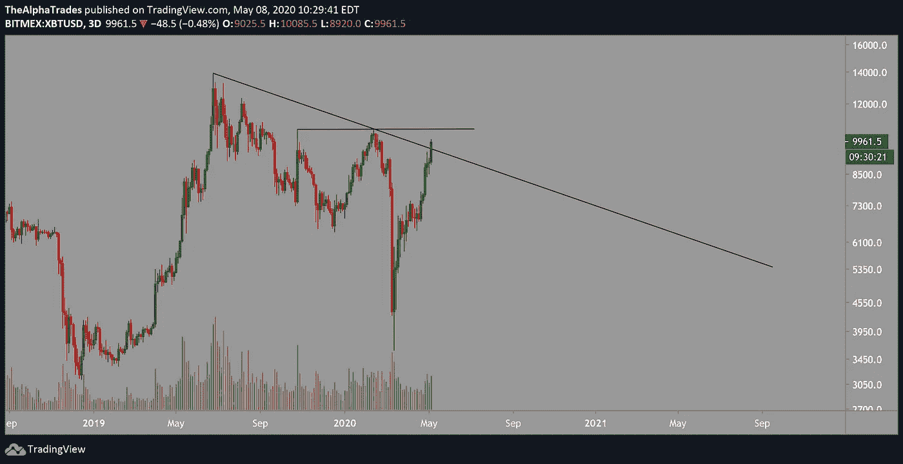

# 比特币触及 10，000 美元，即将“减半”——这是顶部吗？

> 原文：<https://medium.datadriveninvestor.com/bitcoin-hits-10-000-with-the-halving-around-the-corner-is-this-the-top-6e88be24843e?source=collection_archive---------12----------------------->

## 不要陷入炒作！

Photo by [Verena Yunita Yapi](https://unsplash.com/@verenayunita?utm_source=unsplash&utm_medium=referral&utm_content=creditCopyText) on [Unsplash](https://unsplash.com/s/photos/hype?utm_source=unsplash&utm_medium=referral&utm_content=creditCopyText)

早上好，各位。让我们直接进入一个令人兴奋的话题，我的朋友警告我不要放弃这个，但我会——Alpha Trades 使用 [Tradinglite](https://tradinglite.com/) 软件进行交易量的法医分析，这是一种流动性热图。你可以自己检查这个软件(我们不是会员，只是快乐的顾客)，但是现在秘密已经泄露了。那么，关于比特币，Tradinglite 告诉了我们什么？

首先，压制比特币的[卖出墙](https://www.investopedia.com/news/buy-and-sell-walls-cryptocurrencies-bitcoin-ethereum-ether-ripple/)今天凌晨消失了。我在上午 6:30(CST)左右发现了价值数百万美元的墙，它们可能在您阅读本文时已经消失。从那天起，大约 10，000 堵重要的墙被啃穿了。问题是，这是否为比特币的上行铺平了一条更容易的道路，答案是“是也不是”。

 [## 加密货币行业是死是活？数据驱动的投资者

### 九月初，我们在 X-Order 内部就代币市场的未来进行了一场辩论。有趣的是，我们的观点是…

www.datadriveninvestor.com](https://www.datadriveninvestor.com/2019/12/12/will-the-cryptocurrency-industry-be-dead-or-alive/) 

就市场动态而言，散户交易者只是帮助推动市场朝着已经加速的方向发展。真正的*市场驱动者——如专业人士、机器人和算法——承担重任，而其他人紧随其后。从这个角度来看，考虑一下价格如何触及一个关键区域，即 10，000。*

昨天我分享了三个成功的交易。第一个是在 9168 做多，在 9300 和 9240 之间退出，然后我在三角形突破的 9340 重新做多，在 9475 和 9600 获利。

Bitcoin Position Playbook, Source: Alpha Trades

然后我在 9550 多做了一个多，在 9700 和 9950 止盈。之后比特币推至 10000 以上。理解了消除偏见和在关键价位止损获利的重要性，我能够连续做三笔盈利的多头交易，尽管我认为价格*可能会*大幅回调。

许多交易者失败的地方是，他们进入了过度杠杆交易，这导致价格偏向某一特定方向，如果没有，在恐惧的魔咒下，经验不足的交易者可能会在亏损的头寸上加倍下注，取消止损，或惊慌失措地决定过早平仓。顺便提一句，在过去的几个月里，整体市场中全新的散户交易者数量出现了惊人的增长，我担心这些新交易者中的许多人会被烧伤。

制定一个游戏计划，并坚持下去——系统是交易者长期成功的关键。现在回到比特币。

四小时的时间框架印出了一个清晰的[看跌背离](https://www.babypips.com/learn/forex/divergence-cheat-sheet)，T2 相对强弱指标的高点较低，价格的高点较高。OBE 指标，即“平衡量”，揭示了资产的流入和流出，仅微弱地跟随价格行动，对我来说，这支持了看跌背离。上涨到 10，080 点左右似乎让买家筋疲力尽，而这一上涨的部分原因可能是交易员补仓或被[清算](https://www.investopedia.com/terms/l/liquidation-margin.asp)。昨日[现货买盘](https://www.investopedia.com/terms/s/spotmarket.asp)量也相当可观，所以此次突破 10000 点的原因是多方面的。我等着看的是随着 OBV 走高，看跌背离的打破，可能需要比特币到 10，500 甚至 11，000 才能重置背离。

Bitcoin Position Playbook, bearish divergence, Source: Alpha Trades

让我们看看三天的时间框架。比特币刚刚超过 2019 年 6 月开始的多月下降趋势线，并试图形成比 2020 年 2 月更高的高点。

如果比特币收盘时出现另一根蜡烛线，随后出现另一根看涨蜡烛线，价格可能会升至 10500 点。

我们的分析师 Amol 在今天的视频中介绍了一个假设的多月反向头肩底形态，你可以在本文的底部找到它。总体而言，我们已经连续八周保持强劲的牛市势头，从周线角度来看，价格正在触及 10，172 附近的关键阻力区。

如果比特币打破了当前的上升趋势线(如上图所示)，这对多头来说将是一个坏兆头，特别是如果价格突破 9240 关口。在价格达到那个水平之前，可能会发生很多事情，所以我们将专注于现在。

Key resistance level reached for Bitcoin, Source: Alpha Trades, LLC

总之，我认为回调是做多机会，在我看到 4 小时或日线反转之前，我不会进入激进的空头仓位。*这些都不是投资建议*，但如果我在接近近期高点的位置做空，我的止损点将在 10，080 上方。

# 媒体在宣传比特币——不要上当！

昨天，保罗·都铎·琼斯(著名投资者兼慈善家)，[讨论购买比特币作为对冲通胀的手段](https://www.bloomberg.com/news/articles/2020-05-07/paul-tudor-jones-buys-bitcoin-says-he-s-reminded-of-gold-in-70s)。*我并不是说他一定会这么做*，但在主要媒体网络上大肆宣传比特币只是为了向你的散户粉丝发泄，这是一个聪明的策略。当富人谈论任何资产时，都要小心，尤其是在我们今天所处的这种被操纵的市场环境中，以及比特币达到关键阻力水平的情况下。比特币在 4000 以下的时候，这些投资者在哪里？我劝你小心这些会说话的人把他们的比特币袋子扔给你。

比特币减半就在眼前 **(Alpha Trades 将于 5 月 11 日直播 12 小时的比特币减半派对。如果你想免费观看，请在下面的 Youtube 视频上给我们留言！)**。尽管市场整体状况良好，但比特币和其他货币仅在 8 周内就攀升至冠状病毒爆发前的水平以上或附近，没有出现任何有意义的回撤。我恳求你要小心，经常获利，尽可能严格止损。

# 处于优势

感谢您成为这个社区的一员。如果你对这篇文章有共鸣，请[订阅 Discord 服务器](https://bit.ly/2KJ1oor)。你将可以免费访问公共频道，在那里我们每天发布大量免费有用的内容。(我们将从 2020 年 5 月 5 日起提高 [Advantage 社区订阅](https://bit.ly/3bUdg3a)的价格)。更多细节请看下面的视频。

Bitcoin Hits 10k! Leave a comment to get free access to our 12-hour Bitcoin Halving lifestream on the 11th!

# 放弃

Alpha Trades，LLC 提供的信息不用于制定任何财务决策，也不是购买、持有和/或销售特定产品、数字资产或 ICO 的请求或建议。

访问我们的完整服务条款:[https://bit.ly/3faVeeV](https://bit.ly/3faVeeV)