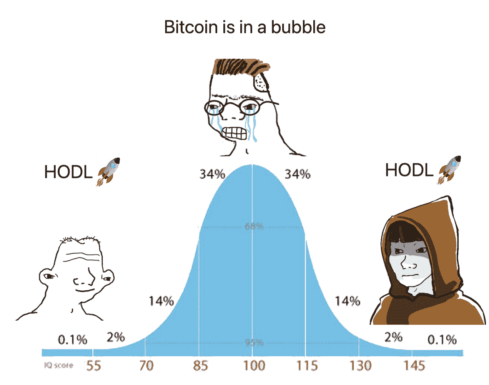
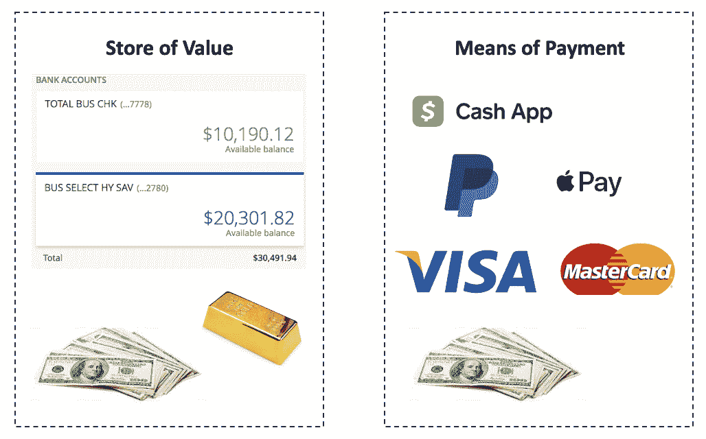
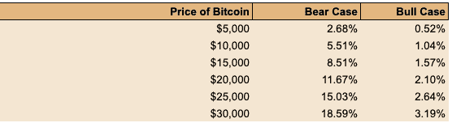

# 比特币值 100 万美元吗？

> 原文：<https://medium.datadriveninvestor.com/bitcoin-investment-thesis-from-first-principles-6f03ccceda21?source=collection_archive---------2----------------------->

## 来自第一原理的比特币投资论文。

随着比特币最近飙升至 40，000 美元，加密货币再次成为公众关注的焦点。我的职业生涯始于在华尔街交易加密货币衍生品，因此我自然对作为投资的加密资产感兴趣。

像许多人一样，我一直持怀疑态度——尽管我已经建立了交易比特币的量子算法。每次试图揭示客观性时，我总是会遇到比特币狂热追随者、哗众取宠的媒体或散户 FOMO 的非理性行为。

比特币缺乏第一原则的投资理论令人担忧。没有信念，在比特币的波动中，我们只能任由自己的情绪摆布。只有当你对自己的策略有信心时，你才能忍受大规模的下跌，当别人恐惧时，你才能变得贪婪。即使你在 2018 年比特币狂热的巅峰时期买入，如果你没有卖出，你仍然可以在 3 年内获得 100%的回报。

今天，我不是从一个交易者的角度，而是从一个理性的长期投资者的角度来介绍。这不是快速致富的技术交易教程——它们是骗人的。我希望这能帮助你做出更明智的决定，将比特币纳入你的投资组合。

**加密令牌的两个主要用例**

快速搜索会发现超过一千种不同的加密货币硬币。其中包括最受欢迎的加密货币比特币，以及以太坊、莱特币和 Dogecoin 等其他“另类硬币”。虽然理解每个加密令牌的作用可能很难，但有两种主要的使用情形— (1)作为实用协议，或(2)作为价值存储。

公用协议令牌的存在是为了分配有限的网络资源，允许用户访问智能合同或支付系统等功能。为了维持这样一个系统(也称为区块链)，它以计算能力的形式付出了现实世界的代价。这些代币奖励给维护区块链的“矿工”。

由于比特币和其他几种另类硬币的供应量有限，而且不会被黑客攻击，因此有人认为它可能会像黄金一样成为一种潜在的非法定价值储存资产。加密货币可能比黄金更特殊的地方在于，它也可以是非主权货币，这意味着它不与任何国家相关联。像黄金这样的商品通常以美元计价出售，因此给了美国太多的外汇市场控制权。

我将证明，投资比特币的唯一令人信服的理由是，它有可能成为占主导地位的非主权非法定储值手段。由于区块链的目的是实现快速、廉价的大规模交易，因此从定义上来说，它作为一个实用协议的价值是有限的。公用事业协议市场也可能被分割成几个加密令牌，每个令牌都服务于自己的利基市场——只要看看今天有多少支付选项就知道了。

**第 1 部分—加密货币作为公用协议令牌的价值**

对于任何给定的加密货币协议，它都可以被视为一种简化的经济——公用事业可以用来交换具有一定货币价值的代币。成熟时，这些令牌只不过是有效地分配计算资源。

**公用事业代币的价值与其基础成本密切相关**

加密货币的成熟是经济均衡的合理代表，其中边际效用等于边际成本。这意味着这些加密货币令牌的价值无法与资源的潜在成本脱钩。

如果你仍然不相信，让我们想象下面的思想实验。假设我们有一台使用起来很贵的区块链。两种可能的情况之一将会发生。在场景一中，矿工之间的竞争将会发生，因为他们相互压价以获得更多的奖励代币，从而降低成本。在场景二中，用户将创建一个分叉的区块链。这是一个相同的网络，但成本较低。在没有进一步的套利动机之前，这两种情况都会发生。

**评估公用事业代币的“市值”**

前面我们提到，加密货币实际上是其自身的微观经济。这样一个经济体的 GDP 或“市值”可以用货币经济学理论来解释。

货币供应量或“市值”M 只是维持区块链(PQ)所需的计算资源的总成本除以使用加密令牌的速度(V)的函数。

M = PQ/V

其中:

*   PQ =消耗的计算资源的总成本(价格*数量)
*   V =令牌被使用的平均频率(速度)

从长期来看，由于莱特定律，计算资源的成本(P)是通货紧缩的。此外，我们目前距离速度的理论上限(V)还很远，因为循环令牌可能会以计算处理的速度四处游荡。

从长远来看，这些趋势最终会降低特定公用事业协议的“市值”(或 M)。简单地说，这意味着区块链科技看好其用户，能够提供快速、强大、廉价的公用事业服务，如规模化支付——然而，对公用事业代币的投资者来说，这是悲观的。事实上，以太坊的内置气体协议旨在确保这一点。

**作为投资的公用协议代币之王**

当前领先的实用协议令牌是以太坊，许多 dApps 和协议都建立在以太坊网络上。因此，作为投资者，通过首先评估以太坊来开始分析公用事业协议是合理的。所有的定量计算都在[这里](https://docs.google.com/spreadsheets/d/1Q5Nsz9rRXfehAuzzeCQRvoDIh_11cvDUiBYsP8_h0Ik/edit?usp=sharing)进行。

在发帖当天，以太坊网络上的每日交易费用总计约 2400 个以太坊代币，或每天约 300 万美元。如果我们假设以太坊网络同比增长 1.5 倍，资源成本同比下降 20%，那么以太坊的“市值”实际上每年都会翻倍。

假设以太坊的速度为 7，[等于美元的速度](https://hackernoon.com/token-velocity-what-it-is-and-why-you-should-care-56ab2592b8c4)，那么 10 年后以太坊的预测总额预计为 2000 亿美元。以太坊目前的总价值为 1580 亿美元，10 年间仅上涨了 26%。对于一种具有内在长期通缩力量的投机性资产而言，这种回报根本不足。

**第二部分——加密货币作为货币的价值**

钱在某种意义上，只是一个大的债务分类账或 excel 表。发明货币是为了让我们不再需要以物易物来购买特定的商品，因为货币是用来比较商品或服务的记账单位。货币既可以作为价值储存手段(例如黄金和实物现金)，也可以作为支付手段(Visa、Paypal、Apple Pay、Cash App、实物现金)。

一个有趣的观察是，传统上，只有实物现金能够同时作为价值储存手段和支付手段。我们当然不能在信用卡上储值，也不能用一块金子买晚餐。

**加密货币作为货币的潜力**

衡量加密货币作为货币的潜力的一种方法是将其与现有技术进行比较。初步看来，加密货币似乎也有可能服务于这一双重功能。

可以说，加密货币是比实物现金更好的价值储存手段，因为它永远不会像法定货币那样被随意稀释。此外，它是安全的，几乎不可破解——如果这不是真的，比特币会迅速贬值。由于它不是实物商品，与黄金不同，它的储存成本(或运输成本)很低。

作为一种支付手段，与 Apple Pay 或 Google Pay 相比，加密货币目前缺乏日常交易功能。尽管如此，它们在某些特定的使用案例中还是有优势的，比如国际支付。

由于 Square 的 Cash 应用程序或 Paypal 的 Venmo 等热门金融科技平台最近对比特币的支持，支付摩擦正在迅速减少。这种对比特币的支持有助于推广比特币，成为一种强大的营销工具，有助于更广泛的采用。

加密货币的价值实际上来源于其作为支付手段的价值加上其作为价值储存手段的价值。由于支付只是一个效用协议的特例，我们之前已经详细讨论过这里的价值有限。

一种加密货币的大部分估值在于它作为一种占主导地位的非主权非法定储值手段的潜力。

**比特币成为主要储值手段的理由**

当一项资产与制造和储存它的成本或它的功能效用脱钩时，它就被描述为价值储存手段。黄金是价值储存的一个例子，因为它相对于它的效用来说是任意昂贵的——大多数黄金被保存为巨大的惰性金条，没有其他用途。

鉴于比特币是最受欢迎的加密货币，具有极其强大的功能，它是占主导地位的储值手段的主要候选对象。虽然可以认为可能有一个以上的加密资产可以服务于这个目的，但是有多个候选者也没有实际效用。我们只需要看看银，它只是黄金价值的一小部分。

如果比特币成功地成为占主导地位的非法定价值储存手段，那么开始估算比特币价值的一个合乎逻辑的地方就是看看当前的标准——金条。目前，地上约有 198，000 公吨黄金，价值 11.6 万亿美元。其中约 39%(4.5 万亿美元)以金条形式持有，分散在私人部门和国债中。

10 年后，比特币的价值将是今天金条总价值的几倍(或几分之一)。鉴于我们预计政府会更加谨慎，一个看跌的估值案例可能是国债的 0.25 倍，私人部门的 0.75 倍。同样，看涨的情况下，国债的估值可能是 1 倍，私人部门的估值可能是 3 倍。

这使得比特币的价值在 130，000 美元到 530，000 美元之间，如果它成功地成为主要的非法定储值手段的话。分配倍数是该分析中最主观的元素，所有潜在的假设都可以在[这里](https://docs.google.com/spreadsheets/d/1Q5Nsz9rRXfehAuzzeCQRvoDIh_11cvDUiBYsP8_h0Ik/edit#gid=0)找到。

应该注意的是，拥有巨大的上涨空间并不意味着比特币是一项好的投资，本文后面会有更多相关内容。不成功采用的负面影响实际上是 100%的损失。然而，如果比特币被广泛用于取代不稳定的主权货币，如委内瑞拉玻利瓦尔，那么更乐观的情况可能会出现。

**比特币成为国际储备一部分的理由**

取代金条可能只是冰山一角，因为比特币也有可能融入国际储备。在那里，它将充当*非主权、*非法定、储值资产或国家不可知论者。

目前，黄金约占 12 万亿美元国际储备的 11%。其余的 89%是作为一篮子国际法定货币持有的，其中很大一部分是美元。持有不成比例的美元是所有主要商品都以美元计价的结果，而美国是全球贸易的重要参与者。

随着最近的贸易战和中美等国之间持续的经济紧张局势，以美元持有其大部分储备并不是一个理想的情况。减少国际储备中的美元数量减少了美国对国家的控制。

这使得潜在的*非主权、*非法定、像比特币这样的价值储存资产变得引人注目。在比特币能够取代 10%-75%法定货币国际储备的情况下，比特币的价值增加了 60，000-440，000 美元。

将这两种情况相加，如果比特币成功成为*非主权、*非法定的价值储存资产，它在 10 年内的潜在估值将为 191，000 美元到 970，000 美元。

# 第三部分——确定比特币是否是理性投资

确定比特币是否是理性投资的一个重要方面，是看它是否是一个积极的预期价值赌注。在我最近的切入点，比特币的价值是 10，000 美元。鉴于上面的估值预测，我只需要在牛市和熊市中分别有 1-5%的时间是正确的，就可以实现盈亏平衡。

鉴于主要金融科技公司(Venmo 和 Cash App)和对冲基金越来越多地采用比特币，我认为它成功的可能性大于 5%。这不仅使它成为一个积极的期望值赌注，而且是一个不对称的-1 倍到 100 倍的回报。这类似于购买一张彩票，平均来说能赚到钱。

在 30，000 美元的货币估值中，你需要在牛市中正确 3%,在熊市中正确 19%。如果你认为比特币在未来 10 年内成功成为非主权*、*非法定储值资产的几率大于此，你*应该*投资比特币。

盈亏平衡的隐含成功几率

如果你已经接受了比特币的净预期值对当前价格来说是正的，那么你应该进入一个位置。然而，鉴于比特币是一种极具投机性的资产，管理风险的最佳方式是通过下注规模。它应该占你投资组合的一小部分(1-5%)，当然也不应该保证金购买。关于交易员或扑克玩家如何管理下注规模的更多技术分析，请阅读[凯利标准](https://en.wikipedia.org/wiki/Kelly_criterion)。

最后，如果任何基本假设发生变化，那么你需要以类似的方式更新你的投资理论。

# [加入 1000 多名读者，了解更多关于金融和决策的信息](https://investinglessons.substack.com/)

*在过去的生活中，我是华尔街一家大型自营交易公司的衍生品交易员。每个星期天，我都会发表一些我在那里学到的关于投资、交易和决策的东西。本文原载于我的***。* ***跟我上*** [***这里推特***](https://twitter.com/christopherjgan) ***。****

# *热门帖子*

*   *你是在交易还是在赌博？ — 40K+浏览量*
*   *华尔街量化分析师使用的 5 种量化策略*
*   *[做市入门](https://investinglessons.substack.com/p/beginners-guide-to-market-making) — 5K+观点*