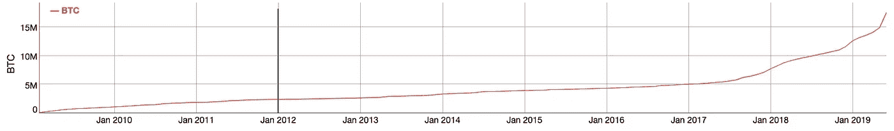

# 比特币是一个早期创业公司，其波动性是最大的买入信号。

> 原文：<https://medium.datadriveninvestor.com/bitcoin-is-an-early-stage-startup-its-volatility-is-the-greatest-buy-signal-d9af3a5bc3e3?source=collection_archive---------16----------------------->

Photo by [Mario Gogh](https://unsplash.com/@mariogogh?utm_source=medium&utm_medium=referral) on [Unsplash](https://unsplash.com?utm_source=medium&utm_medium=referral)

比特币波动性的本质来自于这样一个事实，即它的供应是有限的，不会因需求的变化而改变。

以既定的速度增长是必然的。

让我们在商品和法定货币之间做一些比较，让这一点更清楚:

Photo by [Denny Müller](https://unsplash.com/@redaquamedia?utm_source=medium&utm_medium=referral) on [Unsplash](https://unsplash.com?utm_source=medium&utm_medium=referral)

# 商品

如果你将比特币与你选择的任何商品进行比较，你会发现任何需求**的增加**都会使其生产者大量生产他们正在生产的任何东西，从而抑制商品价格的上涨——以增加利润。

 [## 总部位于瑞士的 ETP 进入加密交易市场|数据驱动的投资者

### 虽然金融市场几乎没有沉闷的时刻，特别是在引入…

www.datadriveninvestor.com](https://www.datadriveninvestor.com/2019/03/10/swiss-based-etp-enters-the-crypto-trading-market/) 

在相反的一端，需求的减少会使生产者减少商品的供应，从而尽可能地减少损失。

Photo by [Ryan Quintal](https://unsplash.com/@ryanquintal?utm_source=medium&utm_medium=referral) on [Unsplash](https://unsplash.com?utm_source=medium&utm_medium=referral)

# 不兑现纸币

就像大宗商品的生产者一样，世界各国的央行预计将保持其货币相对稳定的购买力。

为了保持这种稳定，银行使用货币政策来应对市场上发生的任何波动。

现在，看看比特币，你就会明白，它有一个不可打破的供应时间表，永远不会屈服于过高或过低的需求。此外，要明白也没有央行管理比特币的供应。

如果供应不灵活，没有集中管理，您可能会经历波动。这种情况尤其发生在需求非常疯狂的早期阶段。

现在，把比特币比作一个早期创业公司。

战略、团队、支点，应有尽有。它是不稳定的。它还是个婴儿。但随着市场的增长，比特币的机构和零售用户也变得越来越成熟。这将使比特币的波动性随着时间的推移而降低。

实现这一点的关键是让更多的用户长期持有比特币，正如他们确实持有的那样(见下图)。

**The cumulative sum in dormant Bitcoin addresses is an indicator of how much bitcoin is being stored/held (**[**bitinfocharts.com**](https://bitinfocharts.com/top-100-dormant_8y-bitcoin-addresses.html))

为了提高不灵活供给/分散资产的市场价值，你需要用一小部分供给来做这件事。这就是为什么比特币可以被分割成 100，000，000 个 satoshis 和“stack sats”meme 如此重要。

为了实现稳定性，这既是一个重要的动作，也是一个用例。

# 结论

到 2020 年，比特币的价格将慢慢不再像初创公司那样快速增长。这是通过持续增长和用户采用来实现的。

如果增长停止了，不要担心！在这种特殊情况下，只有操纵型、高风险的投资才会停止被比特币吸引。

这将使比特币像其他货币资产一样，逐年稳步升值。