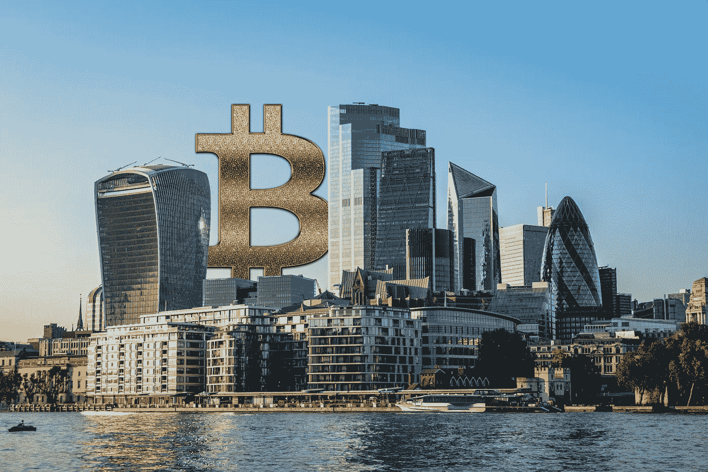
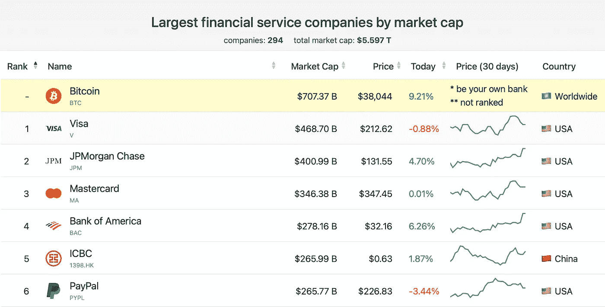

# 比特币现在是最大的金融服务公司

> 原文：<https://medium.datadriveninvestor.com/bitcoin-is-now-the-largest-financial-service-company-64b91712781e?source=collection_archive---------14----------------------->

## 理论上，数字货币是世界上最大的银行、第 21 大“公司”和第 11 大公司。

比特币在去年有着惊人的表现。

这种数字货币的价格已经上涨了 400 %( T1 ),超过了 T2 7000 亿美元的市值(T3)。

从这个角度来看，比特币成为了世界上最有价值的金融服务公司**。**

想想吧。

现在它比 Visa、Mastercard 和 PayPal 更有价值。

这种比较只有一个问题。

比特币不是法律实体。它没有办公室、首席执行官或任何员工。

*那么，我们该如何定义呢？*

看你问谁了。

对一些人来说，它是一种价值储存手段；对其他人来说，支付系统或货币。对不同的人来说是不同的事情。

所以，让我们花一分钟来探索它。

# 第 21 大货币

比特币现在是全球第 21 大货币，并且在取代法定货币作为交易媒介方面也开始取得进展。

被吹捧为“互联网货币”的比特币现在被接受为一种支付形式，类似于 Visa、Mastercard 或 PayPal。你可以使用二维码亲自发送你的比特币，也可以使用将你与买家数字化连接的交换服务。

最近，PayPal 也进入了加密货币市场。用户可以使用他们的贝宝账户买卖比特币和其他加密货币。小型企业越来越多地在国际贸易中使用比特币。类似地，许多对本国货币缺乏信任的国家，如委内瑞拉、尼日利亚、伊朗或阿根廷，都采用了比特币。

客观地说，流通中的比特币价值约为 7000 亿美元。流通中的美元价值约为 2 万亿美元。按照这种速度，比特币很可能在未来几年内超越流通中的美联储纸币。

# 最大的银行

**比特币超越摩根大通成为世界最大银行。**比特币网络最近能够开展一些重要的传统银行服务。例如，分散融资(DeFi)的用户可以通过托管资产进行借贷。这使得网络成为某种银行，因为它可以执行一些基本的银行功能。

根据世界银行的数据，T2 仍有 17 亿成年人没有银行账户。作为最大的“银行”，比特币可以让金融服务摆脱种族歧视，并将其转变为全球包容性的银行基础设施。比特币的目的之一是为地球上剩余的 30%的人口提供银行服务。银行业是一项基本人权。

# 第 11 大公司

从理论上讲，根据市值，这种数字货币现在是全球第 11 大**公司**，领先于三星、沃尔玛、伯克希尔哈撒韦或可口可乐等其他公司。

而且，人们还将比特币称为**数字黄金。它确实表现得像金子一样。你可以在现货市场或通过期货等衍生品进行买卖。和黄金一样，你可以用比特币来储存价值，抵御通胀。和任何商品一样，你可以用它来交换其他资产、货物或商品。**

*那么有人能搞清楚比特币是什么吗？*

号码

也没关系。你永远不会通过学习它的定义来理解任何事情。

正如美国理论物理学家理查德·p·费曼所说:

***“我很早就知道了知道一个东西的名字和知道一个东西的区别。”***

相反，把比特币想象成一个连续的过程。

它正在重塑货币，从中产生的价值将比比特币本身更大。

*如果你喜欢这篇文章，请在左下角“鼓掌”50 次，这样会有更多人分享。你可以随时关注我的*[*Twitter*](https://twitter.com/RasVasilisin)*和*[*LinkedIn*](https://www.linkedin.com/in/rastislav-ras-vasilisin-11bb5819/)*，别忘了订阅我们发给全球两万多名投资者的*[*Virtuse News*](https://www.virtuse.com/)*。*

**访问专家视图—** [**订阅 DDI 英特尔**](https://datadriveninvestor.com/ddi-intel)