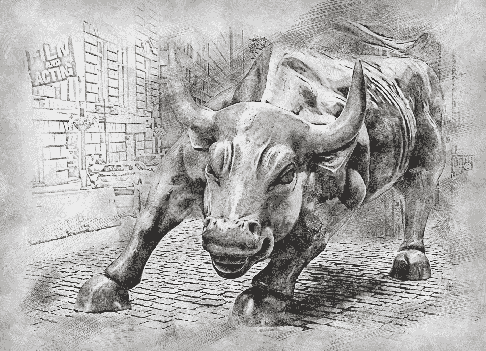
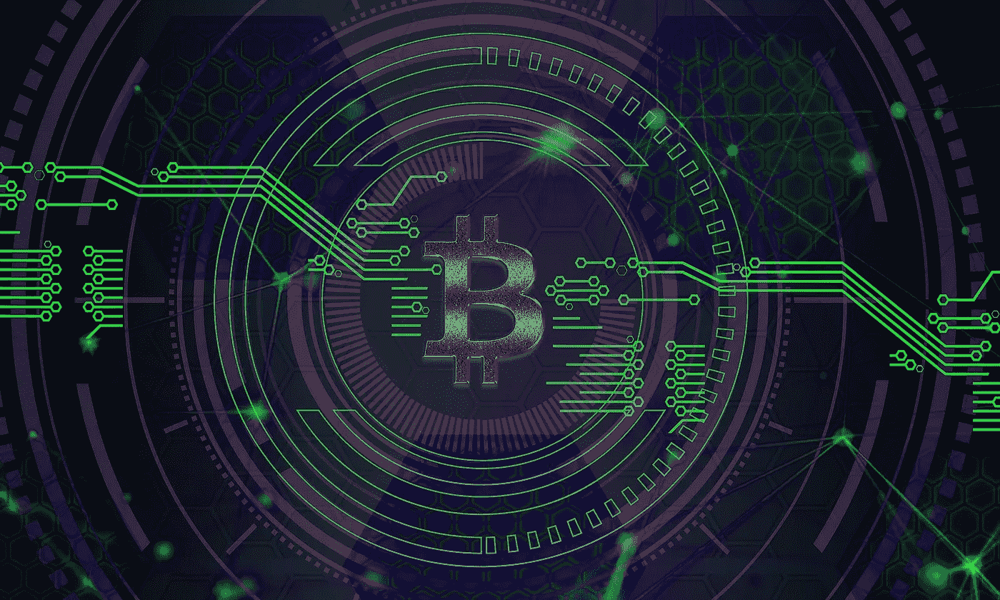

# 花旗银行比特币价格预测 2021 年 318K 美元——是时候投资区块链技术了吗？

> 原文：<https://medium.datadriveninvestor.com/bitcoin-is-projected-to-reach-318k-in-2021-now-is-the-time-to-invest-in-blockchain-technology-416eebf291a4?source=collection_archive---------6----------------------->

## 加密货币

## 2020-2021 年的牛市正在发生。还会继续吗？

Image by [ArtTower](https://pixabay.com/users/arttower-5337/?utm_source=link-attribution&utm_medium=referral&utm_campaign=image&utm_content=3112617) from [Pixabay](https://pixabay.com/?utm_source=link-attribution&utm_medium=referral&utm_campaign=image&utm_content=3112617)

# 比特币(BTC)的当前价格为 18，588.50 美元

(*截至 2020 年 11 月 21 日美国东部时间上午 12:33 根据 CoinMarketCap.com**)*

*最近，人们对比特币和其他加密货币的兴趣和关注度越来越高，包括金融和金融科技行业的主要参与者，他们已经成为区块链和加密货币公司的领导者。*

*你可能以前听说过，也可能没有。无论哪种方式，加密货币都有望成为一个[数万亿美元的金融行业](https://www.cnbc.com/2018/01/03/one-stock-analysts-10-trillion-bull-case-for-cryptocurrencies.html)，几乎在大多数人的雷达下飞行。只有大约 5%的美国人投资或使用比特币，这使得它成为在达到主流临界点之前进行定位的黄金时间。*

## ***我认为现在是坐起来集中注意力的时候了***

*加密货币意识正在迅速传播。甚至一些大学也在教授比特币、加密货币和区块链技术。*

# ***比特币到底是什么？***

*比特币是一种电子持有的数字货币，这意味着它不像法定货币(美元、欧元、日元等)那样是有形的。)，保存在智能手机或电脑的数字钱包应用程序中。它是用图形方式创造出来的*加密*，因此是一种*加密*货币。*

*比特币运行在开源平台上，不受任何实体控制，是去中心化的，不受银行或任何政府的监管。*

*比特币的[历史](https://money.usnews.com/investing/articles/the-history-of-bitcoin)令人着迷！我只希望几年前我第一次接触到它的时候就买下了它。*

*从比特币的当前和预计价格来看，当我第一次听说比特币时，它的价格只有 100 美元左右！而且，当比特币刚发明的时候，花 [10，000 个比特币买几个披萨](https://www.investopedia.com/news/bitcoin-pizza-day-celebrating-20-million-pizza-order/#:~:text=On%20May%2022%2C%202010%2C%20now,two%20delivered%20Papa%20John's%20pizzas.&text=%22It%20wasn't%20like%20Bitcoins,Hanyecz%20told%20the%20NY%20Times.)。*

*我只是对它了解得不够，但我很遗憾没有进一步研究它。但是，我现在知道了，晚知道总比不知道好！*

**

*Photo by [Aleksi Räisä](https://unsplash.com/@denarium_bitcoin?utm_source=medium&utm_medium=referral) on [Unsplash](https://unsplash.com?utm_source=medium&utm_medium=referral)*

# ***什么是区块链？***

*[区块链](https://www.computerworld.com/article/3191077/what-is-blockchain-the-complete-guide.html)技术是比特币和其他加密货币存在的地方。区块链还用于加密货币之外的其他应用，例如运行智能合约。*

*简而言之，区块链是一个去中心化的数字账本。它存储发生在其中的所有交易的记录，并由对等网络运行。这意味着个人和企业使用它通过互联网相互转移数字资产，而不需要第三方(即银行、政府)。*

**

*Image by [Pete Linforth](https://pixabay.com/users/thedigitalartist-202249/?utm_source=link-attribution&utm_medium=referral&utm_campaign=image&utm_content=3510168) from [Pixabay](https://pixabay.com/?utm_source=link-attribution&utm_medium=referral&utm_campaign=image&utm_content=3510168)*

# ***区块链技术和投资加密货币的好处***

*从商业角度来看，[区块链技术](https://www.ibm.com/blogs/blockchain/2018/02/top-five-blockchain-benefits-transforming-your-industry/)可以改善业务流程并显著降低成本。它还将允许企业向客户提供更多的服务利益。例如，金融机构可以使用区块链技术来改善结算和保险等交易的流程。*

* [## 面向开发者的区块链；API 提供商的重要性|数据驱动的投资者

### 在过去的几年里，区块链突然成为这个领域最热门的新技术。每一个…

www.datadriveninvestor.com](https://www.datadriveninvestor.com/2020/11/25/blockchain-for-developers-the-importance-of-api-providers/) 

从个人角度来看，与传统投资相比，区块链技术为[加密货币投资](https://www.techtree.com/content/news/14320/advantages-investing-crypto.html)提供了显著高回报的机会。

区块链技术和加密货币很快被证明是全球经济货币和金融未来不可避免的一部分。它将很快成为世界金融市场的主流，那些作为这项惊人的创新技术的早期采用者进行投资的人将在未来几年甚至更长时间内成为最新的百万富翁。

# 互联网浪潮

我们正处于互联网的第三次浪潮中。

1.  互联网、网站和域名的首次发布(互联网热潮)
2.  移动设备和社交媒体(Twitter、脸书、YouTube 等。)
3.  物联网(或一切)，包括数字革命、区块链技术、比特币和其他加密货币

我认为这是投资加密货币的绝佳时机！

# 秘密牛市

当前加密货币市场价格上涨的重要性(即使价格周期性回调)与比特币矿工 block rewards 第三次[减半发生在今年夏天 2020 年 5 月至 6 月之间的事实有关。](https://www.investopedia.com/bitcoin-halving-4843769)

# 比特币减半时间表

下面来看看比特币自诞生以来，每四年的块奖励(以及价格)是如何减半的。

*   2009 年 1 月:50 BTC(价格=-0.01 美元)
*   2012 年 11 月:25 BTC(价格= 12.27 美元)
*   2016 年 7 月:12.5 BTC(价格= 672.48 美元)
*   2020 年 5 月:6.25 BTC(价格= 9999.93 美元)*
*   未知 2024: 3.125 BTC(价格= $XXX，XXX。XX**)

**历史表明，比特币价格在每次减半后的几个月里都会出现牛市飙升。**

**自 2021 年 2 月 28 日起修订*

** *预测** 

# *比特币价格减半后飙升*

*关于 Hackernoon 的一篇[文章分解如下:](https://hackernoon.com/crypto-the-halving-21m-bitcoin-and-the-next-bull-run-932c3266)*

***第一次减半发生在 2012 年 11 月**，将块奖励从 50 比特币减少到 25 比特币。在过去的 12 个月中，比特币的价格上涨了+500%，牛市导致比特币在接下来的 2 年中价格上涨了**+1700%。***

*第二次减半发生在 2016 年 7 月，将区块奖励从 25 比特币降至 12.5 比特币。在过去的 12 个月中，比特币价格上涨了+200%，牛市导致比特币 **在接下来的 2 年中价格上涨了**+2890%。*****

*第三次减半发生在 2020 年 5 月，将区块奖励从 12.5 比特币降至 6.25 比特币。截至 2020 年 11 月 12 日，**比特币价格自 2020 年 6 月至今**上涨了+200%。*

*历史已经重复了两次，现在也是同样的模式。*

*然而，在前两次比特币热潮之后，这一次是否会像前两次牛市一样，还有待观察。*

# *比特币牛市正在进行中。*

*花旗银行的一份金融分析预测比特币将在 2021 年达到 31.8 万美元。*

*哇哦。*

*根据比特币的历史，牛市可能会持续到 2021 年(交易波动很大)。我们会看到比特币的爆炸性增长吗？如果是这样的话，市场上的替代硬币也会像历史两次证明的那样吗？*

*这肯定值得关注，我肯定会投资。*

**注:我不是金融专业人士。这篇文章不能作为财务建议。它是基于我个人的观点和研究。**

***相关故事***

* [## 投资加密货币时你不想犯的 3 个错误

### 在过去的四年里，这些错误让我损失了数百万的潜在成本，我正在为此后悔

medium.datadriveninvestor.com](/3-mistakes-you-dont-want-to-make-when-investing-in-cryptocurrency-33fced6f28cf)  [## 新的比特币价格预测显示，2021 年其价值将超过 10 万美元

### 但看起来这种数字黄金有望在 4 月或 5 月突破 10 万美元

medium.com](https://medium.com/nova-thinker/new-bitcoin-price-prediction-puts-its-worth-over-100-000-in-2021-4d944f87e09f)  [## 2010 年投资 1000 美元的比特币，如今将价值 2.875 亿美元

### 你想分一杯羹还来得及吗？

medium.com](https://medium.com/datadriveninvestor/1-000-invested-in-bitcoin-in-2010-would-be-worth-287-5-million-today-c9c343416fd4) 

谢谢你的来访。如果你想了解更多我写的东西，请随意访问我的 [*简历*](https://medium.com/illuminations-mirror/bio-audrey-malone-33bd0ec3a57b) *和* [*简介*](https://audreysdesk.medium.com/) *。*

 [## 通过我的推荐链接加入媒体-奥黛丽·马龙

### 阅读奥黛丽·马龙的每一个故事。(也可以从自己的故事中赚取！)您将可以访问…上的每个故事

audreysdesk.medium.com](https://audreysdesk.medium.com/membership) 

## 获得专家观点— [订阅 DDI 英特尔](https://datadriveninvestor.com/ddi-intel)*