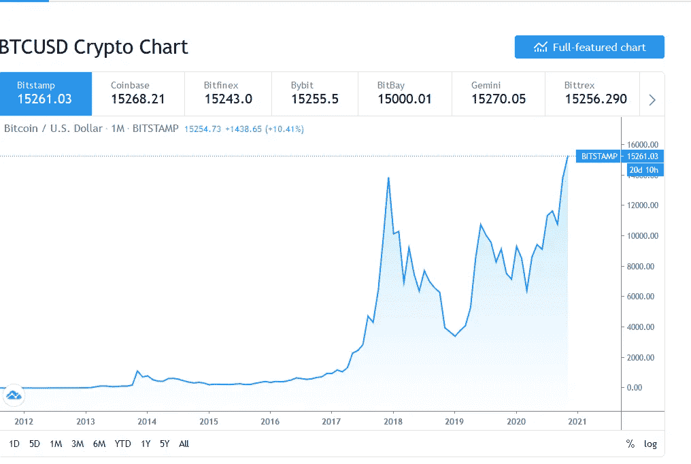

# 比特币在涨:买不起一整枚比特币怎么办？

> 原文：<https://medium.datadriveninvestor.com/bitcoin-is-rising-what-to-do-if-you-cant-afford-a-whole-bitcoin-c383e812372e?source=collection_archive---------0----------------------->

Photo by [Aleksi Räisä](https://unsplash.com/@denarium_bitcoin?utm_source=medium&utm_medium=referral) on [Unsplash](https://unsplash.com?utm_source=medium&utm_medium=referral)

最近的恐慌和兴奋让我想起了 2017 年 11 月——2018 年 1 月，比特币飙升至 2 万美元，FOMOers 在 18 万美元的峰值买入，扼杀了他们的投资梦想。

最近，比特币触及了超过 14K 的上限，这是它上次在 2018 年 1 月触及的上限。当时，在 19K 反弹后，比特币连续几个月跌至 5K 美元以下。怀疑论者对此有很多话要说——这是比特币和 crpytocurrency 疯狂的终结。

但是我们又在这里了。

比特币已经涨到了以前的水平，并将继续上涨。

在 5000 美元及以下下跌后买入的投资者，现在正因为他们的耐心和自律而获得回报。

再说一次，人们如此担心错过另一个比特币的机会，以至于有些人对该做什么感到紧张。

事情是这样的——比特币将继续上涨。它将稳步上升到 2 万美元以上，也许更多，但是，随着兴奋(不耐烦)的投资者兑现他们的利润，再次下降，后期投资者恐慌并迅速卖出。

Bitcoin Graph 2012 to Nov 2020

随着数字货币不断升值，它会变得更加稳定。这意味着随着时间的推移，大幅上涨和下跌将变得更加困难。而且还会变得更贵。

目前，超过 88%的比特币已经被挖掘。比特币矿工越来越不愿意出售他们的比特币，从而增加了密码的稀缺性。

比特币是否是一种货币，或者加密技术是否有未来，这个问题留待以后讨论。

但就目前而言，如果你想拥有比特币，又因为太贵而无法拥有，你该怎么办？

## 比特币贵了怎么买得起

在我写这篇文章的时候，比特币的价格是 1.5 万美元，并且还在稳步上涨。在接下来的几天/几周内，它将继续上升，然后下降。

兴奋而不耐烦的投资者将渴望兑现他们的利润。随着人们再次恐慌性抛售——价值投资者等待最佳价格买入，股价随即反弹，跌幅会更大。

目前，我们确实有一些比特币表现的历史证据，让我们可以判断接下来会发生什么。

当然，这不是一个保证。也不是投资判断的有力依据。但是，如果你想找到一个黄金购买点，这是一个很好的参考点。

如果你想拥有一枚比特币，但又不能，那么知道你不一定需要购买一枚完整的比特币才能拥有一枚比特币是件好事。

你可以购买一半、四分之一甚至更少的比特币，然后看着它增值。

加密货币行业是一个社区驱动的倡议，这意味着任何人都可以从他们拥有的数量中分得一杯羹。

你甚至可以花 10 美元或更少的钱购买并拥有一枚比特币。

购买比特币的最佳地点是比特币基地。

你甚至可以通过分支平台用当地货币购买比特币。

但是要小心你的钱。

随着加密世界的兴起，越来越多的骗子开始从毫无戒心、天真的新手投资者那里寻找快速获利(比特币)。

## 为什么你应该投资比特币，即使它很贵

每天都有这么多新的加密货币出现。

在容易开采、容易拥有“下一个大比特币”的诱惑下，很容易想把你的 50 美元，甚至 1000 美元带到下一个新的密码。

我讨厌这么说，但超过 90%的加密货币几乎没有增长潜力。当然，他们中的一些人将经历一个小的增长爆发——如果你正在寻找快速赚钱，他们是一个很好的选择。

知道什么时候进出就行了。

但如果你想成为一名资深加密投资者，拥有一小部分比特币比成为一些永远不会见天日的秘密加密货币的国王要好。

一些顶级替代硬币确实有潜力。分散你的加密投资组合也很好，大约 2-7 个硬币。

但是比特币仍然是密码之王。

为什么？

虽然一些硬币(Ripple 和以太坊等)仍然与传统金融机构有联系，但比特币完全去中心化了。

这是市场驱动的。为人民创造，由人民管理。这是反抗现状的标志。对于那些受够了被政府监控和控制或受别人摆布的人来说，比特币让你可以控制自己的钱。

它的稀缺性、高发行量、高流动性、高商家数和相对于其他硬币的稳定性也使它受到人们的青睐，从而仍然占据第一的位置。

## 现在是购买比特币的好时机吗？

我是流行的“低买高卖”投资俱乐部的成员

目前，比特币行情看涨。

如果你现在想购买比特币，我建议你短期购买。因为它会达到顶点并反转。然后卖掉。

然后等待黄金价格点，适当购买长期 HODLing。