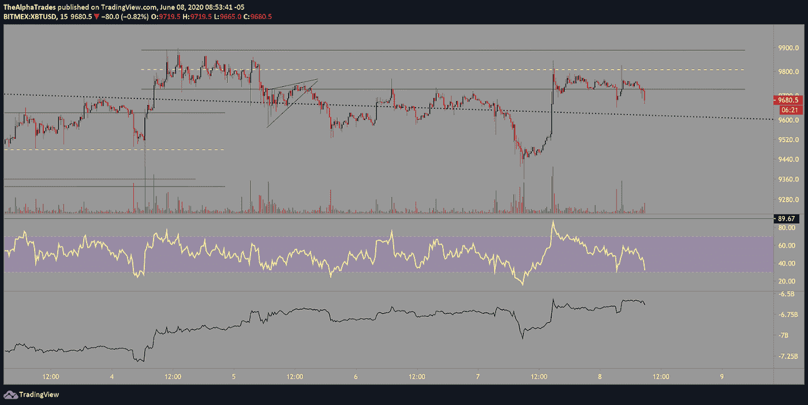
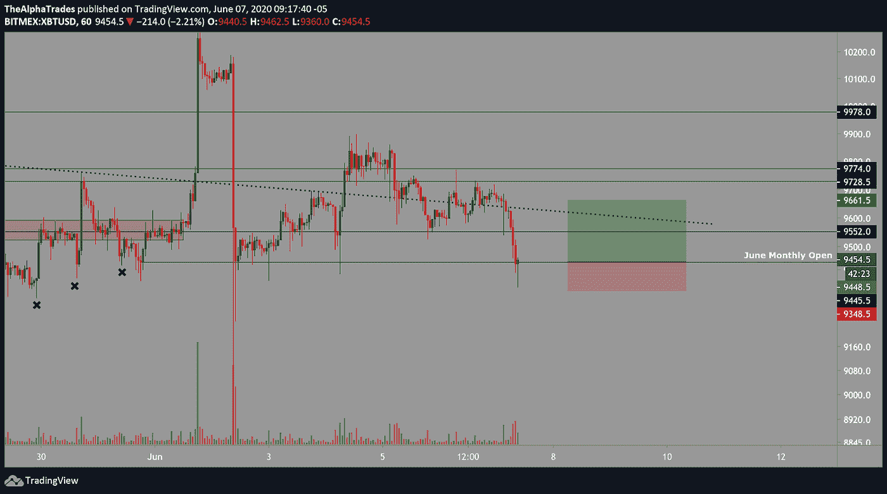

# 比特币还在区间，但谁占上风？|牛对熊！

> 原文：<https://medium.datadriveninvestor.com/bitcoin-is-still-ranging-but-who-has-the-upper-hand-bulls-vs-bears-61af3e807f8d?source=collection_archive---------17----------------------->

## 观看今天的比特币分析视频，了解我们在市场上做什么的更多信息。

Bitcoin, crypto, Image by mohamed Hassan from Pixabay

周一快乐，我们在这里为您提供早间比特币和市场分析。然而，这种东西不是免费制作的，所以请查看页面底部的信息，了解如何支持更多这样的内容。

我上周讨论过，比特币正在跌破交易通道，如下图所示，价格在一夜之间重新进入该交易区间，并在该区间底部形成的 SR 水平上挣扎。令人信服地保持区间将使多头恢复一些持久力，但在本文撰写之际，价格正在滚动。如果这开始向上突破，我会实时提醒我的高级会员。

我预计 BTC 将被 6 月份的月度开盘所吸引，大约在 9445 点左右。根据[成交量曲线固定区间指标](https://medium.com/@globalprimeforex/how-to-interpret-volume-profile-structures-in-the-forex-market-f28f0b5efd62)，最突出的高成交量节点大致为 9525。打破这一水平将淘汰大部分潜在做多的玩家，并且将足够接近 6 月份的月度开盘，以便在价格上汇合崩溃。

周线时间框架揭示了一个长期趋势，低高点已经确定。

Bitcoin fails to hold the channel on lower time frames; Source: Alpha Trades, LLC

Bitcoin gravitates toward the June monthly open; Source: Alpha Trades, LLC

Bitcoin weekly trendline points down; Source: Alpha Trades, LLC

由底部指标和图表上的黑线衡量的 OBV(平衡交易量)正在滚动，而 CME 指标显示，与散户交易者相比，对冲基金作为一个群体仍倾向于做空。此外，散列率投降指标显示，挖掘比特币变得越来越困难，这是对我们之前文章的一个修正，我们在文章中得出的结论是，挖掘比特币会更容易。此后，我们在小组中更深入地研究了这一现象，并基于对散列率的新理解改变了我们的观点。

## **我目前处于 BTC 摇摆空头仓位，平均进场 9710。**

Bitcoin OBV volume and hash rates; Source: Alpha Trades, LLC

# 优势方的红利交易(回顾):

我们偶尔为我们的优势社区发布“非官方”交易，在那里我们披露我们不会进行交易，但我们会向任何希望采取行动的人提供想法。这些都不是财务建议，这些交易设置仅用于教育目的。从本文前面发布的最新图表中可以看出，这个交易想法的所有目标都实现了。

Trade idea for Bitcoin in hindsight; Source: Alpha Trades, LLC

# 优势会员收听了昨天的高级炉边聊天:

**周日，前花旗集团对冲基金经理奥斯汀·阿什拉夫(Austin Ashraf)加入我们，讨论他对本周及未来几周市场的看法。我们已经决定将这些对话转移到 premium，我们本月将对这些服务进行大幅折扣。[订阅 Discord 服务器](https://bit.ly/2KJ1oor)了解高级会员第一个月的 50%折扣(优惠截止到 6 月 15 日)。在下面的视频中了解更多信息。**

The Bull vs Bear Case For Bitcoin; Source: Alpha Trades, LLC

不要错过，因为我们正在考虑重新管理我们迄今为止免费提供的大部分内容，以专注于为我们的优势群体提供更高质量的内容、新闻和数据。

# 放弃

Alpha Trades，LLC 提供的信息不用于制定任何财务决策，也不是购买、持有和/或销售特定产品、数字资产或 ICO 的请求或建议。

访问我们的完整服务条款:【https://bit.ly/3faVeeV 