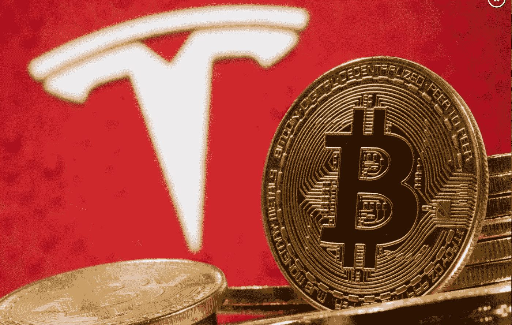
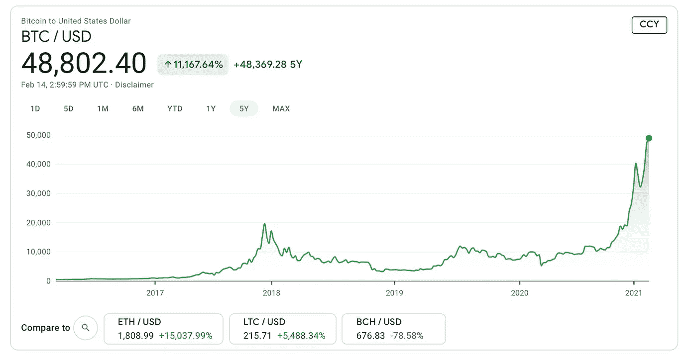
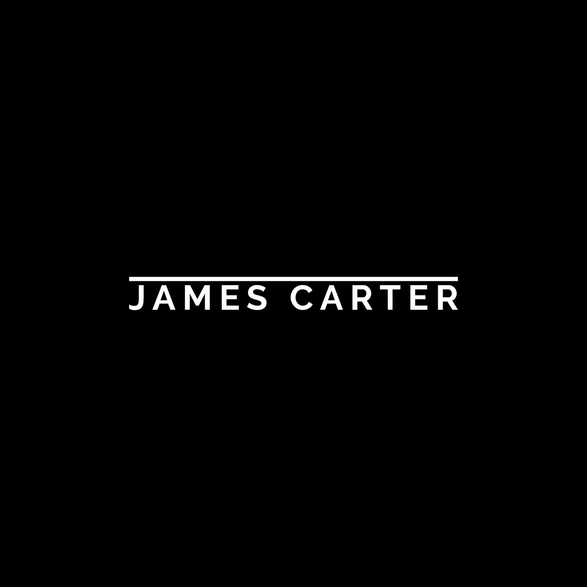

# 比特币正在接管

> 原文：<https://medium.datadriveninvestor.com/bitcoin-is-taking-over-12f569c82af9?source=collection_archive---------24----------------------->

## 我很高兴我赶上了这股潮流！

# 比特币革命？

随着越来越多的公司和组织将比特币加入他们的资产负债表，我们正处于一场新的比特币革命中。在过去的 12 个月里，我们已经在 MicroStrategy、Square 和现在的特斯拉身上看到了这一点。自从购买总额超过 10 亿美元的比特币以来，MicroStrategy 的首席执行官迈克尔·塞勒(Michael Saylor)一直对比特币直言不讳。我的理解是，MicroStrategy 现在几乎所有的现金都是比特币。相比之下，Square 只在比特币上投资了 5000 万美元，这只是其现金资产负债表总额的一小部分。就在上周，我们发现埃隆·马斯克在特斯拉投资了 15 亿美元的比特币。尽管这些金额各不相同，但新趋势非常明显，可以合理地假设其他公司将在未来 12 个月内效仿。我预测，在未来 12 个月内，会有更多的公司购买比特币。

记得多年前和老同事关于比特币和以太坊的对话。我在技术部门工作，周围都是超级聪明的软件工程师，他们了解最新的趋势。我有一个朋友在比特币不到 10 美元的时候使用它。我的一个老副总裁有一个大型以太坊采矿项目，所以我很幸运能听到他们所有人的故事和见解。在 4 年多的时间里，我远离 crypto，因为它对我来说“风险太大”。我记得 2017/2018 年的巨大上涨和暴跌，对我来说似乎不值得。尤其是当我在科技股和交易所交易基金上表现良好时，我认为没有必要偏离我的科技和软件投资计划。很少看到热门科技股在短时间内下跌 70-80 %,所以我对科技和软件公司感到安全得多。

[在 Twitter 上关注我](https://twitter.com/james_carter89)

# 环境在变化

如果你听一些来自 MicroStrategy 的 Michael Saylor 的视频，他谈到了美元是如何贬值的。坐拥现金的公司现在每年都在赔钱，因为美国政府一直在印这么多钱。现在有了 COVID 和巨额刺激法案，这种情况正在更大程度上发生，因为美国政府正在印刷数万亿美元。将资产转移到比特币开始变得更有意义，埃隆·马斯克和其他人似乎也同意这一点。虽然，我认为把 100%的现金放在比特币上是不明智的，但我认为大多数人和公司都能找到一个适合自己的快乐媒介。

# 2%加密(并且还在增长)

现在，我的投资组合中大约有 2%是加密，我有比特币和以太坊。我在 Dogecoin 也有一个小小的职位，只是为了好玩。对我来说，转移资金会产生税务影响，所以我不会很快转移资金。我确实预计，未来 12 个月，我在比特币和以太坊的头寸将增加到我投资组合的 3-5%。我定期买入更多的比特币和以太币，因为我卖出了一些无论如何都会到期的看涨期权。

7 个月前，我开始在比特币和以太坊建仓，开始行动。看到 MicroStrategy 用比特币转移大量资金非常有趣，因为几年前我在那里申请了一份工作。他们的总部就在 DC 郊外，所以我对这家公司很熟悉，也认识在那里工作的人。我建立了一个小的比特币和以太币头寸，我认为这对其他人来说最有意义。当你开始一个新的头寸时，从小的开始是可以的，因为你可以在以后买更多！无论是加密、股票还是交易所交易基金，都没有必要急于建立大量头寸。从你感觉舒服的量开始，然后从这个量开始。准备好了随时可以多买！

> “在一个扩张的货币环境中，你想要稀缺的资产……世界上最稀缺的资产是比特币。这是数字黄金。”——迈克尔·塞勒，微软首席执行官

# 阅读材料

如果你是比特币的新手，亚马逊上有几本评价很高的书，你可能会想看看。我现在正在读《比特币标准》和《比特币亿万富翁》。你也可以阅读原创者中本聪的[比特币白皮书](https://bitcoin.org/bitcoin.pdf)。请注意网上有比特币群和骗局。总是自己做研究，从多种渠道获取信息。

**SCALE 89** 是一份关于高成长股的时事通讯。[在这里报名吧！](https://www.scale89.com/)

# 比特币基地专业

在做了调查并与该领域的几位专家交谈后，我决定选择比特币基地和比特币基地专业版。首先，你需要创建比特币基地帐户，然后你可以升级到专业版，他们都是免费注册的。专业版收费较低，所以这是一个显而易见的。你可以去他们的网站了解他们的产品。我个人觉得比特币基地的产品非常容易使用，他们提供了多种类型的硬币。比特币基地也有关于比特币和加密的教育视频，这些对新用户非常有帮助。

# 关于比特币和加密的预测

*   更多的公司、组织和政府将开始投资比特币。传言甲骨文现在正在考虑比特币。
*   城市和地方政府也将启动比特币头寸。我读到过迈阿密正在进军比特币的消息。
*   大型银行公司或对冲基金将增加比特币的风险敞口。有些人已经这样做了。
*   在未来的 9 个月里，我预测比特币将达到每枚 10 万美元。
*   在接下来的 9 个月里，我预测以太币将达到每枚 4000 美元。
*   由于流行的病毒式营销和每枚硬币的低成本，新用户将涌向 Dogecoin 这样的替代硬币。由于每枚硬币的成本很高，一些新用户认为比特币“太贵了”。新用户和不知情的人会被像 Dogecoin 这样的硬币吸引。据我所知，Dogecoin 没有真正的用例，被认为是一个迷因/笑话硬币。

# 加密位置大小？

当你在一只股票、ETF 或 crypto 上开始一个新的头寸时，大多数人都是从小的开始。许多专家认为，你应该在总投资组合规模的 1-3%中建立新的头寸。从小处着手是正常的，即使它只占你投资组合的 0.1%。当你对股票、交易所交易基金或加密资产感到满意时，你可以随时添加更多。这里真的没有正确的答案，只是你觉得舒服的。在我的情况下，我开始时的比特币头寸不到我投资组合的 0.1%，我在过去 7 个月里增加了头寸。它现在约占我投资组合的 2%。许多人在开始新的头寸时会使用美元成本平均法(DCA ),这对我来说最有意义。你需要弄清楚什么最适合你和你的财务状况。

> 比特币会一直存在下去。任何试图将加密货币专利的功劳据为己有的人都会遭到黑客攻击。我不想成为黑客狂怒的受害者。—亚当·德雷珀

# 比特币价格图

## SCALE 89 是一份关于高增长股票的时事通讯:

[立即订阅](https://www.scale89.com/subscribe?utm_medium=web&utm_source=subscribe-widget&utm_content=32341548)

## 披露:不是财务建议/不是投资建议

*詹姆斯·卡特，SCALE 89 &(作者)不提供财务、投资、法律或税务建议。我的任何内容都不能被解释为建议。作者并不是建议你买卖证券或资产。这篇时事通讯、文章和我的推文仅用于信息和教育目的。通过阅读我的内容，你承认这不是建议。请注意，我的立场可以随时改变。*

*我目前拥有比特币、以太坊和 Dogecoin。我在加密领域的头寸大约占我总投资组合的 2%,这可能会随时发生变化。我在 Dogecoin 的地位很小。*

詹姆斯·卡特在推特上

