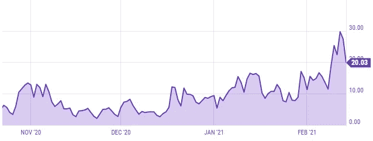

# 比特币不是钱

> 原文：<https://medium.datadriveninvestor.com/bitcoin-isnt-money-fe5f7a3536bb?source=collection_archive---------3----------------------->

## 加密货币和经济学

尽管散户投资者相信比特币的故事，但重要的是要记住，它是一种投机资产，应该被视为投机资产

Photo by [Bermix Studio](https://unsplash.com/@bermixstudio?utm_source=medium&utm_medium=referral) on [Unsplash](https://unsplash.com?utm_source=medium&utm_medium=referral)

一个比特币的价格回到了 40.000 美元以上。

热衷者长期以来一直梦想比特币取代政府和央行支持的货币。最近的价格变动给那些相信比特币有一天将为当前货币体系提供有效替代方案的人注入了新的希望。

尽管价格呈上升趋势，但这仍然只是一个白日梦。

在圣诞节期间令人难以置信地创下历史新高后，其中最重要的加密货币都在 1 月中旬出现了预期的价格暂时回落。

> 比特币缺乏传统法定货币的几个有用属性

在散户投资者的推动下，加密货币作为一种资产类别一直处于蛮荒的西部。但基金和金融科技公司如 Square(甚至汽车制造商特斯拉)在过去六个月也越来越多地购买比特币。

目前的结论似乎很明确:比特币作为一种资产将继续存在。不管怎样。但投资者应该如何看待比特币？

显而易见，比特币不是钱。

它缺乏传统法定货币的几个有用属性，使用比特币进行交易的相关成本太高。

这并不意味着比特币对投资者没有价值。但比特币的价值源于其他因素，而非其作为交易媒介的实用性。

下文将为那些陷入“比特币取代法定货币”乌托邦的人注入急需的现实。

## 金钱的三个特征

经济学家通常用三个特征来定义货币。

*   第一，交换媒介。
*   第二，记账单位。
*   第三，储存流动性

交换媒介意味着其他人愿意用金钱来换取商品或服务。

因此，货币的特点是人们接受它来交换其他东西。为了有效地成为货币，比特币应该被广泛接受为一种支付手段。它不是。

更广泛采用比特币作为交易媒介的主要障碍之一是交易成本。

> [交易成本]实际上排除了使用比特币进行微交易的可能性

比特币设计出来的时候，交易成本比今天高。特别是涉及货币兑换的跨境交易。

在过去的十年中，信用卡普及率的提高以及各种移动和数字支付解决方案的引入极大地降低了交易成本。

同样，用比特币进行交易的成本既处于长期上升趋势，已经处于较高水平，又高度可变。所有三个不吸引人的特征。

当网络拥塞时，成本会上升。在 2017 年前后，用比特币进行交易的成本约为 60 美元。

今天，情况没那么糟了。但是如下图所示，10 到 20 美元的交易成本仍然很高。它有效地排除了使用比特币进行微交易的可能性。

BTC average transaction cost in US Dollar, 6 months. Source: ycharts

除了货币成本之外，用比特币进行交易的耗电量估计是传统银行转账的 1.200 倍。在环境成本也被认为很重要的时代，这是比特币作为支付手段的另一个问题。

> 价格稳定是货币三种用途的重要属性

任何货币的另一个理想属性是其价值的稳定性。没有一种货币是完全固定的，但一种运行良好的货币的价值应该是稳定的，价值路径应该尽可能确定。

价格稳定是货币三种用途的重要属性。如果价值剧烈波动，人们就不太倾向于采用货币作为交换媒介。

 [## 振作起来，通货膨胀就要来了

### 美国通胀预期正在上升。财政和货币政策意味着通胀将进一步加快步伐

medium.com](https://medium.com/datadriveninvestor/brace-yourself-inflation-is-coming-2c27d170705c) 

这是因为交易中货币的接收者不确定他或她可以用收到的货币兑换的商品和服务的数量(和质量)。

解决方案(如果人们被迫使用人民币)将是通过在当前价格上收取溢价来对冲下跌。如果每个人都这样做，价值将继续减少(通货膨胀循环)。

类似地，比特币价值的不稳定性使其不适合作为记账单位(想象一下以比特币计价的抵押贷款)和流动性储存手段。

后者需要一个简单的解释。

家庭和公司(理想情况下)都持有流动性储备。这是为了应付不可预见的开支，或者确保消费/支出和投资不受收入波动的影响。

这些流动性储备的稳定价值至关重要。近期价值的不确定性意味着需要更大规模的储备。

这三个因素是货币需求的唯一原因。钱既不付利息也不分红。

在这方面，比特币和货币有一个共同点。如下所述，它们的价值取决于经济中的代理人如何看待它。

## 比特币和货币的相似之处

比特币不具备货币的资格，并不意味着两者没有相似之处。

毕竟，比特币是为了模仿货币的功能而设计的。

特别是比特币的一个方面非常类似于货币的一个关键机制。如何控制货币供应量？

> 如果信任消失，法定货币或加密货币的价值将会暴跌

比特币和普通法定货币的共同点是，它们没有任何其他资产的支持。两者都没有任何内在价值。

因此，赋予他们价值的是其他人赋予他们类似价值的期望。所谓的网络效应。

根据法律，经济代理人必须接受国家法定货币，但最终，法定货币是建立在信任的基础上的，就像比特币一样。

在这两种情况下，如果信任消失，法定货币或加密货币的价值就会暴跌。

在现代历史上，对货币体系缺乏信任曾多次导致一种由法律强制执行、央行支持的货币解体。显著的例子是委内瑞拉和津巴布韦。

对货币制度的信任不会自己产生。对人民币作为支付手段的执法不足以确保一个稳定的货币体系。

世界各地的央行都采用了不同的策略来确保对国家资产的信任。一些国家，主要是较小的经济体，已经将其汇率与更大的货币挂钩。

在承诺这样做的过程中，这些国家的人民，如果他们相信这一承诺，就会得到保证，他们总是能够以给定的汇率将他们持有的货币兑换成外币。

这排除了持续贬值的可能性，而持续贬值是 20 世纪大部分时间里广泛使用的货币工具。

美国美联储银行(Fed)和欧洲央行(ECB)等大型央行采用基于规则的政策传导。他们承诺一个通胀目标——比如在一个较长的时间范围内，PCE 的年平均通胀率为 2%。

比特币内部执行货币政策的方式类似于美联储和欧洲央行。一个算法决定了比特币的供应量。

这样，比特币的数量遵循一个确定的过程。人们同样可以将美联储和欧洲央行的通胀目标视为(不太明确的)算法，旨在让货币政策尽可能具有确定性。

当通胀前景发生变化时，央行当然有更大的干预空间。但是获得公众信任的机制也是如此。

## 比特币未来可能成为货币吗？

这个问题可能比上面的讨论有趣得多。答案并不简单。

理论上，不能排除比特币作为支付手段、记账单位和流动性储存手段的广泛应用。

与几年前相比，如今接受比特币的公司越来越多，而且这一数字可能会加速增长。

与此同时，企业可以自由地用比特币显示价格，甚至可以将价格与实时美元汇率挂钩(你可以辩称，那时美元仍将是记账单位)。

人们还可以在信用卡或电子钱包提供商那里拥有比特币余额，并直接用比特币支付。

因此，问题归结为可能性。而且乍一看，好像不太现实。

> 比特币网络每秒可以处理大约 10 笔交易。这与常规的现代交易网络形成鲜明对比。

定价成本很高。这反映在大多数公司没有不断调整价格。加油站一天会改变几次燃料的价格，但是你的健身套餐的价格可能一年才改变一次或者更少。因此，经济学家也承认短期内存在某种程度的价格粘性。

如果比特币价格的波动持续下去，比特币的价格设定将会令企业头疼。然而，波动性呈下降趋势。

上述交易成本问题是最令人头疼的问题之一，但另一个问题是网络可以处理的交易量。

目前，比特币网络每秒可以处理大约 10 笔交易。这与常规的现代交易网络形成鲜明对比。例如，VISA 每秒可以处理超过 2000 笔交易，而且他们的基础设施可以更好地扩展。

虽然万事达卡、Square(已经存在)和 VISA 等公司正在努力通过其服务将比特币作为一种支付选择，但不确定客户是否会采用它。

例如，多年来，Shopify 一直为客户提供接受 300 种不同加密货币支付的能力，其中包括比特币。但是几乎没有商家使用这个选项。

如果比特币要成为挑战美元在美国社会中地位的合适候选者，再加上监管障碍，比特币作为货币显然是一个白日梦。

虽然比特币可能永远不会适合作为货币，但它仍然作为一种金融资产在社会中占有一席之地。

## 作为投资的比特币

目前持有比特币的可取性是基于其实用性，既不是现在也不是未来。

相反，它是对未来价格行为的预期。越来越多的机构和散户投资者正在搭乘炒作列车。

有限的供应、对价值的广泛认知和积极的情绪是比特币价格的当前顺风。

当零售商购买比特币或像[特斯拉这样的公司用这种加密货币加载他们的资产负债表时，这是基于投机。](https://medium.com/datadriveninvestor/elon-musks-bitcoin-binge-moves-tesla-toward-fraud-territory-9b70bceb1a3c)

因此，很少能找到替代菲亚特的产品。事实上， [NYDIG](https://nydig.com/) 最近进行的一项调查发现，80%的美国比特币持有者更愿意将比特币存入他们的银行账户。

他们最好也给它们上保险(这意味着由中央银行担保)。很难想象早期采用比特币的梦想会让人们认为这种货币会以某种方式成为当前货币体系的对手。

比特币热潮是否会持续，与比特币是不是货币资产无关。它本身也值得讨论。

但是，无论价格有多高，比特币都不是货币，而且——可能但不一定——永远不会是。

 [## 埃隆·马斯克的比特币狂潮将特斯拉推向欺诈领域

### 从欺骗投资者到顾客和气候，马斯克试图愚弄所有人

medium.com](https://medium.com/datadriveninvestor/elon-musks-bitcoin-binge-moves-tesla-toward-fraud-territory-9b70bceb1a3c)  [## 3 个基于创始人知识的真正颠覆性业务

### 特定行业的知识和技能、经验和多年积累的人脉是无价的，如果你想…

medium.com](https://medium.com/swlh/3-truly-disruptive-businesses-built-on-founder-knowledge-d71ab2482d13)