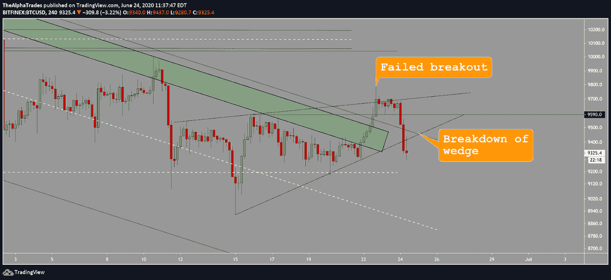
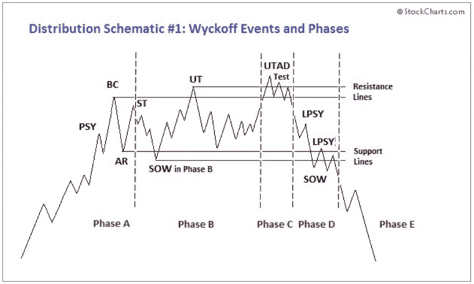
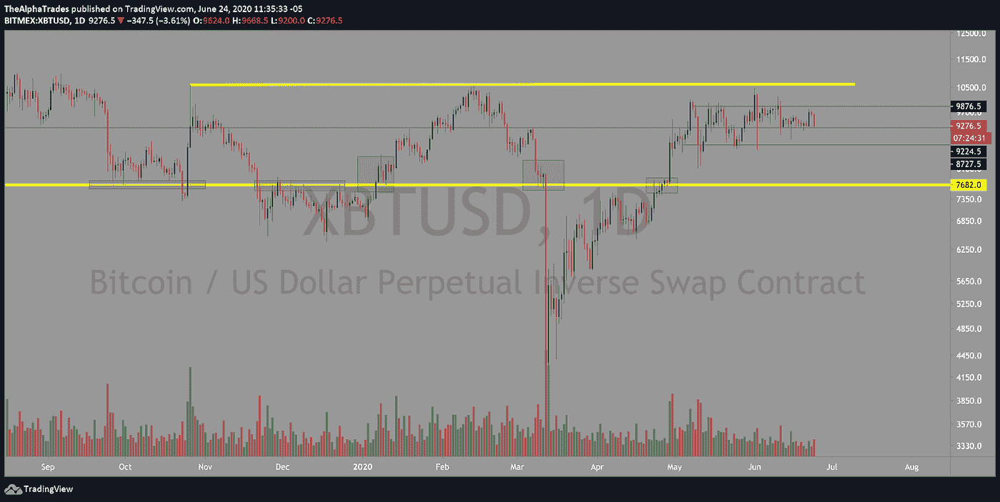
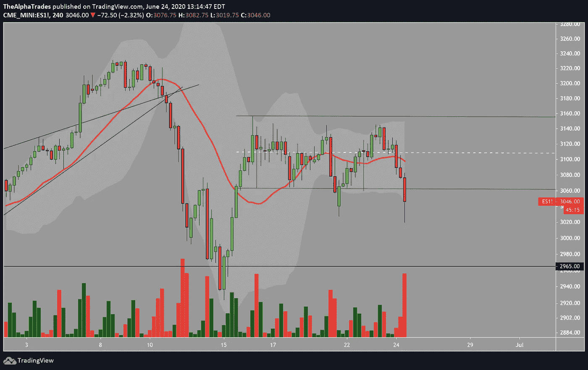

# 比特币市场概述——多头会守住 9250 美元吗？

> 原文：<https://medium.datadriveninvestor.com/bitcoin-market-overview-will-the-bulls-hold-9250-248eae72d6c0?source=collection_archive---------13----------------------->

## 随着 COVID 第二波对整体市场的压力，比特币的价格水平越来越低。

周三快乐，让我们快速分析一下比特币和密码。一夜之间，BTC 抛售了股票，这是我所期待的。昨天我说过，BTC 未能按照下面的图表突破楔形，可能会开启楔形底部下行的价格行动，或者可能从那里崩溃*(昨天视频的时间戳，我在那里讨论了上升楔形可能崩溃的原因:*[*0:58*](https://youtu.be/SIJp6mNO9EY?t=57)*)*。

Bitcoin failed breakout of rising wedge followed by a breakdown; Source: Alpha Trades

# 比特币发行正在发挥作用

将之前的图表与下面来自 stockcharts.com 的进行比较，你会注意到图表确实开始对齐。这是真正分布的迹象包括在每次向上摆动的顶部进入的成交量，以及随着成交量的扩大而出现的更明显的蜡烛线。价格上涨时，需求似乎在逐渐减少。

Wyckoff Distribution; Source: StockCharts.com

比特币目前已经在一个半月的区间内波动，这意味着波动性像弹簧一样盘绕起来，其最终方向应该是强劲和暴力的。我对下行的最低目标是 6900 左右，更深的目标是 5900 和 4400。更难达到的目标是 2400 点和 1500 点，但现在还不是讨论这些水平的时候。如果你想知道 BTC 将如何达到这些水平，以及为什么我认为他们有很大的机会达到这些水平，请查看这篇文章或观看下面的视频。

只要 BTC 保持在下图的范围之内和之上(放大，否则很难看到水平)，我就会在支撑和阻力之间交易。

BTC 相对强弱指标已经下降，从四小时的时间框架来看，现在持平于超卖区域之上。总成交量(OBV)再次告诉我们跟随资金——资金流入表明市场情绪目前是“我不想碰这个”

Bitcoin range bound until it isn’t; Source: Alpha Trades

# 订单书感受到了压力([时间戳:9:39](https://youtu.be/J7w6N25Vy-o)

当你看到买家带着大量百万美元的订单进场，价格实际上突破了那堵墙，这可能是一个熊市指标，因为它意味着供应强劲。如果你习惯于使用 [TradingLite](https://tradinglite.com/) 进行深入的交易量分析，订单中价格范围之间的大块空白区域意味着该领域没有需求。一旦一项资产打破了阻止它进入空白空间的一堵墙，就像在原始图表上，一项资产在经历了之前的大幅波动后可能缺乏整合，它很有可能会穿过空白空间。如果在没有视觉表现的情况下阅读起来有点混乱，请观看今天的视频或给我们留下评论。有人会在附近为你解释订单。

加剧上述剧烈波动的因素是，一旦买入或卖出的墙被咬断，无法再支撑市场中的参与者(许多人拥有高杠杆头寸)被清算或平仓，以避免更长时间的流血。这种心理产生了级联效应，从而导致价格波动更加剧烈。

# 标准普尔 500 期货(ES1！)正在打破它的范围

我在今天的早间视频中说过，如果标准普尔 500 开始向下突破，我认为它会向 2960 点靠拢。我预测的向上突破 3200 点的目标似乎不太可能，因为指数已经跌破该范围。

关于德克萨斯州、佛罗里达州、南卡罗来纳州和亚利桑那州第二波新病例的冠状病毒新闻可能最终开始影响市场。我在得克萨斯州和佛罗里达州当医生的朋友说 [ICU 床位已经占了 85%](https://www.forbes.com/sites/nicholasreimann/2020/06/23/clearly-this-is-real-florida-governor-says-of-coronavirus-spread-but-claims-its-not-cause-for-concern/#4704d21eb419) 。

S&P500 broken channel; Source: Alpha Trades

# 和我们一起聊聊市场

*我们正在寻找客人，所以如果你想顺便聊聊市场和经济，我们邀请你参加* [*加入不和*](https://bit.ly/AlphaTradesDiscord) *并给任何一位管理员发送消息。如果我们有一个爆炸在一起，我们也会在我们的分销渠道的特点你。*

# 想免费试用 Advantage 两天吗？

[订阅 Discord 服务器](https://bit.ly/2KJ1oor)学习技术分析以及如何投资获利。询问 2 天的高级会员试用！

# 放弃

Alpha Trades，LLC 提供的信息不用于制定任何财务决策，也不是购买、持有和/或销售特定产品、数字资产或 ICO 的请求或建议。

访问我们的完整服务条款:[https://bit.ly/3faVeeV](https://bit.ly/3faVeeV)