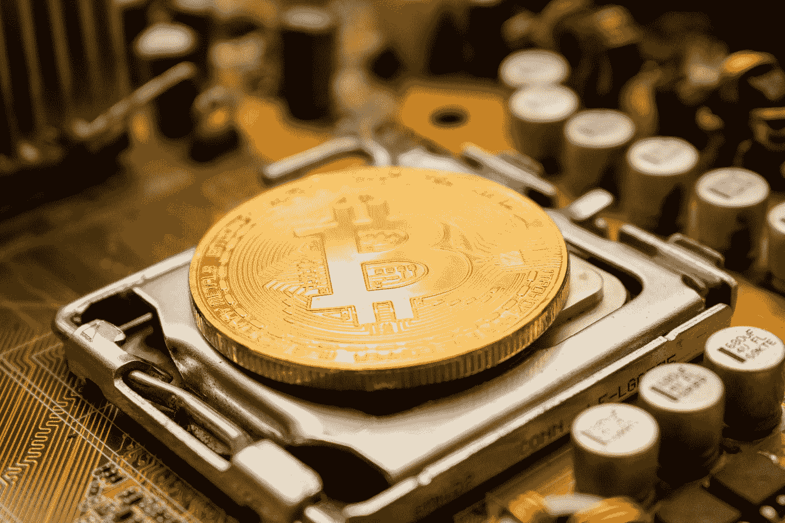

# 比特币现在价值超过 1 万亿美元！

> 原文：<https://medium.datadriveninvestor.com/bitcoin-now-worths-over-1-trillion-11f15377d783?source=collection_archive---------9----------------------->

## 未来的货币正式成为主流。

Photo by [Dmitry Demidko](https://unsplash.com/@wildbook?utm_source=medium&utm_medium=referral) on [Unsplash](https://unsplash.com?utm_source=medium&utm_medium=referral)

比特币的价格经历了许多重要的里程碑。

*   [比特币:一个点对点的电子现金系统](https://bitcoin.org/en/bitcoin-paper)于 2008 年由中本聪**出版**。那时候它没有任何价值，只是纸上谈兵。
*   比特币的价格[在 2010 年首次达到 1 美元](https://www.investopedia.com/articles/forex/121815/bitcoins-price-history.asp)。
*   在接下来的几年里，这一价格达到了更重要的里程碑，并在 2013 年首次达到 1000 美元[和 2017 年达到 10000 美元](https://coinmarketcap.com/currencies/bitcoin/)[和](https://coinmarketcap.com/currencies/bitcoin/)。

今天，一枚比特币的交易价格约为 54，000.00 美元。更重要的是，截至今天，其总市值超过 1 万亿美元。如果数字本身不能说明什么，让我给你一些参考框架。据估计，全世界的黄金总价值约为 10.6 万亿美元。因此，比特币距离取代黄金成为不受任何单一政府驱动的最有价值的价值储存手段只有 10 倍之遥。

你可以称之为泡沫或狂热。几行计算机代码价值 1 万亿美元，这对你来说可能没有意义。然而，即使在这样的价格下，比特币仍然能够在世界各地找到买家。

# 谁还在买比特币？

当比特币最初上线时，只有几个电脑极客在他们的电脑中挖掘比特币，并相互交易。从第一天起，这个网络就以自己的速度不断扩大，并引发了许多个人的兴趣。今天，有超过 [1 亿个比特币钱包](https://www.bitcoinmarketjournal.com/how-many-people-use-bitcoin/)在里面储存一些价值。

然而，不仅仅是个人认为比特币是一种存储和转移价值的有效方式。随着购买、持有和交易比特币的监管框架越来越具体，标准普尔 500 公司也在一个接一个地加入这场游戏。

2020 年 8 月，我写了一篇关于 MicroStrategy 如何购买价值 2.5 亿美元的比特币的文章。当时，他们每比特币支付约 11.65 万美元。今天，这项投资价值超过 10 亿美元。

 [## 为什么一家分析公司通过购买比特币来对冲风险

### 这家商业分析巨头通过价值 2.5 亿美元的比特币实现投资组合多元化，开创了一项新战略。

medium.com](https://medium.com/swlh/why-one-analytics-company-is-hedging-their-bets-by-buying-bitcoin-c9167ba98cba) 

MicroStrategy 没有止步于此，自首次购买以来投资了更多，并表示打算在未来购买更多，作为其国库储备计划的一部分。根据他们在 2021 年 2 月提交的最新文件，该公司拥有 72，000 枚比特币，按今天的价格计算，价值约 40 亿美元。

MicroStrategy 的首席执行官为其公司购买比特币，充当比特币的积极传播者，并教育其他公司。他向他们解释了为什么他们也应该拥有一些比特币，作为现金快速贬值的保险。在[附近，1400 家公司参加了他们最新的比特币峰会](https://news.bitcoin.com/bitcoin-for-corporations-michael-saylor-expects-an-avalanche-of-firms-to-own-bitcoin/)，以了解更多关于比特币的信息。

其中一家公司，Tesla Inc .，Michael Saylor 分享了他的剧本，实际上,[购买了价值 15 亿美元的比特币](https://www.sec.gov/Archives/edgar/data/1318605/000156459021004599/tsla-10k_20201231.htm)。更重要的是，他们已经宣布，他们计划在未来的特斯拉销售中接受比特币支付。

许多人可能会发现[埃隆·马斯克的加密货币推文](https://www.cityam.com/elon-musk-risking-the-wrath-of-us-authorities-with-bitcoin-tweets/)，如下图所示，高度操纵和幼稚，然而用特斯拉总现金的 10%购买比特币，实际上表明他对比特币有多认真。

除了 MicroStrategy 和 Tesla，[杰克·多西广场也在 2020 年 10 月购买了价值 5000 万美元的比特币](https://www.theblockcrypto.com/post/80175/jack-dorsey-square-purchases-50-million-worth-of-bitcoin)。越来越多的公司追随这一趋势，导致比特币价值不可阻挡的价格飙升。

另一个似乎对比特币价格产生积极影响的重大消息是，北美的第一只比特币交易所交易基金最近在加拿大获得批准，并开始交易，首日交易总额达 1 . 65 亿美元，交易地点在 T2。

# 下一步是什么？

越多的国家宣布大规模刺激计划和无限制印钞，越多的个人和公司试图逃离美元、欧元、英镑等法定货币。这就是为什么我们也看到全球股票市场价格大幅上涨。将价值储存在不断贬值的现金中是不安全的，所以每个人都在寻找替代物。

根据[Block Crypto](https://www.theblockcrypto.com/linked/89323/sp-500-companies-will-hold-bitcoin-by-end-of-2021-says-majority-of-the-blocks-outlook-survey-respondents)的研究，五到九家标准普尔 500 公司预计将在 2021 年底前将比特币资产列入其资产负债表。

作为金融领域最大的颠覆性技术之一，比特币的价值和网络规模的增长速度让人们惊叹不已。就其本质而言，越多的参与者加入，网络就变得越强大，区块链就变得越安全。

很难知道还有多少公司将采用比特币作为其国库储备政策的一部分，并将其放在资产负债表中现金旁边，但有了所有这些好消息，每比特币 10 万美元不再是一个激进的价格目标。

# 谨记在心

回顾过去比特币的价格走势，这种加密货币可能会保持其波动性，并在巨大的区间内波动。尽管比特币长期以来一直在上涨，但也有大幅下跌的时候，跌幅一度高达%93。

*   从 2011 年 6 月到 2011 年 11 月，价格从 29 美元暴跌到 2 美元。
*   2013 年 4 月，从 259 美元涨到 68 美元
*   2013 年 12 月至 2015 年 1 月期间，从 1，147 美元增至 177 美元
*   在其 2017 年 12 月至 2018 年 11 月之间的最近一次重大崩盘中，从 19，891.00 美元跌至 3625 美元。

因此，最好是非常谨慎地对待这种不稳定的资产，并关注其长期目标和方向，而不是在每次小幅价格波动中追逐小收益。

# 主要要点

*   自 2009 年以来，比特币的价格从 0 美元飙升至 2021 年的 54.000 美元。
*   在经历了漫长而坎坷的道路后，今天，它的市值超过了 1 万亿美元。
*   随着这场运动的领导者，如 Microstrategy、Square 和特斯拉，更多的公司将它视为比现金更好的长期价值储存方式。
*   在达到 1 亿个储存价值的比特币钱包(主要由个人持有)后，它现在在公司的资产负债表上获得了一席之地。
*   随着购买、持有和交易比特币的更具体监管框架的发展，ETF 等更复杂的金融工具正在围绕这一数字资产建立。
*   尽管最新的发展显示了比特币的光明前景，但它仍然是一种高度波动和投机的资产，需要最大限度的谨慎。所以，在进入如此动荡的市场之前，一定要做好功课。

在外面注意安全！

[*订阅*](https://furkansaatcioglu.com/bitsandchips) *到我的简讯* [*位&位*](https://furkansaatcioglu.com/bitsandchips) *获取您邮箱里的未来文章！*

*免责声明:本文仅用于信息或教育目的，并非任何形式的个性化建议。使用这些信息需要您自担风险。*