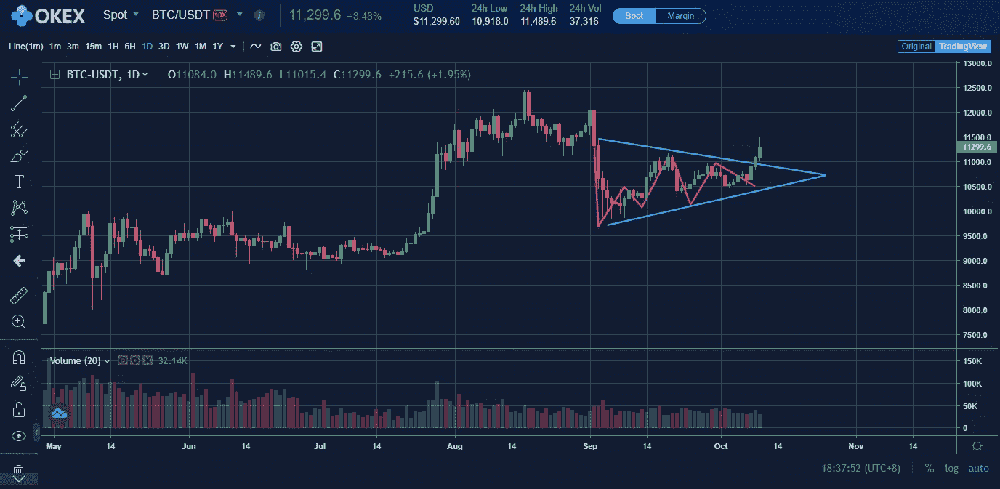

# 比特币价格分析:BTC 的价格是 12400 美元还是 8900 美元——会是什么？

> 原文：<https://medium.datadriveninvestor.com/bitcoin-price-analysis-btc-price-of-12-400-vs-8-900-what-will-it-be-7e1acf0a238d?source=collection_archive---------12----------------------->

今天，我们仔细看看图表中所有加密货币之父，以回答 BTC 是否即将大幅涨价的问题。当然，最重要的是，问题出现在哪个方向？

因此，如果我们敢再次预测未来几周的比特币走势，那将变得令人兴奋。玩得开心！

# 比特币价格交易呈对称三角形

几天前，在加密和交易新闻网站“比特币-Bude”的电报频道中，人们注意到比特币课程中的一个信息，该信息可能会导致比特币的价格小幅上涨。形成的是一个对称的三角形，在日线图上清晰可见。

[OKEx](https://www.okex.com/join/1/2428945)

一个不对称的三角形很容易被两条趋势线识别，这两条趋势线汇聚到一点。重要的是，两条趋势线至少被触及两次，并且该形态中的价格至少有 4 个转折点。此外，路线应均匀地穿过地层内部。通常，体积在地层开始时最高，并随着地层的形成而稳定下降。

正如我们所看到的，比特币课程和上面的形成成功地满足了所有这些要求。我们也可以清楚的看到，课程已经到了三角形的末端，脱离了。这使得早期突破很有可能，前提是地层没有崩溃。

 [## 稳定币会危及比特币在加密领域的地位吗？数据驱动的投资者

### Stablecoin 是一种加密货币，主要用于维持稳定的市场价值。它可以通过…

www.datadriveninvestor.com](https://www.datadriveninvestor.com/2020/06/08/can-a-stablecoin-jeopardize-the-position-of-bitcoin-in-the-crypto-space/) 

**BTC 可能接近 1600 美元的价位**

许多人错误地认为，火山形成前的路线方向是火山爆发后续方向的强有力的指示。换句话说，许多人错误地认为对称三角形是一种延续模式。侄女就是这种情况。其实有了比特币课程，你要等突破方向，再考虑建仓。否则，成功的前景或多或少取决于运气，而不是有意义的概率。

一旦突破方向被确定，三角形的高度被投射到突破点的突破方向，以获得最低价格目标。在向上突破的情况下，这导致价格目标在 12，400 美元左右，在向下突破的情况下，最低价格目标在 8，900 美元。后者将使比特币价格远低于 1 万美元的重要心理关口，并暗示加密市场将经历一段漫长的干旱期。

# 轻松投资比特币，没有任何复杂因素

尤其是加密货币领域的新人，非常重视高舒适度。一开始，设置比特币钱包和手动发送比特币会令人望而生畏。在这种情况下，这是一个好主意，开始与一个可靠的，规范的经纪人谁可以为你提供

*   获得 100 多种不同的加密货币。
*   就交易量而言，东京证交所(OKEx)排名第二，仅次于币安。
*   [OKEx](https://www.okex.com/join/1/2428945) 提供特殊的交易功能，比如保证金交易最高可达 10 倍，衍生品交易最高可达 100 倍。
*   该交易所已经经营了四年，历史悠久。
*   简单的界面使交易相对容易。
*   通过 PayPal 存款
*   将真实的比特币发送到你的钱包，可以使用广泛的交易工具，而不需要下载任何软件。

这些正是你用 [**OKEx**](https://www.okex.com/join/1/2428945) 得到的好处。试一试，让自己相信上述优点就行了。现在就开始投资吧！

我在每月一期的 [**简讯中分享了更多私密的想法，你可以在这里**](https://mailchi.mp/bf8f8e8ed697/keep-in-touch-with-lukas) 查看。请在评论中告诉我，并在各种社交媒体平台上加入我:

[**推特**](https://twitter.com/WiesfleckerL)●[**insta gram**](https://www.instagram.com/lukaswiesflecker/)●[**脸书**](https://www.facebook.com/lukaswiesfleckerr)●[**Snapchat**](https://www.snapchat.com/add/luggooo)**●[**LinkedIn**](https://www.linkedin.com/in/lukas-wiesflecker-1b11251a5/)**

**无论你做什么，都要带着爱和激情去做！**

## **访问专家视图— [订阅 DDI 英特尔](https://datadriveninvestor.com/ddi-intel)**