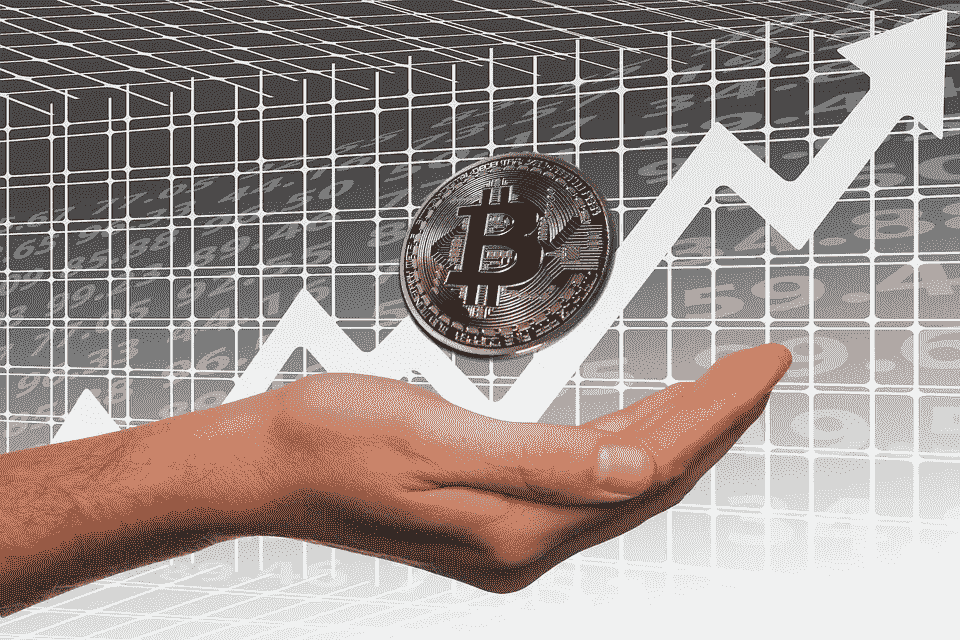
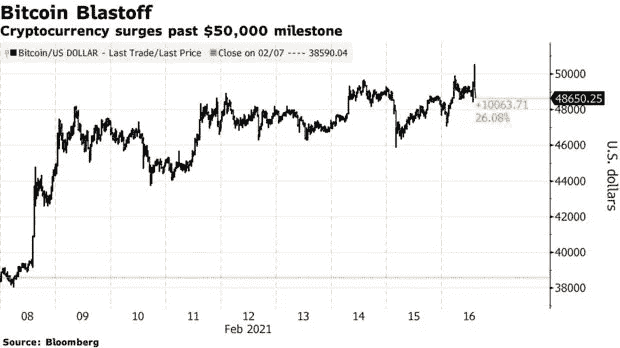

# 关于比特币暴涨你需要知道的 5 件事

> 原文：<https://medium.datadriveninvestor.com/bitcoin-price-hits-all-time-high-to-50-000-564d1e16507b?source=collection_archive---------38----------------------->

## 机构投资者的兴趣增加了人们对比特币的信心

Image by [Gerd Altmann](https://pixabay.com/users/geralt-9301/?utm_source=link-attribution&utm_medium=referral&utm_campaign=image&utm_content=2643188) from [Pixabay](https://pixabay.com/?utm_source=link-attribution&utm_medium=referral&utm_campaign=image&utm_content=2643188)

比特币的价格有史以来首次超过 5 万美元。在一个又一个里程碑之后，最大的加密货币继续吸引着全球投资者。

世界上最大的加密货币货币纽约时间早上 7.21 飙升至 50191 美元，一天上涨 4 美元，今年以来上涨约 73%。

受监管的比特币总市值跃升至 9400 亿美元。

另一个竞争对手加密货币 Etherum 今年的份额也高达 140%。

## 比特币的一年期[价格图](https://twitter.com/spectatorindex/status/1361656171803779072)将帮助你理解轨迹:

*   一年前:9500 美元
*   六个月前:11800 美元
*   三个月前:17000 美元
*   一个月前:37000 美元
*   现在:5 万美元

Source: [Bloomberg](https://assets.bwbx.io/images/users/iqjWHBFdfxIU/i65hK0F0sfpE/v2/pidjEfPlU1QWZop3vfGKsrX.ke8XuWirGYh1PKgEw44kE/620x-1.png)

## 1.仅用了六周时间就超越了最新的门槛

比特币获得了提振，因为特斯拉、万事达和贝宝等大公司显示出对加密的支持。

上周，[特斯拉投资了价值 15 亿美元的比特币](https://medium.com/swlh/100a18cfb848)，万事达卡表示[将敞开大门接受数字货币](https://www.cnbc.com/2021/02/10/mastercard-to-open-up-network-to-select-cryptocurrencies.html)，而 [PayPal](https://www.cnbc.com/quotes/PYPL) 也在努力推进加密。

一家贸易公司的战略主管布莱恩·梅尔维尔说，

> 50，000 美元的水平是“该空间中人们的情绪水平”。"

## 2.比特币快车已经离站

最大的密码贷方之一，伦敦 Nexo 公司的联合创始人 Antoni Trenchev 说，

” ***无论是马斯克、万事达，还是摩根士丹利，其中的情绪、音乐、气势都是无法忽视的，他还补充道，“比特币快车已经离站*** 。"

Image by [Gerd Altmann](https://pixabay.com/users/geralt-9301/?utm_source=link-attribution&utm_medium=referral&utm_campaign=image&utm_content=3029371) from [Pixabay](https://pixabay.com/?utm_source=link-attribution&utm_medium=referral&utm_campaign=image&utm_content=3029371)

## 3.目前的上涨是由机构投资者和科技亿万富翁点燃的

比特币专家表示，2017 年的泡沫是由一场零售赌博引导的，但目前的上涨是由机构投资者和科技亿万富翁点燃的。

最近，在一篇文章中，万事达卡选择了“稳定硬币”,它通常可以保护资产。

万事达卡加入了 Wirex 和 Bitpay 等公司。然而，在处理交易支付之前，需要将数字货币兑换成法定货币。

将币安作为交易平台的人对菲亚特交易所很熟悉。

## 4.在最近的突破之后，投资者应该准备好迎接一场疯狂的旅程。

安东尼·特伦切夫警告说，在最近的突破之后，投资者应该准备好迎接一场疯狂的旅程。他还说，

> “短期波动是本轮牛市的一大特征，投资者应做好相应准备”

## 5.把你的钱四处投资，这样你就分散了风险。

一些投资者认为比特币是历史上最大的泡沫，其他人鼓励购买它。

与任何投资一样，要小心，不要把所有的希望和金钱都放在一种加密货币或一家公司上。

***现在我们要看它还能涨多远，多快？***

***感谢您的阅读。放弃你对比特币的评论。***

# 放弃

本文仅用于信息和教育目的。它无意成为任何投资意见或建议。