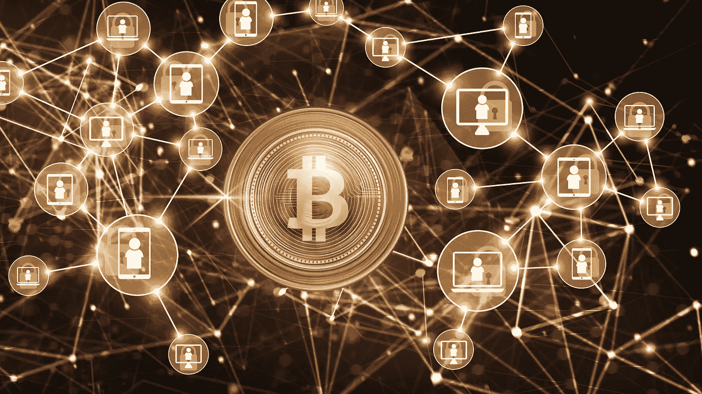

# 比特币——Quo Vadis？

> 原文：<https://medium.datadriveninvestor.com/bitcoin-quo-vadis-a011949988e8?source=collection_archive---------23----------------------->

## 加密货币

## 支付、投资的未来，还是新的黄金？

Canva Pro Image

加密货币比特币今天达到了新的高度，每枚超过 23，000 美元。

自 2010 年以来，它经历了令人难以置信的反弹。你对 1 比特币大约 10 年前的价格有什么猜测？

2010 年 12 月:比特币定价在 0.23 美元/枚左右。

[2010 年](https://en.bitcoin.it/wiki/Laszlo_Hanyecz)也是第一次用这种新的加密货币购买商品的一年，矿工拉兹洛·汉耶茨订购了两个比萨饼，并支付了 10，000 BTC。

这两个比萨饼的报价是 41 美元。想象一下，披萨店只是不小心把一万 BTC 放在钱包里，从来没碰过。

按今天的价值计算，这将是 235，000，000 美元，几乎足够退休了。价格涨幅惊人。想象一下未来 10 年类似的价格上涨…

我从 2010 年开始就有了自己与比特币的个人历史。在 90 年代，我已经对互联网的一切产生了浓厚的兴趣——尤其是它在商业领域的应用。

数字现金的概念在 2008 年并不新鲜——那一年比特币被引入世界。

早在 80 年代末 90 年代初，人们就提出了数字现金的概念。信用卡的缺点是每笔交易都可以被银行追踪到；所以，匿名是不存在的。

对于一些人来说，这种匿名性就是实物现金的优势。

我从来没有看到解决匿名问题有多大价值，因为互联网的基本理念是展示一切。至少对我来说，信用卡在互联网上的支付工作做得很好。

在 90 年代研究数字商业模式时，我开始忽略数字现金的想法。

虚拟货币的概念对我来说也不陌生。互联网兴起的时候，我喜欢玩电脑游戏。不管出于什么原因，一些创建网络游戏的公司有了引入代币的想法。

代币是游戏中的货币项目，可以通过信用卡交易用现金购买。在游戏中，这些代币用于购买游戏中的物品，例如多人在线角色扮演游戏中化身的衣服。

2010 年的某个时候，当我在收件箱里收到一封邮件，说我可以购买代币，并在使用我的计算机挖掘这些代币时赚取更多代币时，我以为这是另一个角色扮演游戏的广告。

经过快速搜索找到属于这封邮件的游戏，结果是否定的。所以我下定决心，开采或购买我不能使用的代币并花上几欧元是非常可笑的。

2013 年，我意识到自己错了，并对加密货币有了更好的理解。从那时起，我就开始关注 BTC 的发展，并不看好它的未来——正如沃伦·巴菲特所说

> 按的价值计算:零。我没有任何加密货币，将来也不会有

每年，我都有同样的想法。我预计 BTC 会崩溃并消失，直到 2017 年比特币飙升至每枚约 2 万美元，并在不久后崩溃。

现在我们有了下一个牛市。在写这篇文章的时候，比特币冲过了 23000 美元大关。就价格预测而言，我已经读过了从下降到零到 2021 年上升到超过 30 万美元，以及在未来 10-30 年内可能超过 100 万美元的任何东西。

现在会发生什么？比特币会在世界经济中扮演怎样的角色？

这里有 4 个场景:

Canva Pro Image

# 比特币作为政府的储备货币

最近，摩根士丹利(Morgan Stanley)的全球策略师鲁奇尔·夏尔马(Ruchir Sharma)认为，比特币可能会取代美元成为世界储备货币。

根据 Investopedia 的说法，储备货币是政府或央行等货币当局大量持有的货币，以降低货币兑换风险。

许多商品，如石油或黄金，都是以美元定价的，美元是 2020 年的世界储备货币。

但是持有外国货币的想法并不新鲜；而且，它和人们用商品交换货币一样古老。维基百科声明:

> 过去的国际货币包括公元前五世纪创造的希腊[德拉克马](https://en.wikipedia.org/wiki/Drachma)，罗马[德纳里](https://en.wikipedia.org/wiki/Denarius)，中世纪的拜占庭 [solidus](https://en.wikipedia.org/wiki/Solidus_(coin)) 和阿拉伯[第纳尔](https://en.wikipedia.org/wiki/Gold_Dinar)，文艺复兴时期的威尼斯[杜卡托](https://en.wikipedia.org/wiki/Ducato_(coin))和佛罗伦萨[弗罗林](https://en.wikipedia.org/wiki/Florin)，17 世纪的荷兰盾[和法国法郎](https://en.wikipedia.org/wiki/Dutch_guilder)[。](https://en.wikipedia.org/wiki/French_franc)

18 世纪，英国在世界经济中的主导地位使英镑成为头号储备货币。帝国用黄金支持它——这就是所谓的金本位制。

第二次世界大战后，自 1944 年起，金融体系由布雷顿森林协议管理。长话短说；结果，美元成为世界储备货币，取代了英镑。

摩根士丹利的全球策略师指出，储备货币的平均寿命为 94 年，在他看来，美元的统治地位现在已经超过 100 年了。

按照这一理论，并接受 1944 年作为美元的起点，它还有 18 年的时间。很可能一种货币不会在一夜之间兑换另一种货币。那么，美元的继任者会是什么呢？

目前，世界上还有另外两种主要货币:

*   欧洲欧元和
*   中国人的人民币

这两种货币似乎都没有资格成为头号货币——欧洲必须首先解决自己的政治问题。中国还没有达到美国的经济水平。

外国当局购买大量货币的好处是能够印出无限量的货币，目前这种情况正在大规模发生。外国政府可能会对美国会买单失去信心，并开始寻找替代方案。

解决方案可能是加密货币。当政府默默地同意 BTC 作为新的标准时，他们将开始大量购买它，并用 BTC 而不是美元进行商品交易。

第三世界国家经常面临恶性通货膨胀的问题，这意味着基本上所有发行的货币在一夜之间变得一文不值。

比特币的供应是固定的，只要许多人相信 BTC 的价值，价格就不太可能降到零。

在摩根士丹利投资管理公司的首席全球策略师兼新兴市场主管鲁奇尔·夏尔马看来，他的理论很吸引我。

我们将会看到这种情况是否会发生。

Canva Pro Image

# 比特币成为数字资产。

比特币是所有加密货币的始祖，现已超过 10 年历史，广为人知。

一开始，它是不法分子、反叛者和所有已经对政府失去信任的人的选择。

随着比特币的价格从几乎为零上升到每枚数百美元，并在 2017 年达到近 2 万美元的最高价格，新的百万富翁出现了。

比特币百万富翁。

媒体对此进行了大量报道，并在 2017 年大量报道了通过购买比特币致富是多么容易。理由是比特币的供应有限。

不久后，比特币泡沫在 2018 年破裂，价格暴跌回每 BTC 约 3500 美元。

然而，市场的起伏越来越受到公共机构和专业投资者的关注，无论是散户还是风险投资者。

2017 年，文克莱沃斯兄弟——那些起诉马克·扎克伯格并获得巨额和解的人——开始建立并争取加密货币交易所交易基金。

在解决了与马克·扎克伯格的问题后，他们将资本投资于比特币，在某个时间点，他们拥有所有开采的比特币的 1%。

2017 年，这使他们成为第一批比特币亿万富翁。通过 ETF 向更多人开放数字资产投资领域，似乎是一个自然而然的举措。

长话短说，他们成功了，与此同时，每个投资者也可以购买以比特币为基础的交易所交易基金，而不是购买比特币。

这是一个非常明智的举动，因为比特币的问题之一是加密货币交易所不断遭到黑客攻击，这很可能会损失所有的钱。ETF 解决了这个问题。

比特币在 2020 年开始了下一轮牛市，到目前为止，到我写这篇文章的时候，价格已经高达 23500 美元。难怪越来越多的投资者对此感兴趣。

最近，越来越多的投资者对比特币持极其积极的态度。罗伯特·清崎就是其中之一。《富爸爸，穷爸爸》这本书的作者教了几十年的金融知识。

他的重点是向每一个想学习如何克服贫困和积累大量财富的人解释。

2020 年，他开始倡导加密货币——尤其是比特币。他说比特币会涨到 10 万美元——至少他是这么认为的。

此外，英德投资者[克里斯蒂安·安格迈尔](https://www.linkedin.com/feed/update/urn:li:activity:6745355227043532800/)表示。

> B itcoin 正在起飞，这只是一个开始。

在我播放播客的圣诞录音时，猎鹰数字投资公司的阿斯特丽德·伍拉德提到，每一种得到比特币新闻报道的加密货币都必然会上涨。

我同意这种说法，特别是比特币，除了其他加密货币，似乎是世界上最响亮的投资顾问的宠儿。

它可能会证明，比特币将继续存在，并成为散户投资者和风险基金在全球最重要的数字资产，以及交易所交易基金的重要基础。

Canva Pro Image

# 比特币被取代

我后悔 2010 年不买比特币的决定。

我后悔 2011 年到 2016 年不买比特币的决定。

价格就这么涨了，事后看来，用 1000 美元赚几百万很容易。想象一下在 2010 年用 0.08 英镑买了比特币。今天会是

> 2875 亿美元

为什么我决定反对？

当被问及对加密货币或数字资产的看法时，沃伦·巴菲特喜欢发表类似的言论:

> 加密货币基本没有价值。他们不生产任何东西。除了把它卖给别人，你什么也做不了。

我一直认为比特币的价格只是一个笑话，因为它没有真正的价值。黄金可以在工业中用于各种目的，或者在珠宝中被接受。

比特币——你不能用它做任何东西。

下一点是，代码是在公共领域。任何人都可以获取代码，复制它，并发行另一种加密货币，从而导致无穷无尽的加密货币在特性上等同。

尽管一种加密货币的供应可能是有限的，但创造新货币的可能性是无限的。无尽的供给和有限的需求意味着价格接近于零。

至少发生了一件事。

据雅虎称，2020 年 4 月

> 现有 5000 多种加密货币，市值 2100 亿美元

人类追随潮流。比特币可能今天很流行，明天就过时了，让人们转向另一种数字资产。每隔几年就像时尚一样。

这是我多年来的恐惧，它让我远离投资比特币——这实际上是一个错误。

 [## 稳定币会危及比特币在加密领域的地位吗？数据驱动的投资者

### Stablecoin 是一种加密货币，主要用于维持稳定的市场价值。它可以通过…

www.datadriveninvestor.com](https://www.datadriveninvestor.com/2020/06/08/can-a-stablecoin-jeopardize-the-position-of-bitcoin-in-the-crypto-space/) 

BTC 仍然很流行。会是明天吗？我不知道。

Canva Pro Image

# 比特币崩盘，价值尽失。

比特币的逻辑中有一个根深蒂固的东西。每隔几年就会发生一次减半事件，这意味着矿工们可以得到一半的工作价格。

我过去的简单逻辑是，如果矿商获得的报酬越来越少，就会把矿商赶出市场，最终，他们只是因为处理交易而获得报酬。

这可能没有足够的吸引力来维持一个稳定的网络来维持区块链平台的生存。

结果，所有矿工都离开去寻找报酬更高的机会，整个网络不复存在。

没有电脑——没有交易——没有比特币——没有价值。

比特币价格会有什么变化？鉴于 2020 年出人意料的动态，我发现做出预测很有挑战性。

比特币无疑已经进入了人类的意识；这就是为什么我认为短期内消失的可能性非常小。

它会成为下一个世界储备货币和/或被世界上最富有的人作为分散投资的资产吗？

我认为随着其他加密货币进入这个领域，这两种情况都有可能发生。

这对价格意味着什么？时间会证明一切，一年后我会回到这篇文章。

**更多关于理财素养的故事:** [**点击此处**](https://christian-soschner.medium.com/17-great-stories-on-financial-literacy-4c7cbe5dbb10)

自 1999 年以来，我是各行各业公司的执行官、顾问和教练。我专攻企业发展和金融，从种子轮到 IPO 级别，从 2006 年开始专注于生命科学。

[**加入我的邮件列表，保持联系！**](https://mailchi.mp/5a50875fb5ea/newsletter)

# 读者:

 [## 比特币的价格历史

### 自 2009 年首次创建以来，比特币的交易历史非常不稳定。数字加密货币已经见证了…

www.investopedia.com](https://www.investopedia.com/articles/forex/121815/bitcoins-price-history.asp)  [## 比特币的历史

### 是一种加密货币，一种数字资产，旨在作为一种交易媒介，使用加密技术来控制其…

en.wikipedia.org](https://en.wikipedia.org/wiki/History_of_bitcoin)  [## 比特币(BTC)价格预测 2020 年、2023 年、2025 年| PrimeXBT

### 比特币是一种去中心化的金融技术，可以在全球范围内取代法定货币。因为它包含…

primexbt.com](https://primexbt.com/blog/bitcoin-price-prediction-forecast/)  [## 2010

### 2010 年是比特币推出的第二年。07 -比特币 v0.3 发布。11 -最新发布的新闻…

en .比特币. it](https://en.bitcoin.it/wiki/2010)  [## 比特币历史，从 2010 年到 2013 年

### 我们在上一篇文章中已经讨论了围绕比特币概念的各种情况，如果你还没有看到…

www.crypto-news.net](https://www.crypto-news.net/bitcoin-history-2010-2013/)  [## 如果你在 2010 年购买了 1000 美元的比特币，你现在的价值将达到 3500 万美元

### 最受欢迎的数字加密货币比特币的价格今年飙升。根据 Coindesk 的说法…

arstechnica.com](https://arstechnica.com/tech-policy/2017/05/price-of-bitcoin-breaks-records-at-2400/)  [## 比特币价格图表|金融参考

### 比特币的美元价格由 Coindesk 报告。本页上的所有价格都是名义价格(即，它们没有被编入…

www.in2013dollars.com](https://www.in2013dollars.com/bitcoin-price)  [## 拉斯洛·汉耶茨

### 拉兹洛·汉耶茨(拉兹洛)第一次有记录地用比特币购买了一件商品，当时他买了两张达美乐比萨…

en .比特币. it](https://en.bitcoin.it/wiki/Laszlo_Hanyecz)  [## 虚拟货币和加密货币的早期历史

### 虚拟现金，加密货币，比特币。

danielsfskim.medium.com](https://danielsfskim.medium.com/the-early-history-of-digital-cash-and-cryptocurrency-b87436711de0)  [## 沃伦·巴菲特不能忍受比特币的 4 个原因

### 如果有一样东西是沃伦·巴菲特永远不会投资的，那就是比特币——或者任何其他加密货币。他叫…

www.fool.com](https://www.fool.com/investing/2020/10/13/4-reasons-warren-buffett-cant-stomach-bitcoin/)  [## 解释 2021 年比特币(BTC)价格的 6 个合理预测

### 新冠肺炎和比特币突破 2 万美元的涨势无疑是 2020 年的重大事件之一。因为它…

cryptopotato.com](https://cryptopotato.com/6-reasonable-bitcoin-btc-price-predictions-for-2021-explained/)  [## 比特币有可能取代美元成为储备货币吗？-福汇市场

### 在这篇文章中，FXCM 讨论了比特币是否会取代美元成为储备货币。当我们继续…

www.fxcm.com](https://www.fxcm.com/markets/insights/could-bitcoin-replace-us-dollar-as-reserve-currency/)  [## 摩根士丹利策略师:比特币崛起取代美元成为世界储备货币

### 摩根士丹利(Morgan Stanley)的全球策略师认为，比特币正朝着取代美元的方向发展，因为…

news.bitcoin.com](https://news.bitcoin.com/morgan-stanley-strategist-bitcoin-replace-us-dollar-worlds-reserve-currency/) 

[https://en . Wikipedia . org/wiki/Reserve _ currency #:~:text = International % 20 currency % 20 in % 20 the % 20 past，guilder % 20 and % 20 the % 20 French % 20 franc](https://en.wikipedia.org/wiki/Reserve_currency#:~:text=International%20currencies%20in%20the%20past,guilder%20and%20the%20French%20franc)。

 [## 比特币交易所交易基金解释

### 投资界最热门的两个领域迟早会相遇，这似乎是不可避免的。对于…

www.investopedia.com](https://www.investopedia.com/investing/bitcoin-etfs-explained/)  [## 你读到的关于哈佛文克莱沃斯双胞胎的一切都是错的

### 随着本月新书的出版，脸书起源故事的作者重新考虑了他帮助创造的反派角色。我已经…

www.bostonmagazine.com](https://www.bostonmagazine.com/arts-entertainment/2019/05/29/winklevoss-twins/)  [## 比特币的 4 种可能长期前景

### 三个是积极的，一个会让你很不高兴。

medium.com](https://medium.com/swlh/the-4-possible-scenarios-for-bitcoin-in-the-long-term-b1e93298b347)  [## 比特币区块奖励减半倒计时

### 奖励-下降 ETA 日期:2024 年 05 月 08 日 05:30:02 UTC 作为比特币发行的一部分，矿工会获得一定金额的奖励…

www.bitcoinblockhalf.com](https://www.bitcoinblockhalf.com/) 

## 访问专家视图— [订阅 DDI 英特尔](https://datadriveninvestor.com/ddi-intel)