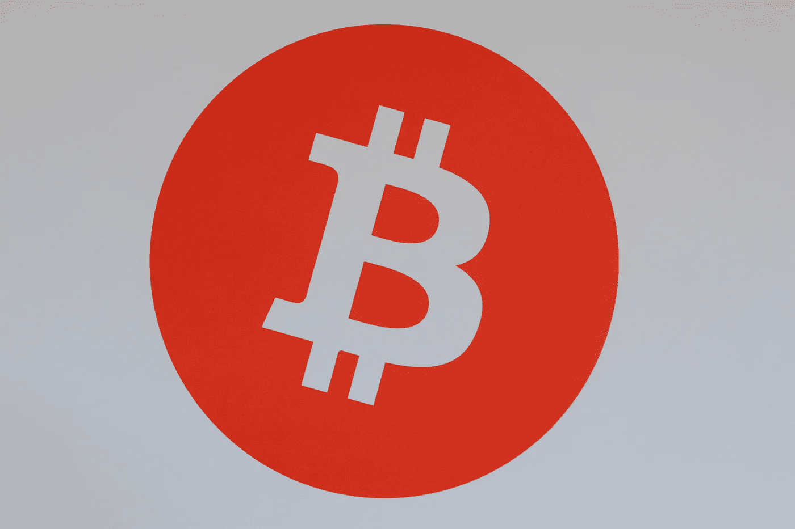

# 比特币达到了 19000 美元——然而我们问了所有错误的问题

> 原文：<https://medium.datadriveninvestor.com/bitcoin-reaches-19-000-yet-were-asking-all-the-wrong-questions-e88417f88957?source=collection_archive---------3----------------------->

Photo by [Micheile Henderson](https://unsplash.com/@micheile?utm_source=unsplash&utm_medium=referral&utm_content=creditCopyText) on [Unsplash](https://unsplash.com/s/photos/bitcoin?utm_source=unsplash&utm_medium=referral&utm_content=creditCopyText)

## 一个失去一切的人给我们上了贪婪的一课

自 2009 年成立以来，它经历了急速上升(和下降)的过程。但是不管你是在名人推特上读到的，还是当你听说一个家伙花了 1 万英镑(目前价值 1 . 9 亿美元)在 T2 买了两个棒约翰披萨的故事时，大多数人都听说过比特币。

别担心，这篇文章不是投资建议，我也不会用解释比特币背后技术的细节来烦你。毕竟，如果你对它是如何工作的至少有一个基本的了解，你不可能点击这篇文章。但是对于任何一个对比特币世界完全陌生的人来说，下面的视频提供了一个有用的概述，它到底是什么，它是如何工作的，以及它为什么如此特别。

Created by The Guardian

在比特币诞生的前八年，它相对来说还不为人知。早期的采用者用最基本的电脑就能很容易地收集到，他们收集了成千上万的硬币，并梦想着有一天他们珍贵的硬币会值很多钱。2010 年初的大部分时间里，比特币的交易价格在 200 美元至 600 美元之间。

# 输入“2017 繁荣”

在 2017 年 1 月 1 日，一个比特币会让你花掉 960 美元。到 2017 年 12 月 16 日，你可能已经以将近 2 万美元的价格卖出了同样的比特币。*投资回报率怎么样？*

早期采用者和长期相信比特币的人成为了百万富翁，比特币开始受到主流媒体的关注，每个人都在问“*它能涨到多高？”*

对于加密货币来说，这是一个美好的时代。

当时，我和妻子正在努力存钱买房子，我在 2017 年 6 月向比特币和其他加密货币投入了几千美元。

六个月来，我欣喜地看着我的投资组合越来越多，直到达到大约 50，000 美元的峰值。老婆求我卖，我拒绝了。我坚持认为这只是开始，抛售将是一个灾难性的错误，价格将继续上涨。

*没有。*

到 2018 年 2 月中旬，比特币的价格已经下跌了一半以上，到 2018 年底，价格回到了 3000 美元左右。

我以和最初购买时差不多的价格卖掉了我的比特币。

 [## 自白——我绝对不爱比特币|数据驱动投资者

### 这是真的，我已经写了几篇关于比特币和加密货币的文章，它们可能会在明年或…

www.datadriveninvestor.com](https://www.datadriveninvestor.com/2020/09/15/confessions-i-absolutely-dont-love-bitcoin/) 

# 快进到 2020 年

三年过去了，比特币正迅速接近历史高点，并再次开始吸引主流关注。价格的飙升无疑受到了 PayPal 和 Square 一直在购买比特币的消息的推动——他们计划允许用户通过各自的服务购买比特币。

围绕最近一轮反弹的积极情绪可能令人陶醉，用不了多久，FOMO(害怕错过)就会出现。每天，越来越多的人涌向互联网询问以下问题:

*   “我进去晚了吗？”
*   "*会达到 10 万美元吗？"*
*   "*我应该把毕生积蓄投资到比特币上吗？"*

但是这些是**不该问的**问题，因为*没有人知道答案。*

有些人会告诉你，比特币的价格正在走向月球，你永远不会太晚，有一天它会达到每枚 25 万美元。别人会告诉你它一文不值。

你应该问的唯一问题是，“我应该在什么时候卖出？”

没有退出策略，你注定会犯和我一样的错误。你可以让你的投资翻十倍或一百倍，但如果你没有退出策略，一点都不重要。你做的显示你的投资组合值多少钱的电子表格没有任何意义。你不能卖掉它。除了纸上的数字什么都没有。

在你卖掉投资之前，你什么也没赚到。

# 最后一句话

多年来，比特币让很多人赚了很多钱，我相信它会继续这样做。2010 年购买的价值 100 美元的比特币平均年回报率约为 240%，如今价值约为 3500 万美元(T21)。

但是我不知道明天，下周，或者十年后的价格是多少，任何*做*声称知道的人都是骗子。

我不是让你投资比特币。

但是我要告诉你，如果你真的决定买一些，不要被炒作所迷惑。不要让自己被火箭表情符号、奢侈的价格目标、比特币有朝一日将与黄金一样的市值或比特币将取代美元的说法蒙蔽了双眼。

制定退出策略，并坚持下去。记住，在你卖出之前，你什么都没做。

29 岁的作家乔恩·彼得斯与妻子和两个孩子住在英国康沃尔。如果你读到这里，感谢你的阅读！你真的会喜欢我其余的作品，所有这些都可以在这里找到****。****

## **访问专家视图— [订阅 DDI 英特尔](https://datadriveninvestor.com/ddi-intel)**