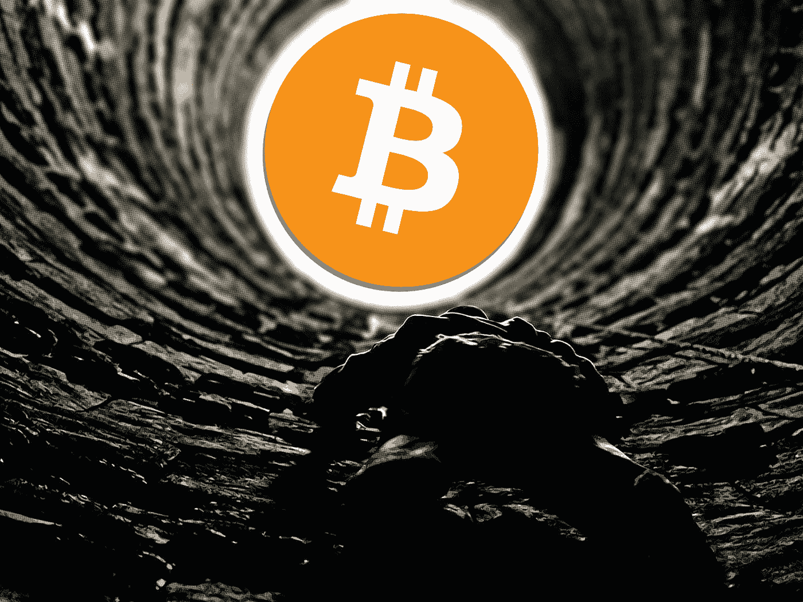
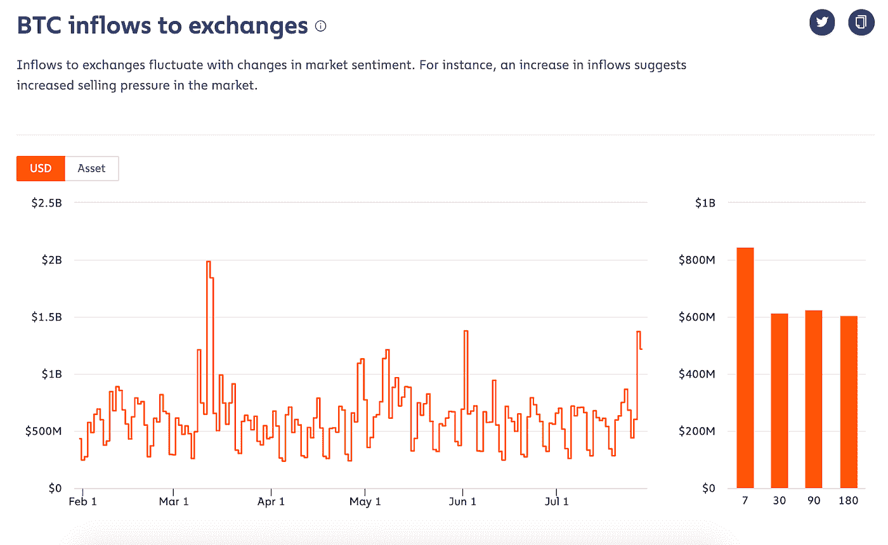
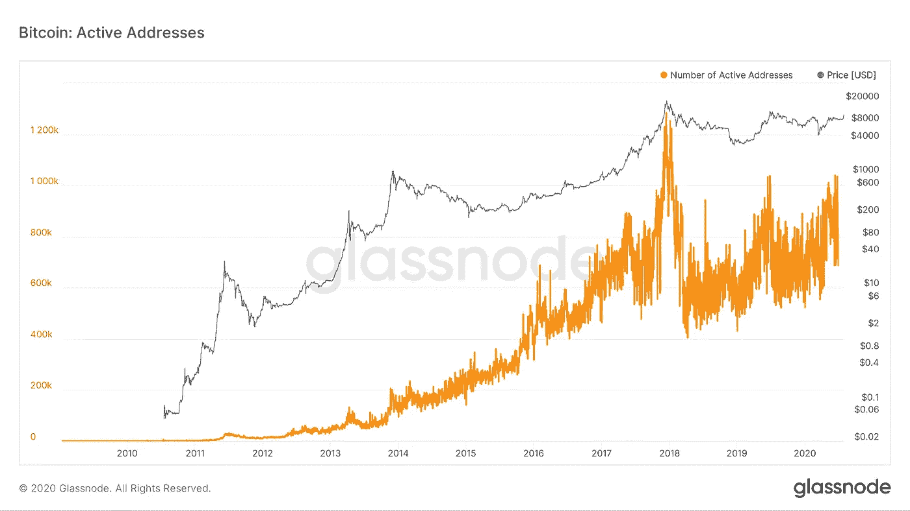
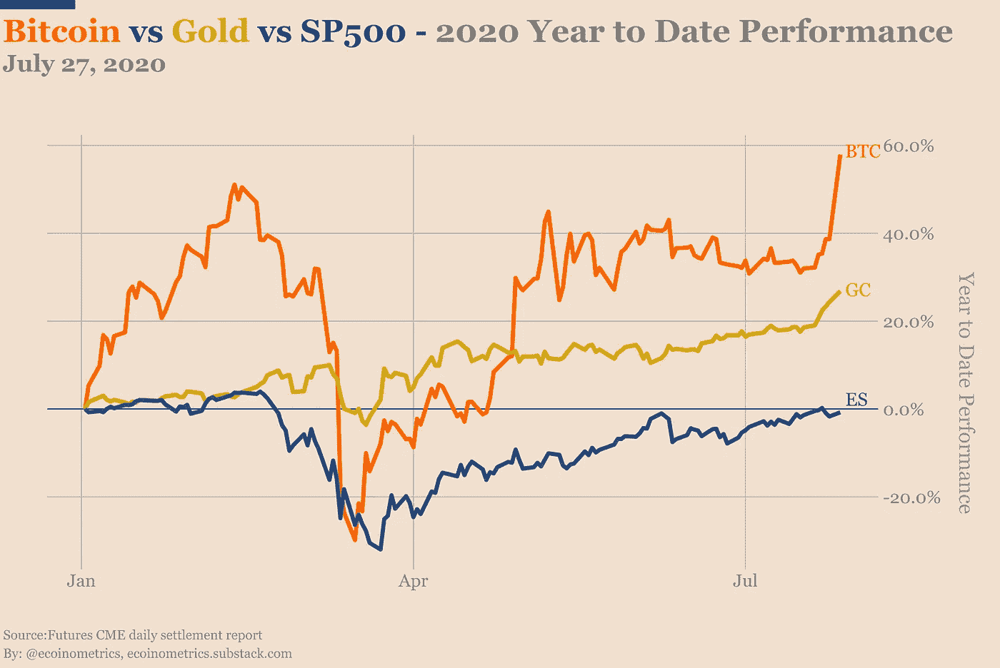
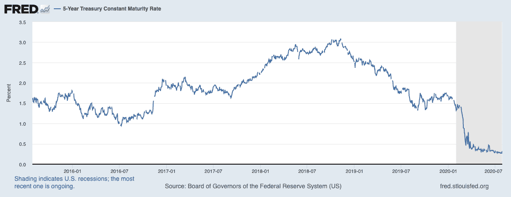
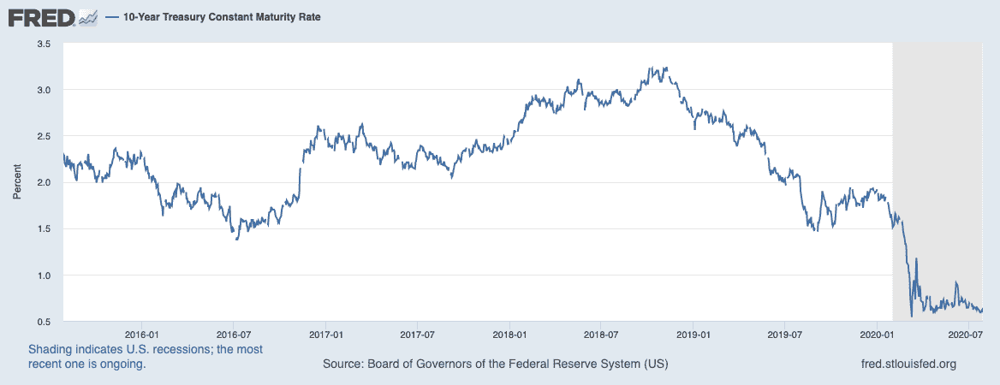
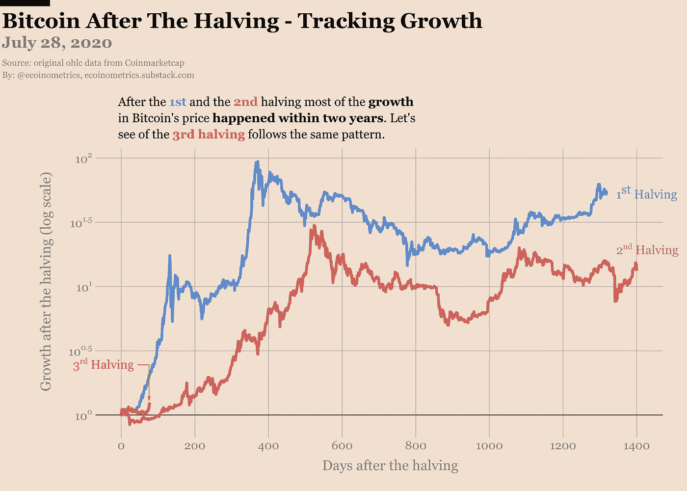
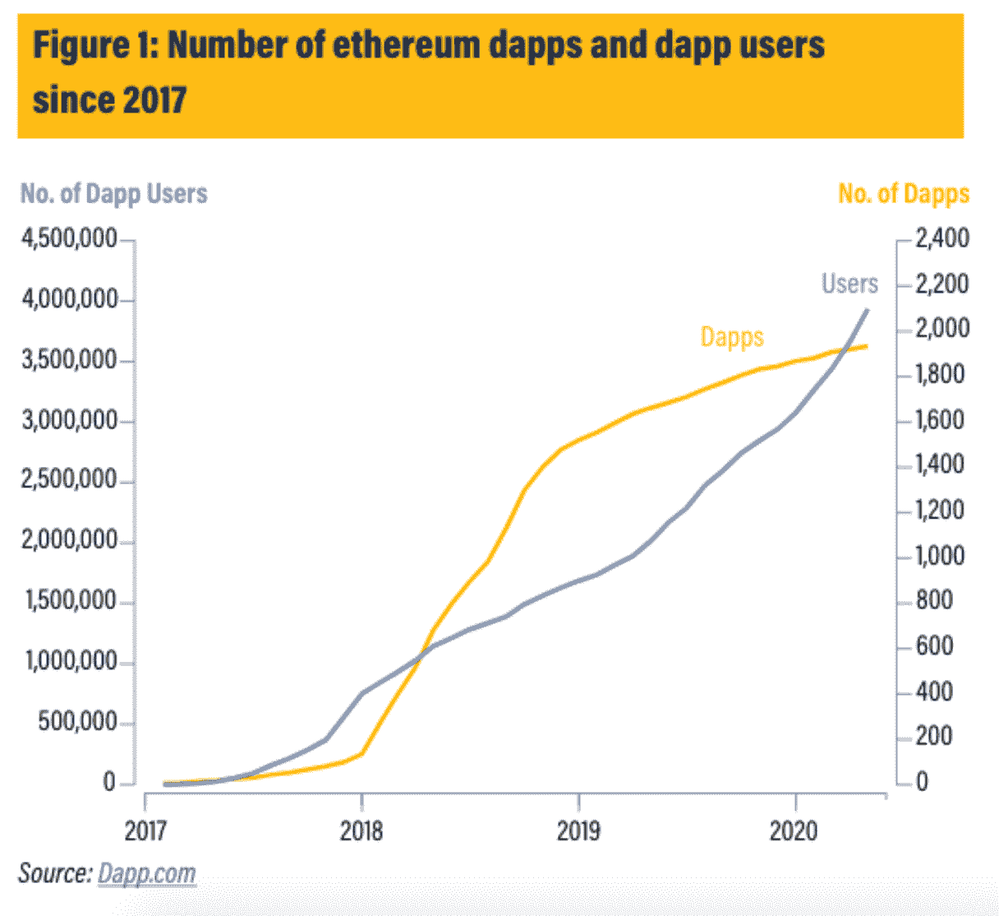
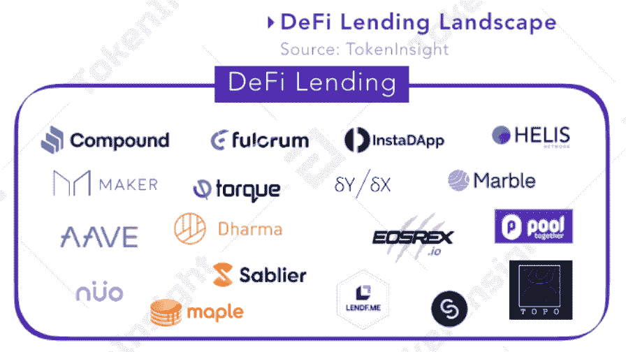

# 比特币上涨，DeFi 充值

> 原文：<https://medium.datadriveninvestor.com/bitcoin-rises-defi-recharges-28f162f4c86b?source=collection_archive---------17----------------------->

## 7 月 30 日当周加密简讯| Bradley @DDI & [**阿尔法交易**](https://medium.com/u/f03db667cf30?source=post_page-----28f162f4c86b--------------------------------)

*阅读上一期 DDI Crypto 简讯*[***【here】***](https://medium.com/datadriveninvestor/riding-the-defi-wave-where-are-we-headed-405c5593ec92)*以及所有关于股票和经济的*[***【here】***](https://medium.com/datadriveninvestor/fear-and-uncertainty-in-the-markets-as-investors-turn-to-gold-7b0fc2c82818)*。*

# 让您的生活更轻松:

*   [**每周击败**](#3c3b)
*   [**以太坊的宁静项目**](#8cf3)
*   [**分权金融——炒作还是革命？**](#08e7)
*   [**洞察一周**](#b151)
*   [**其他新闻**](#fb2c)
*   [**编辑台**](#4c25)
*   [**观看演出**](#830a)

**Crypto 恐惧&贪婪指数:71 (** [**截止 7 月 29 日**](https://alternative.me/crypto/fear-and-greed-index/) **)**

# 每周节拍——比特币上涨！

**加密交易所交易量突破|**7 月的分散交易所交易量[已经超过了 6 月的记录，达到 16 亿美元。](https://www.coindesk.com/julys-decentralized-exchange-volumes-have-already-topped-junes-record-reaching-1-6b)

**未来着火了|** 比特币期货交易量[突破 400 亿美元](https://decrypt.co/37043/bitcoin-futures-volume-40-billion-highest-march-crash)，推动衍生品交易所 BitMEX 价格高达 11431 美元。自 2020 年 3 月黑色星期四崩盘以来，比特币的价格几乎完全恢复。洲际交易所支持的加密平台 Bakkt 报告称[期货交易量单日增长](https://www.theblockcrypto.com/linked/73079/bakkt-bitcoin-futures-july?utm_source=tradingview&utm_medium=rss)达 84%。以太坊期货未平仓合约[达到了 10 亿美元的历史新高](https://decrypt.co/36895/ethereum-futures-open-interest-all-time-high-1-billion?&utm_medium=referral&utm_campaign=feed&utm_source=trading-view)。

 [## 为什么参与正确的加密交换至关重要|数据驱动型投资者

### 到目前为止，与黄金和美元相比，加密货币，尤其是比特币，已经显示出巨大的增长

www.datadriveninvestor.com](https://www.datadriveninvestor.com/2020/07/16/why-engaging-with-right-crypto-exchange-matters/) 

**坏消息熊市，奔牛|** 比特币爆发后，仅在 24 小时内就有超过[5 亿美元的比特币杠杆头寸被平仓](https://bitcoinist.com/the-cost-of-bitcoin-surging-15-in-24-hours-500-million-in-liquidations/)，48 小时内平仓 7400 亿美元。流入交易所的 USDT 资金突破了 8 个月高点，而流入 BTC 的资金和活跃地址也大幅增加。从基本面来看，BTC 交易所资金流入的激增意味着大型参与者正在寻求抛售。从技术角度来看，如果比特币保持在 10，500 美元以上，它继续飙升的可能性更大。(编辑于 2020 年 7 月 30 日星期四)

Source: Chainalysis

随着美国银行可以提供托管服务的消息以及政府的大规模刺激计划，投资者将寻求稀缺的[金属和比特币](https://www.theblockcrypto.com/linked/72990/global-uncertainty-gold-bitcoin)来对冲长期的全球经济低迷。一些投资顾问[将比特币](https://cryptopotato.com/major-investment-bank-recommends-bitcoin-over-gold/)与黄金一起推荐，称比特币不像闪亮的东西那样延伸(尽管这种讨论可能发生在比特币突破 11200 之前)。不确定是什么让比特币成为对冲？观看 Anthony Pompliano 的视频。

发展中的美中紧张局势和冠状病毒在美国南部和西部的死灰复燃导致美元在 11 月的美国总统选举中走软。相反，[黄金创下历史新高](https://thecapital.io/article/bitcoin-on-autopilot-along-with-gold-all-time-highs-weekly-financial-market-news-MDGyUSq3i2ornKOc45F)，铜、银和比特币紧随其后。

随着全球经济[进入衰退](https://blogs.worldbank.org/opendata/understanding-depth-2020-global-recession-5-charts)，比特币在经历减半事件后的头两年内重现大幅升值的历史，时机再好不过了。

瑞士大型银行 Julius Baer 在 2020 年上半年为比特币等数字资产提供托管服务后，利润增长了 34%。现在美国银行已经加入了托管游戏，美国金融机构会提供类似的服务来见证同样的效果吗？

可以肯定的是，我们将继续在采用区块链相关基础设施的公司、政府和机构中发现积极的结果。国际金融服务公司 Fidelity 发现 **80%接受调查的机构投资者认为数字资产很有吸引力。**目前只有 36%的人投资于该类别。

# 找到你的优势。

[订阅阿尔法交易不和谐服务器](https://bit.ly/2KJ1oor)，找专业人士一对一指导。加入阿尔法包两天，无风险。

# 以太坊的宁静项目

**Eth 2.0 崩溃|** 截至 2020 年 6 月，以太坊上部署了近 2000 个 dapp(去中心化应用)，Eth 2.0 的时机已经到来。熟悉这个领域的人可能永远不会忘记当 DApp [在 2017 年末几乎打破](https://www.bbc.com/news/technology-42237162)以太坊网络时发生的事情。解决扩展问题对于任何加密项目来说都是一件大事，以太坊的未来取决于其新的可扩展性计划的成功，该计划被称为“以太坊 2.0”或“宁静”[【在这里了解更多关于以太坊的起源和目的以及宁静项目的入门知识。]](https://kraken.docsend.com/view/67nzrdf)

以太坊 2.0 测试网预计于 2020 年 8 月 4 日上线。

# 分散金融——炒作还是革命？

**又是什么 DeFi？|** 去中心化金融，主要由去中心化应用(DApps)组成。这些 DApps 大多生活在以太坊区块链。DeFi 空间的交易活动最近因相对不稳定的比特币而激增。尤其是 ChainLink (LINK)在投机方面表现强劲，最近几个月，重大交易数量创下纪录，活跃地址数量激增。

Hackernoon [就 DeFi 的未来采访了加密领域的多产企业家 Ivan Starinin](https://hackernoon.com/an-interview-with-ivan-starinin-and-alexander-salnikov-on-defi-tech-2c3l3tot)

“缺乏监管，使得市场对那些寻求大笔投资的人来说相当不确定。因为它发生在区块链，特别是在加密领域，最初的立法只是事后制定的，监管机构在追赶。这个过程似乎在 DeFi 身上重演。”

伊万还提到了缺乏监管意味着投资者的投资回报率会暂时提高。另一个风险是依赖第三方中介来执行交易的漏洞。

**DeFi 继续破纪录|**7 月的去中心化交易量已经突破 6 月的顶部，达到[16 亿美元](https://www.coindesk.com/julys-decentralized-exchange-volumes-have-already-topped-junes-record-reaching-1-6b)。

**让我们都冷静一分钟|** DeFi 可能正在蓬勃发展，但其超越市值里程碑的速度令人担忧。从 DeFi 锁定的 1 亿美元到 5 亿美元花了 495 天，但从 20 亿美元跃升到 30 亿美元只花了 20 天。回调可能是应该的，特别是最近比特币的爆发吸走了替代比特币领域的一些风头。然而以太坊继续展现实力；牛市周期可能不会结束。阅读我们上一期的《驾驭 DeFi 浪潮》。 ]

虽然 DeFi 空间在 2020 年产生了大量炒作，但投资者也有好奇的根本原因。特别是 DeFi lending，因为其开放、无权限和透明而颇具吸引力。2020 年上半年，DeFi 贷款项目锁定的总资本增加了约 177%，达到 12.87 亿美元。DeFi lending 的总市值占该行业总市值的 70-80%[【点击此处阅读完整报告】](https://www.coindesk.com/research/reports/tokeninsight-2020-q2-defi-industry-research-report-part-2-issuance)。

当 P2P 支付技术公司 Circle 发现企业 stablecoin 账户的需求在 3 月至 4 月间增长了 700% 时，Stablecoins 也加大了与 DeFi 的整合力度。中央稳定币公司 Tether 承认该公司[仅以现金或等价物的形式支持 USDT](https://www.coindesk.com/tether-lawyer-confirms-stablecoin-74-percent-backed-by-cash-and-equivalents?ref=hackernoon.com)74%的股份。

# 本周洞察

**学点新东西|** 我们的首席分析师之一 Amol Gharte 在今年早些时候发布了他的[以交易为生的十诫](https://youtu.be/5wwdx3Gm8ps)视频。在你辞掉你的日常工作之前(如果你还有工作的话)，一定要看这个！

**话出自极品|** 你知道林恩·奥尔登吗？如果你在加密或金融领域，你应该这样做！查看她关于比特币的文章，她投资的三个理由。

**忘记交易计数|**Nic Carter 的这篇文章解释了为什么有一个更可靠的指标[来评估比特币作为价值转移系统的价值。一旦你明白了要点，看看 Glassnode 关于比特币基本价值的最新数据](https://medium.com/@nic__carter/transaction-count-is-an-inferior-measure-fba2d5ac97f1)[。](https://reports.glassnode.com/files/formal-verification-in-the-network-bitcoin-q2-2020.pdf)

# 其他新闻

**什么** [**古怪的关键词串**](https://insights.santiment.net/read/making-sense-of%C2%A0the-crypto-market%C2%A0%E2%80%94-in%C2%A010%C2%A0words-or%C2%A0less-5931) **来自社交媒体告诉我们关于加密的趋势|** 我们已经有一段时间没有对关键词笑了。

**比特币被美国政府视为货币？是的，但只是在微妙的情况下。**

比特币[本周根据 DC 华盛顿州的货币传输法案](https://news.bloomberglaw.com/us-law-week/bitcoin-deemed-money-under-d-c-financial-services-law)被归类为“货币”，主要澄清了加密交易所[将需要持有货币传输许可证](https://cointelegraph.com/news/new-ruling-classifying-bitcoin-as-money-isnt-anything-special)。在美国的几个司法管辖区已经是这种情况了。

**grady scaling up |**grady AUM 管理的总资产在不到一周的时间里跃升了[500 多美元](https://cryptopotato.com/grayscale-aum-surge-500m-in-a-week-bitcoin-shares-in-the-lead/)，超过了他们 48 亿美元的总 AUM。但是不要担心，他们不会购买所有的比特币。

# 编辑桌

每周，我们都会为读者带来一些精选的故事，这些故事来自《数据驱动投资者》的朋友。

[是时候用 DeFi 取代银行了吗？](https://www.datadriveninvestor.com/2020/07/17/is-it-now-the-time-to-replace-the-banks-with-defi/)

[什么是赌注？](https://medium.com/datadriveninvestor/what-is-staking-91272710410e)

# 观看表演

我们的团队每周都会讨论几个加密项目价格行为背后的基本驱动因素。 [**【在我们的不和谐服务器了解更多】**](https://discord.gg/a97qq2s) 。通过最近的剧集找到你的优势:

[**比特币波动又回来了！| Altcoin 循环策略！**](https://youtu.be/etW3H_-aNMU)

[**比特币直奔 10500 美元？|为什么山寨币在倾销**](https://youtu.be/tcLYTLjQgMU)

# 放弃

数据驱动投资者(DDI)提供的信息不用于做出任何金融决策，也不是购买、持有和/或出售特定证券或金融工具的请求或建议。

Alpha Trades，LLC 提供的信息不用于制定任何财务决策，也不是购买、持有和/或出售特定证券或金融工具的请求或建议。

访问 Alpha Trades 的完整服务条款:[https://bit.ly/3faVeeV](https://bit.ly/3faVeeV)

**进入专家视角—** [**订阅 DDI 英特尔**](https://datadriveninvestor.com/ddi-intel)