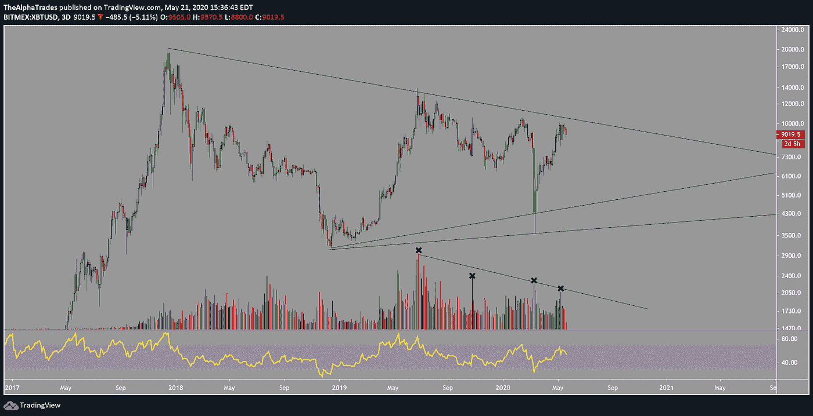
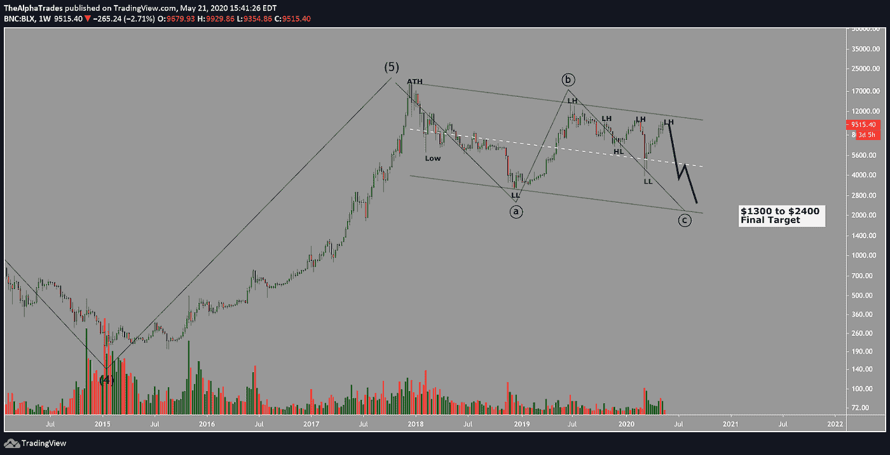
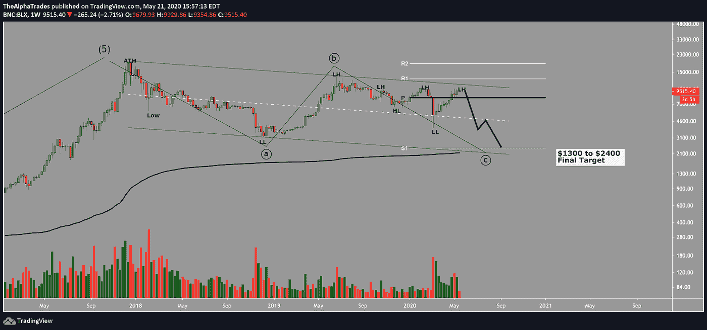
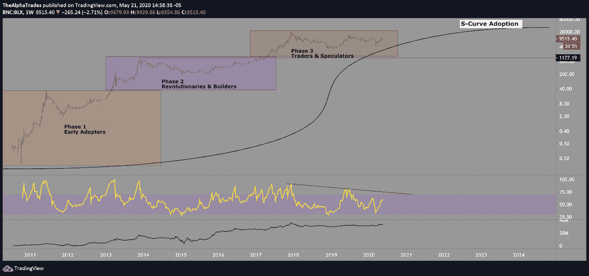
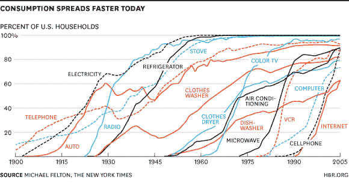
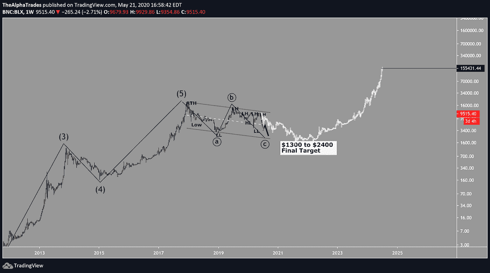

# 到 2025 年的比特币路线图

> 原文：<https://medium.datadriveninvestor.com/bitcoin-roadmap-to-2025-e49c5da26966?source=collection_archive---------5----------------------->

## 离主流采用还有十年。

Bitcoin Roadmap to 2025, Photo by Jake Blucker on Unsplash

在这篇文章中，我将准确描绘出我对未来几周、几个月、几年，直到 2025 年比特币价格走势的看法。

我将展示当前经济格局中的当前事件，如冠状病毒、全球经济衰退和美联储无限制印钞，将如何长期影响比特币，以及价格行为的所有山峰和山谷将如何在我对 2025 年比特币价格目标的道路上发挥作用。

我选择 2025 年是因为我认为[市场通常遵循四到五年的周期](https://www.investopedia.com/trading/market-cycles-key-maximum-returns/)。

如果你看看比特币截至 5 月 21 日的情况，特别是三天的时间框架，比特币已经从 2017 年的顶部一直到 2018 年 12 月的 3100 点的低点形成了一面大三角旗，这种特殊的模式贴现了冠状病毒崩溃形成的灯芯，以支持底部趋势线上的真实蜡烛体。自 2018 年低点以来，价格已经出现了较低的高点，最近的一次是在 3 月份暴跌至约 3600 点。

 [## 加密货币行业是死是活？数据驱动的投资者

### 九月初，我们在 X-Order 内部就代币市场的未来进行了一场辩论。有趣的是，我们的观点是…

www.datadriveninvestor.com](https://www.datadriveninvestor.com/2019/12/12/will-the-cryptocurrency-industry-be-dead-or-alive/) 

此外，比特币刚刚完成了第三次[减半事件](https://buff.ly/2CjnqcP)，该事件每四年发生一次，并将处理交易奖励的比特币数量减半。这一次，数据显示矿工们不再像以前那样紧紧抓住他们的比特币储备，[卖出的 BTC 比减半的同一天](https://www.newsbtc.com/2020/05/13/post-bitcoin-halving-miners-have-dumped-5m-more-btc-than-before/)多了 622 枚。

减半使得许多矿商更难保持盈利。

规模较小、效率较低的矿商无法吸收比特币和整体市场经济状况之间的损失，除了失去一半处理交易的动力之外，最终不得不出售库存以维持运营或彻底关闭。

矿工的持续抛售给比特币的价格带来了进一步的压力，因为它增加了流通中的总供应量。效率更高的矿商有机会从经济危机中复苏，因为竞争的减少可能会在某种程度上为他们创造公平的竞争环境，许多人提前几年就做好了减半的准备。与此同时，全球市场和股票达到反弹顶部的不确定性，以及过去几个月 BTC 与股票市场的相关性，给比特币的价格上涨带来了很大压力。上升的波动性增加有几个原因，无论是来自“不要对抗美联储”心态的炒作，还是由于流动性下降造成的波动性导致的更大的价格波动。随着许多玩家离开比特币市场或账户被清空，流动性已经下降，仔细研究 COVID 崩溃后的四个月回撤可以发现交易量明显下降。

如图所示，在每一次向三角旗顶部移动的顶部(COVID 崩溃是一个异常值)，都有一个交易量的峰值。通常情况下，这意味着散户投资者受到引导价格上涨的机构投资者创造的 FOMO 的推动。我认为，大型参与者推高了价格，因为他们正在策划大规模抛售比特币。在价格波动的低谷中掏空他们的钱袋不符合这些大玩家(通常被称为“鲸鱼”)的利益。相反，理想情况下，他们会在更高的价格水平上将其头寸级联到自己的卖出墙上，依靠散户的交易量，然后在更高的关键水平上卖出大部分头寸。当地毯从零售买家手里拿出来时，它会在图表上显示为关键水平附近的大幅上涨，在提供的图表上用“X”标记。

Bitcoin Roadmap to 2025, Source: Alpha Trades, LLC

# 艾略特波浪预示着突破前的震荡。

我们现在可以绘制出一个[艾略特波浪结构](https://www.babypips.com/learn/forex/corrective-waves)，它从第一波达到 2011 年 5 月的高点开始，然后在 2017 年的 20k 牛市顶部达到第五波的末尾。

比特币现在似乎处于 ABC 修正之中，最近则处于完成修正的 C 波过程中。到目前为止，我们已经讨论了随着价格的上涨，交易量的持续下降，然后在价格可能拒绝的顶部，卖方交易量出现高峰。

**ABC 修正概要:**

从 20，000 的历史高点开始，价格在 2018 年末陷入更低的低点，在 2019 年 6 月陷入更低的高点，在 2019 年 10 月陷入更低的高点，然后是更高的低点。从那里开始，比特币打印了越来越低的高点和低点，因为它未能保持在 2020 年 2 月的高点(约为 10，050)上方。3 月份的大幅下跌创下了一个更低的低点，并最终再次挑战最近的高点，但无法突破它，并再次创下更低的高点。

在目前的价格，我们仍然尊重技术上的一个较低的高点。除非价格突破了令人信服的交易量，并且没有被股市触顶拖到水下，否则 BTC 会发现很难否定这个艾略特波浪计数。考虑到比特币目前的结构，以及大的平行渠道和整体市场状况，我预计未来几个月比特币将会下跌。

Bitcoin Roadmap to 2025, Source: Alpha Trades, LLC

# 比特币未来几个月的目标

从前面的图表中，我们可以使用支点指标，以及 VWAP 世纪指标(该指标考虑了该资产生命周期内的大部分价格行为)，所显示的是 VWAP 世纪以及 S1 支点在每周时间框架内都在 2400 点左右排列。

这一目标可能会在今年 9 月至 2020 年底之间实现。我对 2025 年的目标有点不同，因为会有许多不可预见的障碍，但从技术角度来看，2400 点肯定仍在发挥作用。但图表上的 1300 点目标是哪里来的呢？

Bitcoin Roadmap to 2025, Source: Alpha Trades, LLC

下图显示了比特币在 2013 年 11 月达到约 1200 美元的高点，随后是两年的回撤，随后是 2015 年和 2016 年的重新累积期，然后一路推至 2017 年的 20000 美元高点。

2013 年的高点尚未测试，留下了一个很大的空间真空，这可能在更高的时间框架内仍将价格拖至至少 2400 点，技术上为 1300 点。

Bitcoin Roadmap to 2025, Source: Alpha Trades, LLC

就打算购买并持有其头寸的投资者而言，比特币的生命周期可以分阶段想象，早期采用者在 2010 年至 2013 年之间到来。第一阶段的早期采用者很大程度上是盈利的，而且已经盈利很长时间了。第二阶段的投资者(革命者和建筑商)也仍然有可观的利润。第三阶段的交易者和投机者可能是在价格非常高的时候进入市场的，他们是一个混合体。其中一些仍有可观的利润，另一些则有一定程度的亏损。一旦比特币价格跌至第三阶段水平以下，所有在该水平以上长期投资比特币的人都将开始感受到头寸的巨大痛苦。

许多人的风险偏好不会容忍回到第二阶段的价格水平，尤其是在整个经济陷入困境的情况下。随着经济形势恶化，投资者将寻求清算任何资产，以支付基本生活费用和债务，比特币等风险资产可能会首先消失。

跌破 2400 点或更低的水平将消灭许多从 2017 年开始进入的交易者和投机者，这是一次真正的清洗，只会让第二阶段和第一阶段的人毫发无损。项目早期阶段的投资者有更多的理由持有他们的头寸更长一段时间，因为风险回报如此之大。如果你再有机会在 1300 点至 2400 点之间买入，就价格风险回报而言，你将和那些早期投资者一样。

我从比特币是一项正在发展的技术的角度来看待它，这项技术正在经历被采用的阶段，我们称之为 [S 曲线](https://en.wikipedia.org/wiki/Technology_adoption_life_cycle)。所有新技术都经历了这些阶段，如下图所示。电、冰箱、炉子和彩色电视都经历了这些阶段。从其他突破性技术的角度来看，[比特币目前的采用周期](https://medium.com/@mcasey0827/speculative-bitcoin-adoption-price-theory-2eed48ecf7da)接近峰值。但是我们到底有多“接近”呢？

Adoption cycles are moving faster, Source: The New York Times

# 比特币距离普及高峰还有 10 年

比特币的峰值采用目标是在 2030 年左右，这不一定是比特币的熊市。即使资产价格达到 2400 美元或 1300 美元，交易者和投机者也会被淘汰，第二阶段和第一阶段的投资者基本上不会受到影响。我认为，一旦我们走出这场严重的衰退，从新冠肺炎疫情中复苏，比特币将重新进入一个积累期，这可能会持续一两年，直到价格最终再次开始攀升。它会爬多远？

# 比特币的上限可能在 10 万到 20 万之间

如果比特币的最后一个周期看起来像第二阶段那样，那么 10 万到 20 万之间的估值是可以实现的，基于克隆最后一个阶段的周期并将其置于今天价格的尾端(这包括一直到 1300 的潜在研磨)，一个可靠的中值约为 15.6 万。根据同样的标准，2025 年的现实目标是 2 万人是合理的。

Bitcoin Roadmap to 2025, Source: Alpha Trades, LLC

当前的艾略特波浪周期将在 2024 年 7 月结束，这是通过将 2013 年的顶部克隆到 2017 年的顶部，并将其置于当前价格行为的末端而再次发现的。

世界各地的政府都面临着各自经济的危机，货币贬值，购买债券，甚至可能购买股票来支撑资产价格。基于历史，我认为这场危机不会有好的结局。罗马帝国和魏玛共和国的覆灭是一个清晰的历史警告，它迟早会到来。无论是美国、欧元区，甚至是日本，全球主要经济体都陷入了严重的困境。

我是比特币的信徒，但我仍然认为这种资产还需要十年来证明自己。如果能做到这一点，尤其是在 2025 年之前的五年里，金价有理由大幅升值。

不幸的是，在这段时间内，比特币也很有可能出现故障。也许这将会发生，因为一些新的和改进的东西出现了，或者世界各地的政府利用突破性的技术，如比特币所基于的技术，来强化他们自己的货币，并避免全球货币体系的崩溃。无论如何，比特币是迄今为止我遇到的最令人惊叹的资产和创新技术之一，我认为它在既定目标上可能会取得成功。它的成功取决于许多因素，尤其是采用的规模。

比特币项目和整个加密货币领域背后都有一些强大而聪明的人。像罗恩·保罗、蒂姆·德雷珀、马克·库班、马克·安德森、保罗·都铎·琼斯、迈克·诺沃格拉茨和许多其他人一样，这些人有兴趣继续推动这个项目向前发展，走向更大的成功和稳定。

这就是我对 2025 年比特币价格预测的理由。在我看来，到 2025 年，比特币的价值要么会超过 10 万英镑，要么很可能会低于 1000 英镑。我只看到两种二元方式来看待比特币的价格动作；要么它会成为伟大的东西，要么它会成为一个失败的实验，可能价值 1000 英镑，甚至可能为零。有一天，我会回到这个预言上，可能会有很多话要说，最终发生了什么，没有发生什么，这将是一个伟大的对话。

当考虑到互联网泡沫和 T2 日经指数崩溃的事件时，我不明白为什么比特币不能成为一个泡沫，并朝着 2400 或 1300 这样更现实的价格破裂。大规模、长期和痛苦的调整将降低整体波动性，从项目的价格稳定性来看，最终将对比特币产生积极影响。

我认为比特币是一项了不起的资产，我相信它将对整个社会产生重大影响，但我也意识到，考虑到技术发展的速度，它可能是一项实验，在未来几年内，由于网络效应和 S 曲线的采用，它可能会成为 10 万英镑或更高的资产，也可能是一项失败或先发制人的实验，最终达到 1000 英镑或零英镑。比特币万岁！

# 处于优势

感谢您成为这个社区的一员。如果你对这篇文章有共鸣，请[订阅 Discord 服务器](https://bit.ly/2KJ1oor)。你将可以免费访问公共频道，在那里我们每天发布大量免费有用的内容。更多细节请看下面的视频。

Source: Alpha Trades, LLC

# 放弃

Alpha Trades，LLC 提供的信息不用于制定任何财务决策，也不是购买、持有和/或销售特定产品、数字资产或 ICO 的请求或建议。

访问我们的完整服务条款:【https://bit.ly/3faVeeV 

*原载于 2020 年 5 月 26 日 https://www.datadriveninvestor.com***。**