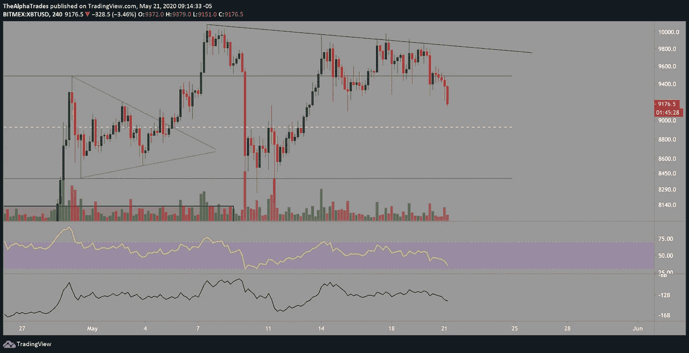
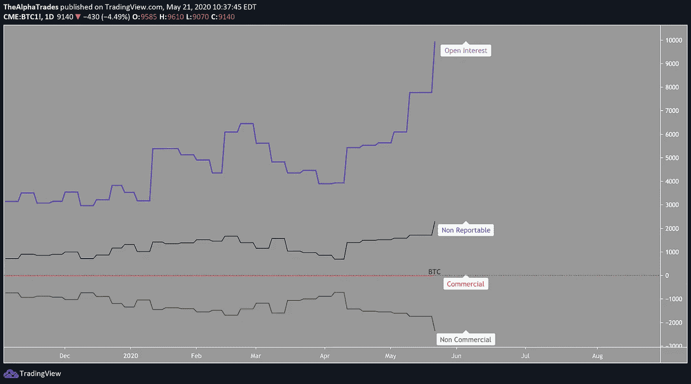

# 比特币做空有回报了！你是看涨还是看跌？

> 原文：<https://medium.datadriveninvestor.com/bitcoin-short-is-paying-off-are-you-bullish-or-bearish-bc9266ee28da?source=collection_archive---------21----------------------->

## BTC 的下一个目标是 9100 美元，然后是 8925 美元

Bitcoin, Photo by André François McKenzie on Unsplash

周四快乐，欢迎来到今天的比特币分析。

在撰写本文时，比特币继续表现疲软，处于更低的低点，并挑战 9200 点区域。从 4 小时的时间框架来看，我认为收盘低于 9281 点左右是进一步看涨的关键信号。如果 BTC 收盘低于此，我预计价格将达到本周的低点 9100，然后 8925 附近的 SR 水平绘制的渠道，如下图所示。

Bitcoin May 22, Source: Alpha Trades, LLC

在昨天的早间分析视频中，我透露了我认为对冲基金和机构与市场上头寸小得多的交易员相比，是如何净做空 BTC CME 期货的。如果你想更好地理解下面的图表，可以去看看。

未平仓头寸持续攀升，而非商业机构(即对冲基金和市场中较大的参与者)增加了空头头寸。当未平仓合约上升而价格下跌时，这意味着有新的空头头寸进入订单流。

Bitcoin CME, Source: Alpha Trades, LLC

正如我在[之前的分析](https://youtu.be/HpBN1K0euRo)中所解释的，BTC 的日线图显示，交易量不是在突破阻力时上升，而是在阻力前上升*，对我来说，这是多头的一个不好的信号。这是一个迹象，表明在大约 10，050 的阻力位附近有大量的卖家在等待。卖家在特定的价格范围内尽可能高效地装满他们的袋子。如果成交量大幅飙升，价格突破该阻力位，我更倾向于认为空头错了，BTC 有机会创造更高的高点。*

 [## 加密货币行业是死是活？数据驱动的投资者

### 九月初，我们在 X-Order 内部就代币市场的未来进行了一场辩论。有趣的是，我们的观点是…

www.datadriveninvestor.com](https://www.datadriveninvestor.com/2019/12/12/will-the-cryptocurrency-industry-be-dead-or-alive/) 

为了不重复之前分析中所说的内容，在今天的视频中，我们回答了观众的几个问题，请查看[昨天的视频](https://youtu.be/HpBN1K0euRo)和[文章](https://medium.com/datadriveninvestor/bitcoin-cme-futures-data-shows-hedge-funds-and-institutions-are-increasing-shorts-9b20c1723936)，看看我是如何得出关于比特币价格走势的这些结论的，以及为什么我认为比特币在这些水平上是看涨的。

# 成交量下降，未平仓合约增加，价格收紧，这是市场告诉我们拐点即将到来的方式吗？

毫无疑问，而且基于目前为止所涉及的所有原因。在这种情况下，比特币每天都在形成一个上升三角形，但事实是，我们已经连续八周没有比特币或标准普尔 500 出现有意义的回调，全面资产的滚动早就应该出现了。

看看 4 月 29 日的区间高点和 8407 附近的关键低点，这可能是空头的一个积极信号，如果他们继续压低价格，这可能会进一步向 9100 或 8925 的 EQ 下跌(当你读到这里时，你会看到这正是正在发生的事情)。

# 每周时间框架内的比特币

我在周线上发现有趣的一件事是，随着价格开始向下，Stoch RSI 正在触及超买区域，再次发出潜在顶部的信号。如果你看散列丝带指标紧缩，这是典型的矿工投降的迹象。矿工抛售比特币的涌入以及比特币 CME 期货合约成为净空头都导致了价格可能开始滚动的汇合(同样，这是从今天早上的视频转录的，所以一定不要错过那些，因为它们比这些文章早一点出来)。

观察今天、明天和 29 日结束的合约，近期看跌期权的交易量在 7500 点区域很大，而看涨期权的交易量没有前者突出。

对于 5 月 29 日到期的合约，我预计 8000 点的看跌期权执行价和 9000 点的看跌期权执行价都很有分量。我关注这一点的原因是，当你在一个特定的合约中看到很多规模时，这表明人们可能对该执行价格更感兴趣，并提供了一个线索，表明价格可能会在这些合约期结束时趋向何处。

随着月底的临近，我们可能会看到一些有趣的波动。

# 处于优势

感谢您成为这个社区的一员。如果你喜欢这篇文章，请[订阅 Discord 服务器](https://bit.ly/2KJ1oor)。你可以免费访问公共频道，在那里我们每天发布大量有用的内容。更多细节请看下面的视频。

Bitcoin Analysis for May 22, Source: Alpha Trades, LLC

# 放弃

Alpha Trades，LLC 提供的信息不用于制定任何财务决策，也不是购买、持有和/或销售特定产品、数字资产或 ICO 的请求或建议。

访问我们的完整服务条款:【https://bit.ly/3faVeeV 