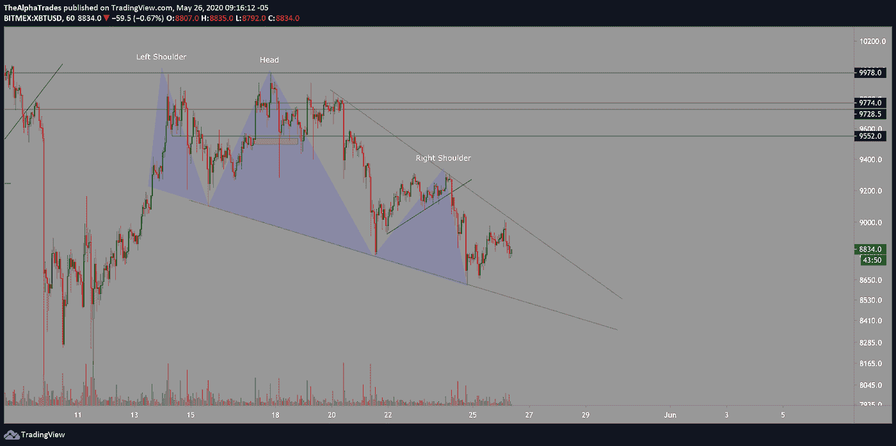
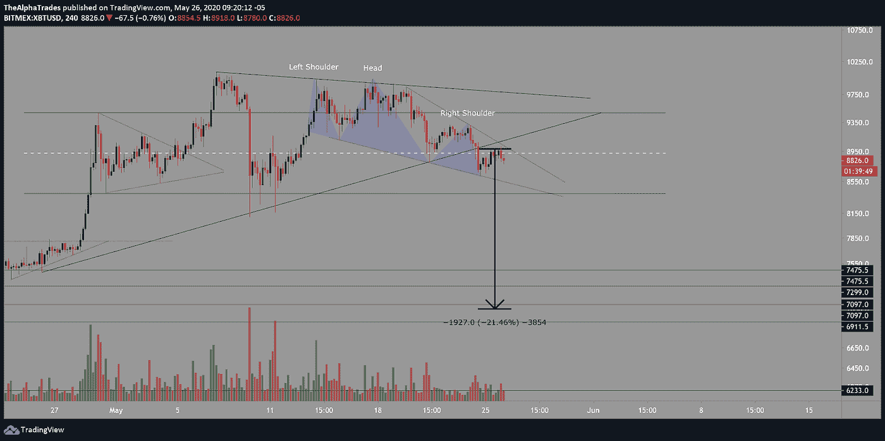
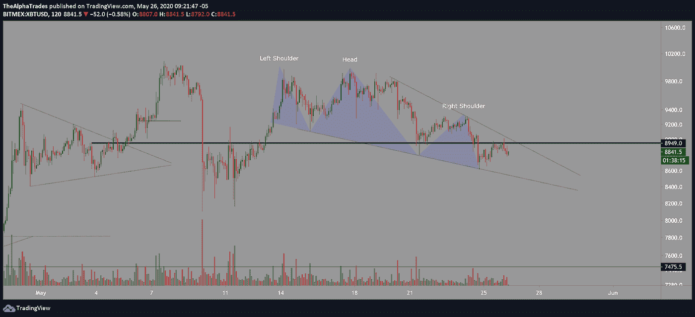

# 比特币预示着更多的下跌——8949 美元是值得关注的关键价位

> 原文：<https://medium.datadriveninvestor.com/bitcoin-signals-more-downside-8949-is-the-key-level-to-watch-864354dbf05?source=collection_archive---------15----------------------->

## 当 SPX 突破 3000 点时，熊市形态吞没了牛市形态。

Photo by Harrison Kugler on Unsplash

交易员和投资者们，早上好。如果你没有赶上我昨天在 YouTube 上的[直播会议，它提供了一个更深入的分析，以配合我今天早上将要报道的内容。阿尔法交易频道有那段视频。](https://youtu.be/CBfA7lxCBSE)

在前几天的分析中，我绘制了两个从一小时角度发展的不同模式，即[头肩顶模式](https://www.investopedia.com/terms/h/head-shoulders.asp)和[下降楔形模式](https://www.investopedia.com/terms/w/wedge.asp)。

如果音量不匹配，头肩模式无效，这意味着左肩需要打印更高的音量，而头用更低的音量产生更高的音量。这就是我今天在比特币中看到的模式，正如你可以看到左肩的高容量，头部的低容量。右肩延伸到周末和周一，这是美国的一个假期。比特币(BitMEX)最低 8618，最高 9014。

头肩顶形态是在一个下降的楔形中形成的，在下降的楔形中(看涨形态)，你真正想看到的是总成交量下降。今天上午的交易量实际上在低点附近飙升。在楔形下跌中，价格实际上收缩成一个更紧的形态，为了更有力地验证这个形态，你希望看到买卖量都下降。这将表明卖方试图压低价格，而买方实际上在卖方吸收，这似乎不是这个下降楔形的情况。

我不愿意给这个下跌的楔形增加太多的可信度，由于成交量的结构，可能有 30%到 40%的机会出现牛市突破。我宁愿说头肩底模式最重要。

比特币周日突破了一个更大的三角形形态的支撑，从那个三角形向下的目标仍然活跃，直到价格达到 6900 或 7000。找到这种类型的三角形分解的测量移动的方法是测量移动的最宽部分，然后将顶部连接到三角形分解的点。在这种情况下，这一有分寸的变动将比特币带到了大约 7100 至 7000 美元。

Bitcoin head and shoulders, falling wedge; Source: Alpha Trades, LLC

Bitcoin measured move; Source: Alpha Trades, LLC

到目前为止，看跌的论点至少有三个有利之处——上升楔形中不匹配的成交量，它被头肩顶包围，跌破一个更大的三角形形态。除此之外，在两小时图上，可以看到比特币已经突破了长期水平 8949。价格也在四小时[支点](https://www.investopedia.com/terms/p/pivotpoint.asp)之下，另一个横向水平来看。

Bitcoin horizontal level; Source: Alpha Trades, LLC

如果下跌的楔形没有发挥出来，价格令人信服地拒绝 8949，我的下跌目标至少是 7600，这是头肩底的一个有分寸的移动。你可以找到从样板顶部到底部的尺寸，然后将结果放在右肩的领口处。

标准普尔 500 电子迷你期货(ES1！)在阵亡将士纪念日周末后强劲开盘，今天早上突破 3000 点水平(在我看来这是疯狂的)，BTC 本周是否会跟随股市仍有待观察。因为 BTC 是一种高风险资产，它可能会像 2 月 13 日左右那样达到顶峰，然后股票市场在 20 日左右跟随同样的走势。

# 优势会员获得更多

[订阅 Discord 服务器](https://bit.ly/2KJ1oor)学习技术分析以及如何投资获利。仅仅几个小时就有可能改进你的游戏。更多请看下面的视频。

Analysis for May 26; Source: Alpha Trades, LLC

# 放弃

Alpha Trades，LLC 提供的信息不用于制定任何财务决策，也不是购买、持有和/或销售特定产品、数字资产或 ICO 的请求或建议。

访问我们的完整服务条款:[https://bit.ly/3faVeeV](https://bit.ly/3faVeeV)