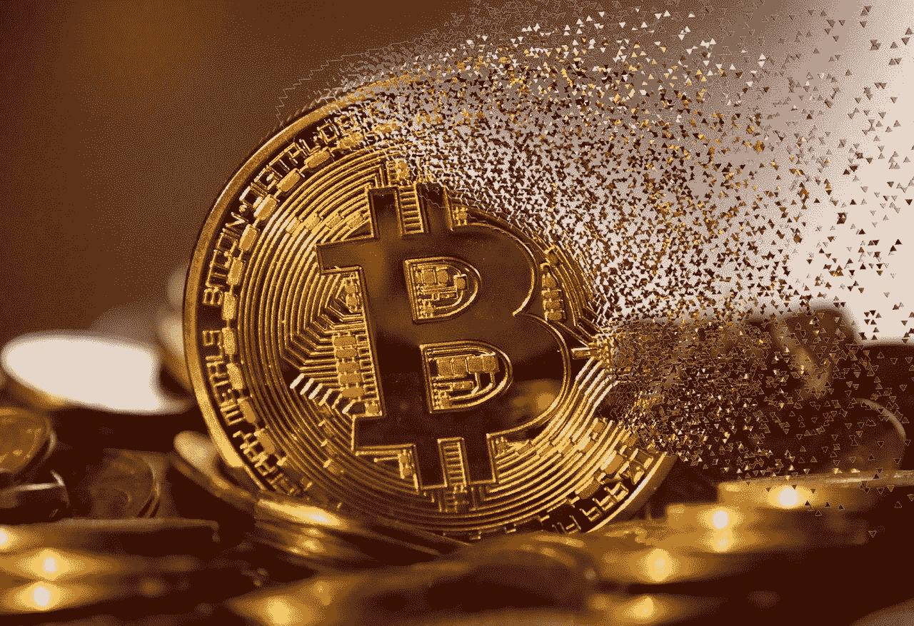
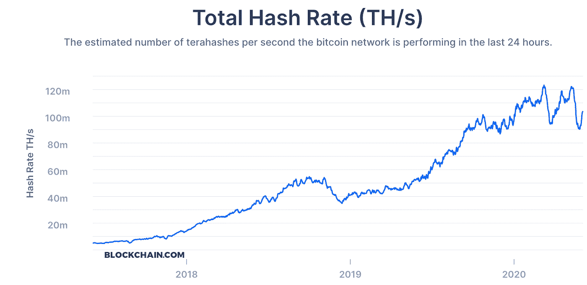
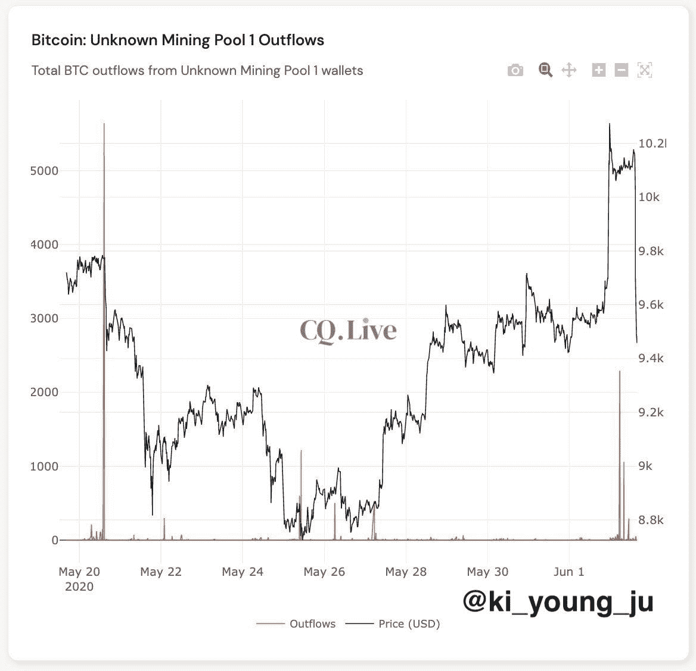
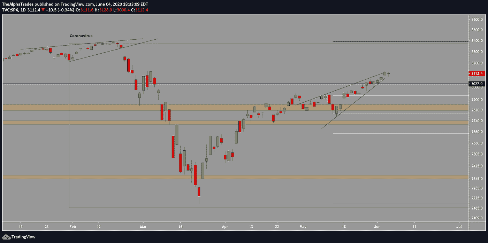
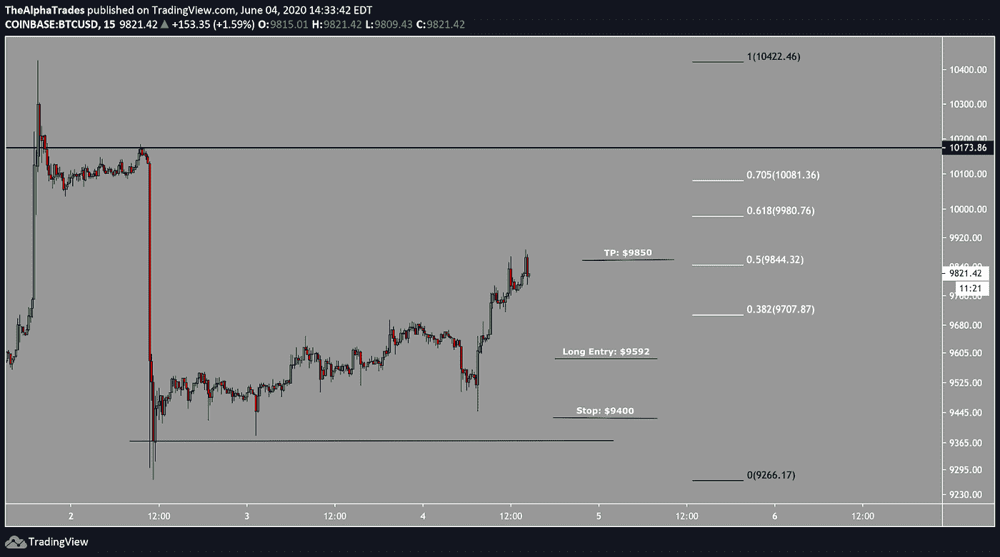
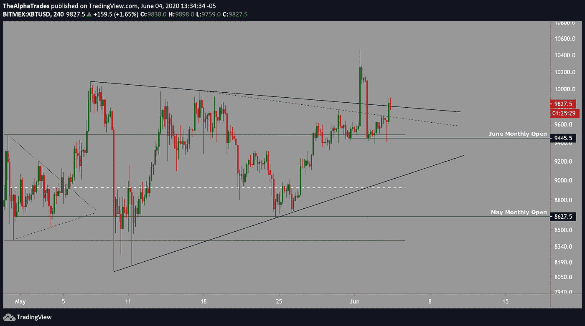
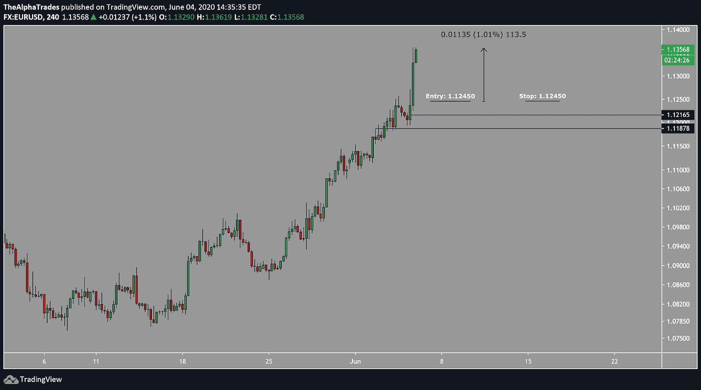
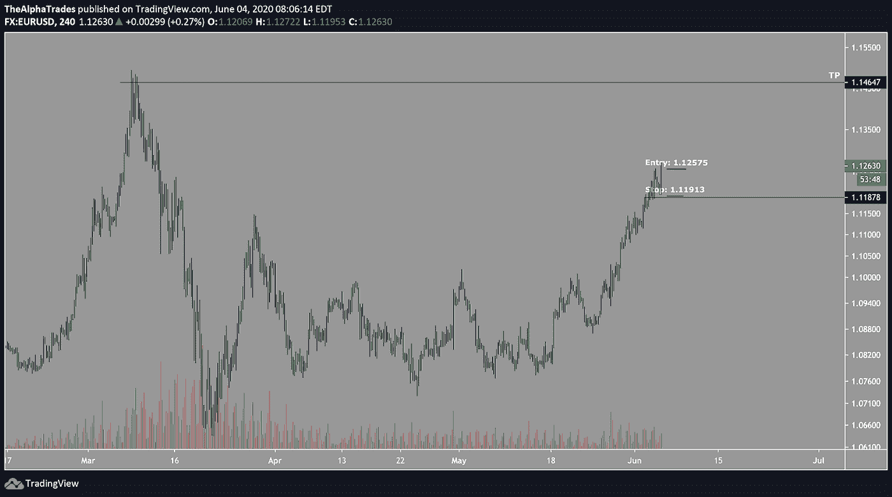
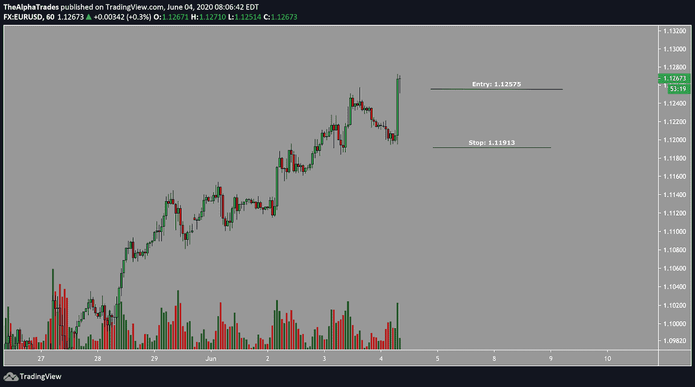

# 比特币到 2 万美元？没那么快，彭博

> 原文：<https://medium.datadriveninvestor.com/bitcoin-to-20-000-not-so-fast-bloomberg-2881f779be39?source=collection_archive---------9----------------------->

## 警惕主流新闻炒作像 BTC 这样不稳定的资产。

Bitcoin, Image by mohamed Hassan from Pixabay

**主题:**

*   彭博预测比特币将达到 2 万美元
*   挖掘难度下降
*   为什么替代硬币仍然无关紧要
*   我目前的市场地位概述

今天早上我的目标是 BTC 50%到 61.8%的 Fib 区域，我在 9592 附近做多。我也从平均 9585 开始在另一个账户上做空。

 [## 加密货币行业是死是活？数据驱动的投资者

### 九月初，我们在 X-Order 内部就代币市场的未来进行了一场辩论。有趣的是，我们的观点是…

www.datadriveninvestor.com](https://www.datadriveninvestor.com/2019/12/12/will-the-cryptocurrency-industry-be-dead-or-alive/) 

我今天早上进入的另一个交易是欧元对美元的多头头寸。我没有给出很多自由贸易设置，因为这些信息是为优势会员保留的，但我今天早上感觉很慷慨。继续滚动，找到我今天的比特币和外汇图表，但首先让我们来看一些新闻。

# 大部分情况下，忽略主流新闻。

[彭博今晨](https://www.coindesk.com/bloomberg-predict-20k-bitcoin-2020)预测比特币将在 2020 年接近其 20，000 美元的历史新高。说得轻一点，我认为零售商人没有一卡车的盐就接受那是愚蠢的。

# 挖掘比特币变得越来越容易

[挖掘新比特币难度今日调整约 9.29%](https://www.coindesk.com/bitcoin-mining-difficulty-drops-9-to-january-levels) 。这让那些在迄今为止产量减半的情况下幸存下来、并准备好了最先进的机械设备的矿商，更容易暂时获利。

Total Hash Rate Bitcoin; Source: [blockchain.com](https://www.google.com/url?q=http://blockchain.com&sa=D&ust=1591315989879000&usg=AFQjCNEuBxJUB8KLAUYiSZwyXIw74eJhIA)

# 一个未知的比特币矿池清算可能导致了下跌。

矿池不会那么快转移大量 BTC，除非他们打算以一个有吸引力的价格出售，而这个特定的矿工肯定认为 [BTC 正以合适的价格出售](https://cointelegraph.com/news/capitulation-by-unknown-miner-caused-the-dip-says-cryptoquant-ceo)。许多人猜测这是大型矿商的投降，但事实上，这可能是有目的的清算。

在我最近的 [Youtube 视频](https://youtu.be/huALemxAC2Q)和[媒体文章](https://medium.com/datadriveninvestor/bitcoin-fell-to-8600-in-under-2-minutes-next-steps-for-traders-and-investors-42a79a9ad1c1)中，我为你们的观众展示了一个关于 BTC 的优秀技术游戏计划。如果你想从长远角度看比特币在未来几年的发展，请阅读我的[2025 年比特币路线图](https://www.datadriveninvestor.com/2020/05/26/bitcoin-roadmap-to-2025/)文章。

Total Bitcoin Mining Outflows from Unknown Mining Pool 1 Wallets, source: @ki_young_ju

# 这不是把 FOMO 变成山寨币的时候

当像彭博这样的大型媒体巨头呼吁比特币在今年某个时候达到 20，000 美元时，因为该资产目前处于关键的几个月阻力位之下，我仍然对替代硬币和 BTC 国王持极度怀疑态度。社交媒体影响者可能会接受这种炒作，并利用它来推动项目，而不管它们在现实世界中的可行性，由于缺乏流动性，很可能会出现恐怖的故事。总之，如果你在积极交易代用币，我建议你要非常小心。

# 该指数正在形成一个上升的楔形

图表说明了一切，我们发布的这篇文章对其进行了分解。

SPX June 4, Source: Alpha Trades, LLC

# BTC 从今天早上就头皮发麻

今天早上我在 BTC 做了一个头皮多头仓位，平均进场 9590，止损 9500。我的出口在 9792 和 9850。我关闭了基于以太坊(ETH)的交易，这可能导致 BTC 下跌。

BTC trade 1, Source: Alpha Trades, LLC

BTC trade 1, Source: Alpha Trades, LLC

# 今天欧元对美元的交易是一个胜利

我在欧元兑美元的看涨蜡烛上建立了一个多头头寸，随后对之前的阻力进行了重新测试，该阻力转变为支撑，然后随着价格的下跌增加了一点仓位，平均进场价格为 1.12450，止盈目标为 1.14350。我以 0.23%的利润和 1.12450 的盈亏平衡止损退出了 50%。一旦交易结束，我会分享这个游戏的最终结果，我会让优势会员知道任何当前的发展。

EURUSD trade 1, Source: Alpha Trades, LLC

EURUSD trade 2, Source: Alpha Trades, LLC

EURUSD trade 3, Source: Alpha Trades, LLC

# 优势会员获得更多

[订阅 Discord 服务器](https://bit.ly/2KJ1oor)学习技术分析以及如何投资获利。要求第一个月的高级会员享受 50%的折扣！(优惠将于 6 月 15 日结束)查看以下视频了解更多信息。

Alpha Trades, LLC

# 放弃

Alpha Trades，LLC 提供的信息不用于制定任何财务决策，也不是购买、持有和/或销售特定产品、数字资产或 ICO 的请求或建议。

访问我们的完整服务条款:【https://bit.ly/3faVeeV 