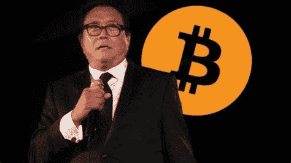

# 比特币登上月球——罗伯特·清崎相信 BTC

> 原文：<https://medium.datadriveninvestor.com/bitcoin-to-the-moon-robert-kiyosaki-believes-in-btc-bbb6684b007e?source=collection_archive---------6----------------------->

罗伯特清崎是最成功的金融书籍作者之一，他的书《富爸爸穷爸爸》昨天，周四，清崎发表了一些关于比特币，黄金，白银的想法。这位畅销书作者在其中形成了他对比特币课程进一步发展的看法。清崎还谈到了通货膨胀保护。

罗伯特·清崎凭借《富爸爸穷爸爸》这本书写了一本非虚构的书，这本书仍然是有史以来最畅销的 10 本金融书籍之一。

富爸爸穷爸爸首先向读者展示了金融教育的重要性。忠实于“成为你自己财务的主人”的格言，清崎让读者敏感地认识到储蓄和投资的正确方法。

与此同时，最畅销的汽车对近几个月金融市场的时事进行了评论。关于新冠肺炎和相关的货币政策措施，清崎反复呼吁硬通货和防通胀货币。

除了黄金，比特币是这里的主要焦点。在最近对畅销书作家安东尼·庞普利亚诺的采访中，他谈到了保护他的资产免受通货膨胀的影响。

金银是神的货币。比特币是人民的开源货币。

 [## 比特币 2025 年路线图|数据驱动的投资者

### 在这篇文章中，我将准确地描绘出我对未来几周、几个月和几个月比特币价格走势的看法

www.datadriveninvestor.com](https://www.datadriveninvestor.com/2020/05/26/bitcoin-roadmap-to-2025/) 

昨天，星期四，清崎简洁地在 Twitter 上透露了他大约 140 万名粉丝，比特币之旅将在那里继续。

同样清楚的是，清崎押注于比特币、黄金和贵金属银。但任何已经看过比特币标准的人都知道，白银不一定能被认为是硬通货。

两周前，清崎已经推荐购买比特币和黄金。假设我们将看到美元强劲贬值，清崎认为，知道你最终将拥有多少比特币很重要。

比特币击败黄金和白银。美元正在消亡。如果出现崩盘，重要的不是价格，而是你拥有多少黄金和 BTC。

我在每月一期的 [**简讯中分享了更多私密的想法，你可以在这里**](https://mailchi.mp/bf8f8e8ed697/keep-in-touch-with-lukas) 查看。请在评论中告诉我，并在各种社交媒体平台上加入我:

[**推特**](https://twitter.com/WiesfleckerL)●[**insta gram**](https://www.instagram.com/lukaswiesflecker/)●[**脸书**](https://www.facebook.com/lukaswiesfleckerr)●[**Snapchat**](https://www.snapchat.com/add/luggooo)**●[**LinkedIn**](https://www.linkedin.com/in/lukas-wiesflecker-1b11251a5/)**

**无论你做什么，都要带着爱和激情去做！**

## **访问专家视图— [订阅 DDI 英特尔](https://datadriveninvestor.com/ddi-intel)**