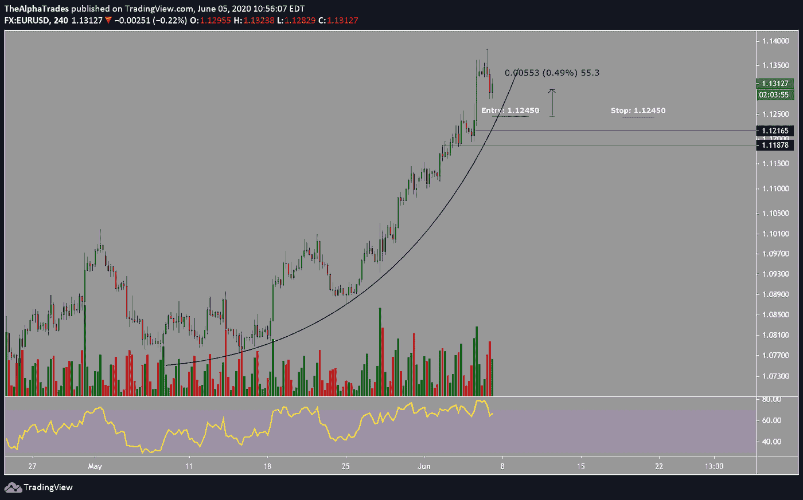
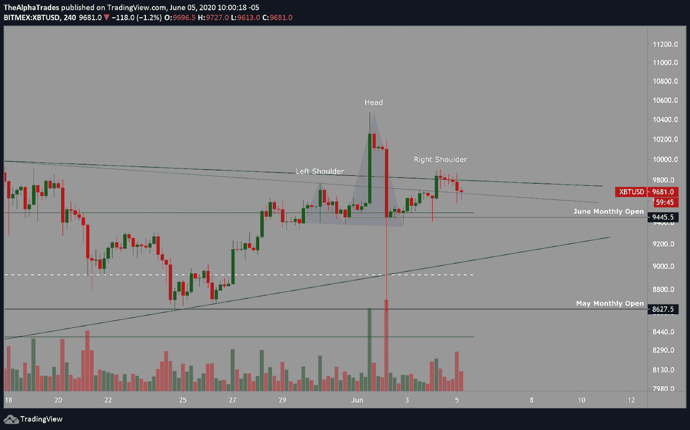
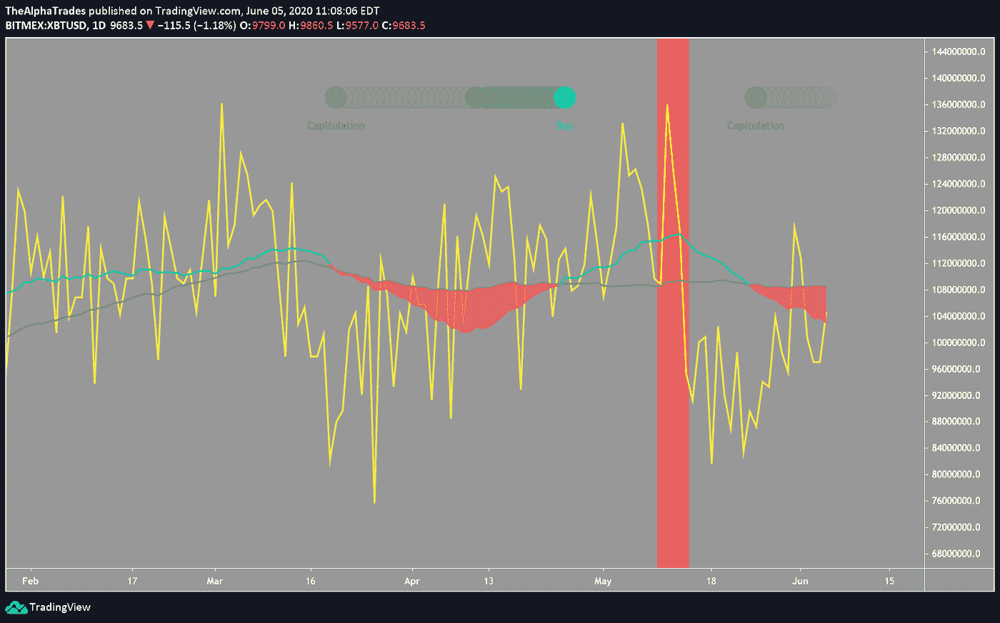

# 比特币——为什么我双向对冲

> 原文：<https://medium.datadriveninvestor.com/bitcoin-why-im-hedged-in-both-directions-59da4af88157?source=collection_archive---------13----------------------->

## 矿商还会继续抛售比特币，给交易员打折吗？

Bitcoin crypto, Image by Pete Linforth from Pixabay

读者，星期五快乐！

6 月 2 日，我在 BTC 以 9690 的均价进入了一个新的空头，止损点在 10600，之前我花了很长时间讨论[平仓我最近的波动交易空头](https://medium.com/datadriveninvestor/bitcoin-hits-10-000-now-what-2636924f8501)，因为大空头挤压止损了我的头寸。我仍然打算建立这个空头头寸，即使当机会出现时，我偶尔会在备用账户上建立头皮多头头寸。

让我们回顾一下我昨天分享的一些[交易](https://medium.com/datadriveninvestor/bitcoin-to-20-000-not-so-fast-bloomberg-2881f779be39)(点击查看相关图表截图)。我在 9592 附近进了一个头皮多头交易，止损 9500。我的出口在 9792 和 9850。我关闭了基于以太坊(ETH)的交易，这可能导致 BTC 下跌。

我愉快地退出了那笔交易，几个小时的工作净赚了约 2.7%。如果你想遵循我们的游戏计划，并了解我们为什么进入交易，我们现在为我们的优势会员提供 50%的折扣。进一步向下滚动页面，了解更多信息。

 [## 加密货币行业是死是活？数据驱动的投资者

### 九月初，我们在 X-Order 内部就代币市场的未来进行了一场辩论。有趣的是，我们的观点是…

www.datadriveninvestor.com](https://www.datadriveninvestor.com/2019/12/12/will-the-cryptocurrency-industry-be-dead-or-alive/) 

昨天的第二笔交易是欧元兑美元。我在欧元兑美元的看涨蜡烛上建立了一个多头头寸，并对之前的阻力进行了重新测试，该阻力转变为支撑，然后随着价格继续下跌，增加了一点仓位，平均进场价格为 1.12450，止盈目标为 1.14350。我以 0.23%的利润和 1.12450 的盈亏平衡止损退出了 50%。交易仍在进行，看起来有利可图，一旦交易结束，我会分享这场比赛的最终结果，我会让优势成员知道任何当前的发展。

EUR-USD trade, Source: Alpha Trades, LLC

# 比特币有可能正在形成头肩底模式。

我不认为这是一个严重的问题，因为被清算的大多是杠杆率过高的交易员。成交量与理想的[头肩顶形态](https://www.investopedia.com/terms/h/head-shoulders.asp)并不完全匹配，但这很可能是因为在最近的空头挤压中有多少成交量被吞没了。

Head and shoulders pattern on Bitcoin, Source: Alpha Trades, LLC

# 矿工继续投降

如前所述，比特币的哈希带状图发出警告，表明矿商正在投降。在昨日的交易中，我在讨论矿商投降的可能性的同时，讨论了流入秘密市场交易所的资金。流入的激增似乎是由一个不知名的大型矿池将大量比特币转移到交易所，以理想的价格出售。很难说这个矿池是否也是导致比特币做空的原因，也不清楚这家矿商是投降了还是只打算在这个价格出售，但当价格徘徊在 10，100 附近时，这个小窗口显然是这家矿商出售的理想水平。

Bitcoin Hash Rate Miner Capitulation; Source: Alpha Trades, LLC

直到下一个报告，保重，好好休息你的星期五。

# 优势会员获得更多

[订阅 Discord 服务器](https://bit.ly/2KJ1oor)学习技术分析以及如何投资获利。要求第一个月的高级会员享受 50%的折扣！(优惠将于 6 月 15 日结束)查看以下视频了解更多信息。

Bitcoin Miners are Selling; Source: Alpha Trades, LLC

# 放弃

Alpha Trades，LLC 提供的信息不用于制定任何财务决策，也不是购买、持有和/或销售特定产品、数字资产或 ICO 的请求或建议。

访问我们的完整服务条款:【https://bit.ly/3faVeeV 