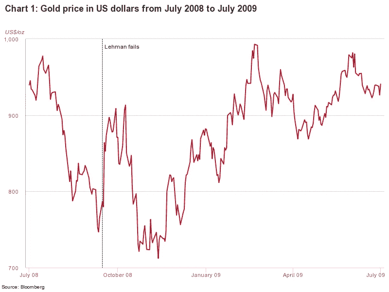

# 比特币不会保护你的钱免受新冠肺炎的攻击…

> 原文：<https://medium.datadriveninvestor.com/bitcoin-wont-protect-your-money-from-covid-19-46676b83094?source=collection_archive---------17----------------------->

## 如果疫情恐慌失控

新冠肺炎(冠状病毒)正在传播。它已经在整个亚洲牢牢扎根。它现在在欧洲，现在正在北美建立滩头阵地。

唐纳德·特朗普说，“在我们国家，一切都在掌控之中”。

疾病预防控制中心说，*“这不是一个是否的问题，而是一个病毒何时在北美扎根的问题，以及*“我们需要让美国公众做好准备，他们的生活可能会被这个疫情打乱”。–*(详见下面视频)*。**

[You-tubers](https://youtu.be/740ezQO98OU) 告诉他们的观众，比特币的回调不是问题，因为比特币与股市的相关性很低，比特币的牛市似乎仍然完好无损。

 [## 总部位于瑞士的 ETP 进入加密交易市场|数据驱动的投资者

### 虽然金融市场几乎没有沉闷的时刻，特别是在引入…

www.datadriveninvestor.com](https://www.datadriveninvestor.com/2019/03/10/swiss-based-etp-enters-the-crypto-trading-market/) 

我建议谨慎。如果冠状病毒恐慌继续失控，比特币不会免疫你的投资组合。

在这篇文章中；

*   日本对新冠肺炎的经验
*   为什么比特币爱好者低估了新冠肺炎威胁
*   雷曼危机后黄金价格的教训
*   每日更新的冠状病毒统计数据

It’s not a matter of ‘if’, it’s a matter of ‘when’

# 日本的新冠肺炎

我不想从历史的角度讲述整个冠状病毒事件，但我想分享一下我在日本的经历，让大家了解这次疫情恐慌可能会继续蔓延到其他国家。

当冠状病毒在武汉爆发时，人们在饮水机旁谈论它，但大多数人似乎同意，日本比中国对传染性流行病的准备更充分。然而，在内心深处，当我们听说 200 多万人在宵禁实施前离开武汉过春节时，我想每个人都有一种恐惧感。

日本全年都充满了中国游客。但是在中国新年期间特别忙。如果你在高峰日出行，机场安检队伍可能会长达数小时。一想到满载(可能被感染的)游客在日本旅游，听起来不是个好主意。

最初，有几个感染者分散在日本各地——主要是从中国旅行回来的人——但我认为没有人开始注意到这一点，直到横滨的游轮让所有乘客都留在船上，试图防止病毒在日本各地传播。

[Why do Japanese people wear masks?](https://theculturetrip.com/asia/japan/articles/why-do-japanese-people-wear-surgical-masks/)

事后看来，日本政府显然犯了错误。现在有 700 例新冠肺炎病例与钻石公主有关，4 人死亡。然而，这些数字可能不像最初听起来那么糟糕。

我经常和医疗专业人士一起工作，我承认，他们中的大多数人对新冠肺炎都出奇的放松。一般来说，我交谈过的医生会说，*‘定期洗手，不要摸脸。’*很明显[你不太可能吸入病毒](https://youtu.be/xWj9OUAfTLQ)，即使你与受感染的人很亲近。

另一方面，新闻已经证实日本只是在测试表现出严重新冠肺炎症状的人。一些人已经在储备食物，几周来，药店一直限制每位顾客只能购买一包口罩(每包大约 5 个口罩)。许多人现在认为病毒不容易被阻止，甚至有消息说可能会取消今年夏天的东京奥运会。

根据今天的统计数据，奥运会被取消似乎不太可能。然而，如果这个疫情失去控制，像取消奥运会这样的灾难真的发生了，还有什么其他重大的金融灾难即将发生？让我问你一个发人深省的问题；如果像日本和朝鲜这样纪律严明、组织严密的国家都无法消灭新冠肺炎，那么这种病毒会传播到什么程度呢？

不确定性对商业或股票市场都没有好处。不管你认为新冠肺炎有多危险，混乱已经开始引起恐慌。在我写这篇文章的时候，股票市场和加密市场已经连续经历了两个糟糕的日子，盘前交易看起来很糟糕，比特币的交易价格在 9200 美元左右。

# 比特币的支持者可能大大低估了投资者心理对价格的影响

比特币不是生意。与黄金或白银一样，比特币的价值源于稀缺性。由于比特币不是一项业务，它与股票和债券市场的相关性往往较低。许多比特币爱好者指出，这种低相关性是比特币投资者无需担心股市行情的原因之一。

一般来说，这是真的，但比特币投资者可能没有完全理解公众日益加剧的担忧。如果人们停止外出，停止工作，停止购买产品，所有这些都通过媒体传播，股票和密码市场将继续恐慌。

# 衰退中的黄金价格

如果比特币是加密宇宙中的黄金，那么我认为值得仔细研究一下 2008 年大衰退期间黄金的价格走势。

一般来说，在衰退中，股票往往表现不佳，而黄金往往表现良好。我们还没有看到衰退期间比特币的价格，然而，大多数人都认为比特币也是一种有效的通胀对冲工具，在衰退中也可能表现良好。然而，在市场恐慌时，所有东西都卖现金。股票，黄金，是的，我相信比特币也会。

> 雷曼兄弟于 2008 年 9 月 15 日破产。黄金在整个危机中的表现如何？图表 1 显示，没有迹象表明黄金从 2008 年 7 月到 2009 年 7 月快速上涨。事实上，黄金在 2008 年第四季度下跌，因为美元走强，黄金被用作流动性来源(并被出售)。尽管当时令许多观察人士感到失望，但我们在其他地方也看到过这种情况:当避险情绪袭来时，投资者的第一反应是抛售资产，奔向美元的避风港。— [黄金枢纽](https://www.gold.org/goldhub/research/gold-investor/gold-investor-february-2019/the-gold-perspective-10-years-after-lehman-brothers-failed)

Gold prices during the Great Recession

# 买卖前要考虑的事情

1.  显然，新冠肺炎病毒正在蔓延。真正的问题是它会蔓延多远，速度有多快？
2.  今天，中国有超过 78，000 例感染和 2700 例死亡——一个有 13.9 亿人口的国家，感染率似乎在下降。[冠状病毒更新](https://www.worldometers.info/coronavirus/)。
3.  经济仍然相当强劲，股票市场(和加密市场)在经历了几个月的上涨后都将出现回调。

我绝对不是传染病专家，但目前的统计数据表明，新冠肺炎感染率还没有完全失控。也有一些迹象表明一种[药物疗法](https://www.investorideas.com/news/2020/biotech/02242StockBites-GILD.asp)可能不远了。

如果感染人数持续下降，也许不会有最初担心的那么大的经济损失。在这一点上，金融和加密市场的最大风险似乎来自投资者没有做好关于这场危机的功课，恐慌，不惜任何代价清算资产。

在你买入或卖出之前，底线是——市场已经恐慌，加密货币价格与股市下跌的相关性高得令人不安。密切关注感染人数。如果它们再次开始快速上涨，特别是在其他金融和工业中心，我会准备好承受更多的金融痛苦，因为如果疫情恐慌失控，比特币将无法保护你的钱不受新冠肺炎的影响。

# 披露——我是长比特币。在做出任何投资决定之前，请寻求专业建议。

我是爱德华·伊夫蒂——如果你想了解更多关于颠覆性投资的知识，我鼓励你阅读更多