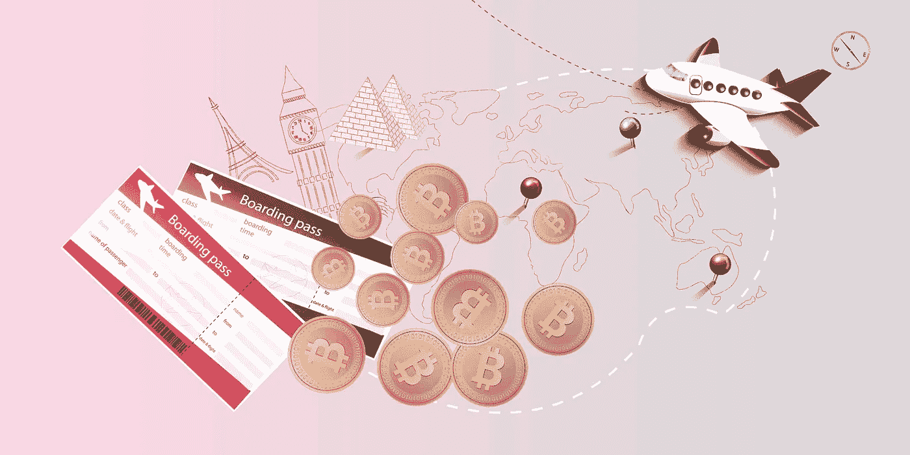

# 将你的旅行体验“比特币化”

> 原文：<https://medium.datadriveninvestor.com/bitcoinize-your-travel-experience-8e75b425423?source=collection_archive---------27----------------------->

## 可以用比特币环游世界吗？

当大多数人想到购买机票或进行其他与旅行相关的购物时，他们可能会从钱包中掏出信用卡。但是你知道你可以用一种数字加密货币支付吗，比如比特币？

一些服务已经开始接受加密支付，不仅是商品，还有服务。如今，许多旅行社、航空公司和预订平台都通过接受比特币来获得导游服务、旅行，当然还有购买机票和预订酒店，从而变得越来越受欢迎。

 [## 总部位于瑞士的 ETP 进入加密交易市场|数据驱动的投资者

### 虽然金融市场几乎没有沉闷的时刻，特别是在引入…

www.datadriveninvestor.com](https://www.datadriveninvestor.com/2019/03/10/swiss-based-etp-enters-the-crypto-trading-market/) 

支付过程非常类似于用信用卡或借记卡支付。如果你在网上购物，你只需选择比特币作为支付方式。然后，您将被重定向到一个支持网站，在那里您将按照指示完成支付。

## 用比特币旅行的好处

比特币的主要优势是外部当局无法控制它。它无法在边境检查站被检查，也永远不会面临任何当局的审查。你可能知道，带着大量的钱旅行是很危险的。比特币的数字投资组合降低了被抓住的风险。

与其他信用卡和借记卡支付相比，比特币支付的另一个优势是货币转换更简单，因为在国外没有交易费用。由于比特币具有高度的匿名性(不完全是，但比普通货币更高)，旅行者更少暴露于身份盗窃，因为交易不需要个人信息。

## 预订航班和酒店

组织旅行的第一步是**买机票**和**订酒店**。澳大利亚 [Webjet](https://www.webjet.com.au/) 、[挪威航空](https://www.norwegian.com/)、台湾[远东航空](https://www.fat.com.tw/) (FAT)、拉脱维亚 [AirBaltic](https://www.airbaltic.com/) 、日本 [FlyPeach](https://www.flypeach.com/en) 都是接受比特币支付国内和国际航班的航空公司。你只需要决定你的航班目的地，日期，填写你的联系方式，并选择支付方式(用比特币支付)。

有很多预订平台和旅行社，它们提供同时预订你的航班和酒店或其他交通服务。 [Travala](https://www.travala.com/) ，[bt 携程](https://btctrip.com/)， [AirTreks](https://www.airtreks.com/) ，[未来。旅行](https://future.travel/)、 [Abitsky](https://www.abitsky.com/) 、 [Cheapair](https://www.cheapair.com/) 、 [Destinia](https://destinia.us/) 、[Fluege.com](https://www.fluege.com/de/)、 [9Flats](https://www.9flats.com/) 是接受比特币最好的预订服务。

网上购物卡商店[Gyft.com](https://www.gyft.com/)和[eGifter.com](https://www.egifter.com/)在 200 多家零售商处购买购物卡，包括[美国航空](https://www.aa.com/homePage.do)、[达美航空](https://www.delta.com/)、[Hotels.com](https://hotels.com/)和[西南航空](https://www.southwest.com/)。比特币还可以通过 Fold app 礼品卡在 [**Airbnb**](http://www.airbnb.com) 预订房屋。这是给你所爱的人一个惊喜的好机会。

在这个仍然年轻的生态系统的当前状态下，使用比特币支付你的旅行似乎是不可能的。但是也有人一直这么做，主要是因为比特币相对于国家货币有很多优势。

***如果您想了解更多，请访问 BIDITEX 页面并提出您的问题，关注我们的*** [***推特***](https://twitter.com/biditex_com) ***，*** [***脸书***](https://www.facebook.com/biditex/) ***，*** [***中型***](https://medium.com/@biditex) ***，*** 用[***bidi tex***](http://www.biditex.com/)***投标你的空格。***