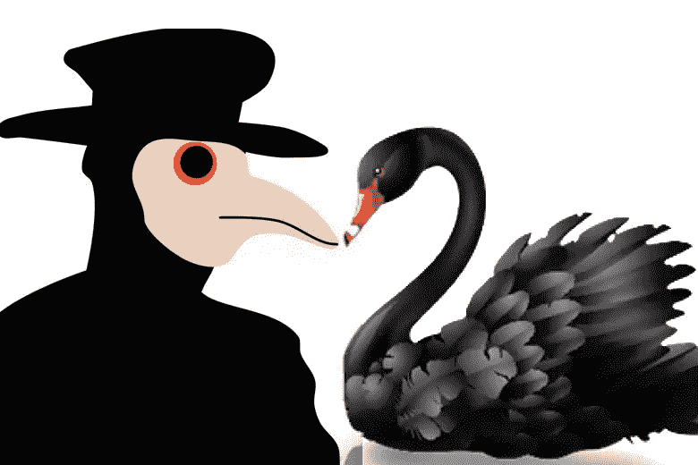
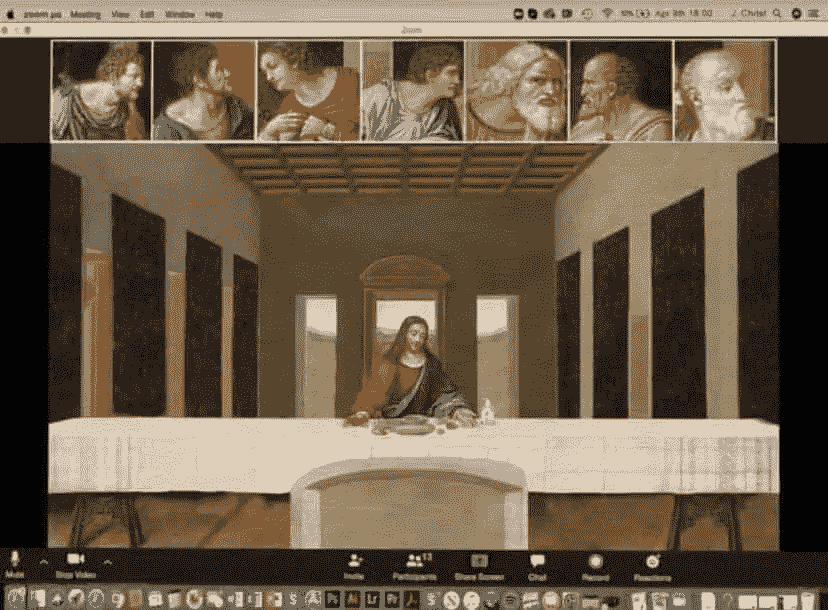

# 黑死病、黑天鹅、黑色星期二——后病毒时代

> 原文：<https://medium.datadriveninvestor.com/black-death-black-swan-black-friday-a-post-virus-world-73a067716bf5?source=collection_archive---------7----------------------->

几乎出自一部网络朋克小说:人们通过视频聊天吃晚餐，危险物质处理工人喷洒在空荡荡的街道上，小孩子从不出门&和老师开电话会议，空空的杂货店货架，戴着面具的人在加油站相互躲避，zoom 上的教堂服务。数字化转型、末日准备、强迫行为、对“增长型经济”的不信任是一些正在成为主流的概念。电晕病毒疫情正在改变未来世界。

与 9/11 或抵押贷款危机类似，covid19 疫情是一个改变模式的里程碑，将在未来几十年产生二级和三级级联效应。市场一片混乱，政府的无能暴露无遗，生活支离破碎。这场危机可能是我们这个时代的黑天鹅(一个突然出现、有重大影响、事后往往被不恰当地合理化的事件)。

黑死病(1347-1350)也是一场毁灭了欧洲和亚洲人口的疫情。它标志着意大利一个时代的结束，其影响是深远的，它导致了广泛的社会、经济、文化和宗教变革，从而导致了文艺复兴。也许没有那么明显，但在这次疫情之后，生活的主要方面肯定也会改变。

# 世界不是平的

经过多年的全球化，疫情迫使各国孤立和自我维持。这种情况惩罚了高度依赖外部的国家。后病毒时代，我们会发现全球化哲学受到了不可修复的破坏。国际贸易的减少可能会导致更高的成本和更低的生活质量，但更稳定。

# 数字化转型

在咨询界，这是一个非常流行的概念和赚钱项目。几乎所有的大公司都经历过或正在涉足“数字化转型”议程，因为他们不想在新经济中落后，或被“优步化”。但是，如果没有一个真正令人信服的立即行动的理由，这些计划就会进展缓慢，遇到阻力，而且往往会失败。然而，疫情已经表明了采取行动的令人信服的理由。所有的公司突然不得不适应远程工作和远程服务他们的客户。视频会议软件 Zoom 的股价已经翻了一倍，因为从日托到医生等一系列企业开始大规模使用视频会议。在疫情之后，我们可能会看到越来越多的数字适应。这将导致效率的提高和更灵活的经济发展。

> 毕竟电晕病毒引领了数字化转型。不是 CEO，不是顾问，不是敏捷宣言，不是硅谷。

Digital transformation - Remote work - Teleconferencing

# 生产变化

企业可能会从这次疫情中质疑即时生产和跨国依赖。供应链现在可能更倾向于本地生产。库存可能会增加，以快速应对潜在的中断。这将导致更高的成本，因此个人的生活成本会增加；一个更有弹性的世界的代价。

 [## 2020 年最佳短期投资选择精选资源|数据驱动型投资者

### 投资是增加你净财富的一个好方法。如果你通过遵循一个严格的…

www.datadriveninvestor.com](https://www.datadriveninvestor.com/2020/03/28/handpicked-resources-for-the-best-short-term-investment-options-of-2020/) 

# 开源和道德黑客

人们破解了水肺面罩，并将其用于医院。麻省理工学院正在向开源社区发布一款制作说明的廉价呼吸机。开源和修补程序社区的力量已经被疫情带到了聚光灯下。这些可能会吸引更多的资金和人们的兴趣。这一趋势可能会从生存主义趋势中获得更多的力量。

# 生存主义

生存主义是个人或团体(称为生存主义者或准备者)积极准备应对紧急情况的运动，包括社会或政治秩序可能出现的混乱。生存主义还包括为个人紧急情况做准备，如失业或被困在野外或恶劣天气条件下。重点是自力更生，储备物资，获得生存知识和技能。生存主义者通常接受紧急医疗和自卫培训，储备食物和水，准备自给自足，并建造诸如生存避难所或地下避难所等可以帮助他们在灾难中幸存下来的建筑。

迄今为止，预科生一直被视为有点疯狂。后电晕，可能越来越多的人将有一个潜在的启示场景植入他们的大脑。

# 金融悲观主义和不信任

市场受到了由多种因素同时引发的海啸的冲击。这与黑色星期二没有什么不同:1929 年华尔街崩盘始于 9 月，止于 10 月下旬，当时纽约证券交易所的股价暴跌。考虑到其后果的全部程度和持续时间，这是美国历史上最具破坏性的股票市场崩溃，并标志着大萧条。

多年来不负责任的资金注入经济，过度膨胀的估值受到电晕病毒和石油输出国组织震慑的打击。许多人已经失去了一半的退休金。展望未来，现金可能会在投资组合中占据更大份额，从而压低整体股票估值。股票、黄金、比特币，几乎所有资产类别都崩盘了。也许这是我们这个时代的第一只黑天鹅。

> 我们经历了互联网泡沫，抵押贷款泡沫。也许称之为万物泡沫是公平的。

# 暴露的政府

一些政府暴露出无力应对危机。随着我们的前进，这可能会改变人们对世界领导地位的看法。哪个政府反应最好，帮助他人，预见即将发生的事情。大多数政府在财政上帮助他们的公民。但一些政府实际上要求捐款，表明腐败的严重性和缺乏应急资金。

# 加密货币和区块链

在疫情时期，比特币未能实现其作为类似黄金的财富储存手段的前提。它的价格也随着股票一起下跌。很明显，人们不太信任加密货币，不会把他们的财富放在那里。至少现在还没有。然而，区块链技术将成为后危机时代的赢家。分散化本来可以避免我们经历过的许多因单点故障而导致的崩溃。

# 社会生活

在一起的独处时间会对关系产生什么影响？离婚会增加还是减少？我们会看到新一代婴儿潮吗？社交媒体参与度和电脑游戏销量会增加吗？会有更多的强迫行为吗？很多未知。

也可以看看这些故事:

[冠状病毒顿悟](https://medium.com/@ermanakdogan/corona-virus-epiphanies-9fe03e5020c7)

[股票还是卫生纸——疫情购物清单](https://medium.com/@ermanakdogan/stocks-or-toilet-paper-pandemic-shopping-list-afa370a32ced)