# 黑色星期五:顾客打算花多少钱？

> 原文：<https://medium.datadriveninvestor.com/black-friday-insights-and-prediction-16933b8a8bfb?source=collection_archive---------3----------------------->


source :- Google

# 数据科学案例研究

***您好👋，各位数据科学家和非数据科学家，***

***首先，我很高兴你在这里，这是我第一篇鼓励自己走向数据科学的文章。我不擅长写文章或英语。本文如有瑕疵，请见谅。***

# 介绍

在本文中，我们将讨论黑色星期五，比如它对购物者和零售商有多重要，以及基于历史交易数据的见解。

在本案例研究中，我们将遵循 **CRISP-DM 流程(数据挖掘的跨行业流程)**。以下是这个过程的各个阶段，

1.  **业务理解**
2.  **数据理解**
3.  **准备数据**
4.  **数据建模**
5.  **评估结果**
6.  **部署**

我们将涵盖除部署之外的所有阶段。

好吧，但首先让我们谈谈这个非常特殊的日子。

> **什么是黑色星期五？**
> 
> 很可能你们都知道，这是一个典型的充满特别购物交易和大折扣的日子，被认为是假日购物季的开始。这个季节对经济至关重要，尤其是对零售商而言。
> 
> 你等了整整一年才在网络平台和实体店抢到最好的**优惠/折扣**。😉
> 
> 但是你可能不知道黑色星期五的由来，
> 
> 那么为什么取这个名字呢？有人说这一天被称为“黑色星期五”,因为“黑色”一词指的是有利可图，这源于旧的簿记惯例，用黑色墨水记录利润，用红色墨水记录损失。这个想法是，零售企业在本周五卖出足够多的商品，让自己在今年剩下的时间里“盈利”。

# 1.商业理解

零售商花了整整一年来计划他们的黑色星期五销售。他们利用这一天为积压的存货提供尽可能低的价格，并为季节性商品、电子产品、装饰品等提供打折优惠。

由于大折扣和大优惠，消费者也要等一整年才能在黑色星期五购物。黑色星期五广告的内容通常被寄予厚望，以至于零售商竭尽全力确保他们事先不会公开失败。

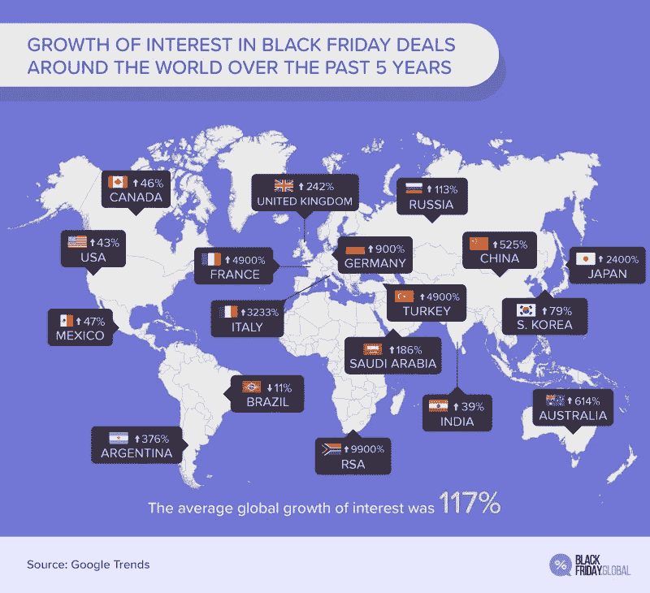

根据 **2018** 数据，全球对黑色星期五销售的平均兴趣增长为 **117%** 。这就是为什么今天对零售业来说是一个关键且有利可图的日子。这也为零售商创造了新的竞争，为了跟上这种竞争，零售商需要更深入地研究先进的黑色星期五营销策略。

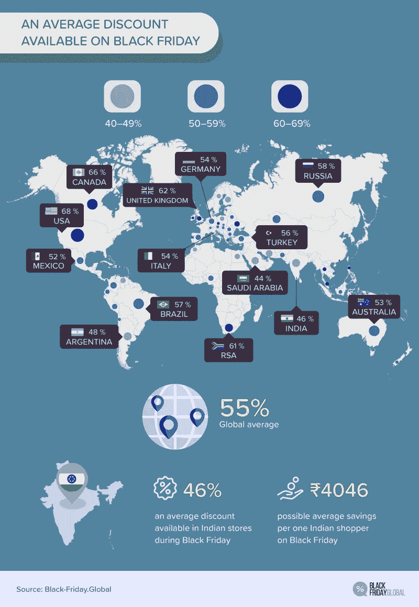

零售商需要适当的数字和更好的洞察消费者在黑色星期五的历史交易数据，以了解消费者的购物特征和趋势产品。

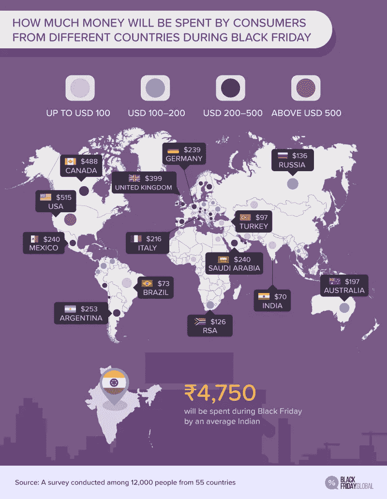

This report was created based on data provided by Picodi.com — a global discount provider existing since **2010**. Black-Friday.Global — dedicated to Black Friday deals — was created by Picodi.com. **12,000** participants from **55** countries took part in the survey.

在此基础上，他们可以针对不同类型的客户实施和应用不同类型的营销策略，并提供折扣来吸引他们。

好了，现在我们知道了黑色星期五及其重要性。那么，让我们从数据开始。😊

# 2.数据理解

**数据采集**:

对于这个案例研究，我们将从 [Kaggle(黑色星期五)](https://www.kaggle.com/sdolezel/black-friday)下载数据集。这个数据集有两个文件 **train.csv** 和 **test.csv.** ，因为我们没有参加比赛，所以我们将只使用 **train** 数据。

**数据可视化:**

让我们显示前 5 行训练数据和所有字段的一些基本信息，

```
train_df = pd.read_csv("./kaggle/input/black-friday/train.csv")
train_df.head()
```


Every row has unique pair of (User_ID, Product_ID)

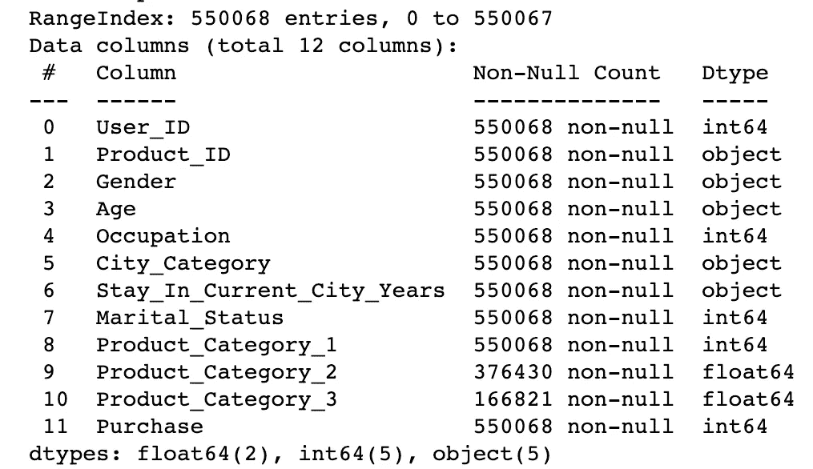

```
Total Transactions -> 550068
Total unique users -> 5891
Total unique products -> 3631
```

查看数据，我们可以得出这样的结论:我们总共有 12 个列的**，总共有 550058 个**交易行的**， **5891 个**唯一用户，以及 **3631 个**唯一产品。我们有 7 个数字变量和 5 个对象变量。除了两列 **Product_category_2** 和 **Product_category_3，我们没有任何缺失值。**我们会在后面的数据预处理部分处理。**

我们还将计算与数据框列相关的统计数据汇总。

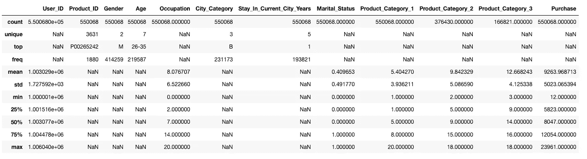

在上图中，如果您尝试查看**职业**字段，它的所有四分位数(最小值、25%、50%、75%和最大值)都是整数，同样的情况也适用于**婚姻状态**、**产品类别 1、产品类别 2 和产品类别 3** 列。显然**、职业**和**婚姻状况**必须被认为为**分类**列。但是我想知道剩下的 3 列🤔，比如它们包含实际值还是只是不同类别的标签？😕。我们很快就会知道了😎。

好了，现在我们对数据有了一个大概的了解。那么，让我们从一些与事务总数 count 相关的问题开始。

> **问题:-**
> 
> 1.哪个年龄段做的交易比较多？
> 2。男性比女性做的交易多吗？
> 3。用户的职业与交易次数有关系吗？
> 4。在城市居住 1 年以上的用户是否做了更多的交易？
> 5。城市类别对购买数量有影响吗？
> 6。婚姻状况与黑色星期五购买价值有关联吗？

为了得到上述问题的答案，我们需要特定领域的计数图。我们将使用 **seaborn** 库来创建很酷的图表。这是一个很棒的图书馆。

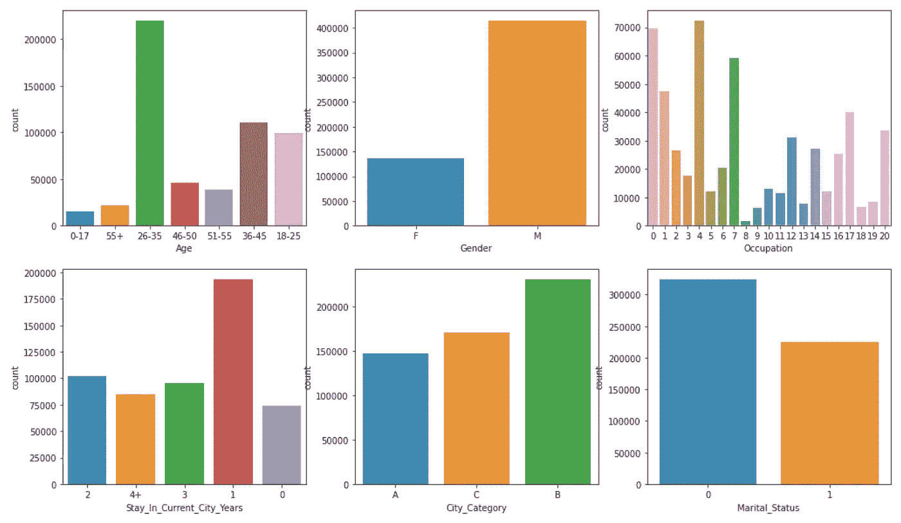

> **答案:-**
> 
> 1.在图 1 中，26-35 岁年龄段的人进行了更多的交易。
> 2。在图 2 中，男性用户完成了更多的交易。
> 3。在图 3 中，职业为 0 和 4 的用户进行了更多的交易。
> 4。在图 4 中，在当前城市停留 1 年的用户完成了更多的交易。
> 5。在图 5 中，B 类城市的用户完成了更多的交易。
> 6。在图 6 中，尚未结婚的用户进行了更多的交易。

哦，现在越来越有趣了。🎃

我们也来谈谈**总采购金额**。👍

> **问题:-**
> 
> 1.哪个年龄段的人在黑色星期五花费更多？
> 2。女性比男性花费更多吗？
> 3。用户的职业和黑色星期五花钱有关系吗？
> 4。在城市居住 1 年以上的用户是否花了更多的钱？
> 5。城市类别对总购买量有影响吗？
> 6。婚姻状况与黑色星期五购买价值有关联吗？

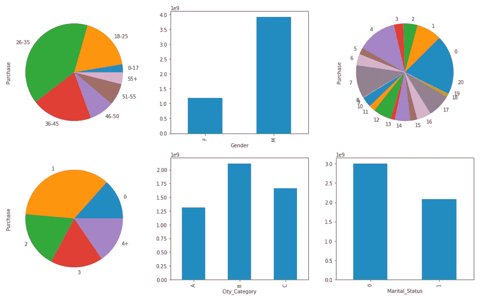

> **答案:-**
> 
> 1.在图 1 中，26-35 岁年龄段的人花了更多的钱。
> 2。在图 2 中，男性用户花了更多的钱。
> 3。在图 3 中，职业为 0 和 4 的用户花了更多的钱。
> 4。在图 4 中，在当前城市停留 1 年的用户花了更多的钱。
> 5。在图 5 中，B 类城市的用户花了更多的钱。
> 6。在图 6 中，还没有结婚的用户花了更多的钱。

嗯，我想你可能想知道为什么我们对这两个问题有相同的答案，为了消除这种困惑😕我们需要对**平均购买金额**做同样的练习。

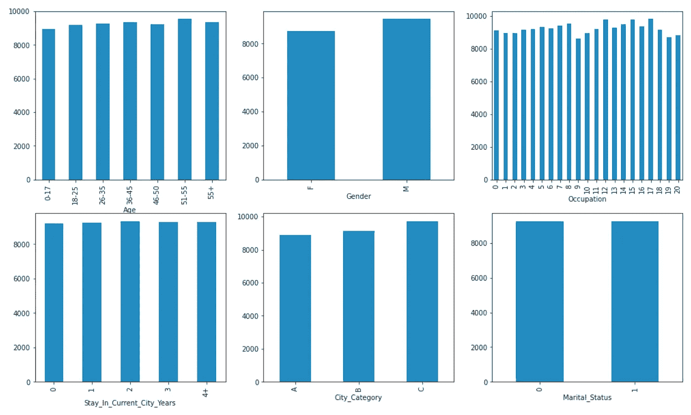

从上面的数字，我们可以得出结论，我们的怀疑是正确的。因为每个类别在每个领域都有几乎相同高度的横条。这消除了困惑。

好了，再加一个组性别，看看会得到什么见解。


好吧，这件事我无能为力。但是根据数据显示，男性平均花费比女性多。所有的领域都是一样的。

下一个是令人兴奋的，是结对图😉。

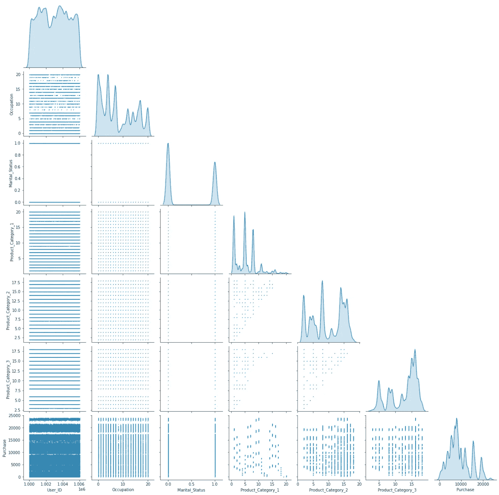

远远高于 Pair-plot 并没有给出关于数值字段之间的相关性的更好的见解。另外，查看所有三个产品类别字段。这有点令人困惑🤔。下一阶段我们一起想办法。👍

# 3.数据预处理

现在，我们对数据有了理解，也有了一些见解，但我们需要一个经过训练的**机器学习模型**，它可以预测消费者将花费多少钱，为了训练机器学习模型，我们需要一个格式良好、结构化和干净的数据。

将原始数据清理、结构化并丰富为所需格式的过程被称为**数据角力**，有时也被称为 ***数据角力* /清理。**这个过程花费了数据科学项目大约 80%的时间。这就像做饭一样，我们需要准备好所有的材料，这需要太多的时间。

首先，我们需要处理缺失的值。所以，让我们检查缺失值的百分比，

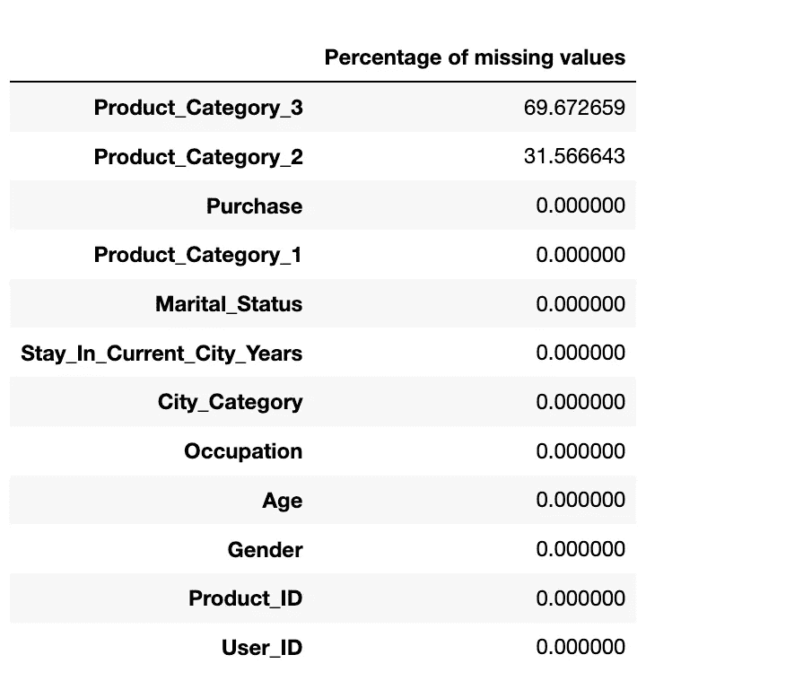

如您所见，我们只有两个字段缺少值。 **Product_Category_3** 带 **69.67%** 和 **Product_Category_2** 带 **31.57%** 缺失值。

我们可以使用几种估算方法来填补缺失值。因此，我们可以使用 mean 方法来填充 **Product_Category_2 中的值。**但是对于 **Product_Category_3** ，我们讨论的是 70%的缺失值。在我们估算任何东西之前，我们需要澄清我们的困惑。这样我们就可以看到唯一的 product_ID = " **P00265242** 的所有交易数据。

```
train_df.loc[
train_df.Product_ID=="P00265242",["User_ID","Product_ID","Product_Category_1","Product_Category_2","Product_Category_3"]
]
```

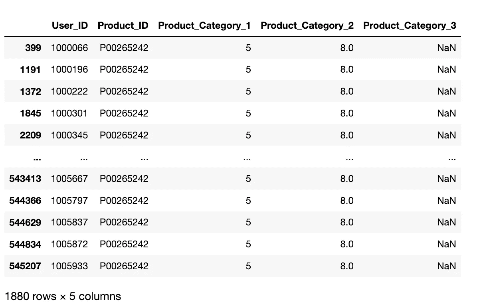

看到最后一个查询的结果后，我可以看到所有三个产品类别字段都包含标签，而不是实际值。让我们为这三个字段创建计数图。

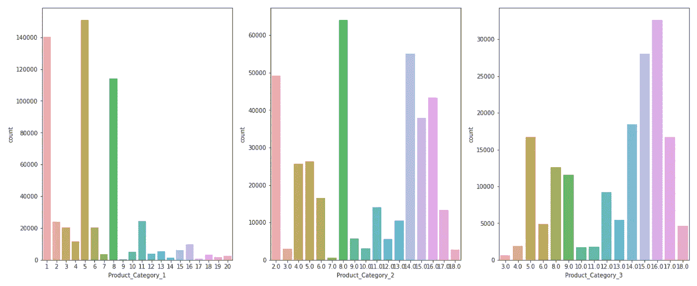

因此，我们不能仅仅使用平均法来估算这些值。还有，中位数/众数也会让数据有些偏差。我们能做的是创建另一个标签，它将代替 **Nan** 值。让我们使用 0.0 作为缺失值，将其输入到两个字段中，并再次检查缺失值的百分比。

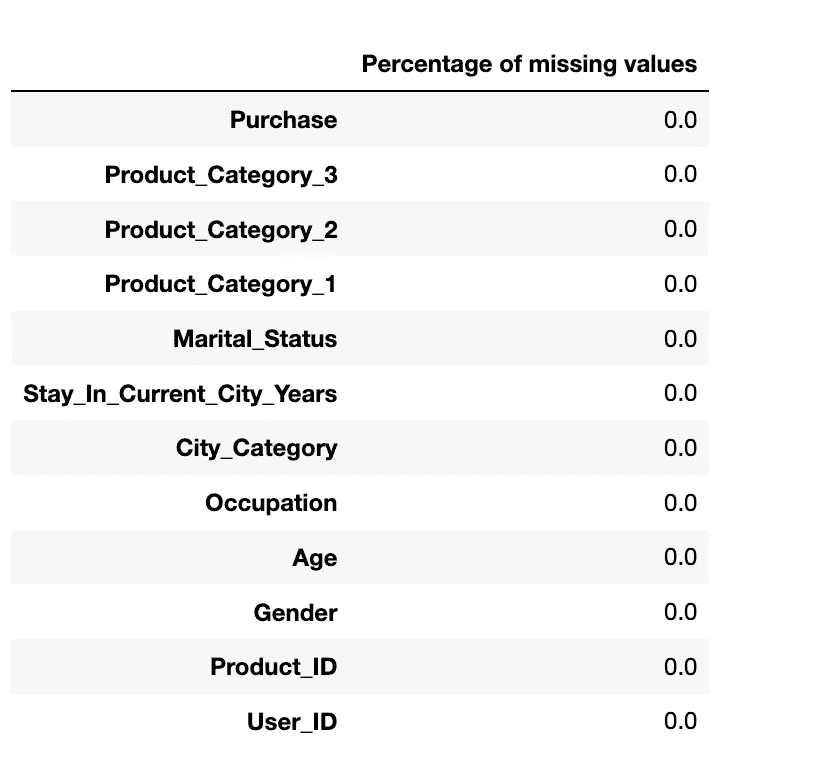

所以我们有所有的值，不再有丢失的值。现在，我们可以转换我们的数据，以便我们可以将数据输入到机器学习模型中进行训练。

对于数据转换，我们需要分别处理分类列和数字列。如果我们再看看数据。我们不需要 **User_ID** 和 **Product_ID** ，因为这些只是识别号，不会给我们任何信息。所以首先我们必须删除这些列。

```
train_df = train_df.drop(['User_ID', 'Product_ID'],axis=1)
```

现在，我们只剩下所有的分类字段，几乎所有的字段都有数字标签，除了**年龄**、**停留 _ 当前 _ 城市 _ 年数、城市 _ 类别、**和**性别。**为了将字符串值转换为标签，我们将使用名为 **LabelEncoder** 的 **scikit-learn 的预处理**方法，对于一键编码，我们将使用 pandas 内置方法 **pandas.get_dummies** 方法。我们将使用 LabelEncoder 拟合和转换前三列的值，使用 get_dummies 方法拟合和转换性别列的值。

```
le = LabelEncoder()train_df["Age"] = le.fit_transform(train_df["Age"])train_df["Stay_In_Current_City_Years"] = le.fit_transform(train_df["Stay_In_Current_City_Years"])train_df["City_Category"] = le.fit_transform(train_df["City_Category"])train_df = pd.get_dummies(train_df, prefix=["Gender"])
```

转换后所有字段之间的相关性是什么？

让我们创建一个相关值的热图。

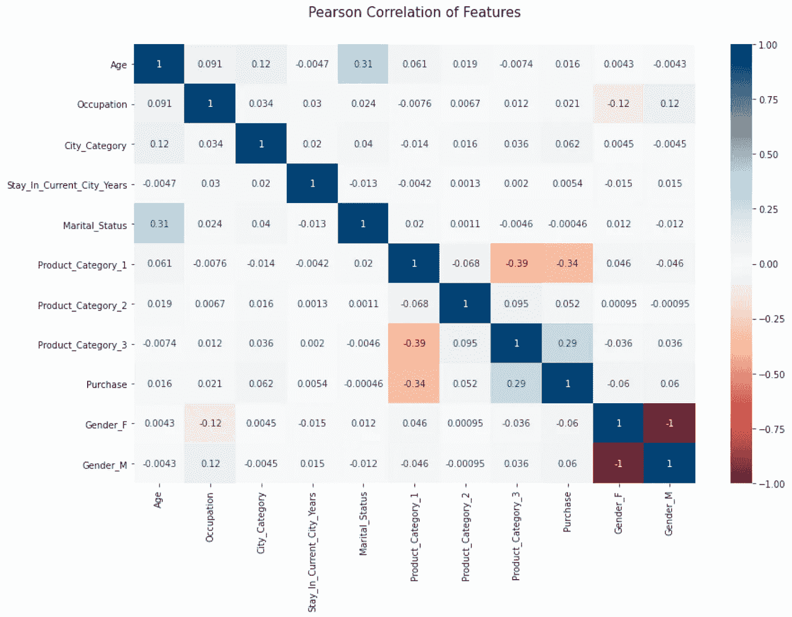

根据热图，我们在购买和产品类别之间有一些关联。
现在我们已经有了格式良好且干净的数据。因此，让我们创建两个数据框，一个用于所有独立字段，另一个用于相关字段(目标字段)。

```
X = train_df.drop(columns='Purchase')
y = train_df['Purchase'].valuesInput shape -> (550068, 11)
Output shape -> (550068,)
```

下一步是数据建模。

# 4.数据建模和**评估结果**

在这个阶段，我假设你已经很了解机器学习及其工作原理。所以，我们不打算在这篇文章中讨论这个理论。我们直接去训练几个**有监督的机器学习**模型，逐个评估结果。

在此之前，我们将使用 **train_test_split** 方法将我们所有的数据分成两组:训练集和测试集。训练集将用于适应我们的模型。训练数据总是用于学习、调整模型参数以及最小化输出误差。其余的数据(测试集)将用于评估结果。

```
X_train, X_test, y_train, y_test = train_test_split(X, y, test_size=0.3, random_state=42)
```

我们将数据分为训练和测试，70%训练，30%测试。两个数据集形状是，

```
Input train shape -> (385047, 11)
Input test shape -> (165021, 11)
```

**机器学习模型:**

让我们照常从线性回归开始😅,

1.  **线性回归**

```
lr = LinearRegression(n_jobs=-1)
train_and_evaluate(lr,X_train,y_train,X_test,y_test)
```

在上面的代码片段中，我使用了 **train_and_evaluate** ，这是我自己创建的一个方法。在该方法中，模型被输入训练数据，在模型被训练后，我们使用两个指标 **R-2 得分**和 **RMSE** 误差来评估模型的结果/性能。

```
Train R-2 Score -> 0.1530319738650423
Test R-2 Score -> 0.1502225848000539

=============================================

Train RMSE  -> 4623.897758674754
Test RMSE  -> 4627.777465694635
```

好吧，这个结果很糟糕。没想到这么低。让我们看看接下来会发生什么。

**2。KNN 回归量**

```
knnreg = KNeighborsRegressor(n_neighbors = 6)
train_and_evaluate(knnreg,X_train,y_train,X_test,y_test)
```

结果呢，

```
Train R-2 Score -> 0.6867254458886132
Test R-2 Score -> 0.584082218078744

=============================================

Train RMSE  -> 2812.1421834752146
Test RMSE  -> 3237.603187280763
```

这是好的，它比线性回归高得多，但在训练和测试 R-2 得分之间仍有如此大的差异。

**3。决策树回归器**

```
dtr = DecisionTreeRegressor(max_depth=8,
                            min_samples_split=5,
                           max_leaf_nodes=10,
                            min_samples_leaf=2,
                            random_state=142)
train_and_evaluate(dtr,X_train,y_train,X_test,y_test)
```

让我们用树回归器试试。

```
Train R-2 Score -> 0.620705208649921
Test R-2 Score -> 0.6151249212697111=============================================Train RMSE  -> 3094.305250315925
Test RMSE  -> 3114.4385769651567
```

现在，我们在训练和测试 R-2 分数之间的差异非常小。但是，它只有 61%的准确性。

**4。随机森林回归器**

```
rf = RandomForestRegressor(max_depth=8,
    min_samples_split=4,
    min_samples_leaf=2,
    random_state=142)
train_and_evaluate(rf,X_train,y_train,X_test,y_test)
```

让我们试试森林回归器，因为树回归器没有给我们好的结果。

```
Train R-2 Score -> 0.6562463716226338
Test R-2 Score -> 0.6491769152142575

=============================================

Train RMSE  -> 2945.7667802369456
Test RMSE  -> 2973.4727049991225
```

现在，我们得到了 65%的准确率，这比树回归。

**5。XGBoost 回归器**

```
# Various hyper-parameters to tune
xgbr = XGBRegressor()
parameters = {
              'objective':['reg:squarederror'],
              'learning_rate': [.03, 0.05, .07], #so called `eta` value
              'max_depth': [5, 6, 7],
              'min_child_weight': [4],
              'subsample': [0.7],
              'colsample_bytree': [0.7],
              'n_estimators': [500]}xgb_grid = GridSearchCV(xgbr,
                        parameters,
                        cv = 5,
                        n_jobs = -1,
                        verbose=True)fitted_xgb = train_and_evaluate(xgb_grid,X_train,y_train,X_test,y_test)
```

我们还将使用 XGBRegressor 的超参数调优方法，对超参数进行一些排列和组合。

```
Train R-2 Score -> 0.6907706227786307
Test R-2 Score -> 0.6723572398432

=============================================

Train RMSE  -> 2793.9272127493064
Test RMSE  -> 2873.5592924067096
```

嗯，这一个突出的是好的。我们在测试数据中取得了 67%的成绩。我们仍然可以实现更多，但在下一章。

# **结论**

机器学习可以用于各种任务。在这篇文章中，我们使用了一种机器学习算法来预测客户在黑色星期五可能会花费的金额。

我们几乎经历了 **CRISP_DM** 的所有阶段，我们执行了探索性的数据分析，以从数据集中找到有趣的趋势，并用不同类型的机器学习模型训练模型。

所以，现在的问题是零售商能从这一切中得到什么？

零售商现在有分析报告和经过训练的模型，这将帮助他们对消费者进行聚类，并根据聚类的特征提供各种类型的折扣。这是他们吸引消费者并达到目标的方式。

你可以在这里找到笔记本。

## 谢谢你