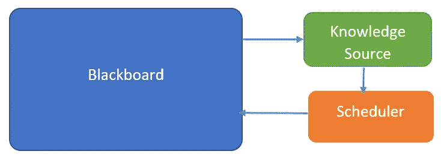

# 黑板架构是所有人工智能和人工智能解决方案的核心

> 原文：<https://medium.datadriveninvestor.com/blackboard-architecture-at-the-core-of-all-ai-and-ml-solutions-2bc66a8450e2?source=collection_archive---------1----------------------->

> 黑板架构是一种用于解决人工智能、挖掘、机器学习问题的架构风格或模式

## 课堂和问题解决作业类比

一些学生同时在黑板上写字，试图解决一个问题。你觉得他们会吗？

如果我们增加一个老师，他首先问每个学生他想在黑板上写什么，然后决定哪个学生的想法最好。当学生完成时，重复这个过程。

## 工作力学

这是黑板架构背后的思想。学生被称为知识源。教师被称为调度器，黑板是知识源的公共数据结构。黑板代表了某个问题空间的所有状态。

**黑板**

黑板是知识源的公共数据结构。黑板显示了给定问题空间的所有状态。黑板通常包含关于问题空间的几个层次的描述。这些级别彼此之间可能有几种关系。这些级别是同一数据结构的一部分。如果需要一个以上的数据结构，则表示被分成多个面板，每个面板现在可以容纳多个级别。

**知识来源**

知识源是添加到问题解决方案中的组件。它是从黑板上读取的任何东西，并建议对黑板的某些部分进行一些更改。通常，知识源与其他知识源是断开的。

**调度器**

调度器控制并决定哪个知识源将获得更换黑板的机会。对于每个执行周期，调度器观察对黑板所做的更改，并激活知识源来执行下一个更改。

## 用例

一个经典的例子是语音识别。输入数据是要被识别的音频。音频可以被分段，多个线程开始将片段与单词进行匹配。当每个线程找到匹配的单词时，它们用到目前为止的翻译更新黑板。当开始组合短语时，另一个线程可以进行语法检查，以验证各种识别器线程正在做出的选择。如果一个单词可信度低，违反了语法，那么可以重新运行，寻找替代词。这甚至可能导致在解决口吃和停顿时重新划分音频数据。

随着短语变成句子，甚至可以获得更大的视图，并且可以解决同音词的各种选项(pair，pare)。所有这些都是通过让黑板对所有进程开放来实现的，只有当各种结果出现时才会应用“锁”。

 [## 人工智能和监督资本主义|数据驱动的投资者

### 大科技，总是现在:人工智能推动的大科技，已经使购物，搜索，在你的…

www.datadriveninvestor.com](https://www.datadriveninvestor.com/2020/03/04/on-artificial-intelligence-and-surveillance-capitalism/) 

*原载于 2020 年 5 月 6 日 https://sunilagollapudi.com***。**